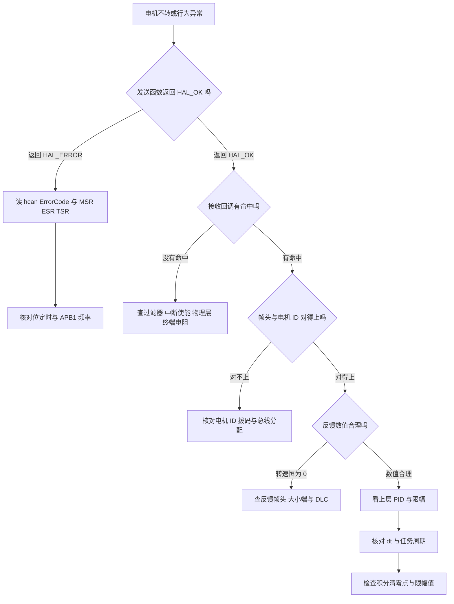
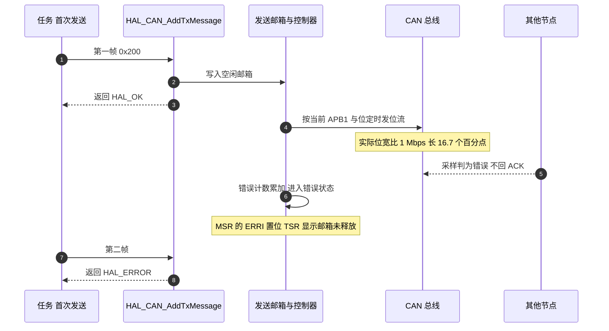

# 易错点与调试

前三页分别讲了帧格式、反馈解析、电流下发与速度环。这一页把它们收拢成一张问题清单，给出排查顺序，并复盘工作记录里记录过的一次波特率事故。文中所有结论都对应到具体源码行，未在代码里验证过的内容单独标出。

## 1. 问题清单

| # | 现象 | 优先怀疑 | 检查位置 |
| --- | --- | --- | --- |
| 1 | 电机完全不转，首次发送返回 `HAL_OK` | 波特率或总线物理层 | `Core/Src/can.c:42-46`、`:74-78` |
| 2 | 同一帧内只有一台电机不动 | 该电机的 ID 拨码或接线 | 回调里 `default` 分支是否命中（`bsp_can.cpp:711`） |
| 3 | 四轮都转但方向与预期相反 | 电流符号或运动学符号 | `ControlCenterTask.cpp:119-128` |
| 4 | 电机持续抖动 | 反馈噪声或 dt 与实际周期不符 | `ChassisTask.cpp:20` 与 `:94` |
| 5 | 长时间堵转后输出不回落 | 积分没有硬上限 | 底盘板 `speed_pid.cpp:86-90` |
| 6 | 角度差突然跳变 | 累计角度回绕 | 底盘板 `bsp_can.h:17` |
| 7 | 温度读数出现负值 | `int8_t` 截断 | `bsp_can.h:14` |
| 8 | 帧头正确但电机不动 | DLC 或大小端写错 | `bsp_can.cpp:94`、`:97-104` |
| 9 | 底盘 yaw 角偶发异常 | 分支落穿 | 底盘板 `bsp_can.cpp:640-646` |
| 10 | 功率限制看不到效果 | 调用顺序或判别式分支 | `ControlCenterTask.cpp:143`、`motor_power_control.c:36` |
| 11 | 偶发丢帧 | 发送邮箱占满或自动重传 | `bsp_can.cpp:107` 的返回值无人检查 |
| 12 | 遥控器或上位机下发无反应 | 控制模式分支 | `ControlCenterTask.cpp:64-70`、`:85-98` |
| 13 | yaw 与 3508 在同一帧里行为异常 | 两类电机共用 0x1FF 帧头 | `bsp_can.cpp:118` |

## 2. 两处已确认的代码缺陷

### 2.1 底盘板接收分支缺少 break

底盘板 `BSP/Src/bsp_can.cpp:640-646`：

```c
case 0x301: {
    dbus.ch[2]     = ((RxData[0] << 8) | RxData[1]);
    dbus.ch[3]     = ((RxData[2] << 8) | RxData[3]);
    dbus.ch[4]     = ((RxData[4] << 8) | RxData[5]);
    dbus.s1        =   RxData[6];
}                          /* 这里缺少 break */
case 0x302: {
    uint8_t float_bytes[4];
    float_bytes[3] = RxData[0];
    /* 其余字节同构 最后 gimbal_yaw_angle = temp */
}
```

`0x301` 的载荷是遥控器通道值，`0x302` 的载荷是云台 yaw 角的浮点大端表示。落穿之后，每一帧 `0x301` 都会被当成浮点数再解析一次，结果写入 `gimbal_yaw_angle`。

影响范围取决于两帧的到达顺序。云台板在同一个循环里先发 `0x301` 再发 `0x302`（云台板 `Task/Src/ControlCenterTask.cpp:135-136`），所以正常情况下 `0x302` 的解析发生在后面，会把落穿写入的值覆盖掉。一旦 `0x302` 这一帧没有成功发出（发送邮箱占满时该帧被丢弃，返回值无人检查），底盘侧就会保留由遥控器通道值解析出的 yaw 角。

### 2.2 底盘板累计角度是 int16_t

`update_motor_total_angle` 计算 `round_count * 8192 + new_ecd`，云台板把它存进 `int32_t`，底盘板存进 `int16_t`（底盘板 `BSP/Inc/bsp_can.h:17`）。$32767 / 8192 \approx 4$，所以 yaw 每转过约 4 圈就会回绕一次。底盘板上只有 yaw 电机调用这个函数（`bsp_can.cpp:634`），而 `ControlCenterTask.cpp:57` 与 `:100` 用它算 `delta_angel`，回绕会让角度差跳变 65536 计数。

对照关系：

| 项目 | 云台板 | 底盘板 |
| --- | --- | --- |
| `total_angle` 类型 | `int32_t` | `int16_t` |
| 回绕前可覆盖圈数 | 约 26 万圈 | 约 4 圈 |
| 使用者 | 拨弹盘（`FireTask.cpp:119-192`） | yaw（`ControlCenterTask.cpp:57`、`:100`） |

## 3. 排查顺序

顺序的原则是先确认外设是否真的在收发，再看数据内容，最后看数值与增益。每一层的判断都依赖下一层成立，跳层排查会得到互相矛盾的线索。



## 4. 波特率事故复盘

材料来自 `/home/wyx/Work-Summary-and-Diary/工作记录/can通信波特率问题.md`。现象是底盘板 CAN1 与 CAN2 都无法进入回调，也无法发送，而代码在故障前可以正常工作，期间没有改动代码。

现象与寄存器读数（工作记录 `:19-25`）：

| 项目 | 值 | 含义 |
| --- | --- | --- |
| 第一次发送 | `HAL_OK` | 数据进入了发送邮箱 |
| 后续发送 | `HAL_ERROR` | 外设进入错误状态 |
| `hcan2.ErrorCode` | `0x00200000` | `HAL_CAN_ERROR_NOT_STARTED` |
| `MSR` | `0x0C08` | 错误中断挂起，ERRI 置位 |
| `TSR` | `0x82000004` | 发送邮箱仍被占用 |

根因是时钟树被改动，导致 APB1 频率与位定时表不再匹配。波特率由两者共同决定：

$$f_{CAN} = \frac{f_{APB1}}{Prescaler \times (1 + BS1 + BS2)}$$

工作记录给出的计算结果是 `857142 Hz`，反推 APB1：

$$f_{APB1} = 857142 \times 2 \times 21 = 36\ \text{MHz}$$

而当前的 `.ioc` 记录是 `RCC.APB1Freq_Value=42000000`（`2026sentriomeni.ioc:367`），按同一组位定时正好得到 1 Mbps。两次的频率差对应一段位宽差：36 MHz 下每个位被拉长约 16.7%，总线上的其他节点按 1 Mbps 采样会把这一段判为错误帧，于是没有节点回 ACK。



这类故障的特征是代码没有改动而外设突然失效。工作记录 `:74-77` 给出的排查顺序把时钟配置放在第一位，与本页第 3 节的决策树一致：发送函数返回 `HAL_OK` 只说明数据进了邮箱，不说明总线收到了正确的位流。

## 5. 观测手段

| 手段 | 位置或接口 | 能看到什么 |
| --- | --- | --- |
| 全局电机结构体 | `bsp_can.cpp:19-27` 与底盘板 `:17-21` | 每台电机的机械角度、转速、转矩电流、温度 |
| HAL 错误码 | `hcan1.ErrorCode`、`hcan2.ErrorCode` | 错误类型，例如 `HAL_CAN_ERROR_NOT_STARTED` |
| 控制器寄存器 | `CAN1->MSR`、`CAN1->ESR`、`CAN1->TSR` | 错误中断标志、协议错误状态、发送邮箱状态 |
| 在线变量 | `BSP/Inc/debug_vars.h` 的全局量 | 任务里算出的中间值与周期 |
| DWT 计时 | `bsp_dwt.cpp` | 任务实际周期，用来核对 dt 传参 |
| 逻辑分析仪 | CANH 与 CANL | 位宽、仲裁过程与 ACK 位是否出现 |

其中第三项是第 4 节那次事故的判定依据：`MSR` 与 `TSR` 直接说明控制器处于什么状态，而 `ErrorCode` 只给出 HAL 层的分类。

## 6. 小结

### 核心概念

- 排查顺序按"外设是否收发、数据内容是否正确、数值与增益是否合理"三层推进，跳层会得到相互矛盾的线索。
- `HAL_CAN_AddTxMessage` 返回 `HAL_OK` 只表示数据进入邮箱，不表示总线收到了正确的位流。
- 波特率由 APB1 频率与位定时共同决定，改动时钟树会静默改变波特率，现象是外设突然失效而代码没有改动。
- 底盘板有两处已确认的缺陷：接收分支缺少 `break` 导致 `0x301` 落穿到 `0x302`，以及 `total_angle` 使用 `int16_t` 导致约 4 圈后回绕。
- 转矩电流与温度字段目前只写不读，可以作为观测余量接入 `debug_vars`。

### 设计权衡

| 权衡点 | 本工程的选择 | 代价与收益 |
| --- | --- | --- |
| 解析放在中断还是任务 | 放在中断 | 时延低；代价是中断里写全局结构体，缺陷与并发问题都发生在中断上下文 |
| 发送返回值不检查 | 采用 | 调用点简洁；代价是邮箱占满与落穿这类问题在现场没有提示 |
| 位定时写死在 can.c | 采用 | 由 CubeMX 生成，参数集中；代价是时钟树改动不会触发任何编译期检查 |
| 累计角度类型两板不同 | 采用 | 云台板够用；代价是底盘板存在回绕缺陷 |
| 观测靠全局结构体 | 采用 | 不需要额外接口；代价是读到的值可能与中断写入交错 |

## 7. 练习

### 基础题

1. 按第 3 节的决策树，写出"发送返回 `HAL_OK`、接收回调不命中"这一支的全部检查项。
2. 已知位定时为 Prescaler 2、BS1 15TQ、BS2 5TQ，计算 APB1 为 36 MHz 与 42 MHz 两种情况下实际波特率，并给出相对 1 Mbps 的偏差百分比。
3. 说明 `MSR` 的 ERRI 位置位意味着总线处于什么状态。

### 挑战题

4. 修复第 2.1 节的落穿缺陷后，论证底盘侧 `gimbal_yaw_angle` 的更新来源是否唯一。
5. 设计一个开机自检序列，覆盖"控制器是否启动、位定时是否与 APB1 匹配、过滤器是否放行"，要求给出每条检查对应的寄存器或 HAL 接口。
6. 把第 1 节清单里的 13 项按"能否用软件在上电时自动发现"分类，并为能自动发现的项给出判据。

### 附：本页引用的固件路径

| 路径 | 用途 |
| --- | --- |
| `/home/wyx/rm/2026SentriOmeniGimbal/2026OmniSentryGimbal/BSP/Src/bsp_can.cpp` | 接收回调与电机结构体（`:19-27`、`:590-715`） |
| `/home/wyx/rm/2026SentriOmeniGimbal/2026OmniSentryGimbal/Task/Src/ControlCenterTask.cpp` | 云台帧发送顺序（`:132-137`） |
| `/home/wyx/rm/2026SentriOmeniChassis/2026OmniSentryChassis/BSP/Src/bsp_can.cpp` | 分支落穿（`:640-646`）、电机结构体（`:17-21`） |
| `/home/wyx/rm/2026SentriOmeniChassis/2026OmniSentryChassis/BSP/Inc/bsp_can.h` | `total_angle` 类型（`:17`）、`temp` 类型（`:14`） |
| `/home/wyx/rm/2026SentriOmeniChassis/2026OmniSentryChassis/Task/Src/ControlCenterTask.cpp` | yaw 累计角度使用（`:57`、`:100`）、功率限制调用（`:143`） |
| `/home/wyx/rm/2026SentriOmeniChassis/2026OmniSentryChassis/Task/Src/ChassisTask.cpp` | dt 定义与任务周期（`:20`、`:94`） |
| `/home/wyx/rm/2026SentriOmeniChassis/2026OmniSentryChassis/Algorithm/Src/motor_power_control.c` | 判别式分支（`:36`）、钳位（`:40-43`） |
| `/home/wyx/rm/2026SentriOmeniChassis/2026OmniSentryChassis/2026sentriomeni.ioc` | `RCC.APB1Freq_Value=42000000`（`:367`） |
| `/home/wyx/Work-Summary-and-Diary/工作记录/can通信波特率问题.md` | 现象与寄存器（`:19-25`）、根因（`:28-39`）、排查顺序（`:74-77`） |


