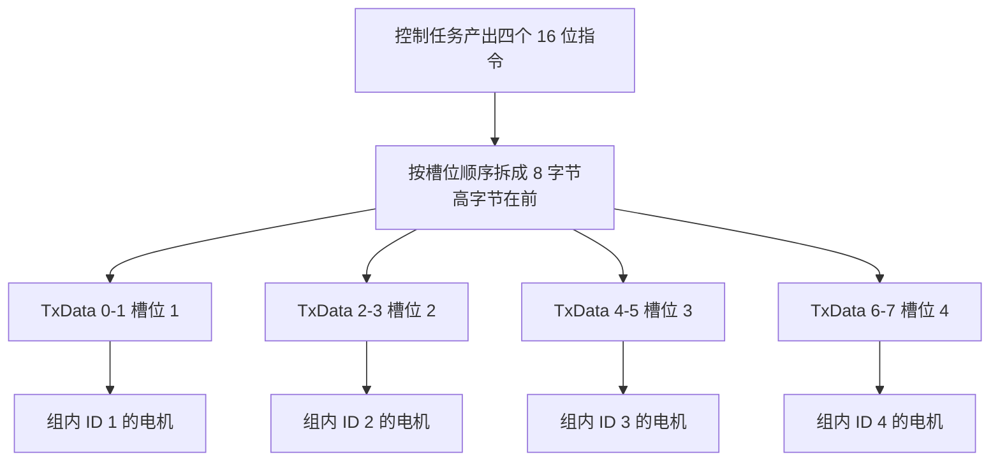
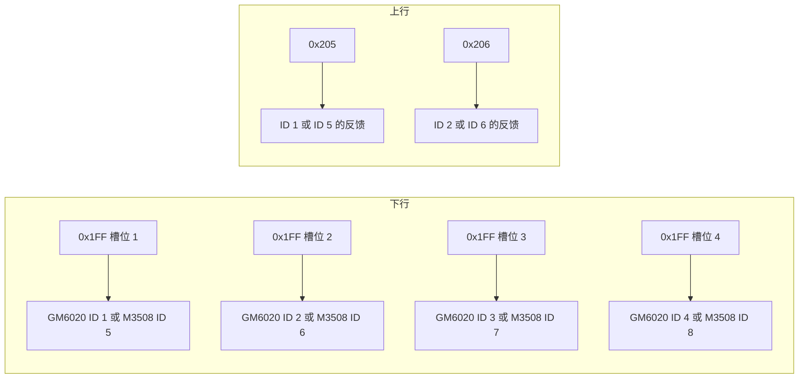
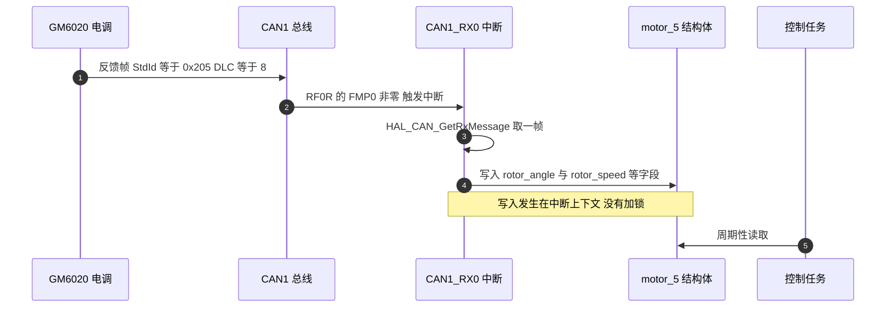

# 报文帧格式与 ID 分配

GM6020 是 DJI 的直驱云台电机，电调与主控之间只有两条报文：一条下行控制帧，一条上行反馈帧。下行帧把 8 字节数据区切成四个 16 位槽位，每个槽位对应一台电机，因此一条报文最多同时给同一组的四台电机下达指令；反馈帧则是一台电机一帧，各发各的。两条报文的标识都放在 11 位标准标识符里，数据长度固定 8 字节，既不用远程帧也不用扩展帧。

这套分配方式有两个后果要在工程里记清楚。第一，槽位与电机是绑定的，一帧的刷新节奏被同组四台电机共享，改一台电机的编号会连带改掉它的槽位和反馈标识符。第二，0x1FF 同时属于 GM6020 与 M3508 两个系列，对前者是 ID 1 到 4 的电压指令，对后者是 ID 5 到 8 的电流指令，只看标识符无法判断总线上是谁。

本文沿着下行帧的字节布局、反馈标识符的推导、本工程两个封装函数的落点、位时序参数的核算往下走，读完应当能回答：一条 0x1FF 里的哪个槽位归哪台电机、收到 0x205 时怎么判断它属于哪个系列、以及 1 Mbps 这个结论依赖哪个前提。

## 一帧驱动四台电机的槽位布局

下行帧的数据区是 8 个字节，按每两个字节一个槽位切开，共四个槽位。每个槽位是一个有符号 16 位量，先发高字节。发送端把一个 16 位指令放进槽位，做的只有移位和截断两件事：

```c
uint8_t TxData[8];
TxData[0] = motor1 >> 8;      /* 高字节 */
TxData[1] = motor1;           /* 低字节 */
```

四台电机的顺序固定：槽位 1 对应组内 ID 最小的一台，之后依次递增。GM6020 的电压指令被电调解释为输出端电压占空比，有符号，正负对应两个转向，所以槽位里的补码要原样送到电调，不能在中间按无符号处理。

两块报文的标识与用途如下：

| 方向 | 标识符 | 承载内容 | 数据长度 |
| --- | --- | --- | --- |
| 下行 | 0x1FF | GM6020 电机 ID 1 到 4 | 8 字节，4 个槽位 |
| 下行 | 0x2FF | GM6020 电机 ID 5 到 7 | 8 字节，前 3 个槽位有效 |
| 上行 | 0x204 加 ID | 单台电机反馈 | 8 字节，7 个字段加 1 字节保留 |
| 下行 | 0x200 | M3508 与 M2006 电机 ID 1 到 4 | 8 字节，4 个槽位 |
| 下行 | 0x1FF | M3508 与 M2006 电机 ID 5 到 8 | 8 字节，4 个槽位 |

从字节到电机的链路：



槽位与电机的对应是硬件层面的约定，拨码决定电调认哪个槽位，代码里改不了。0x2FF 只有三个有效槽位，第 4 个槽位在本工程里没有赋值，原因见后面单独一节。

## 0x1FF 的双重身份与反馈标识符

反馈帧的标识符由电机自身的 ID 直接算出：

$$\text{StdId} = 0x204 + \text{ID}$$

| 电机 ID | 反馈标识符 | 0x1FF 槽位 | 0x2FF 槽位 |
| --- | --- | --- | --- |
| 1 | 0x205 | 1 | 不适用 |
| 2 | 0x206 | 2 | 不适用 |
| 3 | 0x207 | 3 | 不适用 |
| 4 | 0x208 | 4 | 不适用 |
| 5 | 0x209 | 不适用 | 1 |
| 6 | 0x20A | 不适用 | 2 |
| 7 | 0x20B | 不适用 | 3 |

对照 M3508 的反馈标识符 $0x200 + \text{ID}$，两个系列在 0x205 到 0x208 这一段完全重合。区分手段只有两个：该电机实际响应哪条下行帧，以及电机外壳上的 ID 拨码。0x1FF 的两重身份由此而来，同一帧在 GM6020 电调眼里是四路电压，在 M3508 电调眼里是 ID 5 到 8 的四路电流。

本工程在这条边界上做过一次取舍，结果写进了变量命名。云台板 yaw 轴用 GM6020，占 0x1FF 的槽位 1，反馈是 0x205；按 GM6020 的编号它是 ID 1，按 M3508 的编号它是 ID 5。代码最终采用 M3508 的编号，把结构体命名为 motor_5，于是反馈标识符与变量后缀差了 4。工作记录里把这条记作历史遗留，本单元后面的篇目会反复用到这个偏移。

下行与上行的完整路径可以并排看：



同一条 0x205 在上行方向也可能来自两个系列，接收端若只按标识符分流，量纲就会按错误的规格书解释。本工程的做法是分流到固定的结构体，具体见第 2 篇。

## 本工程的两个封装函数与调用点

下行帧的封装在 `BSP/Src/bsp_can.cpp`（云台板 `BSP/Src/bsp_can.cpp:166-238`、底盘板 `BSP/Src/bsp_can.cpp:163-211`），两块板各有一份同名实现：

| 函数 | 标识符 | 槽位填充 | 源文件位置 |
| --- | --- | --- | --- |
| `BSP_CAN1_DJIMotorCmdFive2Eight` | 0x1FF | 参数 5 到 8 依次入槽 1 到 4 | 云台板 `BSP/Src/bsp_can.cpp:166-190` |
| `BSP_CAN1_DJIMotorCmdNine2Eleven` | 0x2FF | 参数 9 到 11 依次入槽 1 到 3 | 云台板 `BSP/Src/bsp_can.cpp:215-238` |
| `BSP_CAN1_DJIMotorCmdFive2Eight` | 0x1FF | 同上 | 底盘板 `BSP/Src/bsp_can.cpp:163-187` |
| `BSP_CAN2_DJIMotorCmdNine2Eleven` | 0x2FF | 同上 | 底盘板 `BSP/Src/bsp_can.cpp:189-211` |

函数名里的 5 到 8 与 9 到 11 是本工程自己的全局电机编号，与 GM6020 的组内 ID 相差 4：编号 5 到 8 对应组内的 ID 1 到 4，编号 9 到 11 对应组内的 ID 5 到 7。这个偏移是上文中 motor_5 命名的来源。

云台板的调用点在 `Task/Src/ControlCenterTask.cpp:106`：

```cpp
bsp_can1_djimotorcmdfive2eight(yaw_current_out, control_output_motor_3, 0, 0);
```

第一个实参是 yaw 电机的电压指令，进入 0x1FF 的槽位 1；第二个实参是拨盘电机的指令，进入槽位 2。这两个实参的反馈帧分别是 0x205 与 0x206，在接收回调里各自更新 motor_5 与 motor_6（云台板 `BSP/Src/bsp_can.cpp:618-638`）。后两个实参写 0，表示槽位 3 与槽位 4 上没有本工程使用的电机。

底盘板只用 0x205 这一路，变量名为 yaw_motor_5（定义在底盘板 `BSP/Src/bsp_can.cpp:21`，0x205 分支在 `BSP/Src/bsp_can.cpp:597-602`），用途是把 yaw 关节的编码器值换算成底盘跟随角度，见本单元第 4 篇。

反馈接收的时序如下，两块板的结构相同：



## 1 Mbps 依赖的位时序参数

位时序在 `Core/Src/can.c` 里，CAN1 与 CAN2 参数相同：Prescaler 等于 2、TimeSeg1 为 `CAN_BS1_15TQ`、TimeSeg2 为 `CAN_BS2_5TQ`、SyncJumpWidth 为 `CAN_SJW_1TQ`（云台板 `Core/Src/can.c:42-46` 与 `Core/Src/can.c:74-78`）。一个位时间由同步段、时间段 1、时间段 2 组成，采样点落在时间段 1 的末尾，所占比例是

$$\text{采样点} = \frac{1 + 15}{1 + 15 + 5} = \frac{16}{21} \approx 76.2\%$$

波特率则等于

$$f_{\text{bit}} = \frac{f_{APB1}}{\text{Prescaler} \times (1 + 15 + 5)} = \frac{42\ \text{MHz}}{2 \times 21} = 1\ \text{Mbps}$$

这条计算依赖 APB1 的实际频率。工作记录里那次 CAN 全体失效就是时钟树被改动后 APB1 变成 36 MHz 导致的（`工作记录/can通信波特率问题.md`），此时分母不变，

$$f_{\text{bit}} = \frac{36\ \text{MHz}}{42} \approx 857142\ \text{Hz}$$

与实测的 857142 Hz 吻合。位时序参数本身没有错，错的是它默认挂在 42 MHz 上。

## 0x2FF 只填了 6 个字节

0x2FF 按协议有 4 个槽位共 8 字节，本工程只填了前 3 个槽位。云台板的封装在 `BSP/Src/bsp_can.cpp:215-238`、底盘板在 `BSP/Src/bsp_can.cpp:189-211`，两处都把 DLC 写成 8，第 7 与第 8 字节没有赋值。发送出去的是栈上的残留值，接收端按 3 个槽位解释时不受影响，逻辑分析仪抓包会看到两个随机字节。

这个现象本身不是功能故障，但会给排查带来干扰：抓包工具报的是 8 字节，人工按协议解读时容易把第 4 槽的残留值当成某台电机的指令。要消除干扰只有两条路，要么把 DLC 改成 6 并确认电调接受，要么把第 4 槽显式写 0。本工程两条都没做，属于已知但未处理项。

## 常见现象与对应的检查顺序

| 现象 | 原因 | 检查手段 |
| --- | --- | --- |
| 电机不响应，但发送返回 HAL_OK | 0x1FF 发给了 M3508 组的 ID 5 到 8，或 GM6020 的 ID 不在 1 到 4 | 核对电机拨码与反馈帧标识符 |
| 收到 0x205 却按 M3508 的量纲解释转速 | 两个系列的反馈帧在 0x205 到 0x208 同号 | 看该电机响应 0x200 还是 0x1FF |
| 槽位 4 的电机不动 | 0x2FF 只有 3 个有效槽位，第 4 槽在本工程里没有赋值 | 检查调用点是否把第 4 个参数当成可用电机 |
| 一台上电后满速转 | 电压指令的量纲与范围按 M3508 电流值给出 | 见第 5 篇的限幅一节 |

排查顺序建议从总线抓包开始，先确认标识符与 DLC，再看槽位内容，最后才回到代码里的量纲换算。反过来先查代码容易在命名偏移上绕圈：函数名里的编号与反馈标识符本来就差 4，这不是笔误。

## 小结

### 核心概念

- GM6020 的下行帧是 4 槽位广播，一帧最多带 4 台电机，槽位与组内 ID 一一对应，槽位里是补码形式的有符号 16 位量。
- 反馈帧标识符为 0x204 加 ID，与 M3508 的 0x200 加 ID 在 0x205 到 0x208 段重合，区分依据是响应哪条下行帧与拨码。
- 0x1FF 在本工程承载 GM6020 的电压指令，函数名里的 5 到 8 是工程内电机编号，与组内 ID 相差 4。
- 位时序四项参数决定波特率，1 Mbps 的结论建立在 APB1 等于 42 MHz 之上，时钟树一改比例就变。
- 下行与上行都以大端组织 16 位量，解析端的高低字节顺序必须与发送端一致。

### 设计权衡

| 选择 | 本工程的做法 | 代价与收益 |
| --- | --- | --- |
| 标识符方案 | 只使用 11 位标准帧 | 报文短；代价是 0x1FF 与 M3508 复用，需要额外约定区分 |
| 槽位复用 | 一条报文带 4 台电机 | 总线负载低；代价是单台电机的刷新率与同组其他电机绑定 |
| 0x2FF 的字节数 | 只填 3 个槽位但 DLC 仍为 8 | 兼容既有接收端；代价是发送 2 字节未初始化数据 |
| 反馈解析位置 | 在中断回调里直接解析 | 时延低；代价是结构体跨上下文访问没有同步，见第 5 篇 |

## 练习

### 基础题

1. 写出 GM6020 电机 ID 4 的反馈帧标识符，并说明它在 0x1FF 里占哪个槽位。
2. 总线上抓到一帧 0x205，数据为 `00 10 00 00 FF FF 37 00`，写出各字段的含义，并说明判断这台电机属于哪个系列还需要什么信息。
3. 若 APB1 被配置为 36 MHz，保持其余参数不变，计算实际波特率与偏差比例。
4. 按 42 MHz 的 APB1 与本节参数，写出采样点的位置百分比，并说明把它推到 87.5% 需要改哪个参数。

### 挑战题

5. 在不改变函数名的前提下，把 `BSP_CAN1_DJIMotorCmdNine2Eleven` 的 DLC 改为 6，说明这样改动对既有接收电调与总线抓包的影响。
6. 设计一个上电自检函数：依次向 0x1FF 的槽位 1 到 4 发送零电压，统计 200 ms 内收到的 0x205 到 0x208 与 0x201 到 0x208 反馈帧，输出一张槽位与电机系列的对应表，并说明这比人工核对拨码可靠在哪里。
7. 底盘板的 0x205 被命名为 yaw_motor_5 而槽位在 0x1FF，若把该轴换到 0x2FF 的槽位 1，需要同时改哪几处代码与拨码。

## 附：本页引用的固件路径

| 路径 | 用途 |
| --- | --- |
| `/home/wyx/rm/2026SentriOmeniGimbal/2026OmniSentryGimbal/BSP/Src/bsp_can.cpp` | 0x1FF 与 0x2FF 下行帧封装（`BSP/Src/bsp_can.cpp:166-190`、`BSP/Src/bsp_can.cpp:192-238`）、接收回调（`BSP/Src/bsp_can.cpp:588-704`） |
| `/home/wyx/rm/2026SentriOmeniGimbal/2026OmniSentryGimbal/Task/Src/ControlCenterTask.cpp` | yaw 与拨盘指令的发送点（`Task/Src/ControlCenterTask.cpp:106`） |
| `/home/wyx/rm/2026SentriOmeniGimbal/2026OmniSentryGimbal/Core/Src/can.c` | CAN1 与 CAN2 位时序（`Core/Src/can.c:42-46`、`Core/Src/can.c:74-78`）、中断优先级 5（`Core/Src/can.c:125-128`、`Core/Src/can.c:158-161`） |
| `/home/wyx/rm/2026SentriOmeniChassis/2026OmniSentryChassis/BSP/Src/bsp_can.cpp` | 底盘板同号下行帧封装（`BSP/Src/bsp_can.cpp:163-211`）、0x205 解析（`BSP/Src/bsp_can.cpp:597-602`） |
| `/home/wyx/Work-Summary-and-Diary/工作记录/can通信波特率问题.md` | 时钟树改动导致波特率不符的排查过程 |
