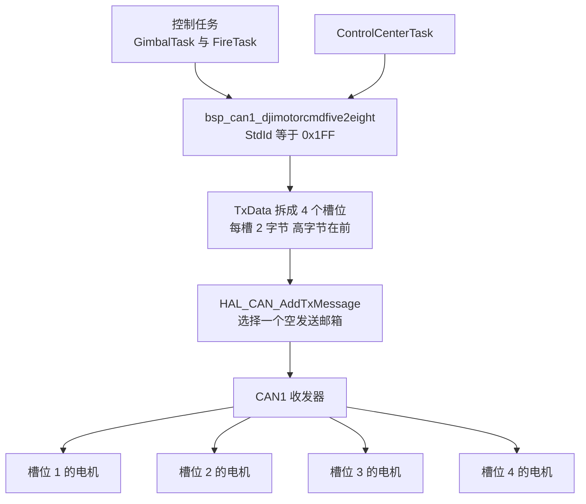
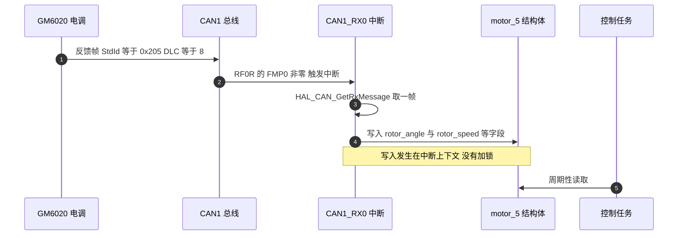

# 报文帧格式与 ID 分配

## 1. 概念：一帧驱动四个电机

GM6020 是 DJI 的直驱云台电机，电调与主控之间只有两条报文：一条下行控制帧，一条上行反馈帧。下行帧把 8 字节数据区切成 4 个 16 位槽位，每个槽位对应一台电机，因此一条报文最多同时给同一组的四台电机下达指令。反馈帧则是每台电机各发各的，一台一帧。

两条报文的标识都放在 11 位**标准标识符**（Standard Identifier）里，数据长度固定 8 字节，不需要远程帧（Remote Frame）和扩展帧。

| 方向 | 标识符 | 承载内容 | 数据长度 |
| --- | --- | --- | --- |
| 下行 | 0x1FF | GM6020 电机 ID 1 到 4 | 8 字节，4 个槽位 |
| 下行 | 0x2FF | GM6020 电机 ID 5 到 7 | 8 字节，前 3 个槽位有效 |
| 上行 | 0x204 加 ID | 单台电机反馈 | 8 字节，7 个字段加 1 字节保留 |
| 下行 | 0x200 | M3508 与 M2006 电机 ID 1 到 4 | 8 字节，4 个槽位 |
| 下行 | 0x1FF | M3508 与 M2006 电机 ID 5 到 8 | 8 字节，4 个槽位 |

表格最后两行给出一个前提：0x1FF 同时属于两个电机系列。对 GM6020 它是 ID 1 到 4 的电压指令，对 M3508 它是 ID 5 到 8 的电流指令。只看标识符无法判断总线上是谁，必须结合反馈帧的标识符一起看。

## 2. 机制：槽位、字节序与反馈 ID

### 2.1 下行帧的槽位打包

每个槽位是一个有符号 16 位量，先发高字节。以槽位 1 为例，发送端要做的事只有两件：

```c
uint8_t TxData[8];
TxData[0] = motor1 >> 8;      /* 高字节 */
TxData[1] = motor1;           /* 低字节 */
```

四台电机的顺序固定为槽位 1 对应组内 ID 最小的一台，之后依次递增。GM6020 的电压指令被电调解释为输出端电压占空比，有符号，正负对应两个转向。

### 2.2 反馈帧的标识符规则

反馈帧的标识符由电机自身的 ID 决定：

$$\text{StdId} = 0x204 + \text{ID}$$

| 电机 ID | 反馈标识符 | 0x1FF 槽位 | 0x2FF 槽位 |
| --- | --- | --- | --- |
| 1 | 0x205 | 1 | 不适用 |
| 2 | 0x206 | 2 | 不适用 |
| 3 | 0x207 | 3 | 不适用 |
| 4 | 0x208 | 4 | 不适用 |
| 5 | 0x209 | 不适用 | 1 |
| 6 | 0x20A | 不适用 | 2 |
| 7 | 0x20B | 不适用 | 3 |

对照 M3508 的反馈标识符 $0x200 + \text{ID}$，两个系列在 0x205 到 0x208 这一段完全重合。区分手段只有两个：该电机实际响应哪条下行帧，以及电机外壳上的 ID 拨码。

### 2.3 下行路径与上行路径





## 3. 落到本项目

下行帧的封装在 `BSP/Src/bsp_can.cpp`，两块板各有一份同名实现：

| 函数 | 标识符 | 槽位填充 | 源文件位置 |
| --- | --- | --- | --- |
| `BSP_CAN1_DJIMotorCmdFive2Eight` | 0x1FF | 参数 5 到 8 依次入槽 1 到 4 | 云台板 :168-192 |
| `BSP_CAN1_DJIMotorCmdNine2Eleven` | 0x2FF | 参数 9 到 11 依次入槽 1 到 3 | 云台板 :217-239 |
| `BSP_CAN1_DJIMotorCmdFive2Eight` | 0x1FF | 同上 | 底盘板 :141-187 |
| `BSP_CAN2_DJIMotorCmdNine2Eleven` | 0x2FF | 同上 | 底盘板 :189-211 |

函数名里的 5 到 8 与 9 到 11 是本工程自己的全局电机编号，与 GM6020 的组内 ID 相差 4：编号 5 到 8 对应 GM6020 组内的 ID 1 到 4，编号 9 到 11 对应组内的 ID 5 到 7。云台板的调用点在 `Task/Src/ControlCenterTask.cpp` 的第 133 行：

```cpp
bsp_can1_djimotorcmdfive2eight(yaw_current_out, control_output_motor_3, 0, 0);
```

第一个实参是 yaw 电机的电压指令，进入 0x1FF 的槽位 1；第二个实参是拨盘电机的指令，进入槽位 2。这两个实参的反馈帧分别是 0x205 与 0x206，在 `BSP/Src/bsp_can.cpp` 的接收回调里各自更新 `motor_5` 与 `motor_6`（云台板 :620-640）。

底盘板只用 0x205 这一路，变量名为 `yaw_motor_5`（底盘板 `BSP/Src/bsp_can.cpp` :629-638），用途是把 yaw 关节的编码器值换算成底盘跟随角度，见本单元第 4 篇。

位时序在 `Core/Src/can.c` 里，CAN1 与 CAN2 参数相同：`Prescaler` 等于 2、`TimeSeg1` 为 `CAN_BS1_15TQ`、`TimeSeg2` 为 `CAN_BS2_5TQ`、`SyncJumpWidth` 为 `CAN_SJW_1TQ`（云台板 :42-46 与 :74-78）。在 APB1 等于 42 MHz 时，

$$f_{\text{bit}} = \frac{42\ \text{MHz}}{2 \times (1 + 15 + 5)} = 1\ \text{Mbps}$$

这条计算依赖 APB1 的实际频率。工作记录里那次 CAN 全体失效就是时钟树被改动后 APB1 变成 36 MHz 导致的（`工作记录/can通信波特率问题.md`，该文件记录的实测波特率 857142 Hz 正好对应 36 MHz 的假设）。

## 4. 易错点

| 现象 | 原因 | 检查手段 |
| --- | --- | --- |
| 电机不响应，但发送返回 HAL_OK | 0x1FF 发给了 M3508 组的 ID 5 到 8，或 GM6020 的 ID 不在 1 到 4 | 核对电机拨码与反馈帧标识符 |
| 收到 0x205 却按 M3508 的量纲解释转速 | 两个系列的反馈帧在 0x205 到 0x208 同号 | 看该电机响应 0x200 还是 0x1FF |
| 槽位 4 的电机不动 | 0x2FF 只有 3 个有效槽位，第 4 槽在本工程里没有赋值 | 检查调用点是否把第 4 个参数当成可用电机 |
| 一台上电后满速转 | 电压指令的量纲与范围按 M3508 电流值给出 | 见第 5 篇的限幅一节 |

0x2FF 的第 3 槽之后还有 2 字节，本工程的实现里没有给这两个字节赋值，而 `DLC` 仍然是 8（云台板 :207-212，底盘板 :202-207）。发送出去的是栈上的残留值，接收端按 3 个槽位解释时不受影响，用逻辑分析仪抓包会看到两个随机字节。

## 5. 小结

### 核心概念

- GM6020 的下行帧是 4 槽位广播，一帧最多带 4 台电机，槽位与组内 ID 一一对应。
- 反馈帧标识符为 0x204 加 ID，与 M3508 的 0x200 加 ID 在 0x205 到 0x208 段重合，区分依据是响应哪条下行帧。
- 0x1FF 在本工程承载 GM6020 的电压指令，函数名里的 5 到 8 是工程内电机编号。
- 位时序四项参数决定波特率，1 Mbps 的结论建立在 APB1 等于 42 MHz 之上。
- 下行与上行都以大端组织 16 位量，解析端的高低字节顺序必须与发送端一致。

### 设计权衡

| 选择 | 本工程的做法 | 代价与收益 |
| --- | --- | --- |
| 标识符方案 | 只使用 11 位标准帧 | 报文短，代价是 0x1FF 与 M3508 复用，需要额外约定区分 |
| 槽位复用 | 一条报文带 4 台电机 | 总线负载低，代价是单台电机的刷新率与同组其他电机绑定 |
| 0x2FF 的字节数 | 只填 3 个槽位但 DLC 仍为 8 | 兼容既有接收端，代价是发送 2 字节未初始化数据 |
| 反馈解析位置 | 在中断回调里直接解析 | 时延低，代价是结构体跨上下文访问没有同步，见第 5 篇 |

## 6. 练习

基础题

1. 写出 GM6020 电机 ID 4 的反馈帧标识符，并说明它在 0x1FF 里占哪个槽位。
2. 总线上抓到一帧 0x205，数据为 `00 10 00 00 FF FF 37 00`，写出各字段的含义，并说明判断这台电机属于哪个系列还需要什么信息。
3. 若 APB1 被配置为 36 MHz，保持其余参数不变，计算实际波特率与偏差比例。

挑战题

4. 在不改变函数名的前提下，把 `BSP_CAN1_DJIMotorCmdNine2Eleven` 的 `DLC` 改为 6，说明这样改动对既有接收电调与总线抓包的影响。
5. 设计一个上电自检函数：依次向 0x1FF 的槽位 1 到 4 发送零电压，统计 200 ms 内收到的 0x205 到 0x208 与 0x201 到 0x208 反馈帧，输出一张槽位与电机系列的对应表。说明这比人工核对拨码可靠在哪里。

---

### 附：本页引用的固件路径

| 路径 | 用途 |
| --- | --- |
| `/home/wyx/rm/2026SentriOmeniGimbal/2026OmniSentryGimbal/BSP/Src/bsp_can.cpp` | 0x1FF 与 0x2FF 下行帧封装（:116-140、:194-216）、接收回调（:590-715） |
| `/home/wyx/rm/2026SentriOmeniGimbal/2026OmniSentryGimbal/Task/Src/ControlCenterTask.cpp` | yaw 与拨盘指令的发送点（:133） |
| `/home/wyx/rm/2026SentriOmeniGimbal/2026OmniSentryGimbal/Core/Src/can.c` | CAN1 与 CAN2 位时序（:42-46、:74-78）、中断优先级 5（:125-128、:158-161） |
| `/home/wyx/rm/2026SentriOmeniChassis/2026OmniSentryChassis/BSP/Src/bsp_can.cpp` | 底盘板同号下行帧封装（:141-211）、0x205 解析（:629-638） |
| `/home/wyx/Work-Summary-and-Diary/工作记录/can通信波特率问题.md` | 时钟树改动导致波特率不符的排查过程 |
