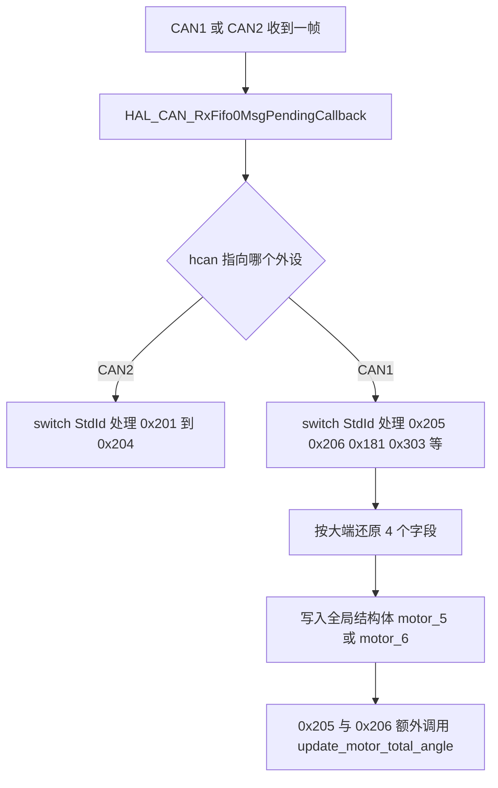
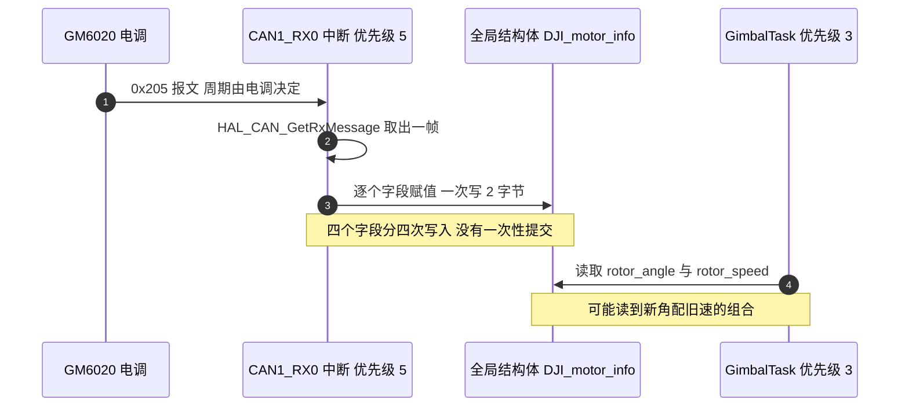

# 反馈报文解析

## 1. 概念：一帧七个字段

GM6020 每隔一段时间主动上报一帧反馈，标识符为 0x204 加 ID，数据长度固定 8 字节。8 字节里装了 4 个量：转子的**机械角**（Mechanical Angle）、转子的转速、**转矩电流**（Torque Current）、温度，最后 1 字节留空。主控端要做的事是把这 8 字节按固定偏移还原成结构体字段。

| 字节偏移 | 字段 | 位宽 | 有无符号 | 量纲 |
| --- | --- | --- | --- | --- |
| 0 到 1 | 机械角 | 16 位 | 无符号，实际取值 0 到 8191 | 编码器计数，8192 计数为 1 圈 |
| 2 到 3 | 转速 | 16 位 | 有符号 | 转每分钟，代码未做换算 |
| 4 到 5 | 转矩电流 | 16 位 | 有符号 | 原始值，代码未做换算 |
| 6 | 温度 | 8 位 | 代码按有符号存放 | 摄氏度 |
| 7 | 保留 | 8 位 | 不适用 | 全工程没有读取 |

表中“代码未做换算”两行需要交代清楚：结构体里存的是报文原始值，任何物理量的换算都要在读取处自行完成。

## 2. 机制：大端还原与量纲

### 2.1 大端还原

四个字段的解析方式一致，都是先取高字节：

```c
motor_5.rotor_angle    = ((RxData[0] << 8) | RxData[1]);
motor_5.rotor_speed    = ((RxData[2] << 8) | RxData[3]);
motor_5.torque_current = ((RxData[4] << 8) | RxData[5]);
motor_5.temp           =   RxData[6];
```

赋值目标决定符号性。机械角落在 `int16_t` 上，0 到 8191 落在正区间，符号位不会被触发。转速与转矩电流是有符号量，赋值给 `int16_t` 时负数会被正确保留，这里的写法没有问题。

### 2.2 机械角与转速的量纲

机械角是转子相对电机自身零点的单圈位置，一圈对应 8192 个计数：

$$\theta = \frac{\text{rotor\_angle}}{8192} \times 360^\circ$$

底盘板把计数换成弧度时用的就是这个比例（底盘板 `Task/Src/ControlCenterTask.cpp` :101）：

$$\Delta\theta = \Delta\text{counts} \times \frac{2\pi}{8192}$$

转速字段的量纲由厂商给出，本工程的代码直接把它当转每分钟使用：摩擦轮速度环的目标值 5800 与拨盘速度目标 4500 都直接写进以该字段为反馈的 PID 里（云台板 `Task/Src/FireTask.cpp` :105 与 :174）。

### 2.3 中断内的解析流程





## 3. 落到本项目

### 3.1 结构体定义

云台板与底盘板的 `DJI_motor_info` 同名，字段基本一致，只有累计角度一项的位宽不同：

| 字段 | 云台板 | 底盘板 |
| --- | --- | --- |
| `rotor_angle` | `int16_t` | `int16_t` |
| `rotor_speed` | `int16_t` | `int16_t` |
| `torque_current` | `int16_t` | `int16_t` |
| `temp` | `int8_t` | `int8_t` |
| `total_angle` | `int32_t` | `int16_t` |

位宽的差异直接决定了累计角度的可用范围，第 4 篇会用一次完整的推导说明后果。

### 3.2 解析位置

两块板的解析都在 `HAL_CAN_RxFifo0MsgPendingCallback` 里，位置与标识符如下：

| 板 | 标识符 | 变量 | 位置 |
| --- | --- | --- | --- |
| 云台板 | 0x205 | `motor_5` | `BSP/Src/bsp_can.cpp` :631-640 |
| 云台板 | 0x206 | `motor_6` | `BSP/Src/bsp_can.cpp` :620-629 |
| 底盘板 | 0x205 | `yaw_motor_5` | `BSP/Src/bsp_can.cpp` :629-638 |

云台板的 0x205 分支在赋值之后多调用了一次 `update_motor_total_angle`（云台板 :636），底盘板同样（底盘板 :634）。这次调用的产物是 `total_angle`，把单圈计数拼成连续计数。

## 4. 易错点

| 现象 | 可能原因 | 检查手段 |
| --- | --- | --- |
| 温度显示为负数 | `temp` 是 `int8_t`，原始字节大于 127 时变成负值 | 调试器里同时看原始 `RxData[6]` 与结构体字段 |
| 电流值比实际大几个数量级 | 结构体里是原始值，直接用安培解释 | 除以手册给出的换算系数后再比较 |
| 角度在同一圈内跳动 | 解析时高字节与低字节顺序写反 | 对比原始报文与结构体字段 |
| 转速符号与转向相反 | 电调安装方向与车体坐标系不一致 | 在读取处取反并记录，改动只放在一处 |
| 读到新角度配旧转速 | 中断逐字段写入，任务在两次写入之间读取 | 需要一致快照时用临界区包住整段读取 |

温度字段还有一个使用上的细节：结构体声明为 `int8_t`，代码只把它当数值存放，没有任何地方做范围校验或过温保护。查询结构体的全部引用只能找到赋值（云台板 :604、:611、:624、:635、:647 等），没有读取点。

## 5. 小结

### 核心概念

- 反馈帧固定 8 字节、4 个量，偏移与位宽在厂商手册里写死，解析端只做高低字节拼接。
- 机械角是 0 到 8191 的单圈计数，8192 计数为一圈，超过一圈的信息需要自行累加。
- 转速与转矩电流在结构体里保存为原始值，量纲换算由读取处负责，本工程在转速上直接按转每分钟使用。
- 解析发生在 CAN 接收中断里，结构体字段逐个写入，任务侧读到的是非原子快照。
- 第 8 字节在本工程中从未被读取，报文长度也没有校验，长度大于 8 或小于 8 的帧同样会走到这个解析分支。

### 设计权衡

| 选择 | 本工程的做法 | 代价与收益 |
| --- | --- | --- |
| 解析位置 | 中断回调内直接解析并写全局量 | 时延最小，代价是任务侧读取没有一致性保证 |
| 量纲折算 | 保存原始值，读取处各自解释 | 结构体简单通用，代价是同一物理量在多处的换算系数可能不一致 |
| 字段位宽 | 云台板累计角度用 32 位，底盘板用 16 位 | 底盘板省 2 字节，代价是累计角度约 8 圈即回绕 |
| 时间戳 | 不记录接收时刻 | 零开销，代价是无法区分数据是新帧还是上电时的残留 |

## 6. 练习

基础题

1. 一帧 0x205 的数据为 `00 10 FF FE 00 64 32 00`，逐个字段写出解析结果与对应物理量。
2. 机械角为 4096 时，转子相对电机零点转过多少度；若一圈之后机械角回到 0，`total_angle` 应当是多少。
3. 说明为什么 `rotor_angle` 用 `int16_t` 存放不会出问题，而 `total_angle` 用 `int16_t` 存放会。

挑战题

4. 给反馈解析加一个一致性方案：要求任务侧读到的四个字段来自同一帧，且不显著增加中断驻留时间。给出实现与中断驻留时间的估算。
5. 设计一个掉线检测：以 0x205 的到达间隔为判据，超过阈值就把对应电机的输出置零。说明阈值应该依据什么确定，以及在本工程里把这段逻辑放在中断还是任务里更合适。
6. 把温度字段改成带量纲的浮点成员并加入过温降额，要求保持既有字段名与位宽不变，说明改动的兼容性影响。

---

### 附：本页引用的固件路径

| 路径 | 用途 |
| --- | --- |
| `/home/wyx/rm/2026SentriOmeniGimbal/2026OmniSentryGimbal/BSP/Inc/bsp_can.h` | `DJI_motor_info` 定义（:10-20） |
| `/home/wyx/rm/2026SentriOmeniGimbal/2026OmniSentryGimbal/BSP/Src/bsp_can.cpp` | 接收回调与 0x205 解析（:590-715）、0x206 分支（:620-629）、0x205 分支（:631-640） |
| `/home/wyx/rm/2026SentriOmeniGimbal/2026OmniSentryGimbal/Task/Src/FireTask.cpp` | 转速原始值的直接使用（:105、:174） |
| `/home/wyx/rm/2026SentriOmeniChassis/2026OmniSentryChassis/BSP/Src/bsp_can.cpp` | 底盘板接收回调与 0x205 解析（:583-689） |
| `/home/wyx/rm/2026SentriOmeniChassis/2026OmniSentryChassis/Task/Src/ControlCenterTask.cpp` | 计数到弧度的换算（:100-101） |
