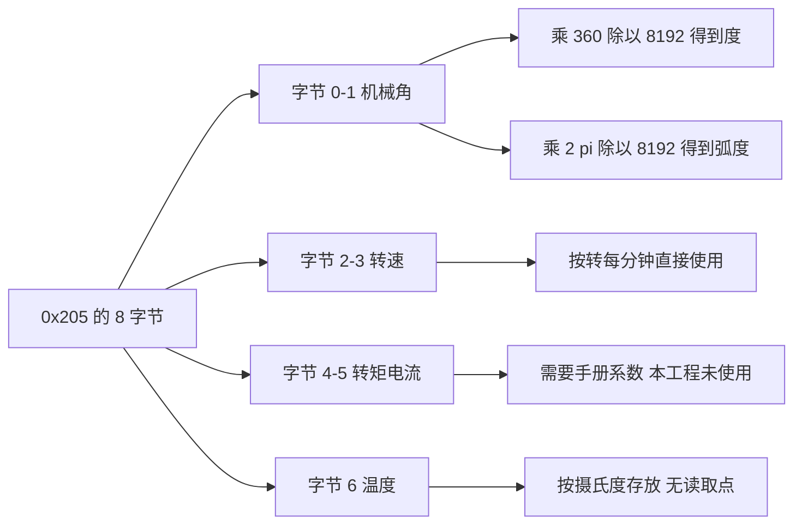
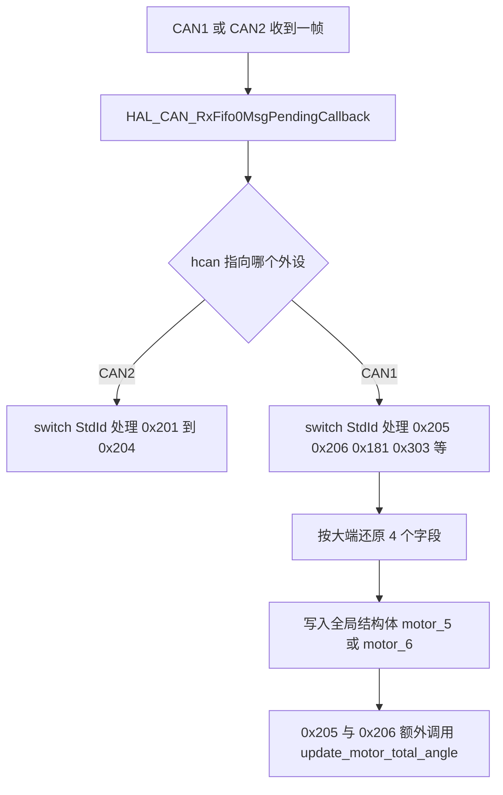
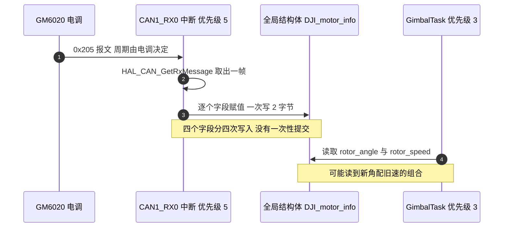

# 反馈报文解析

GM6020 每隔一段时间主动上报一帧反馈，标识符为 0x204 加 ID，数据长度固定 8 字节。这 8 字节里装了 4 个量：转子的机械角、转子的转速、转矩电流和温度，最后 1 字节留空。主控端要做的事，是把这 8 字节按固定偏移还原成结构体字段，再在读取处给每个量补上物理量纲。

报文往哪个方向发、槽位怎么排已在上一篇处理，这里只看上行帧的内容。读完后应当能回答：为什么机械角可以放进 `int16_t`、结构体里的转速到底是什么单位、以及同一帧的四个字段为什么可能来自不同时刻。

## 8 字节里装了哪四个量

字段的偏移与位宽由厂商手册固定，解析端没有自由度：

| 字节偏移 | 字段 | 位宽 | 有无符号 | 量纲 |
| --- | --- | --- | --- | --- |
| 0 到 1 | 机械角 | 16 位 | 无符号，实际取值 0 到 8191 | 编码器计数，8192 计数为 1 圈 |
| 2 到 3 | 转速 | 16 位 | 有符号 | 转每分钟，代码未做换算 |
| 4 到 5 | 转矩电流 | 16 位 | 有符号 | 原始值，代码未做换算 |
| 6 | 温度 | 8 位 | 代码按有符号存放 | 摄氏度 |
| 7 | 保留 | 8 位 | 不适用 | 全工程没有读取 |

表里两处“代码未做换算”需要交代清楚。结构体里保存的是报文原始值，转速字段在厂商手册里的单位就是转每分钟，代码只是没有再做缩放；转矩电流字段则是电调的原始整数，换算成安培需要手册给出的系数，而本工程从未读取过这个字段。把原始值直接当物理量用，是这一路最常见的误判来源。

四个字段的量纲互不相同，从原始整数到物理量的换算关系可以并排看：



## 大端拼接与符号解释

四个字段的还原方式一致，都是先取高字节：

```c
motor_5.rotor_angle    = ((RxData[0] << 8) | RxData[1]);
motor_5.rotor_speed    = ((RxData[2] << 8) | RxData[3]);
motor_5.torque_current = ((RxData[4] << 8) | RxData[5]);
motor_5.temp           =   RxData[6];
```

`RxData` 是 `uint8_t` 数组，参与移位前会整型提升为 `int`，所以 `(RxData[0] << 8) | RxData[1]` 的结果落在 0 到 65535 之间。赋值目标决定符号性：机械角落在 `int16_t` 上，取值 0 到 8191 只占低 13 位，符号位不会被触发；转速与转矩电流是有符号量，赋给 `int16_t` 时负数按补码正确保留。这套写法对两种字段都成立，不需要额外判断。

机械角只有 13 位有效是一个容易忽略的约束。计数范围是 0 到 8191，一圈用满 8192 个计数，超过一圈后字段回到 0。因此单帧永远无法表达“转了几圈”，多圈信息必须由主控自己累加，这正是下一篇的主题。

## 从计数到物理量

机械角是转子相对电调自身零点的单圈位置，一圈对应 8192 个计数，化成角度就是

$$\theta = \frac{\text{rotor\_angle}}{8192} \times 360^\circ$$

底盘板把计数换成弧度时用的比例就是它（底盘板 `Task/Src/ControlCenterTask.cpp`，初值换算在 `Task/Src/ControlCenterTask.cpp`，度到弧度在 `Task/Src/ControlCenterTask.cpp`）：

$$\Delta\theta = \Delta\text{counts} \times \frac{2\pi}{8192}$$

把两个常数算出来备用：一个计数等于 $360/8192 = 0.043945^\circ$，也等于 $2\pi/8192 = 7.6699 \times 10^{-4}\ \text{rad}$。底盘板 `Task/Src/UsbConnectTask.cpp` 的 `mapToAngle` 里还用了另一个比例 `180/4096`，那是在单圈计数上先取半圈映射，见第 4 篇。

转速字段的量纲由厂商给出，本工程的代码直接把它当转每分钟使用：摩擦轮速度环的目标值 5500 与拨盘速度目标正负 1000 都直接写进以该字段为反馈的 PID 里（云台板 `Task/Src/FireTask.cpp` 与 `Task/Src/FireTask.cpp`），相邻的差分计算在 `Task/Src/FireTask.cpp`。这两个目标值本身也提供了旁证，第 4 篇会用它推断电机的减速比与型号。

## 单帧数值的完整换算示例

取一帧实测数据 `00 10 FF FE 00 64 32 00` 走一遍全流程，可以把上面的公式落到具体数值上：

| 字段 | 原始字节 | 拼接结果 | 解读 |
| --- | --- | --- | --- |
| 机械角 | `00 10` | 16 | 16 个计数，$16 \times 360 / 8192 = 0.7031^\circ$ |
| 转速 | `FF FE` | 65534，赋给 `int16_t` 后为 -2 | 转子转速 -2 转每分钟，方向与正转相反 |
| 转矩电流 | `00 64` | 100 | 电调原始值，需要手册系数才能换成电流 |
| 温度 | `32` | 50 | 50 摄氏度 |
| 保留 | `00` | 未读取 | 忽略 |

拼接结果 65534 到 -2 的转换过程需要展开：`0xFFFE` 的最高位是 1，按补码解释就是 $65534 - 65536 = -2$。C 语言里把这个值赋给 `int16_t` 属于实现定义行为，GCC 在 Cortex-M4 上的处理是直接截断并保留位模式，与本工程依赖的行为一致。

换算时还要注意单位口径。同样的 16 个计数，乘 $360/8192$ 得到度，乘 $2\pi/8192$ 得到弧度，两者相差 $180/\pi \approx 57.3$ 倍。本工程的拨盘角度环用编码器计数的差值做误差，没有做任何换算；yaw 环用姿态解算的度，也没有做换算。两个入口各自一致，混用才会出错。

## 解析在中断里完成意味着什么

接收回调是 `HAL_CAN_RxFifo0MsgPendingCallback`（云台板 `BSP/Src/bsp_can.cpp`、底盘板 `BSP/Src/bsp_can.cpp`），由 CAN1_RX0 中断触发，两块板共用同一个回调，靠 `hcan->Instance` 分流。



四个字段是分四次赋值写进全局结构体的，中间没有关中断，任务侧可能刚好在这两次写入之间读取：



结构体没有声明为 `volatile`。单个 16 位字段是对齐访问，读到的值不会是半个；但字段之间没有顺序保证，任务如果同时用机械角和转速做判断，两个值可能来自相邻的两帧。本工程的控制任务都是周期读取，对单帧一致性没有要求，所以这个问题一直没有暴露。

## 两块板的结构体与解析落点

云台板与底盘板的 `DJI_motor_info` 逐字段一致（云台板 `BSP/Inc/bsp_can.h`、底盘板 `BSP/Inc/bsp_can.h`）：

| 字段 | 云台板 | 底盘板 |
| --- | --- | --- |
| `rotor_angle` | `int16_t` | `int16_t` |
| `rotor_speed` | `int16_t` | `int16_t` |
| `torque_current` | `int16_t` | `int16_t` |
| `temp` | `int8_t` | `int8_t` |
| `total_angle` | `int16_t` | `int16_t` |

两处定义相同这一点需要单独说明，因为累计角度的可用范围由 `total_angle` 的位宽决定：它是 `int16_t`，而写入值是 `round_count * 8192 + new_ecd`，能表示的正负范围约对应正负 4 圈（$32767/8192 \approx 4$），跨过之后回绕。记录圈数的 `round_count` 是 32 位，本身没有限制，但结果在写回 `total_angle` 时被截断。要放宽范围只能改 `total_angle` 的位宽，两块板都要改。

解析位置与对应变量：

| 板 | 标识符 | 变量 | 位置 |
| --- | --- | --- | --- |
| 云台板 | 0x205 | `motor_5` | `BSP/Src/bsp_can.cpp` |
| 云台板 | 0x206 | `motor_6` | `BSP/Src/bsp_can.cpp` |
| 底盘板 | 0x205 | `yaw_motor_5` | `BSP/Src/bsp_can.cpp` |

云台板的 0x205 分支在赋值之后多调用一次 `update_motor_total_angle`（云台板 `BSP/Src/bsp_can.cpp`），底盘板同样（底盘板 `BSP/Src/bsp_can.cpp`）。云台板的 0x206 分支在 `BSP/Src/bsp_can.cpp` 也调用了它。这次调用的产物是 `total_angle`，把单圈计数拼成连续计数。

该函数的实现是 `BSP/Src/bsp_can.cpp`：首次调用把 `last_angle` 与 `round_count` 清零并把当前计数写进 `total_angle`；之后按两帧计数之差是否超过 4096 判断过零，`round_count` 加减一，最后用 `round_count * 8192 + new_ecd` 得到连续计数。

## 读到异常值时的对照表

| 现象 | 可能原因 | 检查手段 |
| --- | --- | --- |
| 温度显示为负数 | `temp` 是 `int8_t`，原始字节大于 127 时变成负值 | 调试器里同时看原始 `RxData[6]` 与结构体字段 |
| 电流值比实际大几个数量级 | 结构体里是原始值，直接拿来当物理量 | 先用同一帧的转速核对量级 |
| 角度在同一圈内跳动 | 解析时高字节与低字节顺序写反 | 对比原始报文与结构体字段 |
| 转速符号与转向相反 | 电调安装方向与车体坐标系不一致 | 在同一处取反并注释，改动只放一处 |
| 读到新角度配旧转速 | 中断逐字段写入，任务在两次写入之间读取 | 需要一致快照时用临界区包住整段读取 |
| 上电后字段长期不变 | 没有接收超时判定，中断不来则保持上次的值 | 加到达计数或时间戳 |

温度字段还有一个使用上的细节：结构体声明为 `int8_t`，代码只把它当数值存放，没有任何地方做范围校验或过温保护。查询结构体的全部引用只能找到赋值（云台板 `BSP/Src/bsp_can.cpp` 等），没有读取点。转矩电流同样只写不读。这两个字段属于现成的观测余量，接一个调试任务就能读到温度曲线。

## 小结

### 核心概念

- 反馈帧固定 8 字节、4 个量，偏移与位宽在厂商手册里写死，解析端只做高低字节拼接。
- 机械角是 0 到 8191 的单圈计数，8192 计数为一圈，超过一圈的信息需要自行累加。
- 转速与转矩电流在结构体里保存为原始值，量纲换算由读取处负责；本工程在转速上直接按转每分钟使用。
- 解析发生在 CAN 接收中断里，结构体字段逐个写入，任务侧读到的是非原子快照。
- 第 8 字节在本工程中从未被读取，报文长度也没有校验，长度大于或小于 8 的帧同样会走到这个解析分支。

### 设计权衡

| 选择 | 本工程的做法 | 代价与收益 |
| --- | --- | --- |
| 解析位置 | 中断回调内直接解析并写全局量 | 时延最小；代价是任务侧读取没有一致性保证 |
| 量纲折算 | 保存原始值，读取处各自解释 | 结构体简单通用；代价是同一物理量在多处的换算系数可能不一致 |
| 字段位宽 | 云台板累计角度用 32 位，底盘板用 16 位 | 底盘板省 2 字节；代价是累计角度约正负 4 圈即回绕 |
| 时间戳 | 不记录接收时刻 | 零开销；代价是无法区分数据是新帧还是上电时的残留 |
| 长度校验 | 不检查 DLC | 代码短；代价是短帧也会走完整解析路径 |

## 练习

### 基础题

1. 一帧 0x205 的数据为 `00 10 FF FE 00 64 32 00`，逐个字段写出解析结果与对应物理量。
2. 机械角为 4096 时，转子相对电机零点转过多少度；若一圈之后机械角回到 0，`total_angle` 应当是多少。
3. 说明为什么 `rotor_angle` 用 `int16_t` 存放不会出问题，而 `total_angle` 用 `int16_t` 存放会。
4. 按一个计数等于 `2 pi / 8192` 弧度，写出 100 个计数对应的角度值，保留四位有效数字。

### 挑战题

5. 给反馈解析加一个一致性方案：要求任务侧读到的四个字段来自同一帧，且不显著增加中断驻留时间。给出实现与中断驻留时间的估算。
6. 设计一个掉线检测：以 0x205 的到达间隔为判据，超过阈值就把对应电机的输出置零。说明阈值应该依据什么确定，以及这段逻辑放在中断还是任务里更合适。
7. 把温度字段改成带量纲的浮点成员并加入过温降额，要求保持既有字段名与位宽不变，说明改动的兼容性影响。

## 附：本页引用的固件路径

| 路径 | 用途 |
| --- | --- |
| `BSP/Inc/bsp_can.h` | `DJI_motor_info` 定义（`BSP/Inc/bsp_can.h`） |
| `BSP/Src/bsp_can.cpp` | 接收回调（`BSP/Src/bsp_can.cpp`）、0x206 分支（`BSP/Src/bsp_can.cpp`）、0x205 分支（`BSP/Src/bsp_can.cpp`）、累计角度（`BSP/Src/bsp_can.cpp`） |
| `Task/Src/FireTask.cpp` | 转速原始值的直接使用（`Task/Src/FireTask.cpp`、`Task/Src/FireTask.cpp`、`Task/Src/FireTask.cpp`） |
| `底盘板 BSP/Src/bsp_can.cpp` | 底盘板接收回调（`BSP/Src/bsp_can.cpp`）与 0x205 解析（`BSP/Src/bsp_can.cpp`） |
| `底盘板 Task/Src/ControlCenterTask.cpp` | 计数到弧度的换算（`Task/Src/ControlCenterTask.cpp`、`Task/Src/ControlCenterTask.cpp`）与度到弧度（`Task/Src/ControlCenterTask.cpp`） |
| `底盘板 Task/Src/UsbConnectTask.cpp` | 单圈计数映射为罗盘角（`Task/Src/UsbConnectTask.cpp`） |
