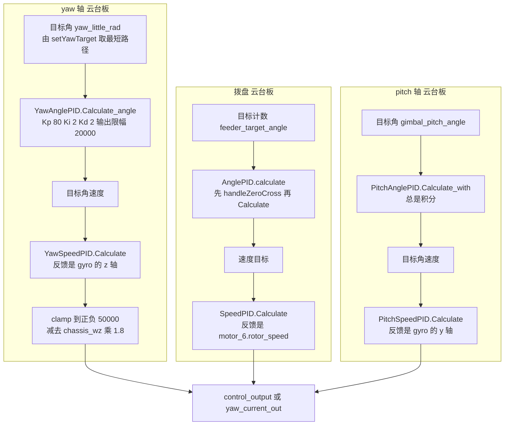
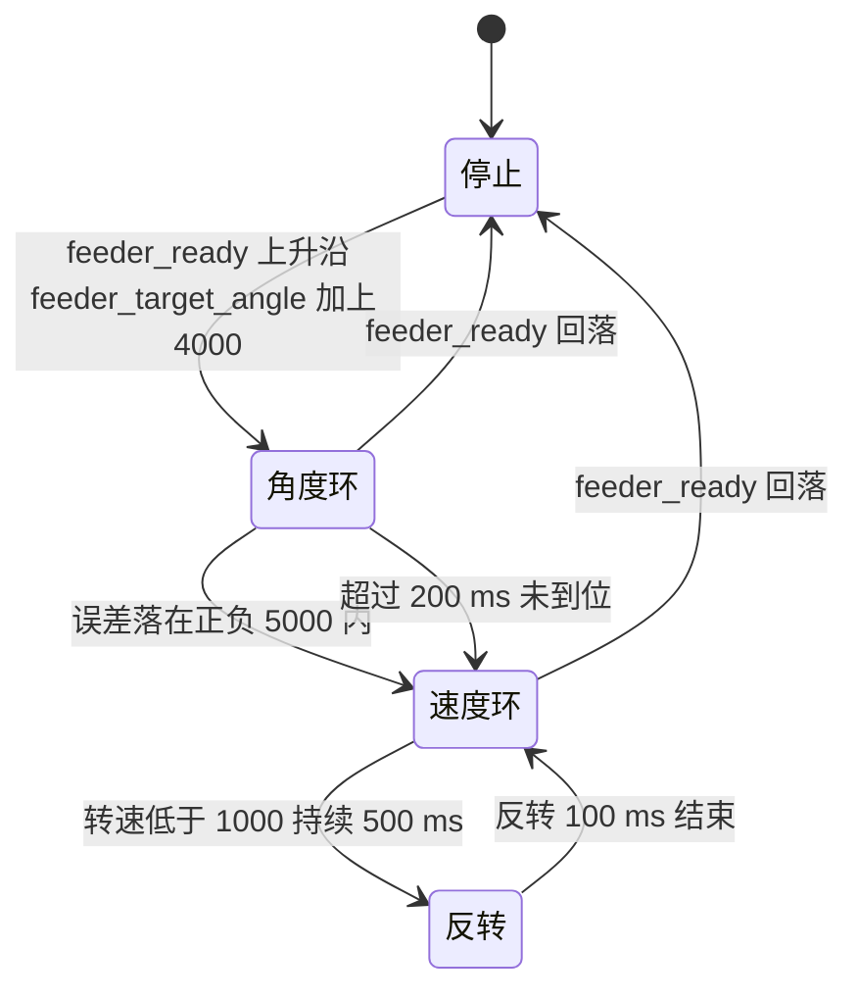
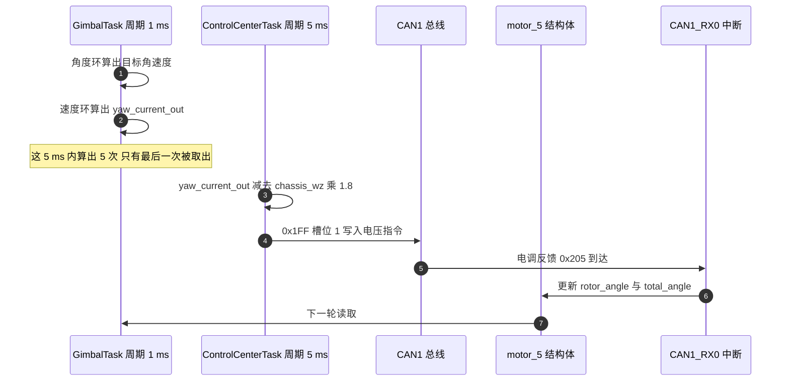

# 角度环控制

## 1. 概念：外环算目标速度，内环算输出

把电机停在一个指定角度上，最小可用的结构是两级**串级控制**（Cascade Control）：外环比较目标角度与当前角度，输出一个速度目标；内环比较目标速度与当前速度，输出电机指令。外环管位置，内环管阻尼与跟随速度，两级各自限幅。

本工程的 `AnglePID` 就是外环，继承自 `PidBase`，比基类多一个函数 `handleZeroCross`。它有两个入口：

| 入口 | 输入量纲 | 用途 |
| --- | --- | --- |
| `calculate` | 编码器计数，周期 8192 | 电机自身角度环 |
| `Calculate_angle` | 度，周期 360 | 姿态角角度环 |

两个入口对应两种不同的“圈”概念。编码器的 8192 计数是一圈，姿态角的 360 度是一圈，都需要把反馈折算到目标附近才能算出正确的误差。

## 2. 机制

### 2.1 PidBase 的计算流程

`PidBase::Calculate` 的顺序是：算误差、算微分、算比例加微分、条件积分、输出限幅。

```cpp
float error = target - actual;
if ((prevTarget * target) < 0.0f) { integral = 0.0f; }   /* 目标反向时清积分 */
float derivative = (error - prevError) / dt;
float output = Kp * error + Kd * derivative;
if (output < maxOutput && output > -maxOutput) {          /* 只在未饱和时积分 */
    integral += Ki * error * dt;
    integral = clamp(integral, -maxIntegral, maxIntegral);
}
output += integral;
output = clamp(output, -maxOutput, maxOutput);
```

条件积分是这里的核心取舍：输出一旦撞上限幅就不再累积积分，避免积分项在饱和期间持续增长。代价是饱和期间的有效增益下降，回到线性区时的跟随会慢一点。

### 2.2 三个计算变体

| 函数 | 积分策略 | 回绕处理 | 本工程用在哪 |
| --- | --- | --- | --- |
| `Calculate` | 条件积分 | 无 | 拨盘角度环经过 `handleZeroCross` 后调用 |
| `Calculate_angle` | 条件积分，目标穿越 ±90 度时清积分 | 反馈归一到目标加减 180 度内 | yaw 角度环 |
| `Calculate_with` | 总是积分，只做积分限幅 | 无 | pitch 角度环 |

`Calculate_angle` 的归一化写法与最短路径选择是同一件事：

```cpp
float normalized_actual = actual;
while (normalized_actual - target > 180.0f)  normalized_actual -= 360.0f;
while (normalized_actual - target < -180.0f) normalized_actual += 360.0f;
```

### 2.3 相位展开

`handleZeroCross` 的作用是把单圈计数展开成目标的最近等价表示，注释里称为 Phase Unwrapping（相位展开）。两块板都实现了同名函数，写法不同：

```cpp
/* 云台板：循环迭代，直到误差落在正负 4096 之内 */
while (error > 4096)  { current += 8192; error = target - current; }
while (error < -4096) { current -= 8192; error = target - current; }

/* 底盘板：只调整一次 */
if (error > 4096)       { current += 8192; }
else if (error < -4096) { current -= 8192; }
```

单次调整的版本在目标与反馈相差超过一圈时会算错误差，循环版本的代价是迭代次数不受限，目标与反馈差距越大迭代越多。

### 2.4 三处应用的结构



## 3. 落到本项目

### 3.1 拨盘电机：唯一走编码器角度环的一路

拨盘电机是 0x1FF 槽位 2 上的电机，反馈帧 0x206，变量名 `motor_6`。它的角度环实例在 `Task/Src/FireTask.cpp` 第 36 行：

```cpp
AnglePID motor_SUPPLY_ANGLE_PID(5.0f, 0.5f, 0.0f, 5000.0f, 3000.0f);
```

五个实参依次是 `Kp`、`Ki`、`Kd`、`maxOutput`、`maxIntegral`。外环调用在 :142：

```cpp
int32_t speed_target = motor_SUPPLY_ANGLE_PID.calculate(
        feeder_target_angle, motor_6.total_angle, 0.01f);
```

反馈是累计计数 `total_angle`，所以 `handleZeroCross` 用 8192 作周期展开是匹配的。内环在 :153：

```cpp
control_output_motor_3 = motor_SUPPLY_PID.Calculate(speed_target, motor_6.rotor_speed, 0.01f);
```

外环输出经过 `int16_t` 截断，限幅 5000 落在范围内。

### 3.2 拨盘的三阶段状态机

角度环只负责发射周期里的第一个阶段，之后交给速度环，堵转时再反转：



### 3.3 yaw 轴：角度环走姿态角，不走进编码器

yaw 电机的反馈帧是 0x205，但它的角度环没有使用编码器计数。目标角由 `setYawTarget` 生成（`Task/Src/GimbalTask.cpp` :108-112），把输入折算到当前角的加减 180 度内；外环用 `Calculate_angle` 比较目标与 IMU 的 yaw（:65-69），内环反馈是陀螺仪 z 轴（:76-80）：

```cpp
float yaw_target_speed = YawAnglePID.Calculate_angle(yaw_little_rad, yaw, dt);
float yaw_current = YawSpeedPID.Calculate(yaw_target_speed, gyro[2], dt);
yaw_current_out = (int16_t)clamp(yaw_current, -50000.0f, 50000.0f);
```

这条链路里存在两处量纲问题，第 4 节单独列出。命令的发送不在本任务，而在 `Task/Src/ControlCenterTask.cpp` :131-133：先减去底盘角速度前馈，再以 200 Hz 的节奏调用 0x1FF 帧。



### 3.4 没有被调用的封装

两块板的 `PID/Src/angle_pid.cpp` 里都有一个静态实例与一对 C 封装：

```c
static AnglePID angle_pid(15.0f, 0.8f, 0.08f, 5000.0f, 5000.0f);
int16_t angle_pid_calculate(int32_t target, int32_t actual_angle, float dt);
```

全工程搜索 `angle_pid_calculate` 只有定义与声明，没有调用点。实际在用的只有类成员函数。

## 4. 易错点

| 现象 | 原因 | 检查手段 |
| --- | --- | --- |
| 积分几乎不工作、微分作用偏小 | `dt` 写成 0.01，实际循环周期约 1 ms | 对比任务里的 `osDelay` 与传给 PID 的 `dt` |
| yaw 内环长期贴住输出上限 | 目标按度每秒给出、反馈是弧度每秒，数值相差 57 倍，误差几乎恒为同号 | 统一量纲或在读取处乘 $180/\pi$ |
| 目标与反馈不同基准，稳定后总差一个常数 | 目标由 `yaw_out` 基准生成，反馈用了未减零点的 `yaw` | 两者用同一个零点 |
| 目标与反馈差出几圈 | 底盘板单次调整的 `handleZeroCross` 展开不彻底 | 改用循环版本或先把目标归一 |
| 积分清零过于频繁 | 目标反向判定用的是 `prevTarget * target < 0` | 观察目标在零点附近抖动时的输出 |

关于第二行，量纲的来源可以直接核对：陀螺仪量程配置为 2000 dps，换算系数写成 `0.00106526443603169529841533860381f`（`BMI088/BMI088config.h` :233），这个数值等于 0.061 乘以 $\pi/180$，因此 `gyro` 数组的量纲是弧度每秒。而 `yaw` 与 `pitch` 在 `Task/Src/ImuTask.cpp` :63-65 由四元数转出时已乘 $180/\pi$，是度。外环 `Kp` 为 80，针对的是度制误差，内环拿到的却是弧度制反馈。角度环输出的目标角速度量级可达 20000，而陀螺仪以弧度每秒计时通常只有几十，误差项长期偏正，速度环的输出会贴住限幅。

关于限幅，`clamp` 的上限写成 50000，而 GM6020 电压指令的取值区间按厂商手册为正负 30000，本仓库内没有手册文件，这一条标注为待核实。若手册区间正确，超过 30000 的部分由电调自行解释或钳位。

## 5. 小结

### 核心概念

- `AnglePID` 在 `PidBase` 之上只加了相位展开，误差计算与限幅逻辑全部继承。
- 条件积分的判据是输出是否饱和，饱和期间不累积积分，代价是回到线性区时跟随偏慢。
- 编码器角度环的周期是 8192 计数，姿态角角度环的周期是 360 度，两者用不同的入口函数。
- 拨盘电机是本工程唯一走编码器角度环的一路，外环输出速度目标、内环输出电流，中间经过 16 位截断。
- yaw 与 pitch 的角度环反馈来自姿态解算，与电机编码器无关；0x205 的反馈在云台板只写入结构体，没有参与控制。
- 两块板的 `handleZeroCross` 实现不同，云台板循环展开，底盘板只展开一次。

### 设计权衡

| 选择 | 本工程的做法 | 代价与收益 |
| --- | --- | --- |
| 外环反馈来源 | yaw 与 pitch 用姿态解算，拨盘用编码器 | 姿态角不受机械间隙影响，代价是编码器多圈信息被闲置 |
| 积分策略 | 条件积分与恒积分两种并存 | 拨盘与 yaw 抗饱和，pitch 保底消除静差，代价是三处参数不能互相照搬 |
| 相位展开 | 云台板循环，底盘板单次 | 云台板适应大偏差，代价是迭代次数不受限；底盘板实现简单，代价是超一圈失效 |
| 输出限幅 | 角度环 5000 到 20000，yaw 末级 50000 | 分级限幅便于定位饱和环节，代价是末级数值超出手册区间 |
| C 封装 | 保留但不再调用 | 接口仍在，代价是搜索函数名时会误认为它是活跃路径 |

## 6. 练习

基础题

1. 已知 `Kp = 80`、`Kd = 2`、`dt = 0.001`，误差为 3 度且上一周期误差为 2 度，计算 `Calculate_angle` 的比例与微分两项。
2. 说明 `handleZeroCross` 在目标为 100、反馈为 8000 时，两块板的返回值分别是多少。
3. 拨盘外环的 `Ki` 为 0.5，`dt` 为 0.01，误差恒为 200，计算 10 个循环后的积分项，并说明积分限幅是否会生效。

挑战题

4. 把 FireTask 传给 PID 的 `dt` 改成与循环周期一致，说明需要同步修改哪些参数才能保持原有整定效果。
5. 用一次实测替代推算：在 yaw 环上分别以度每秒与弧度每秒解释 `gyro[2]`，给出两种情况下末级输出的数量级，并设计一个区分它们的实验。
6. 给拨盘的三阶段状态机补一个“卡死”状态：连续三次反转仍无法脱困时停机并置错误标志，要求不改变既有阶段的编号，说明新增状态与现有超时判定的交互。

---

### 附：本页引用的固件路径

| 路径 | 用途 |
| --- | --- |
| `/home/wyx/rm/2026SentriOmeniGimbal/2026OmniSentryGimbal/PID/PidBase.h` | `Calculate`（:29-61）、`Calculate_angle`（:63-97）、`Calculate_with`（:99-127） |
| `/home/wyx/rm/2026SentriOmeniGimbal/2026OmniSentryGimbal/PID/Src/angle_pid.cpp` | `calculate` 与 `handleZeroCross`（:7-30）、未使用的 C 封装（:33-43） |
| `/home/wyx/rm/2026SentriOmeniGimbal/2026OmniSentryGimbal/Task/Src/GimbalTask.cpp` | yaw 角度环与速度环（:31-32、:61-83）、pitch 角度环（:34-37、:89-102） |
| `/home/wyx/rm/2026SentriOmeniGimbal/2026OmniSentryGimbal/Task/Src/FireTask.cpp` | 拨盘角度环与速度环（:36-39、:142-153）、三阶段状态机（:129-196） |
| `/home/wyx/rm/2026SentriOmeniGimbal/2026OmniSentryGimbal/Task/Src/ControlCenterTask.cpp` | 角速度前馈与 0x1FF 发送（:131-133） |
| `/home/wyx/rm/2026SentriOmeniGimbal/2026OmniSentryGimbal/Task/Src/ImuTask.cpp` | 四元数转欧拉角（:63-69） |
| `/home/wyx/rm/2026SentriOmeniGimbal/2026OmniSentryGimbal/BMI088/BMI088config.h` | 陀螺仪换算系数（:233） |
| `/home/wyx/rm/2026SentriOmeniChassis/2026OmniSentryChassis/PID/Src/angle_pid.cpp` | 底盘板单次展开版本（:14-22） |
