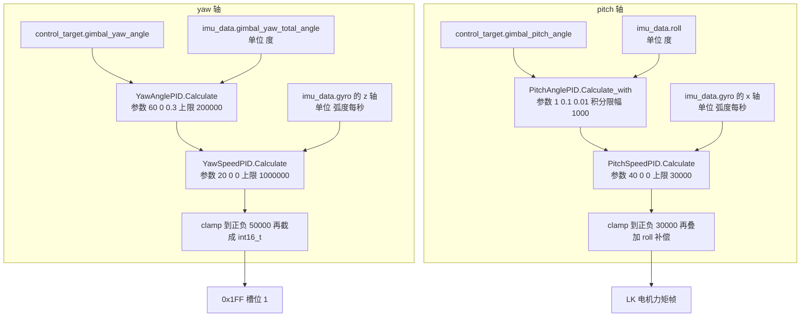
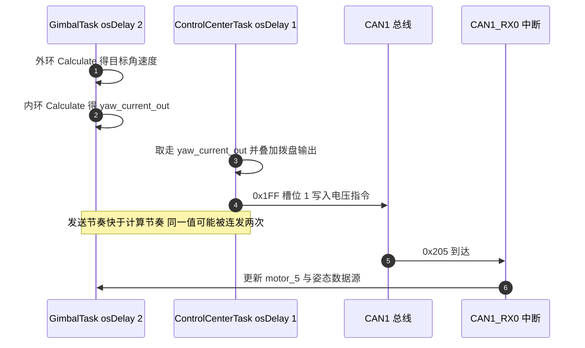

# 角度环控制

把电机停在一个指定角度上，最小可用的结构是两级串级控制：外环比较目标角度与当前角度，输出一个速度目标；内环比较目标速度与当前速度，输出电机指令。外环管位置与稳态误差，内环管阻尼与跟随速度，两级各自限幅。云台板的 `AnglePID` 就是外环，它继承自 `PidBase`，只多了一个相位展开函数。

需要先纠正一个容易先入为主的印象：云台板当前源码里没有名为 `Calculate_angle` 的成员，也没有把反馈归一化到目标正负 180 度的那段循环。角度环走的是基类的 `Calculate`，相位展开只服务编码器计数。下面按源码逐处核对，把两个入口、三个派生函数和两条真实链路分别交代。

## PidBase 的五步计算顺序

`PidBase::Calculate` 位于 `PID/PidBase.h:29-61`，顺序固定为：算误差、清反向积分、算微分、算比例加微分、条件积分、输出限幅。

```cpp
float error = target - actual;
if ((prevTarget * target) < 0.0f) { integral = 0.0f; }   /* 目标反向时清积分 */
float derivative = (error - prevError) / dt;
float output = Kp * error + Kd * derivative;
if (output < maxOutput && output > -maxOutput) {          /* 只在未饱和时积分 */
    integral += Ki * error * dt;
    integral = clamp(integral, -maxIntegral, maxIntegral);
}
output += integral;
output = clamp(output, -maxOutput, maxOutput);
```

条件积分是这里的核心取舍：输出一旦撞上限幅就不再累积积分，避免积分项在饱和期间持续增长。代价同样明确，饱和期间有效增益下降，回到线性区时的跟随会慢一点。这一取舍对角度环尤其必要，因为目标角常常远离当前角，外环很容易在一开始就顶到限幅。

目标反向时清积分是一个额外的抗过冲措施，判据用的是 `prevTarget * target < 0`，即上一周期的目标与本周期目标的符号相反。这个判据只比较目标本身，不看实际位置，所以在目标于零点附近来回抖动时会被频繁触发。

## 两个派生函数与两块板的差异

`PidBase` 在两块板上不是同一份内容：

| 成员 | 云台板 | 底盘板 | 位置 |
| --- | --- | --- | --- |
| 构造函数 | 有 | 有 | 云台板 `PID/PidBase.h:15-18`、底盘板 `PID/PidBase.h:15-18` |
| `Clear` | 有 | 有 | 云台板 `PID/PidBase.h:23-26` |
| `Calculate` | 有 | 有 | 云台板 `PID/PidBase.h:29-61`、底盘板 `PID/PidBase.h:29-61` |
| `Calculate_with` | 有 | 无 | 云台板 `PID/PidBase.h:63-91` |
| 成员变量 | `protected` | `protected` | 云台板 `PID/PidBase.h:93-98`、底盘板 `PID/PidBase.h:63-69` |

`Calculate_with` 与 `Calculate` 有两处不同：积分无条件累加，只受积分限幅约束；输出写成 `Kp * error + integral + Kd * derivative`，比例项与积分项之间没有饱和判断。它同样保留目标反向清积分的分支（云台板 `PID/PidBase.h:67-69`），所以“恒积分变体不清积分”这个说法只对了一半：反向瞬间它照样清零。

`SpeedPID` 是另一个派生类（`PID/Inc/speed_pid.h:12-36`），它重写 `Calculate` 以加入误差限幅（`PID/Inc/speed_pid.h:31`），构造函数有七参数与五参数两个版本（`PID/Inc/speed_pid.h:15-21`）。`AnglePID` 只增加相位展开，不碰误差限幅。

## 相位展开：两块板的实现差异

`AnglePID` 的声明在 `PID/Inc/angle_pid.h:12-21`，公开成员只有一个 `calculate`（`PID/Inc/angle_pid.h:17`），相位展开 `handleZeroCross` 是私有成员（`PID/Inc/angle_pid.h:20`）。实现里先展开再调用基类：

```cpp
int16_t AnglePID::calculate(int32_t target,int32_t feedback, float dt) {
    int32_t fb = handleZeroCross(target, feedback);
    float output = Calculate(static_cast<float>(target), static_cast<float>(fb), dt);
    return static_cast<int16_t>(output);
}
```

这段在云台板 `PID/Src/angle_pid.cpp:7-11`、底盘板 `PID/Src/angle_pid.cpp:7-11`，两份相同。差别全部在展开函数里：

```cpp
/* 云台板：循环迭代，直到误差落在正负 4096 之内 */
while (error > 4096)  { current += 8192; error = target - current; }
while (error < -4096) { current -= 8192; error = target - current; }

/* 底盘板：只调整一次 */
if (error > 4096)       { current += 8192; }
else if (error < -4096) { current -= 8192; }
```

云台板在 `PID/Src/angle_pid.cpp:20-27`，底盘板在 `PID/Src/angle_pid.cpp:16-19`。注意两处的加减方向：当 `target - current > 4096` 时给 `current` 加一圈，让展开后的反馈向目标靠拢。

单次调整的版本在目标与反馈相差超过一圈时会算错误差；循环版本的代价是迭代次数不受目标与反馈的差距控制。两处都是纯计算，没有实测的迭代上限，属于按代码推断。

还有一处容易被忽略：`AnglePID::calculate` 在整个仓库里没有调用点。搜索 `calculate(` 的调用只出现在类内定义与 C 封装中，实际角度环用的是继承来的 `Calculate`，因此相位展开在当前固件上并不参与运行。

## yaw 轴：姿态角外环加陀螺仪内环

yaw 环在 `Task/Src/GimbalTask.cpp` 里，四个实例的构造参数都在循环外：

| 实例 | 类型 | 参数 | 位置 |
| --- | --- | --- | --- |
| `YawAnglePID` | `AnglePID` | 60.0f, 0.000f, 0.3f, 200000.0f, 180.0f | `Task/Src/GimbalTask.cpp:27` |
| `YawSpeedPID` | `SpeedPID` | 20.0f, 0.0f, 0.000f, 1000000.0f, 20000.0f | `Task/Src/GimbalTask.cpp:29` |
| `PitchAnglePID` | `AnglePID` | 1.0f, 0.1f, 0.01f, 10000.0f, 5000.0f，随后把积分限幅改成 1000 | `Task/Src/GimbalTask.cpp:31-32` |
| `PitchSpeedPID` | `SpeedPID` | 40.0f, 0.0f, 0.0f, 30000.0f, 20000.0f | `Task/Src/GimbalTask.cpp:34` |

yaw 外环用继承的 `Calculate`，反馈是姿态解算的累计 yaw（`Task/Src/GimbalTask.cpp:61-65`）：

```cpp
float yaw_target_speed = YawAnglePID.Calculate(
    control_target.gimbal_yaw_angle,
    imu_data.gimbal_yaw_total_angle,
    dt);
```

内环随后把角度环输出的目标角速度与陀螺仪 z 轴比较（`Task/Src/GimbalTask.cpp:72-76`），末级限幅与截断在 `Task/Src/GimbalTask.cpp:79`：

```cpp
yaw_current_out = (int16_t)clamp(yaw_current, -50000.0f, 50000.0f);
```

这里有一个量程问题：`int16_t` 的表示范围是正负 32767，而限幅上限是 50000。输出落在 32768 到 50000 之间时，强制转换会把超过 16 位的部分截掉，结果变成负数，例如 50000 转成 -15536。限幅本身没有防止这种回绕，这一条由 `Task/Src/GimbalTask.cpp:79` 与类型定义直接得出。

命令的发送不在本任务，而在 `Task/Src/ControlCenterTask.cpp:106`：`yaw_current_out` 与拨盘输出一起进入 0x1FF 帧，紧接着 `Task/Src/ControlCenterTask.cpp:107` 把 `pitch_current_out` 发给 LK 电机。发送任务里没有对 yaw 输出再做处理，`control_target.chassis_wz` 在整个文件里只出现在 `Task/Src/ControlCenterTask.cpp:33` 的初始化中，值为 0，因此当前固件没有底盘角速度前馈。

## pitch 轴：恒积分变体与限幅清积分

pitch 的外环走 `Calculate_with`（`Task/Src/GimbalTask.cpp:84-89`），反馈是 IMU 的 roll：

```cpp
float pitch_target_speed =
    PitchAnglePID.Calculate_with(
    control_target.gimbal_pitch_angle,
    imu_data.roll,
    dt);
```

内环反馈是陀螺仪的 x 轴（`Task/Src/GimbalTask.cpp:92-96`），注意不是 y 轴。末级输出在 `Task/Src/GimbalTask.cpp:98`：

```cpp
pitch_current_out = (int16_t)clamp(pitch_current, -30000.0f, 30000.0f) + (-imu_data.roll) * 20;
```

30000 落在 `int16_t` 范围内，这一路没有回绕问题；但输出在钳位之后又叠加了一项与 roll 成正比的重力补偿，叠加结果不再受限幅约束。

pitch 还有一处与 yaw 不同的处理：当 roll 越过机械限位时直接把积分清零（`Task/Src/GimbalTask.cpp:45-47`），而限位常量写在第 40 与 41 行，取值为正 30 度与负 20 度。目标角也做同样的钳位（`Task/Src/GimbalTask.cpp:48-57`）。

两条链路的信号流并排看：



## 拨盘与摩擦轮：FireTask 里的速度环

`Task/Src/FireTask.cpp` 里没有角度环实例。全部四个 PID 都是 `SpeedPID`（`Task/Src/FireTask.cpp:31-38`）：摩擦轮左右各一个、拨盘一个、以及一个专门把两轮转速差压到零的差值环。摩擦轮的控制带前馈，前馈量在 `Task/Src/FireTask.cpp:25-26` 定为正负 500：

```cpp
control_output_motor_1 = feed_forward_left + motor_LEFT_PID.Calculate(5500, motor_1.rotor_speed, 0.01f) + diff_output;
control_output_motor_2 = feed_forward_right + motor_RIGHT_PID.Calculate(-5500, motor_2.rotor_speed, 0.01f) - diff_output;
```

拨盘的输出只取三档目标值，判据是转矩电流：

| 条件 | 目标转速 | 位置 |
| --- | --- | --- |
| `motor_6.torque_current > 6000` | -1000 | `Task/Src/FireTask.cpp:53` |
| 转矩电流未超过 6000 | 1000 | `Task/Src/FireTask.cpp:56` |
| `feeder_ready` 为假 | 0 | `Task/Src/FireTask.cpp:59` |

摩擦轮未就绪时三路都回到 0 目标（`Task/Src/FireTask.cpp:65-67`）。源码里没有分阶段状态机，也没有堵转反转与超时退出，拨盘方向只由转矩电流阈值决定。这一条与旧版本的描述不同，属于源码核对后的更正。

## dt 与实际周期的三处不一致

三个任务传给 PID 的 `dt` 与它们的循环间隔对不上：

| 任务 | 传入 dt | 循环写法 | 位置 |
| --- | --- | --- | --- |
| FireTask | 0.01 | `osDelay(1)` | `Task/Src/FireTask.cpp:49` 等与 `Task/Src/FireTask.cpp:70` |
| GimbalTask | 0.001 | `osDelay(2)` | `Task/Src/GimbalTask.cpp:37` 与 `Task/Src/GimbalTask.cpp:100` |
| ControlCenterTask | 不调用 PID | `osDelay(1)` | `Task/Src/ControlCenterTask.cpp:111` |

FireTask 的 `dt` 比 `osDelay(1)` 大 10 倍，微分项因此缩小 10 倍、积分步长放大 10 倍；GimbalTask 的 `dt` 是名义 1 ms，而 `osDelay(2)` 的注释与参数互相矛盾，实际间隔取决于 RTOS 时钟节拍与调度。两处都以实测为准，这里标注为按代码推断。

调度节奏本身还有一处结果：GimbalTask 每 2 ms 算一次 yaw 输出，ControlCenterTask 每 1 ms 发送一次，因此同一个 `yaw_current_out` 会被连续取走两次。属于按两个 `osDelay` 参数推断，需要用 DWT 或示波器确认。



## 角度与角速度的量纲口径

yaw 外环的反馈 `imu_data.gimbal_yaw_total_angle` 是度：它在 `Task/Src/ImuTask.cpp:76` 由弧度乘 $180/\pi$ 得到单圈 yaw，再在 `Task/Src/ImuTask.cpp:86-94` 累加成连续角度，并在 `Task/Src/ImuTask.cpp:100` 写入结构体。外环 `Kp` 为 60，针对的是度制误差。

内环的反馈 `imu_data.gyro` 是弧度每秒。灵敏度的宏在 `BMI088/BMI088config.h:233`：

```c
#define BMI088_GYRO_2000_SEN 0.00106526443603169529841533860381f// 2000 / 32768
```

数值等于 $2000/32768/57.29578$，即每 LSB 的弧度每秒；注释写的却是度每秒，两处口径不一致。转换在 `BMI088/Src/BMI088.cpp:158-160`：

```cpp
real_.gyro[0] = raw_.gyro[0] * BMI088_GYRO_2000_SEN * 2.0f;
```

多出来的 2.0f 让实际比例变成每 LSB 的 $0.00213$ 弧度每秒，等于把物理量放大了一倍。按代码推断，这个系数可能来自量程与标定不符，需要实测确认。

两个口径的数值比是

$$\frac{180}{\pi} \approx 57.3$$

外环输出的目标角速度按度每秒语义可达 200000（限幅值），而陀螺仪以弧度每秒计时通常只有几十，内环误差项长期偏正，输出会贴住限幅。若把 2.0f 也算进来，差距还要再乘一倍。末级 `int16_t` 的上限是 32767，与 GM6020 电压指令按厂商手册的正负 30000 相比略宽，仓库内没有手册文件，这一条标注为待核实。

## 保留但无人调用的 C 封装

两块板的 `PID/Src/angle_pid.cpp` 里都有一个静态实例与一对 C 封装：

```c
static AnglePID angle_pid(15.0f, 0.8f, 0.08f, 5000.0f, 5000.0f);
void angle_pid_clear();
int16_t angle_pid_calculate(int32_t target, int32_t actual_angle, float dt);
```

云台板在 `PID/Src/angle_pid.cpp:33-43`，底盘板在 `PID/Src/angle_pid.cpp:25-35`，参数一致。全工程搜索 `angle_pid_calculate` 只有定义与声明，没有调用点；`AnglePID::calculate` 同样没有调用点。实际在用的只有继承的 `Calculate` 与 `Calculate_with`。保留 C 封装的后果是搜索函数名时会误认为它是活跃路径，改它的参数不会生效。

## 常见现象与对照

| 现象 | 原因 | 检查手段 |
| --- | --- | --- |
| yaw 内环长期贴住输出上限 | 外环按度、内环按弧度每秒，数值差 57.3 倍 | 统一量纲，或把内环反馈乘 $180/\pi$ |
| yaw 输出在正负 32767 附近跳变 | 限幅 50000 超过 `int16_t` 范围，强转后回绕 | 读 `yaw_current_out` 与限幅值的差 |
| 积分几乎不工作、微分作用偏小 | `dt` 写成 0.01，而循环是 1 ms | 对比 `osDelay` 与传入的 `dt` |
| 同一电压指令连发两次 | 发送周期 1 ms，计算周期 2 ms | 统计连续两帧的字节是否相同 |
| pitch 目标角与反馈相差几十度 | 限位常量写成正 30 度与负 20 度，与注释不符 | 核对 `Task/Src/GimbalTask.cpp:40-41` |
| pitch 钳位后仍超出范围 | 输出在钳位之后又叠加 roll 补偿 | 看 `Task/Src/GimbalTask.cpp:98` 的运算顺序 |
| 目标与反馈差出几圈 | 底盘板单次调整的 `handleZeroCross` 展开不彻底 | 改用循环版本或先把目标归一 |
| 积分被频繁清零 | 目标反向判定用的是 `prevTarget * target < 0` | 观察目标在零点附近抖动时的输出 |
| 末级饱和后回中变慢 | 条件积分在饱和期间停止累积 | 临时去掉条件判断做对比 |

## 小结

### 核心概念

- `AnglePID` 在 `PidBase` 之上只加了相位展开，误差计算与限幅逻辑全部继承。
- 条件积分的判据是输出是否饱和，饱和期间不累积积分，代价是回到线性区时跟随偏慢。
- 云台板比底盘板多一个 `Calculate_with`，它无条件积分但仍会在目标反向时清积分。
- 两块板的 `handleZeroCross` 实现不同，云台板循环展开，底盘板只展开一次；两者都没有调用点。
- yaw 与 pitch 的外环用姿态角做反馈，与电机编码器无关，0x205 的编码器值没有参与控制。
- `Task/Src/FireTask.cpp` 全部是速度环，拨盘只有三档目标值，没有角度环与分阶段状态机。
- 传进 PID 的 `dt` 与三个任务的 `osDelay` 都对不上，两处需要实测确认。

### 设计权衡

| 选择 | 本工程的做法 | 代价与收益 |
| --- | --- | --- |
| 外环反馈来源 | yaw 与 pitch 用姿态解算 | 不受机械间隙影响；代价是电机编码器的多圈信息被闲置 |
| 积分策略 | 条件积分与恒积分两种并存 | yaw 抗饱和、pitch 保底消静差；代价是三处参数不能互相照搬 |
| 相位展开 | 云台板循环，底盘板单次 | 云台板适应大偏差，代价是迭代次数不受限；底盘板实现简单，代价是超一圈失效 |
| 输出限幅 | yaw 正负 50000，pitch 正负 30000 | 分级限幅便于定位饱和环节；代价是 yaw 的上限超过 `int16_t` |
| 重力补偿位置 | 放在钳位之后 | 补偿不受限幅约束，响应直接；代价是最终输出可以超出设定上限 |
| C 封装 | 保留但不再调用 | 接口仍在；代价是搜索函数名时会误认为它是活跃路径 |

## 练习

### 基础题

1. 写出 `Calculate` 与 `Calculate_with` 在积分与比例项位置上的三点差异，并指出两者共有的一个分支。
2. 已知 `YawAnglePID` 参数为 60、0、0.3、200000、180，误差为 3 度、上一周期误差为 2 度、`dt` 为 0.001，计算比例与微分两项。
3. 说明 `handleZeroCross` 在目标为 100、反馈为 8000 时，两块板的返回值分别是多少。
4. 列出 `Task/Src/FireTask.cpp` 里四个 `SpeedPID` 实例的用途与限幅值。

### 挑战题

5. 把 GimbalTask 传给 PID 的 `dt` 改成与循环间隔一致，说明需要同步修改哪些参数才能保持原有整定效果。
6. 设计一个实验判定 `imu_data.gyro` 的量纲与那个 2.0f 系数：给出三种假设下的预期读数与区分方法。
7. 修掉 yaw 末级的 `int16_t` 回绕：给出限幅方案与对 0x1FF 槽位取值范围的影响，并说明需要同步改动的文件。
8. 给拨盘补一个角度环（当前源码没有），要求复用 `AnglePID` 与编码器累计角度，说明需要新增的实例、参数来源与被替换的代码段。

## 附：本页引用的固件路径

| 路径 | 用途 |
| --- | --- |
| `/home/wyx/rm/2026SentriOmeniGimbal/2026OmniSentryGimbal/PID/PidBase.h` | `Clear`（`PID/PidBase.h:23-26`）、`Calculate`（`PID/PidBase.h:29-61`）、`Calculate_with`（`PID/PidBase.h:63-91`）、成员（`PID/PidBase.h:93-98`） |
| `/home/wyx/rm/2026SentriOmeniGimbal/2026OmniSentryGimbal/PID/Inc/angle_pid.h` | 类声明（`PID/Inc/angle_pid.h:12-21`）与 C 接口声明（`PID/Inc/angle_pid.h:28-29`） |
| `/home/wyx/rm/2026SentriOmeniGimbal/2026OmniSentryGimbal/PID/Src/angle_pid.cpp` | `calculate`（`PID/Src/angle_pid.cpp:7-11`）、循环展开（`PID/Src/angle_pid.cpp:20-27`）、未使用的 C 封装（`PID/Src/angle_pid.cpp:33-43`） |
| `/home/wyx/rm/2026SentriOmeniGimbal/2026OmniSentryGimbal/PID/Inc/speed_pid.h` | `SpeedPID` 构造函数与误差限幅（`PID/Inc/speed_pid.h:15-21`、`PID/Inc/speed_pid.h:31`） |
| `/home/wyx/rm/2026SentriOmeniGimbal/2026OmniSentryGimbal/Task/Src/GimbalTask.cpp` | 四个 PID 实例（`Task/Src/GimbalTask.cpp:27-34`）、`dt`（`Task/Src/GimbalTask.cpp:37`）、限位（`Task/Src/GimbalTask.cpp:40-47`）、yaw 两环（`Task/Src/GimbalTask.cpp:61-79`）、pitch 两环与补偿（`Task/Src/GimbalTask.cpp:84-98`） |
| `/home/wyx/rm/2026SentriOmeniGimbal/2026OmniSentryGimbal/Task/Src/FireTask.cpp` | 前馈与 PID 实例（`Task/Src/FireTask.cpp:25-38`）、摩擦轮（`Task/Src/FireTask.cpp:42-50`）、拨盘三档（`Task/Src/FireTask.cpp:53-59`）、循环周期（`Task/Src/FireTask.cpp:70`） |
| `/home/wyx/rm/2026SentriOmeniGimbal/2026OmniSentryGimbal/Task/Src/ControlCenterTask.cpp` | `chassis_wz` 初始化（`Task/Src/ControlCenterTask.cpp:33`）、发送点（`Task/Src/ControlCenterTask.cpp:106-107`）、周期（`Task/Src/ControlCenterTask.cpp:111`） |
| `/home/wyx/rm/2026SentriOmeniGimbal/2026OmniSentryGimbal/Task/Src/ImuTask.cpp` | 度制转换（`Task/Src/ImuTask.cpp:76`）、累计角度（`Task/Src/ImuTask.cpp:86-100`） |
| `/home/wyx/rm/2026SentriOmeniGimbal/2026OmniSentryGimbal/BMI088/BMI088config.h` | 陀螺仪灵敏度宏（`BMI088/BMI088config.h:233`） |
| `/home/wyx/rm/2026SentriOmeniGimbal/2026OmniSentryGimbal/BMI088/Src/BMI088.cpp` | 陀螺仪换算（`BMI088/Src/BMI088.cpp:158-160`） |
| `/home/wyx/rm/2026SentriOmeniChassis/2026OmniSentryChassis/PID/Src/angle_pid.cpp` | 底盘板单次展开（`PID/Src/angle_pid.cpp:16-19`）与 C 封装（`PID/Src/angle_pid.cpp:25-35`） |
| `/home/wyx/rm/2026SentriOmeniChassis/2026OmniSentryChassis/PID/PidBase.h` | 无 `Calculate_with`，成员在 `PID/PidBase.h:63-69` |
