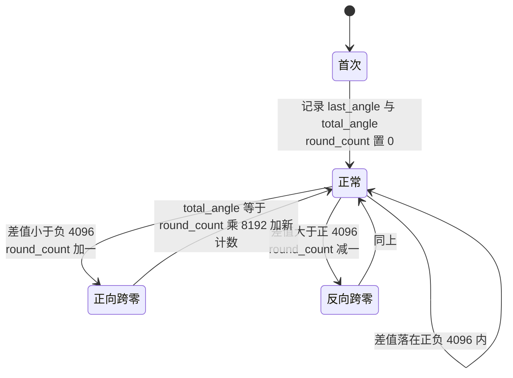
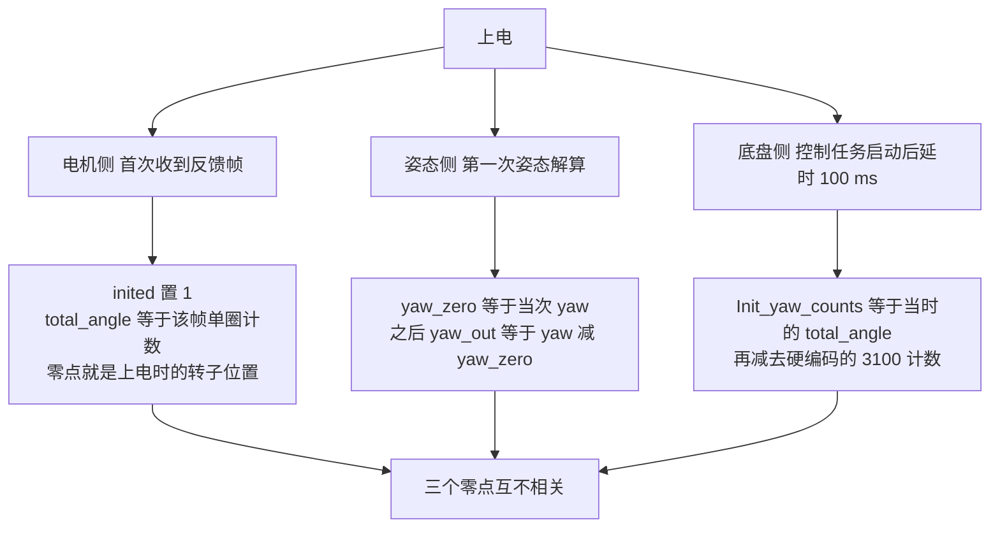
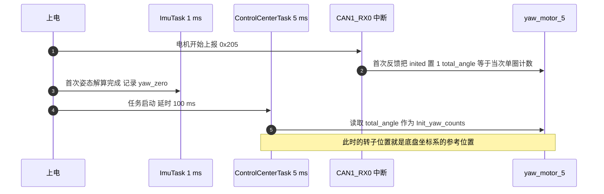

# 零点与多圈角度

## 1. 概念：三种零点与两种圈

处理电机角度时，同一个“角度”至少对应三种量：**机械角**（Mechanical Angle）、**累计角度**（Multi-turn Angle）与姿态零点，混用会得到差一个常数的结果。

| 名称 | 定义位置 | 取值范围 | 断电是否保留 |
| --- | --- | --- | --- |
| 单圈机械角 | 电调内部，随电机转动 | 0 到 8191 | 保留，由转子位置决定 |
| 累计角度 | 主控每次收到反馈时更新 | 由圈数与单圈值拼出 | 不保留，上电重新开始 |
| 姿态零点 | 姿态解算内部，上电后第一次采样确定 | 相对值 | 不保留 |

“一圈”也有两种周期：编码器的一圈是 8192 计数，姿态角的一圈是 360 度。第 3 篇讲过角度环的两个入口，这一篇处理的是这些零点从哪来、多圈怎么拼、拼出来能存多少。

## 2. 机制

### 2.1 单圈计数拼成累计角度

拼接函数 `update_motor_total_angle` 只有三段逻辑：

```c
void update_motor_total_angle(DJI_motor_info* motor, uint16_t new_ecd)
{
    if (!motor->inited) {                       /* 首次收到反馈 */
        motor->last_angle  = new_ecd;
        motor->round_count = 0;
        motor->total_angle = (int32_t)new_ecd;
        motor->inited = 1;
        return;
    }
    int32_t diff = (int32_t)new_ecd - (int32_t)motor->last_angle;
    if (diff > 4096)       { motor->round_count--; }   /* 反向跨过零点 */
    else if (diff < -4096) { motor->round_count++; }   /* 正向跨过零点 */
    motor->total_angle = motor->round_count * 8192 + (int32_t)new_ecd;
    motor->last_angle  = new_ecd;
}
```

判据是相邻两次反馈的计数差是否超过半圈。判据成立的前提是采样间隔内转子转过的角度小于半圈，否则会被误判成跨圈。把这个条件写成公式：

$$n_{\max} = \frac{4096 \times 60}{8192 \times T} = \frac{30}{T}$$

$T$ 是反馈帧的到达间隔，单位秒。取 $T = 1\ \text{ms}$ 时 $n_{\max}$ 为 30000 转每分钟，远高于直驱电机与减速电机的实际转速上限，判据是安全的。本仓库里找不到反馈周期的明确定义，这一条标注为待实测。

### 2.2 过零判定的三种情形



用两个具体数值可以验证方向。上一帧计数 8000、本帧 200，差值为负 7800，判为正向跨零，圈数加一，累计角度为 $8192 + 200$。上一帧 200、本帧 8000，差值为正 7800，判为反向跨零，圈数减一，累计角度为 $-8192 + 8000$。代码的方向正确，而注释写的是“向上跨过 0 点，round_count 增加”，与代码相反。以代码为准。

### 2.3 三种零点的来源



## 3. 落到本项目

### 3.1 云台板：算了但没用

云台板的 `DJI_motor_info` 里 `total_angle` 是 `int32_t`，只有 0x205 与 0x206 两路会调用拼接函数（`BSP/Src/bsp_can.cpp` :625、:636）。其中 `motor_5` 的 `total_angle` 在写入之后没有任何读取点，唯一可能用到它的那一行被注释掉了（`Task/Src/GimbalTask.cpp` :74）。实际在用的是 `motor_6.total_angle`，作为拨盘角度环的反馈（`Task/Src/FireTask.cpp` :142、:119、:192）。

yaw 轴的零点走的是姿态解算这一路（`Task/Src/ImuTask.cpp` :22-26、:70-77）：

```cpp
if(first_run) { yaw_zero = yaw; first_run = false; }
yaw_out = yaw - yaw_zero;
```

累计总角度曾经有一个实现，最终被注释掉（`Task/Src/ImuTask.cpp` :79-96），`gimbal_yaw_total` 变量停留在 0 并保留声明（:21、`Task/Src/GimbalTask.cpp` :13）。

### 3.2 底盘板：16 位累计角度与 3100 偏移

底盘板的结构体里 `total_angle` 是 `int16_t`（`BSP/Inc/bsp_can.h` :17），而拼接表达式是 `round_count * 8192 + new_ecd`。赋值时高 16 位被截掉，等价于对 65536 取模后再按有符号解释：

$$\text{total\_angle} \in [-32768,\ 32767] \Rightarrow |\text{圈数}| \le \frac{32767}{8192} \approx 4$$

底盘跟随角度依赖这个值。控制任务启动后延时 100 ms 再取初值（`Task/Src/ControlCenterTask.cpp` :56-58）：

```cpp
Init_yaw_counts = yaw_motor_5.total_angle;
Init_yaw_angle  = (Init_yaw_counts - 3100) * (2.0f * 3.1415927f / 8192.0f);
```

此后每个周期用初值减去当前读数得到相对角（:100-101），再参与底盘与云台坐标系的旋转补偿（:116-117）：

$$\Delta\theta = (\text{Init\_yaw\_counts} - \text{total\_angle}) \times \frac{2\pi}{8192}$$

$3100$ 是硬编码的机械零位偏移，代码与仓库文档里都没有说明它的来源，标注为待核实。

底盘板还有一处只用单圈值的换算（`Task/Src/UsbConnectTask.cpp` :177、:248-251）：

```cpp
only_yaw.yaw = mapToAngle(yaw_motor_5.rotor_angle) - 180;   /* 系数 180/4096 */
```

`rotor_angle` 取 0 到 8191，乘以 $180/4096$ 得到 0 到 360 度，减去 180 后落在正负 180 度内，这是把单圈计数直接映射成罗盘角的做法。

### 3.3 上电时序



## 4. 易错点

| 现象 | 可能原因 | 检查手段 |
| --- | --- | --- |
| 上电位置不同，跟随角差一个常数 | 首次反馈决定累计角度原点 | 记录首次反馈时的单圈计数 |
| 转过多圈后跟随角突然跳变 | 底盘板 16 位累计角度回绕，约正负 4 圈 | 调试器里同时看 `round_count` 与 `total_angle` |
| 累计角度增长方向与转向相反 | 注释与代码方向相反时按注释修改 | 以 `round_count` 的实际增减为准 |
| 断电重启后绝对角度丢失 | 累计角度只用内存保存 | 需要绝对角度时增加上电回零动作 |
| 电机停转后角度仍在缓慢变化 | 没有接收超时判定，中断不再来则字段保持旧值 | 加时间戳或计数判据 |
| 姿态零点与机械零点混用 | 两个零点在不同任务里各自确定 | 统一到同一参考系后再比较 |

判据的阈值还需要单独看。半圈判据假设两次反馈之间不会转过 4096 个计数，一旦反馈因总线错误长时间中断，恢复后的第一帧差值可能超过半圈，此时会多算或少算一圈，而代码里没有任何补偿。

## 5. 小结

### 核心概念

- 单圈机械角由电调给出，累计角度由主控用半圈判据自行拼接，两者的零点不同。
- 半圈判据的安全上限是 $n_{\max} = 30/T$，在 1 ms 反馈间隔下为 30000 转每分钟。
- 首次反馈把累计角度的原点定在上电时的转子位置，因此绝对角度在上电之间没有可比性。
- 底盘板的累计角度是 16 位，可用范围约正负 4 圈，超出后回绕。
- 姿态零点由上电后第一次姿态解算确定，与编码器零点无关，云台板的 yaw 环只用前者。
- 云台板把 `motor_5.total_angle` 算了出来却没有使用，拨盘电机是唯一使用累计计数的角度环。

### 设计权衡

| 选择 | 本工程的做法 | 代价与收益 |
| --- | --- | --- |
| 累计角度位宽 | 云台板 32 位，底盘板 16 位 | 底盘板省内存，代价是超过 4 圈即回绕 |
| 零点确定时机 | 首次反馈与首次姿态解算各自确定 | 无需上电回零，代价是三个零点互不相关 |
| 过零判据 | 固定 4096 计数阈值 | 实现简单，代价是长间隔丢帧后可能误判 |
| 机械零位 | 硬编码 3100 计数 | 改动一处即可调整，代价是含义只能从数值猜 |
| 单圈映射 | 单圈计数乘 180/4096 再减 180 | 直接得到罗盘角，代价是丢失多圈信息 |

## 6. 练习

基础题

1. 上一帧计数为 100，本帧为 8100，写出 `round_count` 的增减、`total_angle` 的值，并判断转子转向。
2. 反馈周期为 2 ms，计算半圈判据允许的最大转速；若电机以 6000 转每分钟运行，判据是否会误判。
3. 底盘板 `round_count` 为 5、单圈计数为 1000 时，写出表达式结果与截断后的 `total_angle`，并说明与真实累计角度差多少。

挑战题

4. 把 `total_angle` 改成 32 位，说明需要同步修改哪些类型、初始化与比较表达式，并给出一次跨越 4 圈的验证方案。
5. 设计一个上电回零流程：让 yaw 关节在限速下缓慢转到机械限位，把该位置的计数写入非易失存储，之后每次上电用它恢复绝对零点。说明断电发生在回零过程中的处理办法。
6. 用 4096 之外的阈值做一个对比实验：给定反馈丢帧时长与转速，推导最优阈值，并说明为什么本工程用固定阈值仍可接受。

---

### 附：本页引用的固件路径

| 路径 | 用途 |
| --- | --- |
| `/home/wyx/rm/2026SentriOmeniGimbal/2026OmniSentryGimbal/BSP/Src/bsp_can.cpp` | `update_motor_total_angle`（:559-587）、0x205 与 0x206 的调用点（:625、:636） |
| `/home/wyx/rm/2026SentriOmeniGimbal/2026OmniSentryGimbal/BSP/Inc/bsp_can.h` | 云台板 `DJI_motor_info`（:10-20） |
| `/home/wyx/rm/2026SentriOmeniGimbal/2026OmniSentryGimbal/Task/Src/ImuTask.cpp` | `yaw_zero` 与 `yaw_out`（:22-26、:70-77）、被注释的总角度累加（:79-96） |
| `/home/wyx/rm/2026SentriOmeniGimbal/2026OmniSentryGimbal/Task/Src/GimbalTask.cpp` | 未使用的 `motor_5` 速度换算（:74） |
| `/home/wyx/rm/2026SentriOmeniGimbal/2026OmniSentryGimbal/Task/Src/FireTask.cpp` | 拨盘以累计计数为目标与反馈（:119、:142、:192） |
| `/home/wyx/rm/2026SentriOmeniChassis/2026OmniSentryChassis/BSP/Inc/bsp_can.h` | 底盘板 16 位 `total_angle`（:17） |
| `/home/wyx/rm/2026SentriOmeniChassis/2026OmniSentryChassis/BSP/Src/bsp_can.cpp` | 底盘板拼接函数与 0x205 调用（:552-580、:634） |
| `/home/wyx/rm/2026SentriOmeniChassis/2026OmniSentryChassis/Task/Src/ControlCenterTask.cpp` | `Init_yaw_counts` 与 3100 偏移（:56-58）、相对角与旋转补偿（:100-101、:116-117） |
| `/home/wyx/rm/2026SentriOmeniChassis/2026OmniSentryChassis/Task/Src/UsbConnectTask.cpp` | 单圈计数映射为罗盘角（:177、:248-251） |
