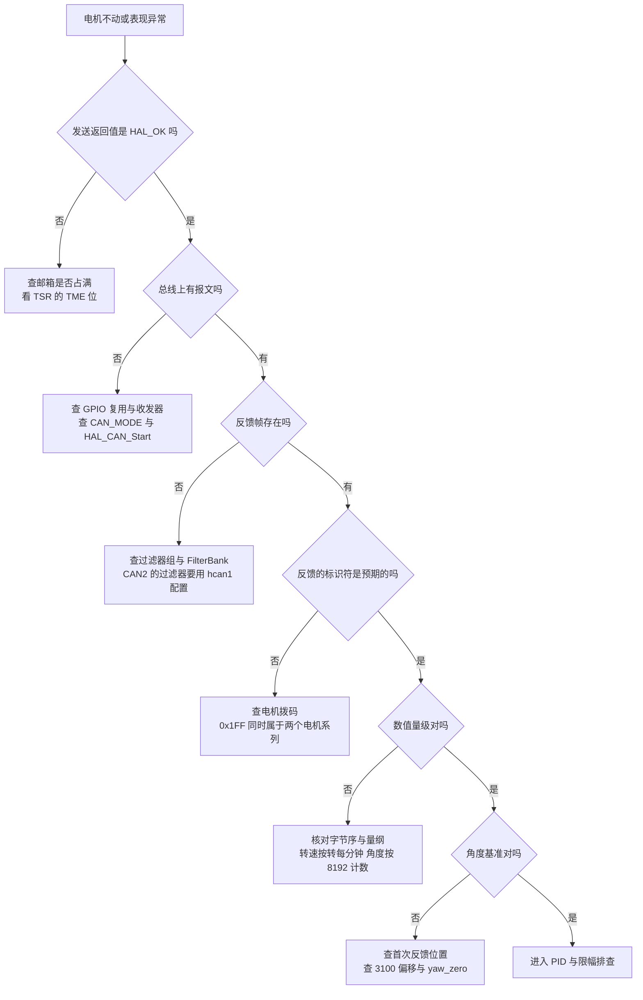
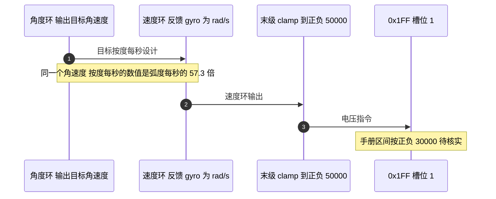

# 易错点与排查顺序

同一条“电机不动”的现象，根因可能落在完全不同的层次：报文没发出去、发出去了但没人应答、反馈收到了却按错误的量纲解读、控制量被限幅吃掉。这四个层次的排查手段互不相同，如果一上手就调 PID，很可能在参数上反复试却碰不到根因。

本单元前四篇里出现过的问题可以归成五类，按从便宜到昂贵的顺序排列，并列出需要现场核对的事项。读完后应当能在一个具体故障面前先判断它属于哪一类，再按照对应的观察点取证据，而不是逐项试错。

## 五类归属

| 类别 | 典型表现 | 主要证据来源 |
| --- | --- | --- |
| 报文与 ID | 发送返回 HAL_OK，电机完全不响应 | 逻辑分析仪抓包、电机拨码 |
| 解析与量纲 | 数值量级明显不符，符号与转向相反 | 原始报文与结构体字段对照 |
| 零点与多圈 | 上电后角度偏差固定，转多圈后跳变 | `total_angle` 与 `round_count` |
| 控制与限幅 | 响应迟钝、饱和、抖动 | PID 参数与限幅链 |
| 时序与并发 | 偶发错值，随负载变化 | 中断优先级、读写上下文 |

分类的意义在于证据来源不同。报文类问题的证据在总线上，量纲类的证据在结构体字段与原始字节的对照里，零点类的证据要看计数与圈数，控制类的证据在限幅链路上，时序类问题则通常只在负载变化时复现，必须靠观测代码才能定位。

## 排查决策树

顺序按“便宜且常见”排在前面，每一步都能排除一整类可能：

决策树里没有“直接改参数”这一步。参数只在前面的层次全部通过之后才需要怀疑，否则改完参数也无法解释现象的变化。

## 发送成功但电机不动：0x1FF 的双系列复用

这是唯一一个“发送成功但电机不动”的常见根因。0x1FF 既承载 GM6020 的 ID 1 到 4 电压指令，也承载 M3508 的 ID 5 到 8 电流指令。云台板的调用把 yaw 与拨盘两台电机的指令放进同一条 0x1FF（云台板 `Task/Src/ControlCenterTask.cpp:106`），前提是这两台电机确实按 GM6020 的 ID 规则拨码。

仓库文档与代码在这一点上给出的信息不同：

| 材料 | 说法 |
| --- | --- |
| `项目概述.md` :8-9 | GM6020 的 ID 1 到 4 用 0x1FF，5 到 8 用 0x2FF |
| `项目概述.md` :12 | yaw 电机是 6020 电机 ID2，拨弹盘是 3508 电机 ID2 |
| 代码 | 0x1FF 槽位 1 的指令对应 0x205 反馈的电机，槽位 2 对应 0x206 |

0x205 与 0x206 按 $0x204 + \text{ID}$ 分别对应 ID 1 与 ID 2。文档写 yaw 为 ID2，代码把 yaw 的反馈接在 0x205 上，两者矛盾。这一条列出为待核实，需要用电机拨码或一次上电抓包确认。

## 量纲差出 57 倍

| 位置 | 代码里的数字 | 实际含义 | 偏差 |
| --- | --- | --- | --- |
| yaw 角度环 `Kp` | 60 | 每度误差的增益（云台板 `Task/Src/GimbalTask.cpp:27`） | 外环按度，内环反馈按弧度每秒，数值差 57.3 倍 |
| yaw 末级 `clamp` | 正负 50000 | 电压指令（云台板 `Task/Src/GimbalTask.cpp:79`） | 超过 `int16_t` 的 32767，强转后回绕 |
| 拨盘速度环目标 | 正负 1000 | 转每分钟（云台板 `Task/Src/FireTask.cpp:53-56`） | 判据是转矩电流 6000，与角度无关 |
| 陀螺仪换算 | 宏值再乘 2.0f | 弧度每秒（云台板 `BMI088/Src/BMI088.cpp:158-160`） | 实际比例是灵敏度宏的两倍 |

表中前两行指向单位口径，后两行指向仓库里没有写明的系数与档位。拨盘电机只有一个以转矩电流为判据的三档目标，没有角度环，因此不存在角度增量这一项。0x206 这一路电机的型号代码里没有写明，从正负 1000 转每分钟的目标量级看更接近带减速箱的电机，这一条标注为推断。

## 中断与任务之间的可见性

接收回调在 CAN1_RX0 中断里，优先级 5（云台板 `Core/Src/can.c:125-128`），而读取这些结构体的控制任务优先级为 `osPriorityNormal`。中断只做一次 `HAL_CAN_GetRxMessage`，随后逐个字段赋值，任务可能在这中间读取：

结构体没有声明为 `volatile`，四个字段分四次写入。单字段是 16 位对齐访问，读到的值不会出现半个，组合却可能跨帧。需要一致快照时，用 `taskENTER_CRITICAL` 包住整段读取，或者把解析搬到任务里。本工程三处控制任务都只用单个字段做判断，因此一直没有暴露，但这不是设计保证。

## 波特率：改了时钟树却不动位时序

工作记录里的那次故障链条是完整的：时钟树被改动，APB1 从 42 MHz 变为 36 MHz，位时序参数不变，实际波特率从 1 Mbps 变成 857142 Hz，总线无 ACK，CAN 进入错误状态并锁定，之后全部发送失败（`/home/wyx/Work-Summary-and-Diary/工作记录/can通信波特率问题.md`）。

$$f_{\text{bit}} = \frac{f_{\text{APB1}}}{\text{Prescaler} \times (1 + \text{BS1} + \text{BS2})}$$

分母由三个位时序参数决定，只要 APB1 变了，同一个分母就对应另一个波特率。观察点如下：

| 观察点 | 位置 | 含义 |
| --- | --- | --- |
| `ErrorCode` | `hcan1` 或 `hcan2` 句柄 | 低 32 位记录最近一次错误类型 |
| `MSR` | CAN 外设寄存器 | 错误中断挂起位 |
| `TSR` | CAN 外设寄存器 | 发送邮箱占用与请求状态 |
| `ESR` | CAN 外设寄存器 | 上一次协议错误的类型与节点状态 |

工作记录里把 `ErrorCode = 0x00200000` 记成 `NOT_STARTED`。对照 HAL 的 CAN 头文件，这个位对应的不是未启动，而属于参数类错误，工作记录的这一条标注为有误，按头文件判定。

## 未初始化的两个字节与死代码

`BSP_CAN1_DJIMotorCmdNine2Eleven` 只给前 6 字节赋值，第 7、8 字节保持栈上的残留值，而 `DLC` 是 8（云台板的 CAN2 版本在 `BSP/Src/bsp_can.cpp:192-214`、CAN1 版本在 `BSP/Src/bsp_can.cpp:215-238`，底盘板在 `BSP/Src/bsp_can.cpp:189-211`）。接收端按 3 个槽位解释时不受影响，但抓包与总线错误统计会把它算作有效载荷。这类问题的代价不在功能，而在排查时多出两个无法解释的字节。

另一类干扰是看起来在用的死代码：

| 符号 | 状态 | 误判后果 |
| --- | --- | --- |
| `angle_pid_calculate` | 只有定义与声明 | 以为改这里的参数能生效 |
| `AnglePID::calculate` | 只有定义，无外部调用 | 以为相位展开在运行 |
| `motor_5.total_angle` 与 `motor_6.total_angle` | 写入后无读取 | 以为 yaw 用了编码器多圈角度 |
| `gimbal_yaw_total` | 活跃，用于累加总角度 | 反过来被当成死代码 |
| `control_target.chassis_wz` | 只在初始化里赋 0 | 以为存在底盘角速度前馈 |

搜索符号名只能找到存在性，判断是否活跃要看调用点。表里三类情况要分开看：保留的 C 接口、算出来却没人消费的字段、以及被误判活跃方向的一对符号（`gimbal_yaw_total` 是活跃的，`chassis_wz` 是死值）。改动它们都会移动源码行号，因此本单元维持原状并在此登记。

## 把证据固定在一次上电采集里

上述检查分布在总线和代码两侧，逐项临时观察容易漏掉时序信息。可执行的做法是在一次上电里同时采集下面几组数据，之后离线对照：

| 采集项 | 位置 | 用途 |
| --- | --- | --- |
| 0x1FF 与 0x2FF 的发送计数 | 发送函数入口 | 确认指令确实产生 |
| 0x205 与 0x206 的到达计数与间隔 | 接收回调 | 判断掉线与周期 |
| `round_count` 与 `total_angle` | 调试器快照 | 判断多圈拼接是否连续 |
| `yaw_zero`、`Init_yaw_counts` | 首次赋值处 | 确认三个零点各自取到值 |
| `yaw_current_out` 与末级指令 | 发送前 | 判断饱和发生在哪一级 |
| `hcan1.ErrorCode` | CAN 句柄 | 确认总线是否进入错误状态 |

采集本身不改变控制逻辑，前提是计数器放在中断与任务的执行路径边缘，不引入临界区。若发现计数在某个时刻停止，先把注意力放到总线与外设状态，而不是继续读结构体字段。

## 待核实清单

| 事项 | 现状 | 核实方式 |
| --- | --- | --- |
| 反馈帧到达周期 | 本仓库没有定义，此处按 1 ms 估算 | 在接收回调里计数并计时 |
| yaw 电机的实际 ID | 代码用 0x205，文档写 ID2 | 读拨码或上电抓包 |
| 0x206 一路的电机型号 | 代码未写明，转速目标指向减速电机 | 读拨码与外壳标识 |
| GM6020 电压指令区间 | 代码限幅正负 50000，手册值未在仓库中 | 查厂商手册 PDF |
| 3100 机械零位的来源 | 硬编码，无注释 | 询问作者或实测零点 |
| 拨盘 `dt` 取值 | 写 0.01，循环周期约 1 ms | 比对整定结果与实测周期 |

## 小结

### 核心概念

- 排查顺序按 时钟与位时序、GPIO 与收发器、过滤器、中断与回调、报文与 ID、量纲、零点、PID 逐层推进，前一层不通过时后面全是噪声。
- 0x1FF 的双系列复用是“发送成功但电机不动”的首要嫌疑，区分依据是反馈标识符与拨码。
- 量纲问题在 yaw 环上有两个独立来源：陀螺仪按弧度每秒输出，末级限幅 50000 超过 `int16_t` 上限。
- 半圈判据在 16 位累计角度上会回绕，约正负 4 圈；长间隔丢帧会让判据误判一圈。
- 中断逐字段写全局结构体，任务侧读到跨帧组合；单字段访问本身是原子的。
- 波特率由 APB1 与三个位时序参数共同决定，时钟树改动会让这组参数失效。

### 设计权衡

| 排查手段 | 成本 | 能定位的范围 |
| --- | --- | --- |
| 调试器看 CAN 寄存器与 ErrorCode | 低 | 外设状态与错误类型 |
| 逻辑分析仪抓包 | 中 | 报文是否存在、ID 与数据是否符合预期 |
| 中断里加计数器与时间戳 | 低 | 掉线、到达周期、丢帧 |
| 把解析搬到任务 | 中 | 消除跨上下文写，便于下断点 |
| 统一量纲与限幅 | 中 | 消除数量级与饱和类问题 |
| 电机拨码核对 | 低 | 确认 0x1FF 组内身份 |

## 练习

### 基础题

1. 按决策树，写出“发送返回 HAL_OK、总线抓包有 0x1FF、但收不到 0x205”时的三个检查点。
2. 已知目标角速度按度每秒设计、反馈是弧度每秒，计算等效增益的偏差倍数。
3. 底盘板累计角度从正 32767 越过 32768 后读到什么值，对应真实圈数的偏差是多少。
4. 说明为什么 `ErrorCode` 只能反映最近一次错误，排查间歇性故障时还需要看哪些寄存器。

### 挑战题

5. 写一个掉线与量纲自检任务：周期读取四个 0x205 类电机的字段，检测反馈间隔是否超过阈值、转速绝对值是否超出该型号的物理上限，输出一份状态表并说明两类检测的误报来源。
6. 把接收回调整体改造为“只入队、任务解析”，说明这样改动之后跨帧组合问题是否消失，以及新增的内存与中断驻留时间。
7. 针对待核实清单里的六项，设计一次台架实验，用一次上电采集把所有项都定下来，并给出数据记录表格的字段。

## 附：本页引用的固件路径

| 路径 | 用途 |
| --- | --- |
| `/home/wyx/rm/2026SentriOmeniGimbal/2026OmniSentryGimbal/Task/Src/ControlCenterTask.cpp` | 0x1FF 发送点（`Task/Src/ControlCenterTask.cpp:106`）与 `chassis_wz` 初始化（`Task/Src/ControlCenterTask.cpp:33`） |
| `/home/wyx/rm/2026SentriOmeniGimbal/2026OmniSentryGimbal/Task/Src/GimbalTask.cpp` | PID 实例（`Task/Src/GimbalTask.cpp:27-34`）、yaw 两环与末级限幅（`Task/Src/GimbalTask.cpp:61-79`） |
| `/home/wyx/rm/2026SentriOmeniGimbal/2026OmniSentryGimbal/BSP/Src/bsp_can.cpp` | 过滤器配置（`BSP/Src/bsp_can.cpp:60-84`）、0x2FF 未初始化字节（`BSP/Src/bsp_can.cpp:215-238`）、接收回调（`BSP/Src/bsp_can.cpp:588-704`） |
| `/home/wyx/rm/2026SentriOmeniGimbal/2026OmniSentryGimbal/PID/Src/angle_pid.cpp` | 未被调用的 C 封装（:33-43） |
| `/home/wyx/rm/2026SentriOmeniGimbal/2026OmniSentryGimbal/Task/Src/ImuTask.cpp` | 姿态零点（`Task/Src/ImuTask.cpp:65-70`）与总角度累加（`Task/Src/ImuTask.cpp:77-94`） |
| `/home/wyx/rm/2026SentriOmeniGimbal/2026OmniSentryGimbal/Core/Src/can.c` | 中断优先级 5（`Core/Src/can.c:125-128`）与位时序（`Core/Src/can.c:42-46`） |
| `/home/wyx/rm/2026SentriOmeniChassis/2026OmniSentryChassis/项目概述.md` | 电机编号（`项目概述.md:8-9`）与接线描述（`项目概述.md:12`） |
| `/home/wyx/rm/2026SentriOmeniChassis/2026OmniSentryChassis/BSP/Inc/bsp_can.h` | 16 位 `total_angle`（:17） |
| `/home/wyx/rm/2026SentriOmeniChassis/2026OmniSentryChassis/BSP/Src/bsp_can.cpp` | 0x2FF 未初始化字节（`BSP/Src/bsp_can.cpp:189-211`） |
| `/home/wyx/Work-Summary-and-Diary/工作记录/can通信波特率问题.md` | 波特率故障的现象与寄存器证据 |
