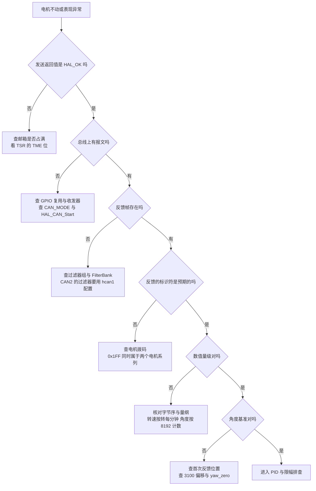
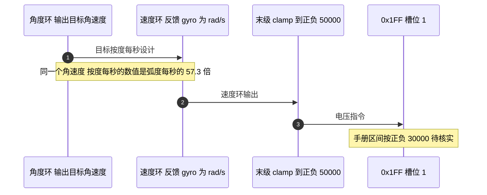

# 易错点与排查顺序

## 1. 概念：故障的五类归属

同一条“电机不动”的现象，根因可能落在完全不同的层次。把 GM6020 相关的故障归成五类，可以让排查顺序固定下来，避免在 PID 参数上反复试。

| 类别 | 典型表现 | 主要证据来源 |
| --- | --- | --- |
| 报文与 ID | 发送返回 HAL_OK，电机完全不响应 | 逻辑分析仪抓包、电机拨码 |
| 解析与量纲 | 数值量级明显不符，符号与转向相反 | 原始报文与结构体字段对照 |
| 零点与多圈 | 上电后角度偏差固定，转多圈后跳变 | `total_angle` 与 `round_count` |
| 控制与限幅 | 响应迟钝、饱和、抖动 | PID 参数与限幅链 |
| 时序与并发 | 偶发错值，随负载变化 | 中断优先级、读写上下文 |

## 2. 机制：排查顺序

顺序按“便宜且常见”排在前面，每一步都能排除一整类可能：

## 3. 落到本项目

### 3.1 0x1FF 的双系列复用

这是唯一一个“发送成功但电机不动”的常见根因。0x1FF 既承载 GM6020 的 ID 1 到 4 电压指令，也承载 M3508 的 ID 5 到 8 电流指令。云台板的调用把 yaw 与拨盘两台电机的指令放进同一条 0x1FF（`Task/Src/ControlCenterTask.cpp` :133），前提是这两台电机确实按 GM6020 的 ID 规则拨码。

仓库文档与代码在这一点上给出的信息不同：

| 材料 | 说法 |
| --- | --- |
| `项目概述.md` :8-9 | GM6020 的 ID 1 到 4 用 0x1FF，5 到 8 用 0x2FF |
| `项目概述.md` :12 | yaw 电机是 6020 电机 ID2，拨弹盘是 3508 电机 ID2 |
| 代码 | 0x1FF 槽位 1 的指令对应 0x205 反馈的电机，槽位 2 对应 0x206 |

0x205 与 0x206 按 $0x204 + \text{ID}$ 分别对应 ID 1 与 ID 2。文档写 yaw 为 ID2，代码把 yaw 的反馈接在 0x205 上，两者矛盾。这一条列出为待核实，需要用电机拨码或一次上电抓包确认。

### 3.2 量纲与范围的四个数量级

| 位置 | 代码里的数字 | 实际含义 | 偏差 |
| --- | --- | --- | --- |
| yaw 角度环 `Kp` | 80 | 每度误差的增益 | 目标数值按度每秒，比弧度每秒的反馈大 57 倍 |
| yaw 末级 `clamp` | 正负 50000 | 电压指令 | 超过手册区间，具体行为待核实 |
| 拨盘速度环目标 | 4500 | 转每分钟 | 直驱电机达不到该转速 |
| 拨盘角度增量 | 4000 计数 | 约 0.49 圈转子 | 减速电机对应的输出轴角很小 |

第三行与第四行一起指向一个推论：0x206 这一路电机的转速反馈单位与减速比更接近齿轮减速电机，而云台 yaw 才是直驱的 6020。代码里没有写明型号，这一条标注为推断。

### 3.3 时序与并发

接收回调在 CAN1_RX0 中断里，优先级 5（`Core/Src/can.c` :125-128），而读取这些结构体的控制任务优先级为 `osPriorityNormal`。中断只做一次 `HAL_CAN_GetRxMessage`，随后逐个字段赋值，任务可能在这中间读取：

结构体没有声明为 `volatile`，四个字段分四次写入。单字段是 16 位对齐访问，读到的值不会出现半个，组合却可能跨帧。需要一致快照时，用 `taskENTER_CRITICAL` 包住整段读取，或者把解析搬到任务里。

### 3.4 波特率依赖 APB1

工作记录里的那次故障链条是完整的：时钟树被改动，APB1 从 42 MHz 变为 36 MHz，位时序参数不变，实际波特率从 1 Mbps 变成 857142 Hz，总线无 ACK，CAN 进入错误状态并锁定，之后全部发送失败（`工作记录/can通信波特率问题.md` :27-47）。

$$f_{\text{bit}} = \frac{f_{\text{APB1}}}{\text{Prescaler} \times (1 + \text{BS1} + \text{BS2})}$$

| 观察点 | 位置 | 含义 |
| --- | --- | --- |
| `ErrorCode` | `hcan1` 或 `hcan2` 句柄 | 低 32 位含 `HAL_CAN_ERROR_NOT_STARTED` |
| `MSR` | CAN 外设寄存器 | 错误中断挂起位 |
| `TSR` | CAN 外设寄存器 | 发送邮箱占用与请求状态 |
| `ESR` | CAN 外设寄存器 | 上一次协议错误的类型与节点状态 |

### 3.5 两处未初始化的字节

`BSP_CAN1_DJIMotorCmdNine2Eleven` 只给前 6 字节赋值，第 7、8 字节保持栈上的残留值，而 `DLC` 是 8（云台板 `BSP/Src/bsp_can.cpp` :207-212，底盘板 :202-207）。接收端按 3 个槽位解释时不受影响，但抓包与总线错误统计会把它算作有效载荷。

### 3.6 看起来在用的死代码

| 符号 | 状态 | 误判后果 |
| --- | --- | --- |
| `angle_pid_calculate` | 只有定义与声明 | 以为改这里的参数能生效 |
| `angle_pid` 静态实例 | 只有定义 | 同上 |
| `motor_5.total_angle` | 写入后无读取 | 以为 yaw 用了编码器多圈角度 |
| `gimbal_yaw_total` | 声明为 0，累加代码被注释 | 以为存在姿态总角度 |

## 4. 待核实清单

| 事项 | 现状 | 核实方式 |
| --- | --- | --- |
| 反馈帧到达周期 | 本仓库没有定义，此处按 1 ms 估算 | 在接收回调里计数并计时 |
| yaw 电机的实际 ID | 代码用 0x205，文档写 ID2 | 读拨码或上电抓包 |
| 0x206 一路的电机型号 | 代码未写明，转速目标指向减速电机 | 读拨码与外壳标识 |
| GM6020 电压指令区间 | 代码限幅正负 50000，手册值未在仓库中 | 查厂商手册 PDF |
| 3100 机械零位的来源 | 硬编码，无注释 | 询问作者或实测零点 |
| 拨盘 `dt` 取值 | 写 0.01，循环周期约 1 ms | 比对整定结果与实测周期 |

## 5. 小结

### 核心概念

- 排查顺序按 时钟与位时序、GPIO 与收发器、过滤器、中断与回调、报文与 ID、量纲、零点、PID 逐层推进，前一层不通过时后面全是噪声。
- 0x1FF 的双系列复用是“发送成功但电机不动”的首要嫌疑，区分依据是反馈标识符与拨码。
- 量纲问题在 yaw 环上有两个独立来源：陀螺仪按弧度每秒输出，末级限幅按手册应小于 50000。
- 半圈判据在 16 位累计角度上会回绕，约正负 4 圈；长间隔丢帧会让判据误判一圈。
- 中断逐字段写全局结构体，任务侧读到跨帧组合；单字段访问本身是原子的。
- 波特率由 APB1 与三个**位时序**（Bit Timing）参数共同决定，时钟树改动会让这组参数失效。

### 设计权衡

| 排查手段 | 成本 | 能定位的范围 |
| --- | --- | --- |
| 调试器看 CAN 寄存器与 ErrorCode | 低 | 外设状态与错误类型 |
| 逻辑分析仪抓包 | 中 | 报文是否存在、ID 与数据是否符合预期 |
| 中断里加计数器与时间戳 | 低 | 掉线、到达周期、丢帧 |
| 把解析搬到任务 | 中 | 消除跨上下文写，便于下断点 |
| 统一量纲与限幅 | 中 | 消除数量级与饱和类问题 |
| 电机拨码核对 | 低 | 确认 0x1FF 组内身份 |

## 6. 练习

基础题

1. 按第 2 节的决策树，写出“发送返回 HAL_OK、总线抓包有 0x1FF、但收不到 0x205”时的三个检查点。
2. 已知目标角速度按度每秒设计、反馈是弧度每秒，计算等效增益的偏差倍数。
3. 底盘板累计角度从正 32767 越过 32768 后读到什么值，对应真实圈数的偏差是多少。

挑战题

4. 写一个掉线与量纲自检任务：周期读取四个 0x205 类电机的字段，检测 (a) 反馈间隔是否超过阈值，(b) 转速绝对值是否超出该型号的物理上限，输出一份状态表并说明两类检测的误报来源。
5. 把接收回调整体改造为“只入队、任务解析”，说明这样改动之后第 3.3 节的跨帧组合问题是否消失，以及新增的内存与中断驻留时间。
6. 针对待核实清单里的五项，设计一次台架实验，用一次上电采集把所有项都定下来，并给出数据记录表格的字段。

---

### 附：本页引用的固件路径

| 路径 | 用途 |
| --- | --- |
| `/home/wyx/rm/2026SentriOmeniGimbal/2026OmniSentryGimbal/Task/Src/ControlCenterTask.cpp` | 0x1FF 发送点与角速度前馈（:131-133） |
| `/home/wyx/rm/2026SentriOmeniGimbal/2026OmniSentryGimbal/Task/Src/GimbalTask.cpp` | yaw 角度环、速度环与末级限幅（:31-32、:65-83） |
| `/home/wyx/rm/2026SentriOmeniGimbal/2026OmniSentryGimbal/BSP/Src/bsp_can.cpp` | 0x2FF 未初始化字节（:207-212）、接收回调（:590-715） |
| `/home/wyx/rm/2026SentriOmeniGimbal/2026OmniSentryGimbal/PID/Src/angle_pid.cpp` | 未被调用的 C 封装（:33-43） |
| `/home/wyx/rm/2026SentriOmeniGimbal/2026OmniSentryGimbal/Task/Src/ImuTask.cpp` | 姿态零点与被注释的总角度累加（:22-26、:79-96） |
| `/home/wyx/rm/2026SentriOmeniGimbal/2026OmniSentryGimbal/Core/Src/can.c` | 中断优先级 5 与位时序（:42-46、:125-128） |
| `/home/wyx/rm/2026SentriOmeniChassis/2026OmniSentryChassis/项目概述.md` | 电机编号与接线描述（:5-13） |
| `/home/wyx/rm/2026SentriOmeniChassis/2026OmniSentryChassis/BSP/Inc/bsp_can.h` | 16 位 `total_angle`（:17） |
| `/home/wyx/rm/2026SentriOmeniChassis/2026OmniSentryChassis/BSP/Src/bsp_can.cpp` | 0x2FF 未初始化字节（:202-207） |
| `/home/wyx/Work-Summary-and-Diary/工作记录/can通信波特率问题.md` | 波特率故障的现象与寄存器证据 |
