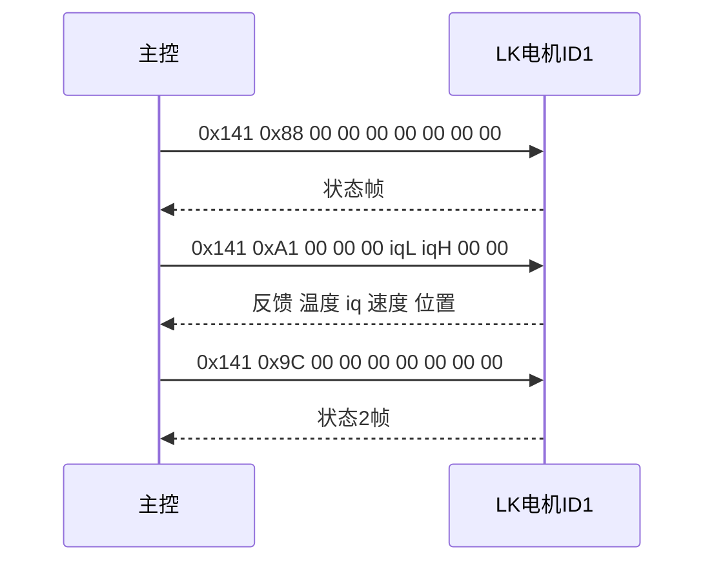

# LK 协议与 0x141

> 云台板路径为 `/home/wyx/rm/2026SentriOmeniGimbal/2026OmniSentryGimbal`，底盘板路径为 `/home/wyx/rm/2026SentriOmeniChassis/2026OmniSentryChassis`。下文相对路径都相对于这两个根目录。

## 1. 概念

LK 电机（LK Motor，上海瓴控）把驱动器、编码器与减速器集成在一个壳体里，主控只用一条 CAN 总线就能下发目标并读取状态。通信使用标准数据帧，不带扩展标识符，数据段固定 8 字节。寻址规则只有一条：

$$\text{StdId} = \mathrm{0x140} + \text{电机 ID}$$

电机 ID 在 1 到 32 之间，ID 取 1 时 StdId 为 0x141。这条规则使 LK 报文落在 0x141 到 0x160 这一段，与 DJI 的 0x200、0x1FF、0x2FF 以及达妙电机使用的 ID 段互不重叠。

8 个字节分两部分：字节 0 是**命令字**（command byte），字节 1 到 7 是参数区，参数区含义随命令字变化。同一个 StdId 上既有主机发往电机的命令帧，也有电机返回的反馈帧，方向不同。


## 2. 协议

命令字按功能分四组。状态控制组改变工作状态，运动控制组写入目标，参数读取组请求回读，标定组改写编码器基准。

| 分组 | 命令字 | 含义 | 参数区 |
| --- | --- | --- | --- |
| 状态控制 | 0x80 | 关机，清除圈数与上一条命令 | 无 |
| 状态控制 | 0x88 | 运行（使能） | 无 |
| 状态控制 | 0x81 | 停止，保留当前状态 | 无 |
| 运动控制 | 0xA1 | 力矩环 | 字节 4-5 为 int16 电流 |
| 运动控制 | 0xA2 | 速度环 | 字节 2-3 前馈电流，字节 4-7 为 int32 速度 |
| 运动控制 | 0xA3 | 多圈位置环 | 字节 4-7 为 int32 角度 |
| 运动控制 | 0xA4 | 多圈位置环加限速 | 字节 2-3 限速，字节 4-7 角度 |
| 运动控制 | 0xA5 | 单圈位置环 | 字节 1 转向，字节 4-7 角度 |
| 运动控制 | 0xA6 | 单圈位置环加限速 | 字节 1 转向，字节 2-3 限速，字节 4-7 角度 |
| 运动控制 | 0xA7 | 增量位置环 | 字节 4-7 为 int32 角度增量 |
| 运动控制 | 0xA8 | 增量位置环加限速 | 字节 2-3 限速，字节 4-7 角度增量 |
| 参数读取 | 0x90 | 读编码器值、原始值与偏移 | 无 |
| 参数读取 | 0x92 | 读多圈角度 | 无 |
| 参数读取 | 0x94 | 读单圈角度 | 无 |
| 参数读取 | 0x9A | 读状态 1：温度、电压、电流、状态、错误 | 无 |
| 参数读取 | 0x9C | 读状态 2：温度、iq、速度、编码器 | 无 |
| 参数读取 | 0x9D | 读状态 3：三相电流 | 无 |
| 标定 | 0x19 | 把当前位置设为零点 | 无 |
| 标定 | 0x95 | 把当前位置设为指定多圈角 | 字节 4-7 角度 |
| 参数读写 | 0xC0 / 0xC1 | 读 / 写控制参数 | 见手册 |

一帧命令对应一帧反馈，收发时序以 ID1 的使能与力矩下发为例：



反馈帧的 StdId，常见约定与命令帧同为 0x140 加电机 ID。本工程云台板的接收分派写在 0x181（见第 3 节），与这条约定相差 0x40，改动总线或更换电机前要先确认当前电机的实际反馈 ID。

## 3. 落到本项目

两块板的 LK 命令函数都把 StdId 写死为 0x141，句柄都是 hcan1。

| 板 | 文件 | 函数 | 命令字 | 行号 |
| --- | --- | --- | --- | --- |
| 云台板 | `BSP/Src/bsp_can.cpp` | `BSP_CAN1_LKMotorCloseCmd` | 0x80 | `:335-352` |
| 云台板 | `BSP/Src/bsp_can.cpp` | `BSP_CAN1_LKMotorStartCmd` | 0x88 | `:355-372` |
| 云台板 | `BSP/Src/bsp_can.cpp` | `BSP_CAN1_LKMotorTorqueCmd` | 0xA1 | `:375-396` |
| 云台板 | `BSP/Src/bsp_can.cpp` | `BSP_CAN1_LKMotorVelocityCmd` | 0xA2 | `:399-424` |
| 云台板 | `BSP/Src/bsp_can.cpp` | `BSP_CAN1_LKMotorIncrePosCmd` | 0xA7 | `:427-452` |
| 云台板 | `BSP/Src/bsp_can.cpp` | `BSP_CAN1_LKMotorIncrePosVelRestrictCmd` | 0xA8 | `:455-481` |
| 云台板 | `BSP/Src/bsp_can.cpp` | `BSP_CAN1_LKReadStatus2` | 0x9C | `:483-497` |
| 底盘板 | `BSP/Src/bsp_can.cpp` | 前六项同名函数，无 0x9C | 0x80 到 0xA8 | `:308-459` |

取 StdId 的写法（云台板 `bsp_can.cpp:342-345`）：

```c
TxHeader.StdId = 0x141; //标准标识符
TxHeader.IDE = CAN_ID_STD;
TxHeader.RTR = CAN_RTR_DATA;
TxHeader.DLC = 8;
```

反馈分派在云台板 `BSP/Src/bsp_can.cpp:643`，位于 CAN1 分支内：

```c
case 0x181: {
    switch (RxData[0]) {
        case 0xA1: { /* 温度 iq 速度 位置 */ }
        case 0xA2: { /* 同上 */ }
        case 0xA7: { break; }
        case 0xA8: { break; }
    }
```

函数名带 `CAN1`，句柄也确实是 `hcan1`（`:351`、`:371`、`:395` 等）。云台板 CAN1 上还挂着 yaw（GM6020，0x1FF 第 1 槽位、反馈 0x205；代码按 M3508 的编号习惯记作 ID5、变量名 `motor_5`）与拨弹盘（M3508，ID6、反馈 0x206），帧头分别是 0x1FF 与 0x141。过滤器为全接收（`BSP/Src/bsp_can.cpp:62-86`），三种报文都进同一个 FIFO0 回调，靠 StdId 分派。

## 4. 易错点

- 0x141 只对应电机 ID 1。ID 改成 2 之后命令帧要写 0x142，电机不会响应 0x141。
- 发送用 0x141、接收分派用 0x181，两个值不同。只按命令 ID 去 `switch` 反馈会让 `LK_motor_1` 恒为 0。
- 命名里的 `CAN1` 指代码里的 hcan1，与接插件丝印不一定是同一编号。改线时对着 `Core/Src/can.c` 的 GPIO 复用确认。
- 0x80 关机之后电机不再执行运动命令，恢复控制前需要重新发一次 0x88。

## 5. 小结

| 项 | 值 |
| --- | --- |
| 帧类型 | CAN 标准数据帧，DLC 8 |
| 寻址 | StdId = 0x140 + 电机 ID |
| ID1 命令 StdId | 0x141 |
| 命令字位置 | 字节 0 |
| 参数区 | 字节 1 到 7 |
| 本工程发送句柄 | hcan1 |
| 本工程接收分派 | 0x181，云台板 CAN1 分支 |

## 6. 练习

1. 电机 ID 设为 3，写出使能命令的 StdId 与 8 个数据字节。
2. 从 `BSP_CAN1_LKMotorTorqueCmd` 找出电流写入哪两个字节，判断字节序。
3. 把 LK 电机从 CAN1 移到 CAN2，列出需要改动的句柄与过滤器位置。
4. 说明 0x1FF 与 0x141 能在云台板 CAN1 共存而不误解析的原因。
