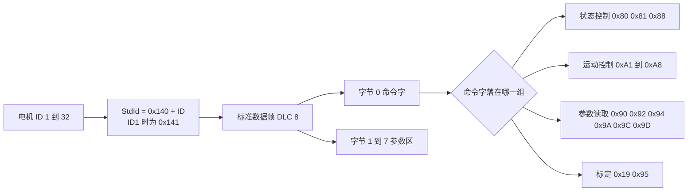
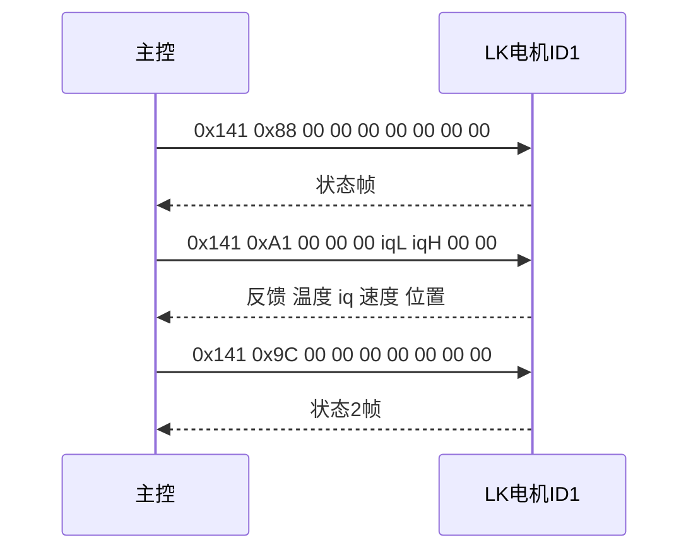

# LK 协议与 0x141

LK 电机（LK Motor，上海瓴控）把驱动器、编码器与减速器集成在一个壳体里，主控只用一条 CAN 总线就能下发目标并读取状态。通信使用标准数据帧，不带扩展标识符，数据段固定 8 字节。整条协议只有一条寻址规则，命令字的含义全部靠数据段的第 1 个字节区分。

本工程在云台板 CAN1 上挂了三种互不相同的电机：yaw 是 GM6020，走 0x1FF 的槽位广播；拨弹盘是 M3508，与 yaw 同走 0x1FF 的槽位广播（占槽位 2）；pitch 是 LK 电机，走 0x141。三者共用同一个 FIFO0 回调，区分方式是标准标识符。LK 的帧结构与命令字体系先要说清楚，再落到两块板的发送函数与接收分派上。

> 云台板路径为 `/home/wyx/rm/2026SentriOmeniGimbal/2026OmniSentryGimbal`，底盘板路径为 `/home/wyx/rm/2026SentriOmeniChassis/2026OmniSentryChassis`。下文相对路径都相对于这两个根目录。

## 一条寻址规则定下 0x141 到 0x160

$$\text{StdId} = \mathrm{0x140} + \text{电机 ID}$$

电机 ID 在 1 到 32 之间，ID 取 1 时 StdId 为 0x141，取 32 时是 0x160。这段编号与 DJI 的 0x200、0x1FF、0x2FF 以及达妙电机使用的 ID 段互不重叠，因此三类报文可以挂在同一条总线上而不冲突。

8 个字节分两部分：字节 0 是命令字，字节 1 到 7 是参数区，参数区含义随命令字变化。同一个 StdId 上既有主机发往电机的命令帧，也有电机返回的反馈帧，方向不同、命令字回显也不同。



ID 与标识符的对应是硬约定，改电机 ID 拨码之后命令帧与反馈帧都要跟着换标识符，代码里写死的 0x141 只对 ID1 有效。

## 8 个字节怎么分工

字节 0 固定是命令字，主机发出的和电机返回的都用同一个值回显这一位，因此接收端第一件事就是读 `RxData[0]`。字节 1 到 7 的用途由命令字决定，同一个偏移在不同命令下含义完全不同。以运动类命令为例，字节 4 到 7 在多数命令里放 int32 参数，而 0xA1 只用字节 4 到 5 放 int16。

这种“命令字优先”的布局意味着解析必须两级分派：先按 StdId 判断是不是 LK 帧，再按 `RxData[0]` 判断是哪条命令。只按 StdId 分派会把不同命令的反馈写进同一组字段，得到没有意义的值。

| 部位 | 固定含义 | 会变的含义 |
| --- | --- | --- |
| 字节 0 | 命令字 | 无 |
| 字节 1 | 无 | 0xA5 与 0xA6 的转向标志 |
| 字节 2 到 3 | 无 | 0xA2 的前馈电流、0xA4 / 0xA6 / 0xA8 的限速 |
| 字节 4 到 5 | 无 | 0xA1 的 int16 电流 |
| 字节 4 到 7 | 无 | 速度、角度、角度增量等 int32 参数 |
| 字节 6 到 7 | 无 | 0xA1 与 0xA2 命令帧中的填充 |

## 命令字的四组分类

命令字按功能分四组。状态控制组改变工作状态，运动控制组写入目标，参数读取组请求回读，标定组改写编码器基准。

| 分组 | 命令字 | 含义 | 参数区 |
| --- | --- | --- | --- |
| 状态控制 | 0x80 | 关机，清除圈数与上一条命令 | 无 |
| 状态控制 | 0x88 | 运行（使能） | 无 |
| 状态控制 | 0x81 | 停止，保留当前状态 | 无 |
| 运动控制 | 0xA1 | 力矩环 | 字节 4-5 为 int16 电流 |
| 运动控制 | 0xA2 | 速度环 | 字节 2-3 前馈电流，字节 4-7 为 int32 速度 |
| 运动控制 | 0xA3 | 多圈位置环 | 字节 4-7 为 int32 角度 |
| 运动控制 | 0xA4 | 多圈位置环加限速 | 字节 2-3 限速，字节 4-7 角度 |
| 运动控制 | 0xA5 | 单圈位置环 | 字节 1 转向，字节 4-7 角度 |
| 运动控制 | 0xA6 | 单圈位置环加限速 | 字节 1 转向，字节 2-3 限速，字节 4-7 角度 |
| 运动控制 | 0xA7 | 增量位置环 | 字节 4-7 为 int32 角度增量 |
| 运动控制 | 0xA8 | 增量位置环加限速 | 字节 2-3 限速，字节 4-7 角度增量 |
| 参数读取 | 0x90 | 读编码器值、原始值与偏移 | 无 |
| 参数读取 | 0x92 | 读多圈角度 | 无 |
| 参数读取 | 0x94 | 读单圈角度 | 无 |
| 参数读取 | 0x9A | 读状态 1：温度、电压、电流、状态、错误 | 无 |
| 参数读取 | 0x9C | 读状态 2：温度、iq、速度、编码器 | 无 |
| 参数读取 | 0x9D | 读状态 3：三相电流 | 无 |
| 标定 | 0x19 | 把当前位置设为零点 | 无 |
| 标定 | 0x95 | 把当前位置设为指定多圈角 | 字节 4-7 角度 |
| 参数读写 | 0xC0 / 0xC1 | 读 / 写控制参数 | 见手册 |

三组状态控制命令的区别只在副作用上：0x80 会清掉圈数与上一条命令，0x81 保留状态，0x88 使能。这个区别决定了故障恢复的写法，从 0x80 之后恢复控制必须重新发 0x88，而 0x81 之后可以直接继续下发运动命令。

## 一次使能与一次力矩下发的收发时序

一帧命令对应一帧反馈，收发时序以 ID1 的使能与力矩下发为例：



时序上有两点要在工程里确认。第一，反馈的到达时刻由电机决定，与命令帧之间没有严格的先后关系；第二，0x9C 这类读取命令本身不改变电机状态，但在同一条总线上会增加一帧往返负载。

## 反馈标识符与 0x181 的偏移

反馈帧的 StdId，常见约定与命令帧同为 0x140 加电机 ID，也就是 ID1 对应 0x141。本工程云台板的接收分派写在 0x181，与这条约定相差 0x40。这个偏移在改动总线或更换电机之前必须先确认，因为接收端按 StdId 分派，标识符对不上时反馈会被直接丢弃，现象与“电机没有回帧”完全相同。

0x181 与 0x141 同时出现在一块板上的写法并不矛盾：发送用命令标识符，接收用该电机实际反馈的标识符，两者由电机的固件决定，不是同一件事。工程里的证据只能确认分派值，电机的实际反馈值需要抓包核对。

## 本工程的发送函数与分派位置

两块板的 LK 命令函数都把 StdId 写死为 0x141，句柄都是 hcan1。

| 板 | 文件 | 函数 | 命令字 | 行号 |
| --- | --- | --- | --- | --- |
| 云台板 | `BSP/Src/bsp_can.cpp` | `BSP_CAN1_LKMotorCloseCmd` | 0x80 | `:333-350` |
| 云台板 | `BSP/Src/bsp_can.cpp` | `BSP_CAN1_LKMotorStartCmd` | 0x88 | `:353-370` |
| 云台板 | `BSP/Src/bsp_can.cpp` | `BSP_CAN1_LKMotorTorqueCmd` | 0xA1 | `:373-394` |
| 云台板 | `BSP/Src/bsp_can.cpp` | `BSP_CAN1_LKMotorVelocityCmd` | 0xA2 | `:397-422` |
| 云台板 | `BSP/Src/bsp_can.cpp` | `BSP_CAN1_LKMotorIncrePosCmd` | 0xA7 | `:425-450` |
| 云台板 | `BSP/Src/bsp_can.cpp` | `BSP_CAN1_LKMotorIncrePosVelRestrictCmd` | 0xA8 | `:453-479` |
| 云台板 | `BSP/Src/bsp_can.cpp` | `BSP_CAN1_LKReadStatus2` | 0x9C | `:481-495` |
| 底盘板 | `BSP/Src/bsp_can.cpp` | 前六项同名函数，无 0x9C | 0x80 到 0xA8 | `:308-459` |

取 StdId 的写法（云台板 `bsp_can.cpp:340-343`）：

```c
TxHeader.StdId = 0x141; //标准标识符
TxHeader.IDE = CAN_ID_STD;
TxHeader.RTR = CAN_RTR_DATA;
TxHeader.DLC = 8;
```

反馈分派在云台板 `BSP/Src/bsp_can.cpp:641`（`case 0x181` 所在行），位于 CAN1 分支内：

```c
case 0x181: {
    switch (RxData[0]) {
        case 0xA1: { /* 温度 iq 速度 位置 */ }
        case 0xA2: { /* 同上 */ }
        case 0xA7: { break; }
        case 0xA8: { break; }
    }
```

函数名带 `CAN1`，句柄也确实是 `hcan1`（`:349`、`:369`、`:393` 等）。云台板 CAN1 上还挂着 yaw（GM6020，0x1FF 第 1 槽位、反馈 0x205；代码按 M3508 的编号习惯记作 ID5、变量名 `motor_5`）与拨弹盘（M3508，ID6、反馈 0x206，槽位 2），两者同属 0x1FF 帧；证据是 `BSP_CAN1_DJIMotorCmdFive2Eight` 的 StdId 写 0x1FF（`BSP/Src/bsp_can.cpp:166`、`BSP/Src/bsp_can.cpp:173`），而 `Task/Src/ControlCenterTask.cpp:106` 的第二个参数正是拨弹盘的 `control_output_motor_3`。pitch 的 LK 命令帧头才是 0x141。过滤器为全接收（`BSP/Src/bsp_can.cpp:60-84`），三种报文都进同一个 FIFO0 回调，靠 StdId 分派。

## 现象与检查顺序

| 现象 | 原因 | 检查手段 |
| --- | --- | --- |
| 电机不动，总线上有 0x141 | ID 不是 1，命令帧发到了别的地址 | 核对拨码与 StdId |
| 电机不动，总线上没有 0x141 | 发送调用点未执行、句柄写错或过滤器异常 | 先看发送函数的调用点 |
| `LK_motor_1` 恒为 0 | 接收分派 0x181 与电机实际反馈标识符不一致 | 在回调里按 StdId 计数 |
| 命令发出但电机不执行 | 0x80 关机后没有重发 0x88 | 抓帧看字节 0 的历史 |
| 帧进了回调但字段错位 | 只按 StdId 分派，没有再看命令字 | 检查两级 `switch` |

排查按表从上往下走：先确认标识符与命令帧存在，再确认命令字，最后才看参数区。跳过前两步直接看参数区，很容易把 0x181 与 0x141 的差值误当成发送失败。

## 小结

### 核心概念

- LK 用 CAN 标准数据帧，DLC 固定 8，寻址规则是 StdId = 0x140 加电机 ID，ID1 对应 0x141。
- 字节 0 是命令字，字节 1 到 7 是参数区，参数含义随命令字变化，解析必须两级分派。
- 命令字分状态控制、运动控制、参数读取、标定四组；0x80 会清圈数与上一条命令，恢复控制要重发 0x88。
- 本工程两块板的发送句柄都是 hcan1，云台板的接收分派写在 0x181，与发送的 0x141 相差 0x40。
- 云台板 CAN1 上同时存在 0x1FF、0x141 与 0x181 三类报文，靠标准标识符区分。

### 设计权衡

| 项 | 值 | 说明 |
| --- | --- | --- |
| 帧类型 | CAN 标准数据帧，DLC 8 | 不用扩展帧，标识符空间够用 |
| 寻址 | StdId = 0x140 + 电机 ID | 一段连续编号，最多 32 台 |
| 命令字位置 | 字节 0 | 固定，便于快速分流 |
| 参数区 | 字节 1 到 7 | 布局随命令变化，解析需要查表 |
| 本工程发送句柄 | hcan1 | 与 yaw、拨弹盘共用总线 |
| 本工程接收分派 | 0x181，云台板 CAN1 分支 | 与发送标识符不同，改动需同步两处 |

## 练习

### 基础题

1. 电机 ID 设为 3，写出使能命令的 StdId 与 8 个数据字节。
2. 从 `BSP_CAN1_LKMotorTorqueCmd` 找出电流写入哪两个字节，判断字节序。
3. `LK_motor_1` 恒为 0 时，列出两个与接收分派有关的检查点。
4. 说明 0x80 与 0x81 在状态保留上的差别，以及各自恢复控制时需要补发什么。

### 挑战题

5. 把 LK 电机从 CAN1 移到 CAN2，列出需要改动的句柄与过滤器位置。
6. 说明 0x1FF 与 0x141 能在云台板 CAN1 共存而不误解析的原因，并设计一个验证分派正确性的计数方案。
7. 若总线上有 32 台 LK 电机，设计一次寻址扫描：逐个发 0x88 并统计 0x141 到 0x160 的反馈，说明扫描期间如何避免电机同时动作。

## 附：本页引用的固件路径

| 路径 | 用途 |
| --- | --- |
| `/home/wyx/rm/2026SentriOmeniGimbal/2026OmniSentryGimbal/BSP/Src/bsp_can.cpp` | 七个 LK 发送函数（`BSP/Src/bsp_can.cpp:333-495`）、反馈分派 0x181（`BSP/Src/bsp_can.cpp:641-671`）、过滤器配置（`BSP/Src/bsp_can.cpp:60-84`）、0x1FF 帧（`BSP/Src/bsp_can.cpp:166`） |
| `/home/wyx/rm/2026SentriOmeniGimbal/2026OmniSentryGimbal/BSP/Inc/bsp_can.h` | LK 接口声明（`BSP/Inc/bsp_can.h:81-88`）、`LK_motor_info` 定义（`BSP/Inc/bsp_can.h:40-45`） |
| `/home/wyx/rm/2026SentriOmeniGimbal/2026OmniSentryGimbal/Task/Src/ControlCenterTask.cpp` | 使能（`Task/Src/ControlCenterTask.cpp:30`）与力矩下发（`Task/Src/ControlCenterTask.cpp:107`）、0x1FF 第二参（`Task/Src/ControlCenterTask.cpp:106`） |
| `/home/wyx/rm/2026SentriOmeniGimbal/2026OmniSentryGimbal/Task/Src/GimbalTask.cpp` | 状态 2 读取（`Task/Src/GimbalTask.cpp:83`） |
| `/home/wyx/rm/2026SentriOmeniChassis/2026OmniSentryChassis/BSP/Src/bsp_can.cpp` | 底盘板六个 LK 命令函数（`BSP/Src/bsp_can.cpp:308-459`） |
