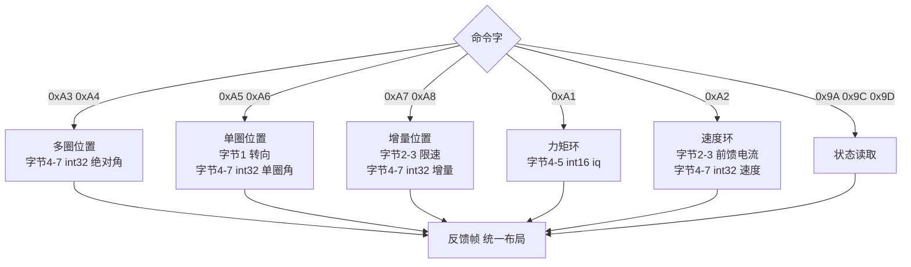
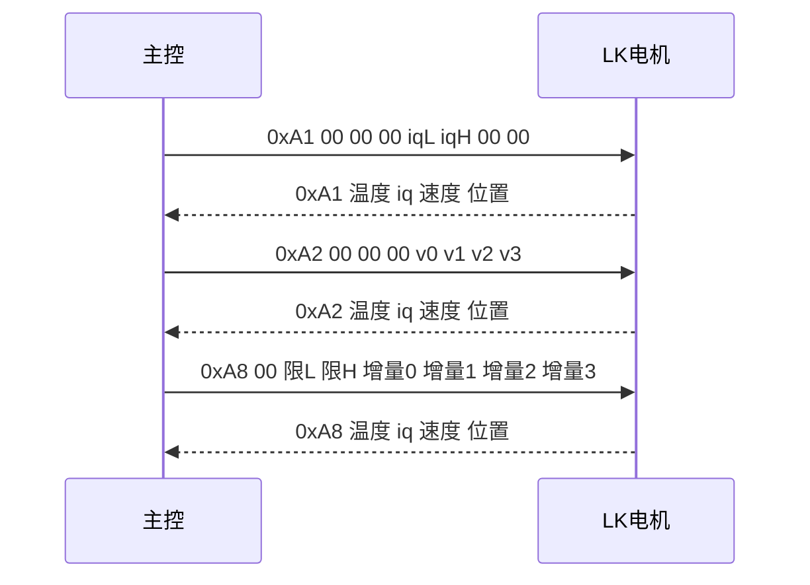

# 位置、速度与力矩模式

LK 电机内部有电流环、速度环和位置环三套闭环，主控不需要通过寄存器切换模式：收到 0xA1 就按力矩执行，收到 0xA2 就按速度执行，收到 0xA3 到 0xA8 就按位置执行。选择哪一种，完全由命令字决定。

三套闭环的差异不在报文长度上，而在参数区的布局与单位上。同一个字节偏移在不同命令下放的是不同量纲的 int16 或 int32，写错位置的现象是电机能响应但动作方向或幅度不对。各命令的参数位置、单位换算与反馈布局逐一说明之后，再对照本工程实际下发过的两条命令。读完后应当能独立算出一条力矩命令里该填什么数。

## 三套闭环都在电机里，主控只选命令字

| 命令字 | 闭环 | 输入类型 | 单位 |
| --- | --- | --- | --- |
| 0xA1 | 力矩（电流） | int16 | iq，量程见下一节 |
| 0xA2 | 速度 | int32 | 0.01 dps/LSB |
| 0xA3 / 0xA4 | 位置（多圈） | int32 | 0.01 °/LSB |
| 0xA5 / 0xA6 | 位置（单圈） | int32 | 0.01 °/LSB |
| 0xA7 / 0xA8 | 位置（增量） | int32 | 0.01 °/LSB |

多圈位置是绝对角，跨零后继续累计；单圈位置只在 0 到 360° 内定位，需要转向标志配合；增量位置相对当前位置偏移。三者的报文长度相同，区别只在语义上，因此看命令字是唯一可靠的判据。



## 力矩命令的 iq 与安培换算

力矩命令的输入是 iq。按参考实现，MF 系列满量程 2048 对应 ±16.5 A，MG 系列满量程 2048 对应 ±33 A：

$$k_{I,\text{MF}} = \frac{16.5}{2048} = \frac{33}{4096}\ \text{A/LSB}, \qquad k_{I,\text{MG}} = \frac{33}{2048} = \frac{66}{4096}\ \text{A/LSB}$$

由目标电流反推 iq：

$$\text{iq} = \mathrm{round}\left(\frac{I}{k_I}\right)$$

把两个系数化成十进制备用：MF 每 LSB 为 8.057 mA，MG 每 LSB 为 16.113 mA。同一个 iq 值在 MG 系列上对应的电流是 MF 的两倍，换型号时必须重新折算，否则同样的指令会给出双倍力矩。

本工程的下发限幅是 ±30000，而参考实现的 iq 输入范围是 ±2048。两条边界对应的物理量完全不同：

| 限幅来源 | 数值 | 覆盖的电流（MG） | 说明 |
| --- | --- | --- | --- |
| int16 表示范围 | ±32767 | 不适用 | 只保证不溢出 |
| 本工程限幅 | ±30000 | 远超 ±33 A | 保护的是数据类型 |
| 参考实现量程 | ±2048 | ±33 A | 电机认可的输入范围 |

第三条才是电机认可的范围，前两条只是软件侧的护栏。超出的部分由驱动器自行解释或钳位，具体行为按型号确认。

## 速度命令与速度反馈差 100 倍

速度命令与速度反馈的单位不同。0xA2 的字节 4-7 是 int32，单位 0.01 dps/LSB；反馈字节 4-5 是 int16，单位 1 dps/LSB。两者相差 100 倍：

$$v_{\text{cmd}} = \mathrm{round}(100 \cdot v_{\text{deg/s}}), \qquad v_{\text{fb,deg/s}} = v_{\text{raw}}$$

这个差异的后果是：把反馈值直接回灌给命令，实际目标会被放大 100 倍。以 720 deg/s 为例，命令里要写 72000，而反馈帧里同一个转速只显示 720。写命令时按反馈的量级填数，电机只会得到设定值的百分之一。

## 位置命令的三套语义与限速参数

位置命令字节 4-7 是 int32，单位 0.01 °/LSB，一圈为 36000：

$$n_{\text{deg}} = \mathrm{round}(100 \cdot \theta_{\text{deg}})$$

限速参数出现在 0xA4、0xA6、0xA8 的字节 2-3，无符号 16 位，单位 1 dps/LSB。限速与位置命令绑在不同字节上，写入时不能互相覆盖：

| 命令字 | 字节 1 | 字节 2-3 | 字节 4-7 |
| --- | --- | --- | --- |
| 0xA4 多圈加限速 | 不用 | 限速，1 dps/LSB | 绝对角，0.01 °/LSB |
| 0xA6 单圈加限速 | 转向 | 限速，1 dps/LSB | 单圈角，0.01 °/LSB |
| 0xA8 增量加限速 | 不用 | 限速，1 dps/LSB | 角度增量，0.01 °/LSB |

增量命令还有一个使用上的性质：每一帧都在当前位置上叠加。位置环下发同一个增量值，等价于持续转动；而绝对位置命令下发同一个值，转子停在同一个位置。这条区别决定了闭环里该选哪一种。

## 一条 10 A 力矩命令的完整算例

把上面的换算串起来走一遍。目标是 10 A 电流，先按型号算 iq：

| 型号 | 系数 | iq 计算 | 取整结果 | 十六进制 |
| --- | --- | --- | --- | --- |
| MF | 33/4096 A/LSB | $10 / 0.008057$ | 1241 | 0x04D9 |
| MG | 66/4096 A/LSB | $10 / 0.016113$ | 621 | 0x026D |

int16 小端写入字节 4 与字节 5，得到两条完整命令帧：

| 型号 | 字节 0 | 字节 1-3 | 字节 4 | 字节 5 | 字节 6-7 |
| --- | --- | --- | --- | --- | --- |
| MF | 0xA1 | 00 00 00 | 0xD9 | 0x04 | 00 00 |
| MG | 0xA1 | 00 00 00 | 0x6D | 0x02 | 00 00 |

同一句“给 10 A”，两个型号的命令帧差别在字节 4 与字节 5 上，数量级接近 2 倍。这条算例也解释了为什么不能把上一个型号的指令直接复制到新电机上。

## 反馈帧的固定布局

运动命令的反馈帧采用统一布局，全部小端：字节 0 回显命令字，字节 1 温度，字节 2-3 iq，字节 4-5 速度，字节 6-7 位置或编码器值。



反馈布局不随命令变化，只有字节 6-7 的语义在读取类命令里改成编码器值或状态字段。因此同一条总线上的反馈帧可以直接按统一偏移解析，前提是先确认回显的命令字与预期一致。

## 本工程实际使用的两种模式

云台板 `BSP/Src/bsp_can.cpp` 三种模式的写入方式：力矩命令把 int16 放在字节 4-5：

```c
TxData[0] = 0xA1;   // 命令字：转矩控制
TxData[1] = 0x00;
TxData[2] = 0x00;
TxData[3] = 0x00;
TxData[4] = current & 0xFF;
TxData[5] = (current >> 8) & 0xFF;
TxData[6] = 0x00;
TxData[7] = 0x00;
```

速度命令与增量位置命令把 int32 拆成低到高四字节。增量位置限速命令把 velocity 放在字节 2-3，degree 放在字节 4-7。底盘板同名前六项函数写法一致（`BSP/Src/bsp_can.cpp`）。

本工程实际用到两种模式：

| 用途 | 函数 | 命令字 | 调用点 | 周期 |
| --- | --- | --- | --- | --- |
| pitch 力矩下发 | `bsp_can1_lkmotortorquecmd` | 0xA1 | `Task/Src/ControlCenterTask.cpp` | 1 ms |
| 读取状态 2 | `bsp_can1_lkreadstatus2` | 0x9C | `Task/Src/GimbalTask.cpp` | 2 ms |

速度环与位置环的命令函数虽然在云台板与底盘板都实现了，但全工程没有调用点，pitch 的闭环走的是“外环算电流、力矩命令下发”这条路。

pitch 指令来自 GimbalTask 的速度环，限幅后写入 `pitch_current_out`（`Task/Src/GimbalTask.cpp`）：

```c
pitch_current_out = (int16_t)clamp(pitch_current, -30000.0f, 30000.0f) + (-imu_data.roll) * 20;
```

这条限幅保护的是 int16 的表示范围，不保证落在电机认可的量程内。换电机型号时要按手册核对，参考实现给出的 MF/MG 系列上限是 ±2048。

## 现象与量纲核对

| 现象 | 原因 | 检查手段 |
| --- | --- | --- |
| 电机响但不转 | 力矩为 0，或外环输出被限幅抵消 | 抓 0xA1 字节 4-5 |
| 实际转速是设定值的百分之一 | 命令按反馈量级填写，少乘了 100 | 对比命令与反馈的数值 |
| 电机朝一个方向持续转 | 用了增量位置命令，且每帧叠加同一个值 | 看命令字是 0xA7 / 0xA8 还是 0xA3 |
| 位置到不了目标 | 用了单圈命令但目标超出 0 到 360° | 看命令字与目标角 |
| 力矩明显偏大 | 换到 MG 系列后没有重算 iq 系数 | 按 $k_I$ 折算目标电流 |
| 限速不起作用 | 限速写到了字节 4-7，被角度覆盖 | 核对限速所在字节 |

## 小结

### 核心概念

- 三套闭环的选择完全由命令字决定，0xA1 力矩、0xA2 速度、0xA3 到 0xA8 位置，主控不需要切换模式。
- 力矩输入是 iq，MF 系列 2048 对应 ±16.5 A，MG 系列 2048 对应 ±33 A，换型号必须重算系数。
- 速度命令单位 0.01 dps/LSB，速度反馈单位 1 dps/LSB，两者相差 100 倍。
- 位置命令单位 0.01 °/LSB，一圈为 36000；限速在 0xA4 / 0xA6 / 0xA8 的字节 2-3，单位 1 dps/LSB。
- 运动命令的反馈帧布局统一，全部小端，先写低字节。
- 本工程只实际使用 0xA1 与 0x9C 两条，限幅按 int16 上限设置，超过电机认可量程的部分按型号确认。

### 设计权衡

| 模式 | 命令字 | 参数位置 | 单位 | 本工程使用 |
| --- | --- | --- | --- | --- |
| 力矩 | 0xA1 | 字节 4-5，int16 | iq，量程按型号 | 是 |
| 速度 | 0xA2 | 字节 4-7，int32 | 0.01 dps/LSB | 否 |
| 多圈位置 | 0xA3 / 0xA4 | 字节 4-7，int32 | 0.01 °/LSB | 否 |
| 单圈位置 | 0xA5 / 0xA6 | 字节 4-7，int32 | 0.01 °/LSB | 否 |
| 增量位置 | 0xA7 / 0xA8 | 字节 4-7，int32 | 0.01 °/LSB | 否 |
| 限速 | 0xA4 / 0xA6 / 0xA8 | 字节 2-3，uint16 | 1 dps/LSB | 否 |

## 练习

### 基础题

1. 目标速度 720 deg/s，写出 0xA2 命令字节 4-7 的四个字节。
2. 目标多圈角 -90°，写出 0xA3 命令的 8 个字节。
3. 目标电流 10 A，分别按 MF 与 MG 系列计算 iq 值。
4. 说明为什么速度命令与速度反馈的单位不相等，回灌会差多少。

### 挑战题

5. 从 `BSP_CAN1_LKMotorIncrePosVelRestrictCmd` 找出限速值占用的字节，并设计一次实验验证限速确实生效。
6. 把 pitch 的力矩闭环改成速度闭环，要求仍由 Gyro 提供反馈，说明需要改动的命令字、单位换算与参数位置，并列出可能出现的稳定性问题。
7. 给定一条实测反馈帧与一条命令帧，设计一个自动核对脚本：检查命令字的回显、各字段的字节序与量纲，输出一份不一致项清单。

## 附：本页引用的固件路径

| 路径 | 用途 |
| --- | --- |
| `BSP/Src/bsp_can.cpp` | 力矩命令（`BSP/Src/bsp_can.cpp`）、速度命令（`BSP/Src/bsp_can.cpp`）、增量位置命令（`BSP/Src/bsp_can.cpp`）、增量加限速命令（`BSP/Src/bsp_can.cpp`） |
| `Task/Src/ControlCenterTask.cpp` | pitch 力矩下发（`Task/Src/ControlCenterTask.cpp`）与 1 ms 周期（`Task/Src/ControlCenterTask.cpp`） |
| `Task/Src/GimbalTask.cpp` | 状态 2 读取（`Task/Src/GimbalTask.cpp`）、2 ms 周期（`Task/Src/GimbalTask.cpp`）、pitch 限幅（`Task/Src/GimbalTask.cpp`） |
| `底盘板 BSP/Src/bsp_can.cpp` | 底盘板六个命令函数（`BSP/Src/bsp_can.cpp`） |
