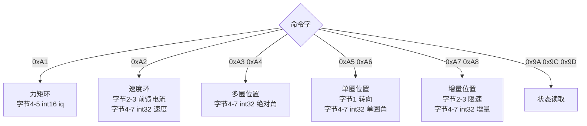
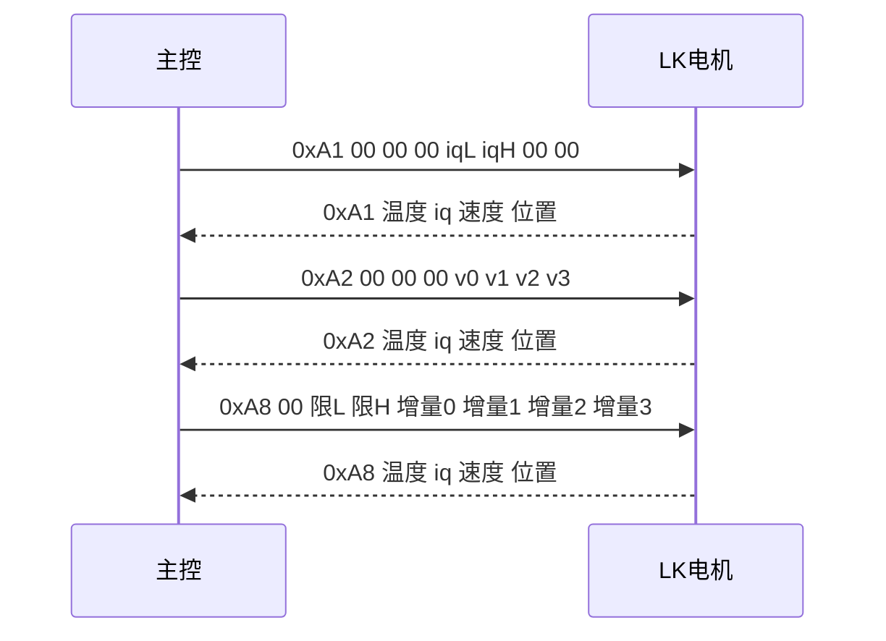

# 位置、速度与力矩模式

## 1. 概念

LK 电机内部有电流环、速度环和位置环三套闭环，主控选一组参数下发即可，不需要额外切换模式。收到 0xA1 按力矩执行，收到 0xA2 按速度执行，收到 0xA3 到 0xA8 按位置执行。

三套闭环的输入量与单位：

| 命令字 | 闭环 | 输入类型 | 单位 |
| --- | --- | --- | --- |
| 0xA1 | 力矩（电流） | int16 | iq，量程见第 2 节 |
| 0xA2 | 速度 | int32 | 0.01 dps/LSB |
| 0xA3 / 0xA4 | 位置（多圈） | int32 | 0.01 °/LSB |
| 0xA5 / 0xA6 | 位置（单圈） | int32 | 0.01 °/LSB |
| 0xA7 / 0xA8 | 位置（增量） | int32 | 0.01 °/LSB |

多圈位置是绝对角，跨零后继续累计；单圈位置只在 0 到 360° 内定位；增量位置相对当前位置偏移。

运动命令的反馈帧采用统一布局，全部小端：字节 0 回显命令字，字节 1 温度，字节 2-3 iq，字节 4-5 速度，字节 6-7 位置或编码器值。



## 2. 单位换算

力矩命令的输入是 iq。MF 系列满量程 2048 对应 ±16.5 A，MG 系列满量程 2048 对应 ±33 A：

$$k_{I,\text{MF}} = \frac{16.5}{2048} = \frac{33}{4096}\ \text{A/LSB}, \qquad k_{I,\text{MG}} = \frac{33}{2048} = \frac{66}{4096}\ \text{A/LSB}$$

由目标电流反推 iq：

$$\text{iq} = \mathrm{round}\left(\frac{I}{k_I}\right)$$

速度命令与速度反馈的单位不同。0xA2 的字节 4-7 是 int32，单位 0.01 dps/LSB；反馈字节 4-5 是 int16，单位 1 dps/LSB。两者相差 100 倍：

$$v_{\text{cmd}} = \mathrm{round}(100 \cdot v_{\text{deg/s}}), \qquad v_{\text{fb,deg/s}} = v_{\text{raw}}$$

位置命令字节 4-7 是 int32，单位 0.01 °/LSB，一圈为 36000：

$$n_{\text{deg}} = \mathrm{round}(100 \cdot \theta_{\text{deg}})$$

限速参数出现在 0xA4、0xA6、0xA8 的字节 2-3，无符号 16 位，单位 1 dps/LSB。



## 3. 落到本项目

云台板 `BSP/Src/bsp_can.cpp` 三种模式的写入方式：力矩命令把 int16 放在字节 4-5（`:386-393`）：

```c
TxData[0] = 0xA1;   // 命令字：转矩控制
TxData[1] = 0x00;
TxData[2] = 0x00;
TxData[3] = 0x00;
TxData[4] = current & 0xFF;
TxData[5] = (current >> 8) & 0xFF;
TxData[6] = 0x00;
TxData[7] = 0x00;
```

速度命令（`:412-420`）与增量位置命令（`:440-448`）把 int32 拆成低到高四字节。增量位置限速命令（`:468-477`）把 velocity 放在字节 2-3，degree 放在字节 4-7。底盘板同名前六项函数写法一致（`BSP/Src/bsp_can.cpp:348-459`）。

本工程实际用到两种模式：

| 用途 | 函数 | 命令字 | 调用点 | 周期 |
| --- | --- | --- | --- | --- |
| pitch 力矩下发 | `bsp_can1_lkmotortorquecmd` | 0xA1 | `Task/Src/ControlCenterTask.cpp:134` | 5 ms（`:137`） |
| 读取状态 2 | `bsp_can1_lkreadstatus2` | 0x9C | `Task/Src/GimbalTask.cpp:87` | 1 ms（`:104`） |

pitch 指令来自 GimbalTask 的速度环，限幅后写入 `pitch_current_out`（`GimbalTask.cpp:102`）：

```c
pitch_current_out = (int16_t)clamp(pitch_current, -30000.0f, 30000.0f);
```

参考实现给出的 MF/MG 系列 iq 输入范围是 ±2048，本工程限幅到 ±30000。这条限幅保护的是 int16 的表示范围，不保证落在电机认可的量程内，换电机型号时要按手册核对。

## 4. 易错点

- 速度命令单位 0.01 dps/LSB，速度反馈单位 1 dps/LSB。把反馈值直接回灌给命令会放大 100 倍。
- 0xA7 是增量位置。每发一帧都在当前位置上叠加，周期性写同一个值等同于持续转动。
- 0xA3 与 0xA5 都在字节 4-7 写角度，区别在多圈与单圈语义，不在报文长度。
- int32 参数一律小端，先写低字节；0xA1 的电流是 int16，只占两个字节。
- 力矩限幅按 int16 上限设置，可能超过电机认可的 iq 量程，超出部分的行为要按具体型号确认。

## 5. 小结

| 模式 | 命令字 | 参数位置 | 单位 |
| --- | --- | --- | --- |
| 力矩 | 0xA1 | 字节 4-5，int16 | iq，量程按型号 |
| 速度 | 0xA2 | 字节 4-7，int32 | 0.01 dps/LSB |
| 多圈位置 | 0xA3 / 0xA4 | 字节 4-7，int32 | 0.01 °/LSB |
| 单圈位置 | 0xA5 / 0xA6 | 字节 4-7，int32 | 0.01 °/LSB |
| 增量位置 | 0xA7 / 0xA8 | 字节 4-7，int32 | 0.01 °/LSB |
| 限速 | 0xA4 / 0xA6 / 0xA8 | 字节 2-3，uint16 | 1 dps/LSB |

## 6. 练习

1. 目标速度 720 deg/s，写出 0xA2 命令字节 4-7 的四个字节。
2. 目标多圈角 -90°，写出 0xA3 命令的 8 个字节。
3. 说明为什么速度命令与速度反馈的单位不相等，回灌会差多少。
4. 从 `BSP_CAN1_LKMotorIncrePosVelRestrictCmd` 找出限速值占用的字节。
