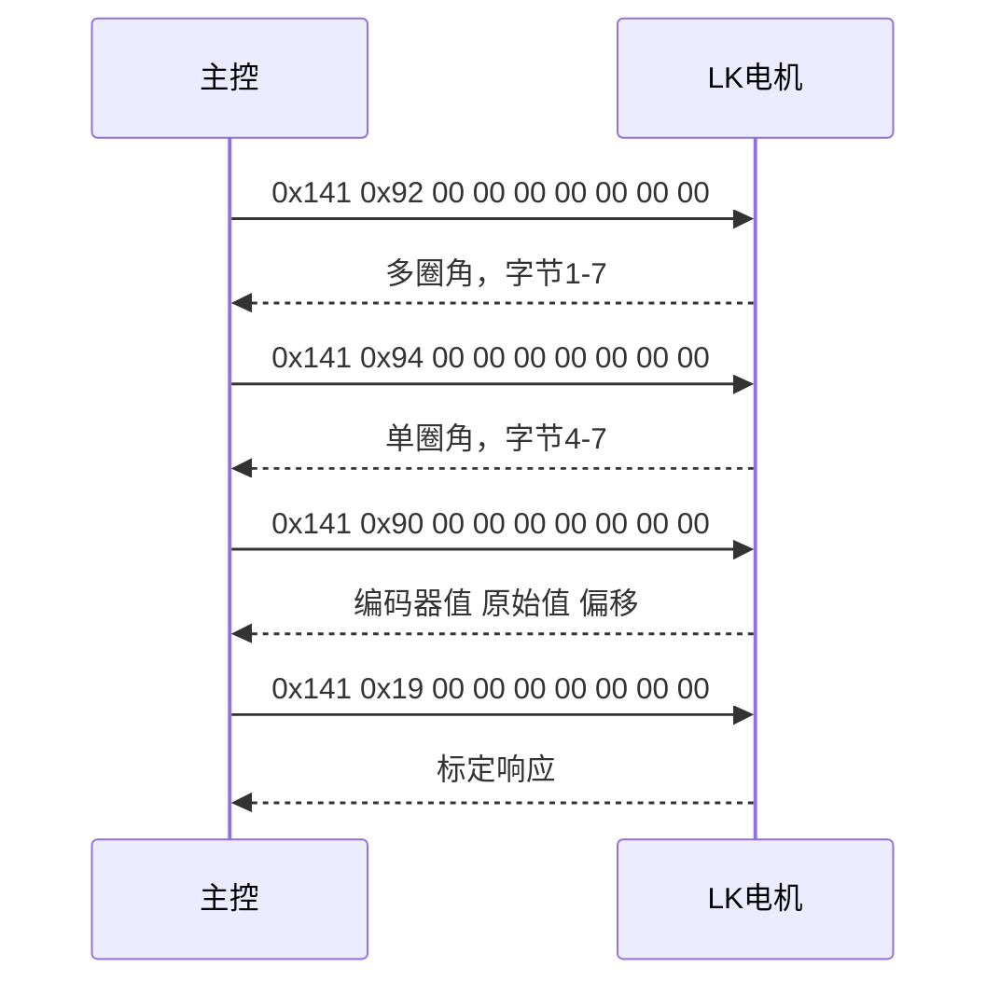
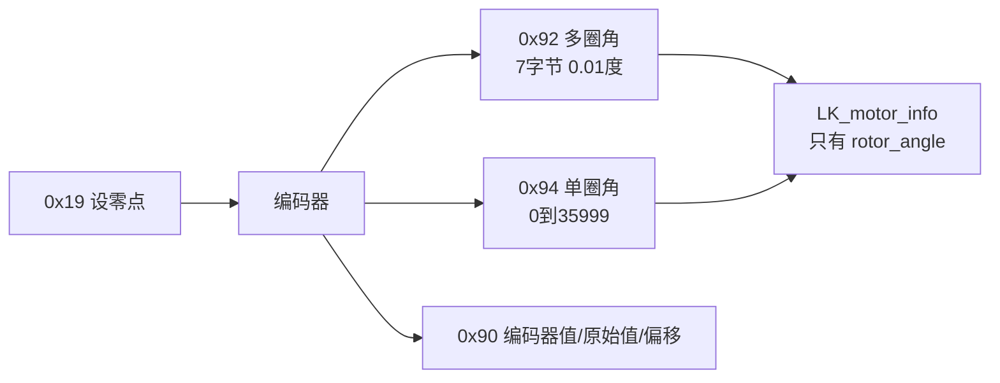

# 多圈角度与零点标定

## 1. 概念

编码器给出的是单圈内的绝对角度，多圈角度在此基础上累加圈数。LK 电机把两者分成不同命令读取：

- **单圈角度**（single-turn angle）范围 0 到 35999，单位 0.01°，对应 0 到 359.99°。
- **多圈角度**（multi-turn angle）是有符号数，单位 0.01°，跨过 0° 后继续累计，可以为负。
- **零点**决定单圈角度 0 位置对应的机械位置。

三者的关系：

$$\theta_{\text{multi}} = N \cdot 36000 + \theta_{\text{single}}, \qquad N \in \mathbb{Z}$$

$$\theta_{\text{single,LSB}} = \mathrm{round}(100 \cdot \theta_{\deg}) \bmod 36000$$

## 2. 协议

读取与标定命令：

| 命令字 | 名称 | 数据布局 |
| --- | --- | --- |
| 0x92 | 读多圈角度 | 字节 1-7 拼成 7 字节小端有符号数 |
| 0x94 | 读单圈角度 | 字节 4-7 拼成 uint32，0 到 35999 |
| 0x90 | 读编码器 | 字节 2-3 编码器值，字节 4-5 原始值，字节 6-7 偏移 |
| 0x19 | 设零点 | 把当前位置写为零点 |
| 0x95 | 设当前位置为指定多圈角 | 字节 4-7 目标角 |

多圈角用 7 字节而不是 4 字节，是为了覆盖大圈数。单圈角返回在字节 4-7，与多圈角的字节 1-7 不同。

零点标定流程：先把轴转到期望的机械基准，再发 0x19，最后读 0x92 校验。


读取时序：



## 3. 落到本项目

LK 反馈结构只有四个字段（云台板 `BSP/Inc/bsp_can.h:40-45`，底盘板同）：

```c
//瓴控系列电机反馈信息
typedef struct {
    uint16_t rotor_angle;      // 电机转子角度
    int16_t rotor_speed;      // 电机转子速度
    int16_t torque_current;   // 电机转矩电流
    int8_t  temp;             // 电机温度
} LK_motor_info;
```

对比 DJI 的结构（`BSP/Inc/bsp_can.h:10-20`）多出 `last_angle`、`total_angle`、`round_count`、`inited` 四个累计相关字段。工程没有为 LK 提供等价字段，也没有调用多圈或单圈读取命令，0x92、0x94、0x90、0x19、0x95 在两块板的 `bsp_can.cpp` 里都不存在。

反馈解析只取单帧 `rotor_angle`（云台板 `BSP/Src/bsp_can.cpp:643-671`），不累计圈数。工程内有一段过零计数逻辑 `update_motor_total_angle`（云台板 `:559-587`，底盘板 `:552-580`），它按 8192 编码器分辨率、半圈 4096 做跨圈判断（`:567-573`），只服务 DJI 电机，yaw 与拨弹盘调用它（云台板 `:625`、`:636`），LK 分支没有调用。



## 4. 易错点

- 0x19 会改写驱动器的编码器偏移并保存，参考实现提示频繁调用会影响驱动器寿命，只在需要时执行一次。
- 多圈角断电后是否保持取决于型号与保存设置，不能默认跨上电连续。
- 单圈角在字节 4-7，多圈角在字节 1-7。把单圈角当多圈角解析会得到错误的大数。
- 复用 DJI 的过零计数逻辑处理 LK 反馈得到错误圈数：DJI 一圈 8192 计数，LK 角度单位是 0.01°，一圈 36000。
- `LK_motor_info.rotor_angle` 是 uint16，直接存 0.01° 位置时 65535 对应 655.35°，负角会回绕。

## 5. 小结

| 项 | 单圈角度 | 多圈角度 |
| --- | --- | --- |
| 命令字 | 0x94 | 0x92 |
| 数据位置 | 字节 4-7，uint32 | 字节 1-7，有符号 |
| 范围 | 0 到 35999 | 有符号，累计圈数 |
| 单位 | 0.01 °/LSB | 0.01 °/LSB |
| 本工程使用 | 无 | 无 |

## 6. 练习

1. 单圈角读数为 12345，多圈角读数为 12345，判断此时轴在什么位置。
2. 轴已转过 3 圈又 90°，写出 0x92 应返回的数值。
3. 说明为什么不能把 `update_motor_total_angle` 直接套用到 LK 的 `rotor_angle`。
4. 列出零点标定后应当校验的两个读数。
