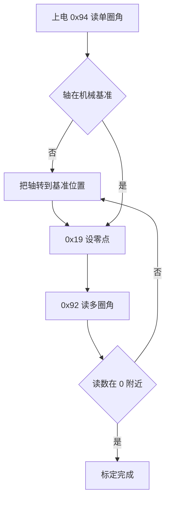
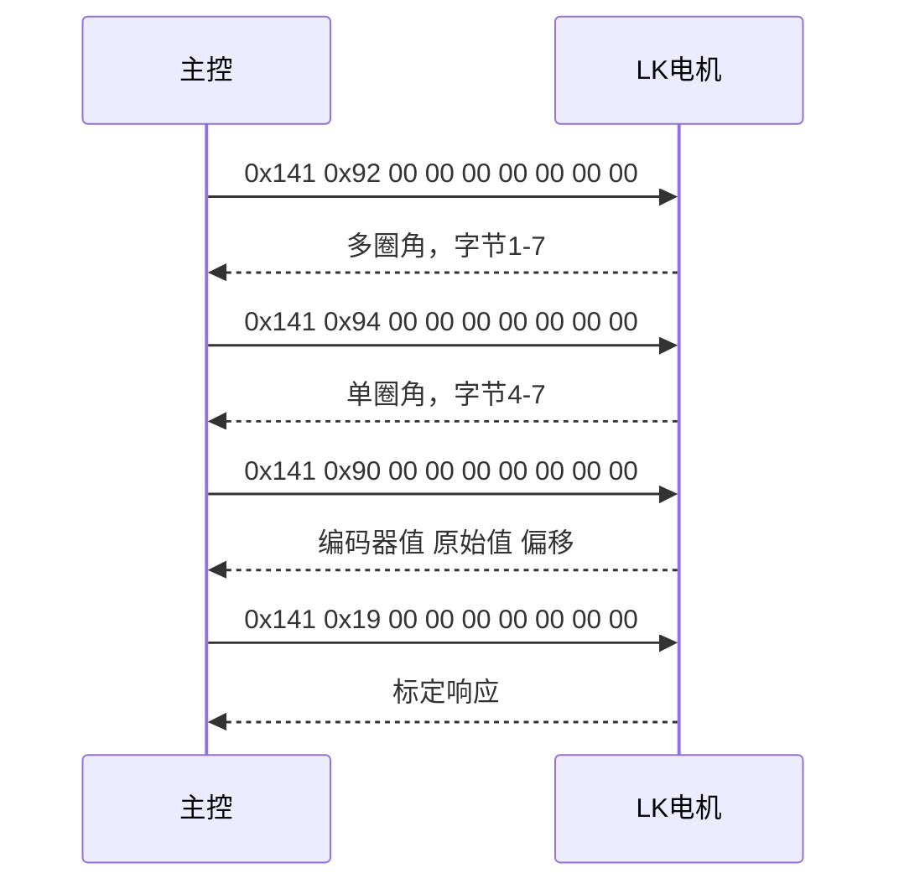
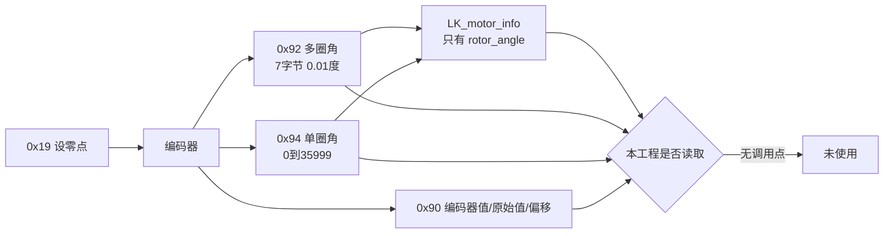

# 多圈角度与零点标定

编码器给出的是单圈内的绝对角度，多圈角度在这个基础上累加圈数。LK 电机把两者分成不同命令读取，单圈角、多圈角与编码器原始值各有自己的命令字和字节布局，零点则由标定命令写入驱动器。

本工程没有调用这一组命令中的任何一条，LK 反馈结构里也没有累计字段。先说明三个量的定义与换算，再给出标定流程，最后解释为什么把 DJI 的累计逻辑套到 LK 上会算错。读完后应当能回答：多圈角为什么用 7 个字节、0x19 做了什么、以及 `LK_motor_info.rotor_angle` 能表示多大的角度。

## 单圈、多圈与零点三者怎么定义

- 单圈角度（single-turn angle）范围 0 到 35999，单位 0.01°，对应 0 到 359.99°。
- 多圈角度（multi-turn angle）是有符号数，单位 0.01°，跨过 0° 后继续累计，可以为负。
- 零点决定单圈角度 0 位置对应的机械位置。

三者的关系：

$$\theta_{\text{multi}} = N \cdot 36000 + \theta_{\text{single}}, \qquad N \in \mathbb{Z}$$

$$\theta_{\text{single,LSB}} = \mathrm{round}(100 \cdot \theta_{\deg}) \bmod 36000$$

把 36000 这个常数记住有助于换算：一圈 36000 个 LSB，1° 对应 100 个 LSB，0.01° 对应 1 个 LSB。单圈角永远落在 0 到 35999 之间，多圈角等于单圈角加上整数倍的 36000。

零点是一个软件偏置，写进驱动器后单圈角的 0 位就移到指定的机械位置。零点改变的是映射关系，不改变编码器本身的分辨率。

## 读取与标定用到的五条命令

| 命令字 | 名称 | 数据布局 |
| --- | --- | --- |
| 0x92 | 读多圈角度 | 字节 1-7 拼成 7 字节小端有符号数 |
| 0x94 | 读单圈角度 | 字节 4-7 拼成 uint32，0 到 35999 |
| 0x90 | 读编码器 | 字节 2-3 编码器值，字节 4-5 原始值，字节 6-7 偏移 |
| 0x19 | 设零点 | 把当前位置写为零点 |
| 0x95 | 设当前位置为指定多圈角 | 字节 4-7 目标角 |

多圈角用 7 字节而单圈角用 4 字节，这个差别是刻意的。多圈角要覆盖大圈数，7 字节给到 56 位，远超实际需要的范围；单圈角只需要覆盖 0 到 35999，uint32 足够。接收端如果按固定 4 字节解析多圈角，会把高位的符号信息丢掉。

0x90 一次返回三个量：编码器值、原始值与偏移。三者配合可以看出零点写入前后的变化，是标定后校验的原始证据。

## 零点标定的完整流程

先把轴转到期望的机械基准，再发 0x19，最后读 0x92 校验。



读取时序：



流程里“把轴转到基准位置”这一步靠外部机械限位或工装确定，固件只能读角度、不能判断机械基准在哪。标定完成后要校验 0x92 的多圈角是否落在零点附近，单圈角本身不足以判断。

## 0x90 的三个量在标定前后怎么变

0x90 一次返回三个 16 位量，分布在固定偏移上：

| 字节 | 字段 | 类型 | 用途 |
| --- | --- | --- | --- |
| 2 到 3 | 编码器值 | uint16 | 经过零点偏移换算后的位置 |
| 4 到 5 | 原始值 | uint16 | 编码器的原始读数 |
| 6 到 7 | 偏移 | uint16 | 驱动器中保存的零点偏移 |

三个量的换算关系以手册为准，本仓库的代码里没有对应的解析分支，这一条标注为待核实。可以确定的是 0x19 写的就是第三个量：标定前后各读一次 0x90，偏移字段会发生变化，而原始值与机械位置无关、应当保持连续。这个前后对比比只看单圈角更有说服力，因为单圈角同时受转速与偏移影响。

校验时把两次 0x90 与一次 0x92 的读数记在一起：

| 时刻 | 0x90 偏移 | 0x92 多圈角 | 预期 |
| --- | --- | --- | --- |
| 发 0x19 之前 | 旧值 | 旧基准下的角度 | 与机械位置对应 |
| 发 0x19 之后 | 新值 | 接近 0 | 机械基准成为新的 0 位 |

如果发完 0x19 后偏移没有变化，说明命令帧没有送达驱动器，这时应当先查总线与 StdId，而不是反复重发。

## 本工程为什么没有多圈角度

LK 反馈结构只有四个字段（云台板 `BSP/Inc/bsp_can.h`，底盘板同）：

```c
//瓴控系列电机反馈信息
typedef struct {
    uint16_t rotor_angle;      // 电机转子角度
    int16_t rotor_speed;      // 电机转子速度
    int16_t torque_current;   // 电机转矩电流
    int8_t  temp;             // 电机温度
} LK_motor_info;
```

对比 DJI 的结构（`BSP/Inc/bsp_can.h`）多出 `last_angle`、`total_angle`、`round_count`、`inited` 四个累计相关字段。工程没有为 LK 提供等价字段，也没有调用多圈或单圈读取命令，0x92、0x94、0x90、0x19、0x95 在两块板的 `bsp_can.cpp` 里都不存在。

反馈解析只取单帧 `rotor_angle`（云台板 `BSP/Src/bsp_can.cpp`），不累计圈数。工程内有一段过零计数逻辑 `update_motor_total_angle`（云台板与底盘板同名文件），它按 8192 编码器分辨率、半圈 4096 做跨圈判断（两者相乘即整圈计数），只服务 DJI 电机，yaw 与拨弹盘调用它，LK 分支没有调用。



## 复用 DJI 累计逻辑会错在哪

DJI 与 LK 的累计逻辑看着相似，判据的分母完全不同：

| 项 | DJI | LK |
| --- | --- | --- |
| 单圈分辨率 | 8192 计数 | 36000 个 0.01° |
| 半圈判据阈值 | 4096 计数 | 18000 |
| 反馈字段类型 | `int16_t rotor_angle` | `uint16_t rotor_angle` |
| 多圈来源 | 主控自行累加 | 电机内部，0x92 可读 |

把 `update_motor_total_angle` 直接套到 LK 的 `rotor_angle` 上，第一步就会在阈值上出错：4096 只相当于 DJI 的半圈，对 LK 而言还不到一圈的八分之一，正常转动都会被判成跨圈，圈数会飞快累积。

第二个问题是字段宽度。`LK_motor_info.rotor_angle` 是 `uint16`，若直接存放 0.01° 的原始位置，最大只能表示 655.35°，超过之后回绕；而 LK 自己提供了 0x92，多圈信息不需要主控拼接。正确的做法是改用读命令直接取多圈角，而不是把 DJI 的拼接逻辑搬过来。

判断能否复用可以先看一个量：反馈字段里存的是原始编码器计数还是带量纲的角度值。前者配合固定分辨率可以拼接，后者本身已经对应物理量，再按半圈判据叠圈数只会得到没有意义的数。

## 现象与检查顺序

| 现象 | 原因 | 检查手段 |
| --- | --- | --- |
| 单圈角读数正常但多圈角异常 | 把单圈角的字节 4-7 当成多圈角解析 | 核对 0x92 的字节 1-7 |
| 标定后角度仍偏一个常数 | 标定时的机械位置不是期望基准 | 重新转到基准再发 0x19 |
| 角度读数超过 655.35° 后回绕 | `rotor_angle` 是 uint16，存放了带量纲的值 | 确认字段里存的是原始值还是 0.01° |
| 圈数累积过快 | 套用了 DJI 的 4096 阈值 | 按 LK 的 36000 分辨率重算阈值 |
| 断电后多圈角从头开始 | 多圈角是否保存取决于型号与保存设置 | 按型号手册确认，不能默认跨上电连续 |

## 小结

### 核心概念

- 单圈角范围 0 到 35999，单位 0.01°；多圈角是有符号数，两者由不同命令读取。
- 多圈角用 7 字节，单圈角用字节 4-7，两者的偏移与宽度都不同。
- 零点由 0x19 写入驱动器，0x95 可以把当前位置设为指定多圈角，适合在工装上批量标定。
- 本工程的 `LK_motor_info` 只有四个字段，没有累计角度相关成员，也没有调用任何读取命令。
- DJI 的过零计数逻辑按 8192 计数设计，不能直接用于 LK 的 36000 分辨率。
- 0x19 会改写并保存编码器偏移，参考实现提示频繁调用会影响驱动器寿命。

### 设计权衡

| 项 | 单圈角度 | 多圈角度 | 本工程使用 |
| --- | --- | --- | --- |
| 命令字 | 0x94 | 0x92 | 无 |
| 数据位置 | 字节 4-7，uint32 | 字节 1-7，有符号 | 无 |
| 范围 | 0 到 35999 | 有符号，累计圈数 | 无 |
| 单位 | 0.01 °/LSB | 0.01 °/LSB | 无 |
| 断电保持 | 由零点与型号决定 | 由型号与保存设置决定 | 无 |

## 练习

### 基础题

1. 单圈角读数为 12345，多圈角读数为 12345，判断此时轴在什么位置。
2. 轴已转过 3 圈又 90°，写出 0x92 应返回的数值。
3. 说明为什么不能把 `update_motor_total_angle` 直接套用到 LK 的 `rotor_angle`。
4. 列出零点标定后应当校验的两个读数。

### 挑战题

5. 设计一次完整的标定与校验流程，要求只用 0x94、0x19、0x92 三条命令，并给出每一步的预期返回值。
6. 给 `LK_motor_info` 增加多圈角度支持：说明新增字段的类型、由哪条命令填充，以及如何避免 uint16 回绕。
7. 若同一块板上同时有 DJI 与 LK 电机，设计一个统一的累计角度接口，使两套分辨率（8192 与 36000）在调用侧不区分。

## 附：本页引用的固件路径

| 路径 | 用途 |
| --- | --- |
| `BSP/Inc/bsp_can.h` | `LK_motor_info`（`BSP/Inc/bsp_can.h`）、DJI 结构（`BSP/Inc/bsp_can.h`） |
| `BSP/Src/bsp_can.cpp` | LK 反馈解析（`BSP/Src/bsp_can.cpp`）、`update_motor_total_angle`（`BSP/Src/bsp_can.cpp`）与判据（`BSP/Src/bsp_can.cpp`）、DJI 调用点（`BSP/Src/bsp_can.cpp`、`BSP/Src/bsp_can.cpp`） |
| `底盘板 BSP/Src/bsp_can.cpp` | 底盘板 `update_motor_total_angle`（`BSP/Src/bsp_can.cpp`） |
