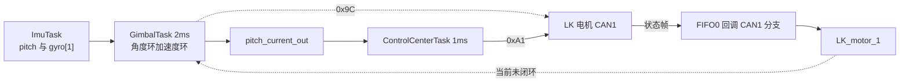
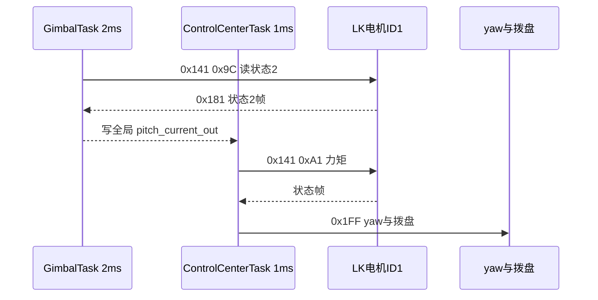

# 本项目应用

俯仰轴 pitch 使用 LK 电机，接在云台板 CAN1 上，与 yaw 电机（GM6020，0x1FF 第 1 槽位、反馈 0x205；代码按 M3508 编号习惯记作 ID5）和拨弹盘电机（M3508，ID6）共用一条总线。云台板 CAN2 挂两个摩擦轮，底盘板不参与 pitch 控制。

这条链路跨越三个任务：上电时 ControlCenterTask 发一次使能，运行时 GimbalTask 每 2 ms 读一次状态并算出电流，ControlCenterTask 每 1 ms 把当前值发下去，反馈帧则在 CAN1 接收中断里解析。四个环节的周期两两不同，任何一处的节奏改动都会影响闭环。下面按数据流把它们串起来，并说明底盘板上那套同名函数为什么没有被调用。

> 云台板路径为 `/home/wyx/rm/2026SentriOmeniGimbal/2026OmniSentryGimbal`，底盘板路径为 `/home/wyx/rm/2026SentriOmeniChassis/2026OmniSentryChassis`。下文相对路径都相对于这两个根目录。

## pitch 轴挂在哪条总线上

云台板两条 CAN 的分工是固定的：CAN1 上挂 yaw、拨弹盘与 pitch 三种电机，CAN2 上挂两个摩擦轮。三类报文在一根线上共存，靠标准标识符区分：

| 电机 | 型号 | 下行标识符 | 上行标识符 | 变量 |
| --- | --- | --- | --- | --- |
| yaw | GM6020 | 0x1FF 槽位 1 | 0x205 | `motor_5` |
| 拨弹盘 | M3508 | 0x1FF 槽位 2 | 0x206 | `motor_6` |
| pitch | LK | 0x141 | 0x181 | `LK_motor_1` |

yaw 与拨弹盘共用一条 0x1FF 广播帧，pitch 单独用 0x141。三条上行的标识符互不重叠，接收回调按 StdId 分派即可，不需要额外的通道号。

## 从 IMU 到力矩命令的完整链路

一个 CAN1 周期内的报文顺序：

链路上有三点要交代。第一，状态读取与力矩下发由不同任务以不同周期发出，中间靠一个全局变量传递。第二，读状态与写力矩都占用 CAN1 的带宽，而 yaw 与拨弹盘的 0x1FF 也要走同一条线。第三，反馈帧的解析结果 `LK_motor_1` 目前没有回到闭环里，pitch 速度环用的是陀螺仪。

`pitch_current_out` 是这条链路里唯一的跨任务变量：GimbalTask 写，ControlCenterTask 读，没有互斥保护。两个任务周期不同，而且下发侧更快：ControlCenterTask 的 1 ms 周期比 GimbalTask 的 2 ms 短，同一个 `pitch_current_out` 会被连续发出两次，控制量的实际更新率由 2 ms 那一侧决定。

## 逐个环节的源码落点

| 环节 | 文件与行号 | 内容 |
| --- | --- | --- |
| 反馈结构 | `BSP/Inc/bsp_can.h:40-45` | rotor_angle、rotor_speed、torque_current、temp |
| 全局实例 | `BSP/Src/bsp_can.cpp:25` | `LK_motor_info LK_motor_1;` |
| 接口声明 | `BSP/Inc/bsp_can.h:81-88` | 七个 LK 发送函数 |
| 使能 | `Task/Src/ControlCenterTask.cpp:30` | `bsp_can1_lkmotorstartcmd()` |
| 力矩下发 | `Task/Src/ControlCenterTask.cpp:107` | `bsp_can1_lkmotortorquecmd(pitch_current_out)` |
| 下发周期 | `Task/Src/ControlCenterTask.cpp:111` | `osDelay(1)` |
| 状态 2 读取 | `Task/Src/GimbalTask.cpp:83` | `bsp_can1_lkreadstatus2()` |
| 速度环 | `Task/Src/GimbalTask.cpp:92-98` | `PitchSpeedPID` 到 `pitch_current_out` |
| 读取周期 | `Task/Src/GimbalTask.cpp:100` | `osDelay(2)`，注释仍写 1 ms |
| 反馈分派 | `BSP/Src/bsp_can.cpp:641-671` | `case 0x181` |
| 命令帧 StdId | `BSP/Src/bsp_can.cpp:340` 等 | 0x141，句柄 hcan1 |
| CAN1 中断 | `Core/Src/can.c:125-128` | CAN1_RX0 与 RX1，抢占优先级 5 |

读状态与下发力矩的频率关系可以直接算：GimbalTask 的 `osDelay(2)` 给出 2 ms 周期，即每秒 500 次读取；ControlCenterTask 的 `osDelay(1)` 给出 1 ms 周期，即每秒 1000 次下发。每 1 次状态读取对应 2 次力矩下发，比例是 1 比 2。闭环的等效更新率取决于较慢的一侧，也就是 500 Hz；下发侧的 1 kHz 只是把同一个值重复发一次。

## 中断优先级与调用边界

CAN1_RX0 与 RX1 的抢占优先级是 5（`Core/Src/can.c:125`、`:127`），HAL 时基 TIM2 的 `TICK_INT_PRIORITY` 是 15（`Core/Inc/stm32f4xx_hal_conf.h:151`），FreeRTOS 的 `configLIBRARY_LOWEST_INTERRUPT_PRIORITY` 也是 15（`Core/Inc/FreeRTOSConfig.h:104`）。抢占值越小优先级越高，CAN 中断可以先于时基与 PendSV 执行。

| 中断 | 抢占优先级 | 来源 |
| --- | --- | --- |
| CAN1_RX0 / RX1 | 5 | `Core/Src/can.c:125-128` |
| TIM2 时基 | 15 | `Core/Inc/stm32f4xx_hal_conf.h:151` |
| PendSV 与 SysTick | 15 | `Core/Inc/FreeRTOSConfig.h:104` |

FreeRTOS 的 `configLIBRARY_MAX_SYSCALL_INTERRUPT_PRIORITY` 为 5（`Core/Inc/FreeRTOSConfig.h:110`），CAN 中断正好处在可以调用 FromISR 接口的边界上。再往上调一级（数值改成 4）就会越过边界，`vPortValidateInterruptPriority()` 里的断言会命中，因此这个数值不能随意提升。

## 云台板 CAN1 上的三类报文怎么共存

过滤器是全接收配置（`BSP/Src/bsp_can.cpp:60-84`），三类报文都进入同一个 FIFO0 回调，靠两层分派分开：先按 `hcan->Instance` 判断是 CAN1 还是 CAN2，再按 StdId 走不同分支。

| 报文 | 方向 | 回调里的分支 | 落到哪个变量 |
| --- | --- | --- | --- |
| 0x1FF | 下行 | 无（发送函数里封装） | 不适用 |
| 0x205 | 上行 | CAN1 分支 | `motor_5` |
| 0x206 | 上行 | CAN1 分支 | `motor_6` |
| 0x141 | 下行 | 无（发送函数里封装） | 不适用 |
| 0x181 | 上行 | CAN1 分支，再按字节 0 分派 | `LK_motor_1` |

三类报文共用一条总线带来的直接后果是带宽共享，具体的周期配比与占用估算放在「三个任务的周期与报文节奏」一节，这里只保留分派关系。任何一帧发送阻塞都会推迟另外两轴的指令。

## 底盘板的 LK 代码为什么是死代码

`BSP/Src/bsp_can.cpp:308-459` 有同名前六项 LK 命令函数与 C 接口封装（`BSP/Src/bsp_can.cpp:701-723`），句柄同样是 hcan1，但没有 0x9C 读取函数。全工程没有任何调用点，`Chassis/Src/Motor.cpp` 只有 3 行注释，`Chassis/Inc/Motor.h` 为空。

底盘板的 RX 回调（`BSP/Src/bsp_can.cpp:551-657`）只有 CAN2 的 0x201 到 0x204 与 CAN1 的 0x205、0x301、0x302、0x401、0x501，没有 0x181 分支。底盘板 CAN2 实挂四个轮子，CAN1 挂 yaw 与板间报文。

| 项 | 云台板 | 底盘板 |
| --- | --- | --- |
| LK 命令函数 | 0x80、0x88、0xA1、0xA2、0xA7、0xA8、0x9C | 0x80、0x88、0xA1、0xA2、0xA7、0xA8 |
| 命令帧 StdId | 0x141 | 0x141 |
| 句柄 | hcan1 | hcan1 |
| 反馈分派 | 0x181，CAN1 分支 | 无 |
| 调用点 | ControlCenterTask、GimbalTask | 无 |
| pitch 控制 | 有 | 无 |

底盘板这套代码属于预留。它的存在会让搜索函数名的人以为底盘板也在控制 LK 电机，排查时应当以调用点为准，而不是以函数是否存在为准。

## 三个任务的周期与报文节奏

链路上有四个周期，互不相等：

| 环节 | 周期 | 出处 | 说明 |
| --- | --- | --- | --- |
| IMU 姿态更新 | 1 ms | `Task/Src/ImuTask.cpp:111` 的 `DWT_Delay_ms(1)` | 提供 pitch 与 gyro[1] |
| GimbalTask | 2 ms | `Task/Src/GimbalTask.cpp:100` | 读状态 2 并算电流 |
| ControlCenterTask | 1 ms | `Task/Src/ControlCenterTask.cpp:111` | 下发力矩与 0x1FF |
| LK 反馈 | 由电机决定 | 0x181 到达 | 与命令帧无固定相位 |

任务侧最快的是 ControlCenterTask 的 1 ms，GimbalTask 慢一倍，两级之间没有同步机制。由此可以推出两个直接后果。

第一个后果是下发次数比读取次数多，同一个电流值会被连发两次；读取侧算出的新值要等到下一次 2 ms 边沿才生效，因此 1 ms 的下发周期并不会提高闭环带宽。第二个后果是 0x141 与 0x1FF 共享同一段总线时间，ControlCenterTask 每 1 ms 就要发这两帧，若前者的发送邮箱被占满，后者会顺延，yaw 与拨弹盘的指令因此出现抖动。判断这类抖动只需统计两个发送函数的返回码与调用时刻。排查顺序可以固定为：

1. 统计 0x141 与 0x1FF 的发送返回码，确认是否出现 HAL_TIMEOUT 或 HAL_ERROR。
2. 记录两次发送之间的时间差，判断是否稳定在 1 ms。
3. 核对同一窗口内是否有其它任务也往 CAN1 写了帧。

## 现象与检查顺序

| 现象 | 可能原因 | 检查方法 |
| --- | --- | --- |
| pitch 完全不动 | 使能没有发出，或 `pitch_current_out` 恒为 0 | 抓 0x141 帧并看字节 0 |
| 状态 2 读不到 | 反馈分派标识符与实际反馈不一致 | 在 CAN1 分支里按 StdId 计数 |
| 力矩方向相反 | 电调安装方向与车体坐标系不一致 | 在限幅后统一取反并注释 |
| 三轴延迟同时变大 | CAN1 带宽被某一类报文占满 | 统计各 StdId 的每秒帧数 |
| 反馈有值但闭环不用 | pitch 速度环反馈用的是 gyro[0] | 看 `Task/Src/GimbalTask.cpp:92-96` 的实参 |

## 小结

### 核心概念

- pitch 是 LK 电机，挂云台板 CAN1，命令标识符 0x141，反馈分派在 0x181。
- 使能由 ControlCenterTask 在上电时发一次，之后不再重复；0x80 之后才需要补发。
- 状态 2 读取周期 2 ms，力矩下发周期 1 ms，闭环等效更新率按较慢的一侧算为 500 Hz。
- `LK_motor_1` 只在 GimbalTask 与 FireTask 里以 `extern` 声明（`Task/Src/GimbalTask.cpp:18`、`Task/Src/FireTask.cpp:14`），pitch 速度环的反馈是 gyro[0]，`rotor_speed` 未参与闭环。
- CAN 中断抢占优先级 5，正好在 FreeRTOS 允许调用 FromISR 接口的边界上。
- 底盘板有同名 LK 函数与封装，但没有调用点，也没有 0x181 解析分支。

### 设计权衡

| 项 | 本工程的选择 | 代价与收益 |
| --- | --- | --- |
| 反馈来源 | pitch 用 IMU，不用 LK 编码器 | 与云台姿态一致；代价是 `LK_motor_1.rotor_speed` 闲置 |
| 下发周期 | 1 ms | 总线负载高；实际闭环带宽受限于 2 ms 的读取侧 |
| 总线共享 | yaw、拨弹盘、pitch 全部在 CAN1 | 少用一路外设；代价是三轴延迟互相耦合 |
| 跨任务传递 | 全局变量 `pitch_current_out` | 实现简单；代价是没有一致性保护 |
| 底盘板预留 | 保留函数不调用 | 将来可复用；代价是搜索时容易误判为活跃路径 |

## 练习

### 基础题

1. 画出从 IMU pitch 到 LK 力矩命令的完整数据流，标出每个全局变量。
2. 计算 pitch 力矩命令的实际下发频率与状态 2 的读取频率之比。
3. 说明为什么 0x9C 与 0xA1 反馈的末两字节不能互换使用。
4. 列出 CAN1 中断优先级 5 与 FreeRTOS 调用边界之间的关系。

### 挑战题

5. 若把 pitch 电机改到云台板 CAN2，列出 `bsp_can.cpp` 中需要改动的行。
6. 把 pitch 闭环改成用 `LK_motor_1.rotor_speed` 做反馈，说明需要改动的行、单位换算，以及切换时要做的对比实验。
7. 统计 CAN1 上三类报文的每秒帧数，估算总线占用率，并给出把 ControlCenterTask 的控制周期从 1 ms 放宽到 2 ms 时的占用变化。

## 附：本页引用的固件路径

| 路径 | 用途 |
| --- | --- |
| `/home/wyx/rm/2026SentriOmeniGimbal/2026OmniSentryGimbal/BSP/Src/bsp_can.cpp` | `LK_motor_1` 定义（`BSP/Src/bsp_can.cpp:25`）、LK 命令函数（`BSP/Src/bsp_can.cpp:333-495`）、反馈分派（`BSP/Src/bsp_can.cpp:641-671`） |
| `/home/wyx/rm/2026SentriOmeniGimbal/2026OmniSentryGimbal/BSP/Inc/bsp_can.h` | `LK_motor_info`（:40-45）、LK 接口声明（:81-88） |
| `/home/wyx/rm/2026SentriOmeniGimbal/2026OmniSentryGimbal/Task/Src/ControlCenterTask.cpp` | 使能（`Task/Src/ControlCenterTask.cpp:30`）、力矩下发（`Task/Src/ControlCenterTask.cpp:107`）、1 ms 周期（`Task/Src/ControlCenterTask.cpp:111`） |
| `/home/wyx/rm/2026SentriOmeniGimbal/2026OmniSentryGimbal/Task/Src/GimbalTask.cpp` | `LK_motor_1` 引用（`Task/Src/GimbalTask.cpp:18`）、状态 2 读取（`Task/Src/GimbalTask.cpp:83`）、速度环与限幅（`Task/Src/GimbalTask.cpp:92-98`）、2 ms 周期（`Task/Src/GimbalTask.cpp:100`） |
| `/home/wyx/rm/2026SentriOmeniGimbal/2026OmniSentryGimbal/Task/Src/FireTask.cpp` | `LK_motor_1` 引用（`Task/Src/FireTask.cpp:14`） |
| `/home/wyx/rm/2026SentriOmeniGimbal/2026OmniSentryGimbal/Core/Src/can.c` | CAN1_RX0 与 RX1 中断优先级（`Core/Src/can.c:125-128`） |
| `/home/wyx/rm/2026SentriOmeniGimbal/2026OmniSentryGimbal/Core/Inc/FreeRTOSConfig.h` | 中断优先级常量（`Core/Inc/FreeRTOSConfig.h:104`、`Core/Inc/FreeRTOSConfig.h:110`） |
| `/home/wyx/rm/2026SentriOmeniGimbal/2026OmniSentryGimbal/Core/Inc/stm32f4xx_hal_conf.h` | TIM2 时基优先级（`Core/Inc/stm32f4xx_hal_conf.h:151`） |
| `/home/wyx/rm/2026SentriOmeniChassis/2026OmniSentryChassis/BSP/Src/bsp_can.cpp` | 底盘板 LK 命令函数（`BSP/Src/bsp_can.cpp:308-459`）、C 封装（`BSP/Src/bsp_can.cpp:701-723`）、接收回调（`BSP/Src/bsp_can.cpp:551-657`） |
