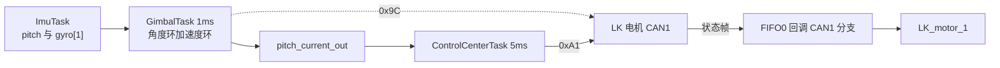

# 本项目应用

> 云台板路径为 `/home/wyx/rm/2026SentriOmeniGimbal/2026OmniSentryGimbal`，底盘板路径为 `/home/wyx/rm/2026SentriOmeniChassis/2026OmniSentryChassis`。下文相对路径都相对于这两个根目录。

## 1. 概念

俯仰轴 pitch 使用 LK 电机，接在云台板 CAN1 上，与 yaw 电机（GM6020，0x1FF 第 1 槽位、反馈 0x205；代码按 M3508 编号习惯记作 ID5）和拨弹盘电机（M3508，ID6）共用一条总线。云台板 CAN2 挂两个摩擦轮。底盘板不参与 pitch 控制。

## 2. 控制链路

上电时 ControlCenterTask 发一次使能。之后 GimbalTask 以 1 ms 为周期读状态 2，用 IMU 的 pitch 与 gyro[1] 跑角度外环和速度内环，结果写入全局变量。ControlCenterTask 以 5 ms 为周期把该变量通过力矩命令下发。反馈帧在 FIFO0 回调的 CAN1 分支里解析。

一个 CAN1 周期内的报文顺序：

## 3. 落到本项目

| 环节 | 文件与行号 | 内容 |
| --- | --- | --- |
| 反馈结构 | `BSP/Inc/bsp_can.h:40-45` | rotor_angle、rotor_speed、torque_current、temp |
| 全局实例 | `BSP/Src/bsp_can.cpp:27` | `LK_motor_info LK_motor_1;` |
| 接口声明 | `BSP/Inc/bsp_can.h:81-88` | 七个 LK 发送函数 |
| 使能 | `Task/Src/ControlCenterTask.cpp:36` | `bsp_can1_lkmotorstartcmd()` |
| 力矩下发 | `Task/Src/ControlCenterTask.cpp:134` | `bsp_can1_lkmotortorquecmd(pitch_current_out)` |
| 下发周期 | `Task/Src/ControlCenterTask.cpp:137` | `osDelay(5)` |
| 状态 2 读取 | `Task/Src/GimbalTask.cpp:87` | `bsp_can1_lkreadstatus2()` |
| 速度环 | `Task/Src/GimbalTask.cpp:96-102` | `PitchSpeedPID` 到 `pitch_current_out` |
| 读取周期 | `Task/Src/GimbalTask.cpp:104` | `osDelay(1)` |
| 反馈分派 | `BSP/Src/bsp_can.cpp:643-671` | `case 0x181` |
| 命令帧 StdId | `BSP/Src/bsp_can.cpp:342` 等 | 0x141，句柄 hcan1 |
| CAN1 中断 | `Core/Src/can.c:125-128` | CAN1_RX0 与 RX1，抢占优先级 5 |

中断优先级：CAN1_RX0 与 RX1 的抢占优先级是 5（`Core/Src/can.c:125`、`:127`），HAL 时基 TIM2 的 `TICK_INT_PRIORITY` 是 15（`Core/Inc/stm32f4xx_hal_conf.h:151`），FreeRTOS 的 `configLIBRARY_LOWEST_INTERRUPT_PRIORITY` 也是 15（`Core/Inc/FreeRTOSConfig.h:104`）。抢占值越小优先级越高，CAN 中断可以先于时基与 PendSV 执行。FreeRTOS 的 `configLIBRARY_MAX_SYSCALL_INTERRUPT_PRIORITY` 为 5（`Core/Inc/FreeRTOSConfig.h:110`），CAN 中断正好处在可以调用 FromISR 接口的边界上。

`LK_motor_1` 在云台板被两个任务引用：`Task/Src/GimbalTask.cpp:22` 与 `Task/Src/FireTask.cpp:17`。当前 pitch 速度环的反馈用的是 gyro[1]（`GimbalTask.cpp:98`），`LK_motor_1.rotor_speed` 没有被闭环使用。

底盘板的情况不同。`BSP/Src/bsp_can.cpp:308-459` 有同名前六项 LK 命令函数与 C 接口封装（`:733-755`），句柄同样是 hcan1，但没有 0x9C 读取函数。全工程没有任何调用点，`Chassis/Src/Motor.cpp` 只有 3 行注释，`Chassis/Inc/Motor.h` 为空。底盘板的 RX 回调（`:583-689`）只有 CAN2 的 0x201 到 0x204 与 CAN1 的 0x205、0x301、0x302、0x401、0x501，没有 0x181 分支。底盘板 CAN2 实挂四个轮子，CAN1 挂 yaw 与板间报文。

## 4. 易错点

- 函数名带 `CAN1`，句柄也是 hcan1。pitch 与 yaw、拨弹盘共用总线，任一帧阻塞都会增加另外两轴的延迟。
- 反馈分派值 0x181 与发送值 0x141 不同，换电机或改 ID 时要同时改两处。
- `LK_motor_1` 被 GimbalTask 与 FireTask 引用，但 pitch 速度环用的是 gyro[1]。改闭环前先确认取的是哪一路反馈。
- 0x9C 返回的末两字节与运动反馈的末两字节语义不同，混用会得到不同的位置量。
- 底盘板的 LK 函数没有调用点。照抄其接口以为底盘板在控制 pitch，会把排查方向带偏。

## 5. 小结

| 项 | 云台板 | 底盘板 |
| --- | --- | --- |
| LK 命令函数 | 0x80、0x88、0xA1、0xA2、0xA7、0xA8、0x9C | 0x80、0x88、0xA1、0xA2、0xA7、0xA8 |
| 命令帧 StdId | 0x141 | 0x141 |
| 句柄 | hcan1 | hcan1 |
| 反馈分派 | 0x181，CAN1 分支 | 无 |
| 调用点 | ControlCenterTask、GimbalTask | 无 |
| pitch 控制 | 有 | 无 |

## 6. 练习

1. 画出从 IMU pitch 到 LK 力矩命令的完整数据流，标出每个全局变量。
2. 计算 pitch 力矩命令的实际下发频率与状态 2 的读取频率之比。
3. 说明为什么 0x9C 与 0xA1 反馈的末两字节不能互换使用。
4. 若把 pitch 电机改到云台板 CAN2，列出 `bsp_can.cpp` 中需要改动的行。
