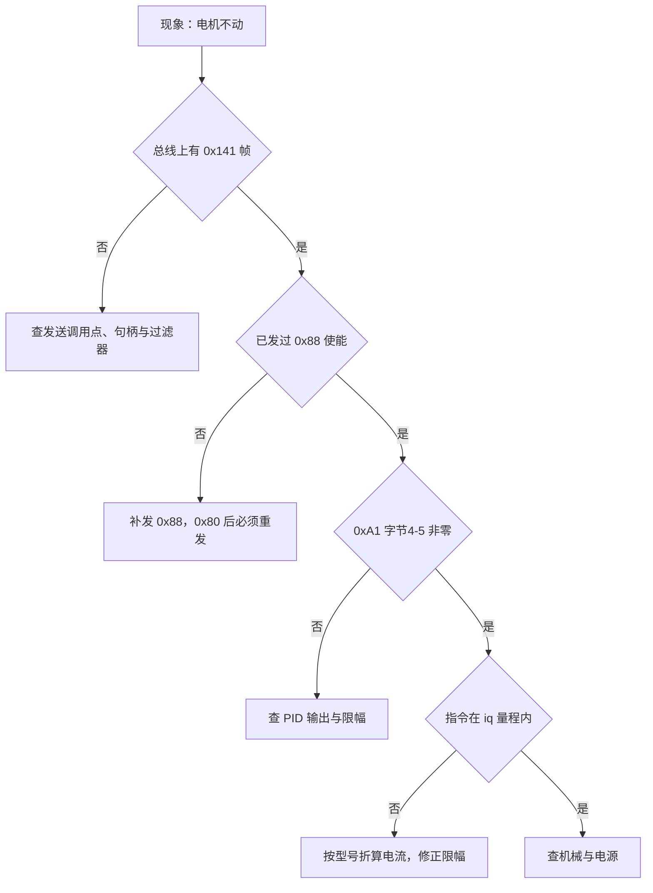
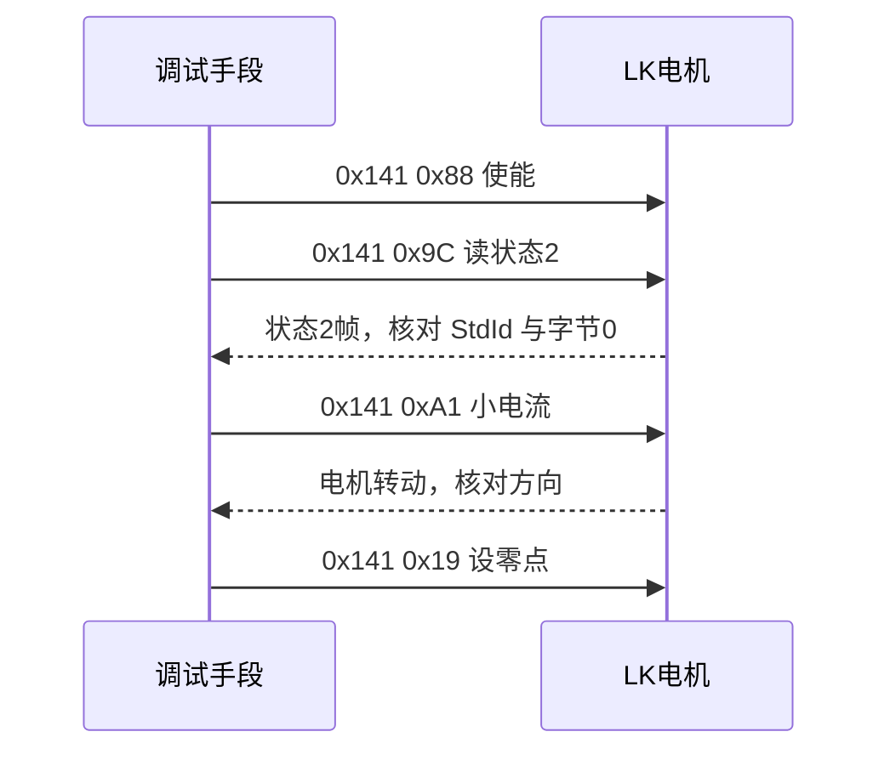

# 易错点与排查

## 1. 概念

排查按从总线到环路的顺序推进：先确认总线上有帧，再确认帧头与命令字，然后确认单位与量程，最后才调环路参数。顺序颠倒会在没有帧的情况下反复改 PID。

## 2. 排查顺序

读取与下发各一轮的调试时序：

## 3. 落到本项目

按现象列出的检查点：

| 现象 | 可能原因 | 检查方法 | 源码位置 |
| --- | --- | --- | --- |
| 电机完全不动 | 没发 0x88，或 0x80 之后没重发使能 | 抓 0x141 帧的字节 0 | `Task/Src/ControlCenterTask.cpp:36` |
| 上电后轴能自由转动 | 没有使能 | 同上 | 同上 |
| 电机响但不转 | 力矩为 0 或 PID 正负抵消 | 抓 0xA1 字节 4-5 | `Task/Src/GimbalTask.cpp:102` |
| `LK_motor_1` 恒为 0 | 反馈分派 ID 与电机实际反馈 ID 不匹配 | 在回调里计数或下断点 | `BSP/Src/bsp_can.cpp:643` |
| 速度差 100 倍 | 命令用 0.01 dps/LSB，反馈用 1 dps/LSB | 对比 0xA2 与反馈速度 | `BSP/Src/bsp_can.cpp:417-420` |
| 位置回不到目标 | 用了 0xA7 增量而不是 0xA3 绝对 | 看命令字 | `BSP/Src/bsp_can.cpp:440` |
| 0x9C 位置与运动反馈不一致 | 两者末两字节语义不同 | 分别读取并对比 | `BSP/Src/bsp_can.cpp:643-671` |
| 收不到任何 LK 帧 | 过滤器、终端电阻或波特率 | 先看总线上是否有 ACK | `BSP/Src/bsp_can.cpp:62-86` |

两条与配置有关的事实。过滤器是全接收：掩码全 0（`BSP/Src/bsp_can.cpp:72-75`），LK 帧能否进入回调只取决于总线上是否真的收到帧，不取决于过滤器。中断优先级方面，CAN1_RX0 与 RX1 抢占优先级为 5（`Core/Src/can.c:125`、`:127`），HAL 时基 TIM2 为 15（`Core/Inc/stm32f4xx_hal_conf.h:151`），FreeRTOS 最低中断优先级也是 15（`Core/Inc/FreeRTOSConfig.h:104`），CAN 中断可以先于后两者执行。

## 4. 易错点

- 先改 PID 再查总线。总线没有帧时任何参数都无意义。
- 只抓发送不看反馈。命令帧正确但反馈分派 ID 写错时，现象与没收到帧一样。
- 把 0x80 当成停止使用。0x80 会清除圈数与上一条命令，恢复控制要重发 0x88。
- 速度命令与反馈单位混用，方向对了数值差 100 倍。
- 力矩指令按 int16 上限限幅，超过电机认可的 iq 量程。

## 5. 小结

| 顺序 | 检查对象 | 通过标准 |
| --- | --- | --- |
| 1 | 总线是否有 0x141 帧 | 周期出现的命令帧 |
| 2 | 字节 0 命令字 | 已发 0x88 使能 |
| 3 | 反馈帧 StdId | 与接收分派一致 |
| 4 | 参数单位与量程 | 换算后落在手册范围内 |
| 5 | 环路参数 | 前四项通过后再调 |

## 6. 练习

1. 写出一段在 FIFO0 回调里统计各 StdId 出现次数的思路，用于确认反馈分派值。
2. 电机上电后能用手转动，列出三个需要确认的发送调用点。
3. 说明过滤器掩码全 0 时，为什么不能靠过滤器排除 DJI 报文。
4. 给定现象“速度指令给正，电机反转”，列出两种可能原因与验证方法。
