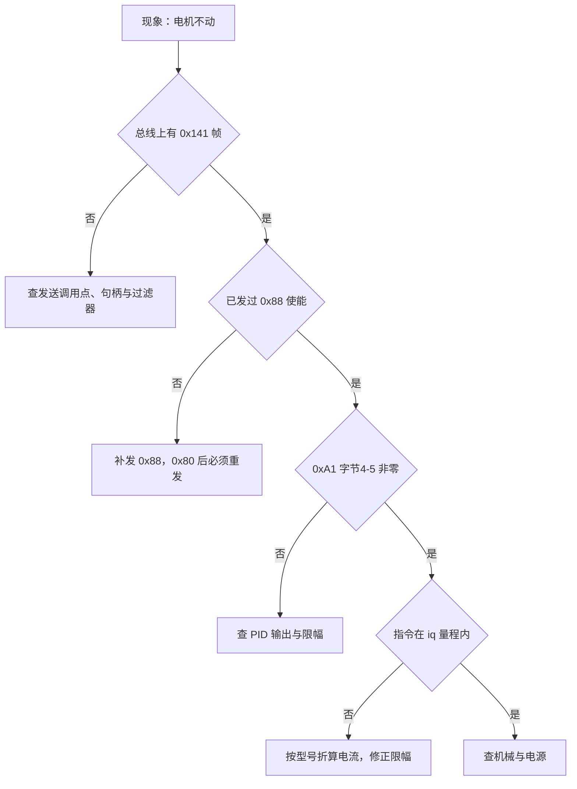
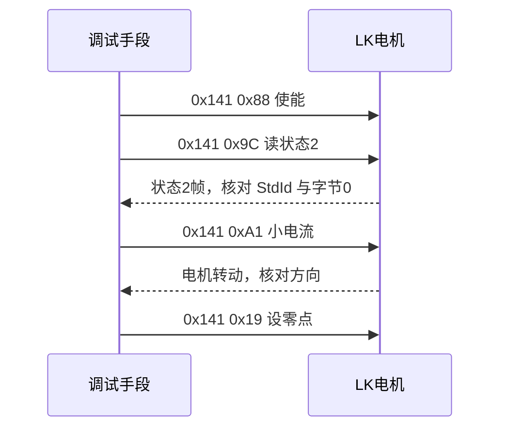
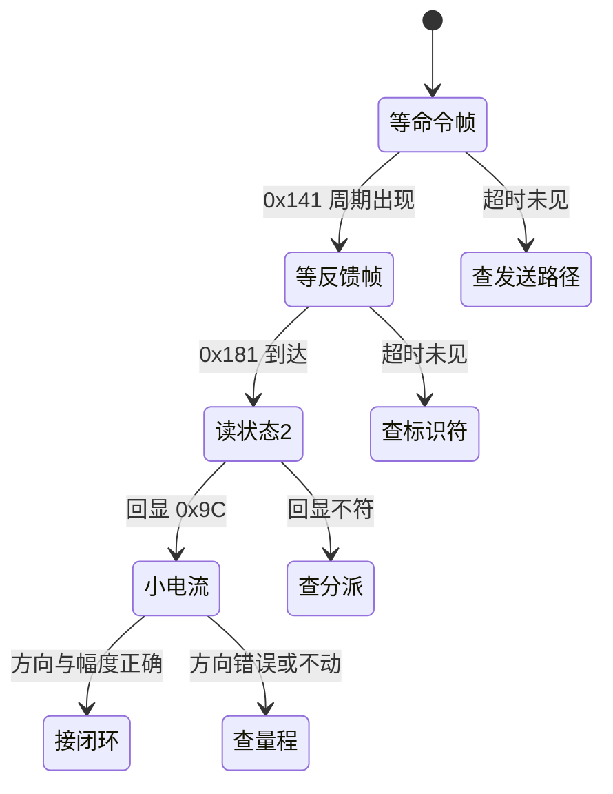

# 易错点与排查

LK 电机的问题表现集中在少数几种：完全不动、响但不转、反馈恒为零、速度数值差一百倍、位置回不到目标。它们的根因分布在不同层次上，有的在总线，有的在命令字，有的在单位换算，有的在环路参数。

排查按从总线到环路的顺序推进：先确认总线上有帧，再确认帧头与命令字，然后确认单位与量程，最后才调环路参数。顺序颠倒会在没有帧的情况下反复改 PID，改完参数也无法解释现象的变化。顺序、每一步的判据，以及两处与配置有关的事实如下。

## 从总线到环路：排查顺序为什么不能颠倒

四个层次的证据来源完全不同。总线层的证据是抓包看到的标识符与数据，命令层的证据是字节 0 的命令字，量纲层的证据是命令与反馈的数值对照，环路层的证据是 PID 输出与限幅。前一层的证据不成立时，后一层的观察值都没有解释力。

一个具体的例子：抓包显示总线上没有 0x141，此时无论 PID 参数怎么改，现象都不会变化，因为电机根本没有收到命令。反过来，如果 0x141 正常发出、0xA1 的字节 4-5 非零，再回去看 PID 才是有意义的。

## 一轮完整的调试时序

时序里有两点要按顺序执行。第一，使能必须在任何运动命令之前；0x80 关机之后电机不再执行运动命令，恢复控制要重新发 0x88。第二，小电流测试应当先于闭环，用一段固定电流确认方向与响应，再接回 PID。

## 按现象列出的检查点

| 现象 | 可能原因 | 检查方法 | 源码位置 |
| --- | --- | --- | --- |
| 电机完全不动 | 没发 0x88，或 0x80 之后没重发使能 | 抓 0x141 帧的字节 0 | `Task/Src/ControlCenterTask.cpp:30` |
| 上电后轴能自由转动 | 没有使能 | 同上 | 同上 |
| 电机响但不转 | 力矩为 0 或 PID 正负抵消 | 抓 0xA1 字节 4-5 | `Task/Src/GimbalTask.cpp:98` |
| `LK_motor_1` 恒为 0 | 反馈分派 ID 与电机实际反馈 ID 不匹配 | 在回调里计数或下断点 | `BSP/Src/bsp_can.cpp:641` |
| 速度差 100 倍 | 命令用 0.01 dps/LSB，反馈用 1 dps/LSB | 对比 0xA2 与反馈速度 | `BSP/Src/bsp_can.cpp:415-418` |
| 位置回不到目标 | 用了 0xA7 增量而不是 0xA3 绝对 | 看命令字 | `BSP/Src/bsp_can.cpp:438` |
| 0x9C 位置与运动反馈不一致 | 两者末两字节语义不同 | 分别读取并对比 | `BSP/Src/bsp_can.cpp:641-671` |
| 收不到任何 LK 帧 | 过滤器、终端电阻或波特率 | 先看总线上是否有 ACK | `BSP/Src/bsp_can.cpp:60-84` |

最后一行是唯一会让人怀疑过滤器的情形。过滤器本身是全接收配置，理论上不会漏帧，所以“收不到任何帧”更可能落在收发器、终端电阻或波特率上，而不是过滤器。

## 过滤器与中断优先级两条配置事实

过滤器是全接收：掩码全 0（`BSP/Src/bsp_can.cpp:70-73`），LK 帧能否进入回调只取决于总线上是否真的收到帧，不取决于过滤器。这意味着不能靠过滤器把 DJI 报文排除在外，分派只能靠回调里的 StdId 判断。

中断优先级方面，CAN1_RX0 与 RX1 抢占优先级为 5（`Core/Src/can.c:125`、`:127`），HAL 时基 TIM2 为 15（`Core/Inc/stm32f4xx_hal_conf.h:151`），FreeRTOS 最低中断优先级也是 15（`Core/Inc/FreeRTOSConfig.h:104`），CAN 中断可以先于后两者执行。

| 项 | 配置 | 出处 | 影响 |
| --- | --- | --- | --- |
| 过滤器掩码 | 全 0，全接收 | `BSP/Src/bsp_can.cpp:70-73` | 所有帧进回调，靠 StdId 分派 |
| CAN1 中断优先级 | 5 | `Core/Src/can.c:125`、`:127` | 可调用 FromISR 接口的边界值 |
| TIM2 时基优先级 | 15 | `Core/Inc/stm32f4xx_hal_conf.h:151` | 低于 CAN 中断 |
| FreeRTOS 最低优先级 | 15 | `Core/Inc/FreeRTOSConfig.h:104` | PendSV 与 SysTick 同档 |

两条配置叠加起来说明：LK 反馈的解析运行在一个比时基更高的优先级上，解析代码执行时间过长会直接推迟 HAL 计时。解析本身只做字节拼接，时间很短，但排查时如果在回调里加打印，就会引入这个副作用。

## 0x9C 与运动反馈的字节对照

两条反馈的布局绝大部分相同，差别只在最后两个字节：

| 字节 | 运动反馈（0xA1 / 0xA2） | 0x9C 状态 2 |
| --- | --- | --- |
| 0 | 命令字回显 | 0x9C |
| 1 | 温度 | 温度 |
| 2 到 3 | iq | iq |
| 4 到 5 | 速度 | 速度 |
| 6 到 7 | 位置 | 编码器值 |

前六个字节可以按同一套偏移解析，最后两个不行。位置是驱动器的多圈或单圈角度，编码器值是编码器的原始读数与零点偏移相关，两者量纲与零点都不同。混用时现象是读数看起来合理但数值对不上，不会立刻暴露，因此核对时要同时打印命令字回显与末两字节。

## 上电自检的四步

把上面的检查点固定成一个开机流程，可以在接闭环之前把层次分开：

| 步骤 | 动作 | 通过判据 | 不通过时先看 |
| --- | --- | --- | --- |
| 1 | 抓 0x141 命令帧 | 每 1 ms 出现一次 | 发送调用点、句柄 |
| 2 | 统计 0x181 到达 | 频率与命令帧相当 | 反馈标识符、物理层 |
| 3 | 发 0x9C 读状态 2 | 字节 0 回显 0x9C | 分派分支、字节序 |
| 4 | 发 0xA1 小电流 | 转子按预期方向转动 | 单位、量程、机械 |

四步都通过之后才接回 PID。这样做的好处是任何一步失败都能立刻定位到某一层，而不需要在参数与总线之间来回猜。

## 抓包与调试器各自适合看什么

| 工具 | 适合观察 | 不适合观察 |
| --- | --- | --- |
| 逻辑分析仪 | 帧是否存在、标识符、字节内容、帧间隔 | 变量取值、任务调度顺序 |
| 调试器断点 | 结构体字段、PID 输出、限幅前后的值 | 帧的到达时刻、偶发丢帧 |
| 中断内计数 | 各 StdId 的到达频率、掉线 | 具体字段的语义 |
| 串口打印 | 时间序列趋势 | 中断上下文内使用会改变实时性 |

四类手段的观察对象互补。只用一个工具排查，很容易把“没有帧”与“有帧但解析错”混为一谈。

## 容易把顺序搞反的几种做法

- 先改 PID 再查总线。总线没有帧时任何参数都无意义。
- 只抓发送不看反馈。命令帧正确但反馈分派 ID 写错时，现象与没收到帧一样。
- 用过滤器去解释丢帧。全接收掩码下，丢帧的根因在物理层或波特率。

其余几项（0x80 的副作用、速度单位差 100 倍、力矩量程）已在上面的检查点表里逐行给出位置与判据，这里不重复。三条共同点是把后一层的现象当成前一层的结论，把检查点固定成表格之后，每次排查只需按行推进。

## 单位与量程的核对表

排查到第四层时，先把命令与反馈的单位并排放一次：

| 量 | 命令单位 | 反馈单位 | 数值倍率 |
| --- | --- | --- | --- |
| 速度 | 0.01 dps/LSB，int32 | 1 dps/LSB，int16 | 100 |
| 位置 | 0.01 °/LSB，int32 | 0.01 °/LSB | 1 |
| 力矩 | iq，MF 为 33/4096 A/LSB，MG 为 66/4096 A/LSB | iq，同一单位 | 按型号为 1 或 2 |
| 限速 | 1 dps/LSB，uint16 | 无对应反馈 | 不适用 |

表里只有速度一行存在倍率差，位置与力矩在命令与反馈之间口径一致。力矩一行的差异来自型号，不是来自报文：同一个 iq 在 MG 系列上对应的电流是 MF 的两倍。

核对完单位之后再看量程。本工程的力矩限幅是 ±30000，参考实现的 iq 量程是 ±2048，两者相差十几倍。判断指令是否落在有效范围，要按后一个数值，而不是按限幅值。

## 小结

### 核心概念

- 排查顺序是 总线帧存在、命令字正确、单位与量程正确、环路参数，前一项不成立时后一项无意义。
- 使能只发一次，0x80 之后必须重发 0x88，否则运动命令不执行。
- 反馈恒为零时优先核对接收分派标识符，而不是电机是否上报。
- 速度命令与反馈单位相差 100 倍，力矩限幅按 int16 设置而不按电机量程。
- 过滤器为全接收，中断优先级 5 是调用边界，两者都不该成为丢帧的第一嫌疑。

### 设计权衡

| 顺序 | 检查对象 | 通过标准 |
| --- | --- | --- |
| 1 | 总线是否有 0x141 帧 | 周期出现的命令帧 |
| 2 | 字节 0 命令字 | 已发 0x88 使能 |
| 3 | 反馈帧 StdId | 与接收分派一致 |
| 4 | 参数单位与量程 | 换算后落在手册范围内 |
| 5 | 环路参数 | 前四项通过后再调 |

## 练习

### 基础题

1. 写出一段在 FIFO0 回调里统计各 StdId 出现次数的思路，用于确认反馈分派值。
2. 电机上电后能用手转动，列出三个需要确认的发送调用点。
3. 说明过滤器掩码全 0 时，为什么不能靠过滤器排除 DJI 报文。
4. 给定现象“速度指令给正，电机反转”，列出两种可能原因与验证方法。

### 挑战题

5. 设计一个自动排查脚本：依次检查 0x141 是否发出、字节 0 是否为 0x88、0xA1 字节 4-5 是否非零，任一项失败即输出对应的层次与下一步动作。
6. 把 CAN1 中断优先级从 5 改成 4，说明会触发哪条断言、现象是什么，并给出恢复步骤。
7. 给定一台完全无反馈的电机，设计一次台架实验把物理层、过滤器与标识符三类原因区分开，说明每一步的判据。

## 附：本页引用的固件路径

| 路径 | 用途 |
| --- | --- |
| `/home/wyx/rm/2026SentriOmeniGimbal/2026OmniSentryGimbal/Task/Src/ControlCenterTask.cpp` | 使能（`Task/Src/ControlCenterTask.cpp:30`）与力矩下发（`Task/Src/ControlCenterTask.cpp:107`） |
| `/home/wyx/rm/2026SentriOmeniGimbal/2026OmniSentryGimbal/Task/Src/GimbalTask.cpp` | pitch 限幅（`Task/Src/GimbalTask.cpp:98`） |
| `/home/wyx/rm/2026SentriOmeniGimbal/2026OmniSentryGimbal/BSP/Src/bsp_can.cpp` | LK 反馈分派（`BSP/Src/bsp_can.cpp:641-671`）、速度命令写入（`BSP/Src/bsp_can.cpp:415-418`）、增量位置命令字（`BSP/Src/bsp_can.cpp:438`）、过滤器（`BSP/Src/bsp_can.cpp:60-84`，掩码 `BSP/Src/bsp_can.cpp:70-73`） |
| `/home/wyx/rm/2026SentriOmeniGimbal/2026OmniSentryGimbal/Core/Src/can.c` | CAN1_RX0 与 RX1 中断优先级（`Core/Src/can.c:125-128`） |
| `/home/wyx/rm/2026SentriOmeniGimbal/2026OmniSentryGimbal/Core/Inc/FreeRTOSConfig.h` | 中断优先级常量（`Core/Inc/FreeRTOSConfig.h:104`） |
| `/home/wyx/rm/2026SentriOmeniGimbal/2026OmniSentryGimbal/Core/Inc/stm32f4xx_hal_conf.h` | TIM2 时基优先级（`Core/Inc/stm32f4xx_hal_conf.h:151`） |
