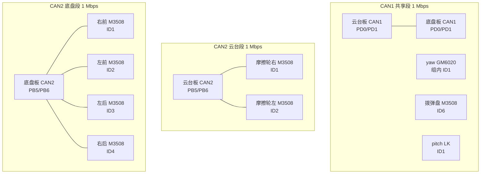
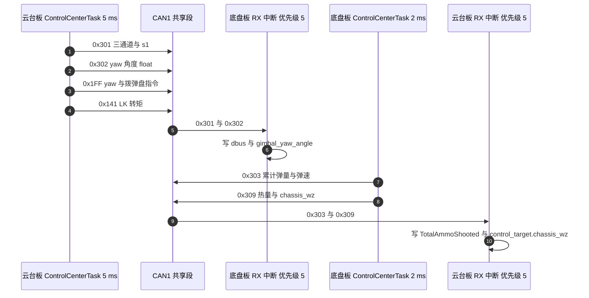

# 上下板 CAN 拓扑

哨兵的主控由两块 STM32F407 板组成：云台板 `2026OmniSentryGimbal` 与底盘板 `2026OmniSentryChassis`。两块板各有一路 CAN1 与一路 CAN2，共四个 bxCAN 控制器，物理上却只有三段总线。云台板 CAN1 与底盘板 CAN1 用导线连成一段，yaw 电机、拨弹盘电机与 pitch 电机也挂在这一段上；每块板的 CAN2 各自独立，只带自己一侧的电机。本文给出每段的节点清单、引脚与中断配置，以及帧在两块板之间的走向。

> 云台板源码根目录 `/home/wyx/rm/2026SentriOmeniGimbal/2026OmniSentryGimbal`，底盘板 `/home/wyx/rm/2026SentriOmeniChassis/2026OmniSentryChassis`。下文相对路径都相对于这两个根目录。

## 1. 概念：两条总线，三段物理段

两块板的 CAN1 引脚都配置在 PD0 与 PD1，复用功能 AF9；CAN2 引脚都配置在 PB5 与 PB6（云台板 `Core/Src/can.c:112-122`、`:145-155`，底盘板同名文件同段行号）。引脚固定之后，拓扑由接线决定，不由软件决定。

三段总线的划分：

| 物理段 | 参与的板 | 挂载的执行器 | 是否共享 |
| --- | --- | --- | --- |
| CAN1 | 云台板与底盘板 | yaw、拨弹盘、pitch | 是，两块板与三个执行器同段 |
| CAN2 云台段 | 云台板 | 两个摩擦轮 | 否 |
| CAN2 底盘段 | 底盘板 | 四个轮子 | 否 |

共享带来的直接后果：CAN1 上的标识符由全部参与者共同使用，负载率也要按整段核算。两条 CAN2 之间没有任何电气连接，同一个标识符在两段上各用一次不会冲突。

## 2. 机制：一帧从任务到总线，再从总线回到结构体

发送侧的函数按总线分成两组，`BSP_CAN1_*` 一组走向 `hcan1`，`BSP_CAN2_*` 一组走向 `hcan2`。两组函数的帧头与数据填充写法相同，最后一步都调用 `HAL_CAN_AddTxMessage`，区别只在传入的句柄（云台板 `BSP/Src/bsp_can.cpp:112` 与 `:164`，底盘板同文件 `:107` 与 `:159`）。

接收侧的入口是 FIFO0 中断，回调函数用 `hcan->Instance` 区分两条总线（云台板 `BSP/Src/bsp_can.cpp:595` 与 `:617`，底盘板 `:588` 与 `:624`），再按 `RxHeader.StdId` 分发到各个电机结构体。中断优先级两块板都取 5（云台板 `Core/Src/can.c:125-128`、`:158-161`，底盘板同段行号），HAL 时基 TIM2 的中断优先级取 15（`Core/Inc/stm32f4xx_hal_conf.h:151`），FreeRTOS 的 PendSV 取 15（`Core/Inc/FreeRTOSConfig.h:104` 与 `:114`）。数值越小优先级越高，因此 CAN 接收中断可以打断时基中断与任务切换。

各任务的发送节奏由 `osDelay` 决定，FreeRTOS 的节拍为 1000 Hz（`Core/Inc/FreeRTOSConfig.h:64`），所以延时实参的单位是毫秒：

| 任务 | 周期 | 发出内容 | 源码 |
| --- | --- | --- | --- |
| 云台板 `StartControlCenterTask` | 5 ms | 0x200、0x1FF、0x141、0x301、0x302 | `Task/Src/ControlCenterTask.cpp:132-137` |
| 云台板 `StartGimbalTask` | 1 ms | 0x141 读状态2 | `Task/Src/GimbalTask.cpp:87`、`:104` |
| 底盘板 `StartControlCenterTask` | 2 ms | 0x200、0x303、0x309 | `Task/Src/ControlCenterTask.cpp:150-154` |

## 3. 落到本项目

### 3.1 CAN1 共享段

| 节点 | 发出的帧 | 帧头与方向 | 周期 | 源码 |
| --- | --- | --- | --- | --- |
| 云台板 | yaw 与拨弹盘控制 | 0x1FF 下行 | 5 ms | 云台板 `ControlCenterTask.cpp:133` |
| 云台板 | LK pitch 转矩 | 0x141 下行 | 5 ms | `:134` |
| 云台板 | LK 读状态2 | 0x141 下行 | 1 ms | 云台板 `GimbalTask.cpp:87` |
| 云台板 | 遥控器数据 | 0x301 下行 | 5 ms | `ControlCenterTask.cpp:135` |
| 云台板 | yaw 角度 | 0x302 下行 | 5 ms | `:136` |
| 底盘板 | 累计弹量与弹速 | 0x303 上行 | 2 ms | 底盘板 `ControlCenterTask.cpp:152` |
| 底盘板 | 热量与底盘 wz | 0x309 上行 | 2 ms | `:153` |
| yaw 电机 | 转子反馈 | 0x205 上行 | 规格 1 ms | 云台板 `bsp_can.cpp:631` |
| 拨弹盘电机 | 转子反馈 | 0x206 上行 | 规格 1 ms | `:620` |
| pitch 电机 | 状态反馈 | 0x181 上行 | 每条命令一帧 | `:643` |

两块板都解析 0x205：云台板把它写入 `motor_5`（`bsp_can.cpp:631-640`），底盘板写入 `yaw_motor_5`（`bsp_can.cpp:629-638`），后者用于底盘跟随的转角换算（底盘板 `ControlCenterTask.cpp:100-101`）。同一帧被两个节点各自接收是共享总线的正常行为。

### 3.2 两条 CAN2

| 段落 | 执行器 | 控制帧头与槽位 | 反馈帧头 | 源码 |
| --- | --- | --- | --- | --- |
| 云台段 | 摩擦轮右 ID1 | 0x200 槽位0 | 0x201 | 云台板 `bsp_can.cpp:599-606` |
| 云台段 | 摩擦轮左 ID2 | 0x200 槽位1 | 0x202 | `:607-613` |
| 底盘段 | 右前 ID1 | 0x200 槽位0 | 0x201 | 底盘板 `bsp_can.cpp:592-599` |
| 底盘段 | 左前 ID2 | 0x200 槽位1 | 0x202 | `:600-606` |
| 底盘段 | 左后 ID3 | 0x200 槽位2 | 0x203 | `:607-613` |
| 底盘段 | 右后 ID4 | 0x200 槽位3 | 0x204 | `:614-620` |

云台段两个摩擦轮的槽位分配见云台板 `ControlCenterTask.cpp:132`，底盘段四个轮子的顺序见底盘板 `ControlCenterTask.cpp:80-83` 的注释与 `:150` 的调用。

### 3.3 板间报文

板间通信复用 CAN1，共四条在用的报文与两条只有接收分支的报文：

| 帧 | 方向 | 载荷 | 发送点 | 接收点 |
| --- | --- | --- | --- | --- |
| 0x301 | 云台板到底盘板 | X、Y、Z 通道与 s1 | `ControlCenterTask.cpp:135` | 底盘板 `bsp_can.cpp:640-645` |
| 0x302 | 云台板到底盘板 | yaw 角度，1 个 float | `:136` | 底盘板 `:646-664` |
| 0x303 | 底盘板到云台板 | 累计弹量与弹速 | 底盘板 `ControlCenterTask.cpp:152` | 云台板 `bsp_can.cpp:675-683` |
| 0x309 | 底盘板到云台板 | 17 mm 热量与底盘 wz | `:153` | 云台板 `:685-692` |
| 0x401 | 无发送点 | 底盘 IMU 三轴角度 | 两棵树都没有发送函数 | 云台板 `:694-705`、底盘板 `:668-679` |
| 0x501 | 无发送点 | 底盘旋转量 | 两棵树都没有发送函数 | 云台板 `:707-710`、底盘板 `:681-684` |

0x309 携带的底盘 wz 回到云台板后被用作 yaw 电流的前馈（云台板 `ControlCenterTask.cpp:131`），这是两板控制闭环之间唯一的一处前馈通道。

## 4. 易错点

| # | 易错点 | 表现 | 依据 |
| --- | --- | --- | --- |
| 1 | 认为两块板的 CAN2 也互连 | 按共享总线去规划两条 CAN2 的标识符，白做冲突规避 | 两块板各有独立收发器，`can.c` 中 CAN2 只配 PB5/PB6 |
| 2 | 认为 CAN1 上只有本板发出的帧 | 负载率与冲突分析只算一侧，结果偏低 | 接收回调里出现对端板的帧，如底盘板解析 0x205 与 0x301 |
| 3 | 按 `项目概述.md` 的接线文字判断总线 | 接线的描述与源码的函数句柄可能不一致 | 以 `bsp_can` 各函数末尾传入的句柄为准，见第 2 节 |
| 4 | 把 0x401 与 0x501 当成在用报文 | 排查时去追一条没有发送点的帧 | 两棵树的发送函数清单里没有这两个帧头 |
| 5 | 忽略 CAN 中断优先级与任务优先级的差别 | 以为回调会被任务调度延迟很久 | 回调优先级 5，高于 TIM2 与 PendSV 的 15 |
| 6 | 把 1 ms 的 `GimbalTask` 循环当成只有 PID 计算 | 漏掉它在 CAN1 上产生的 0x141 读状态2 帧 | `GimbalTask.cpp:87` 在循环体内，`:104` 是 `osDelay(1)` |

## 5. 小结

### 核心概念

- 四个 bxCAN 控制器对应三段总线：CAN1 是两块板与 yaw、拨弹盘、pitch 共享的一段；两条 CAN2 各自独立。
- CAN1 与 CAN2 的引脚固定为 PD0/PD1 与 PB5/PB6，AF9，两块板相同。
- CAN 接收中断优先级为 5，HAL 时基 TIM2 与 PendSV 为 15，接收中断可以抢占时基与任务切换。
- 板间在用报文四条：0x301、0x302 由云台板发往底盘板，0x303、0x309 反向。0x401 与 0x501 只有接收分支。
- 0x205 由 yaw 电机发出，两块板都在解析。
- 任务周期为底盘板 2 ms、云台板控制 5 ms、云台 PID 1 ms，它们决定 CAN1 与各段 CAN2 上的命令帧率。

### 设计权衡

| 权衡点 | 本工程的选择 | 代价与收益 |
| --- | --- | --- |
| 板间连接 | 用 CAN1 把两块板连成一段 | 省一对收发器与线束；代价是两块板共享标识符空间与带宽 |
| 板间数据 | 复用 CAN1 而不是另开一路串口 | 与电机帧共用链路，接线简单；代价是板间流量计入 CAN1 负载 |
| 参数同步 | 板间传 yaw 角度与底盘 wz | 底盘跟随与 yaw 前馈成立；代价是两块板的时序被 CAN1 时延耦合 |
| 未用帧头 | 保留 0x401 与 0x501 的接收分支 | 便于以后再接；代价是阅读时容易误判为在用路径 |

## 6. 练习

### 基础题

1. 写出 CAN1 共享段上的全部节点，并说明底盘板为什么能读到 yaw 电机的反馈帧。
2. 两块板的 CAN2 上都有 ID1 与 ID2 的 M3508，说明这不构成标识符冲突的原因。
3. 查 `Core/Src/can.c` 的 `HAL_CAN_MspInit`，写出 CAN1 与 CAN2 的 GPIO 端口、引脚号与复用编号。

### 挑战题

4. 0x301 只装了 X、Y、Z 三个通道与 s1，底盘板的遥控器通道 ch[0] 与 ch[1] 从哪来？给出结论与源码依据。
5. 若在 CAN1 共享段上新增一台 M3508，它的控制帧头应当选 0x200、0x1FF 还是 0x2FF？说明理由并列出该段上已经被占用的反馈标识符。
6. 设计一张上电自检表：只靠两块板各自的接收回调计数，判断 CAN1 的哪一段接线（云台板到总线、底盘板到总线）断开。写出用到的帧与判据。

---

### 附：本页引用的固件路径

| 路径 | 用途 |
| --- | --- |
| `/home/wyx/rm/2026SentriOmeniGimbal/2026OmniSentryGimbal/Core/Src/can.c` | CAN1 与 CAN2 引脚（:112-122、:145-155）、中断优先级（:125-128、:158-161） |
| `/home/wyx/rm/2026SentriOmeniGimbal/2026OmniSentryGimbal/BSP/Src/bsp_can.cpp` | 发送函数按句柄分组（:89-239）、接收回调（:590-715） |
| `/home/wyx/rm/2026SentriOmeniGimbal/2026OmniSentryGimbal/Task/Src/ControlCenterTask.cpp` | 云台板发送点（:132-137）、wz 前馈（:131） |
| `/home/wyx/rm/2026SentriOmeniGimbal/2026OmniSentryGimbal/Task/Src/GimbalTask.cpp` | LK 读状态2 的 1 ms 循环（:87、:104） |
| `/home/wyx/rm/2026SentriOmeniGimbal/2026OmniSentryGimbal/Core/Inc/FreeRTOSConfig.h` | 节拍 1000 Hz（:64）、PendSV 优先级（:104、:114） |
| `/home/wyx/rm/2026SentriOmeniGimbal/2026OmniSentryGimbal/Core/Inc/stm32f4xx_hal_conf.h` | 时基中断优先级 15（:151） |
| `/home/wyx/rm/2026SentriOmeniChassis/2026OmniSentryChassis/BSP/Src/bsp_can.cpp` | 底盘板发送函数（:83-211）、接收回调（:583-689） |
| `/home/wyx/rm/2026SentriOmeniChassis/2026OmniSentryChassis/Task/Src/ControlCenterTask.cpp` | 底盘板发送点（:150-154）、轮序注释（:80-83）、跟随换算（:100-101） |
| `/home/wyx/rm/2026SentriOmeniChassis/2026OmniSentryChassis/项目概述.md` | 接线与帧头的文字描述（:11-14） |
