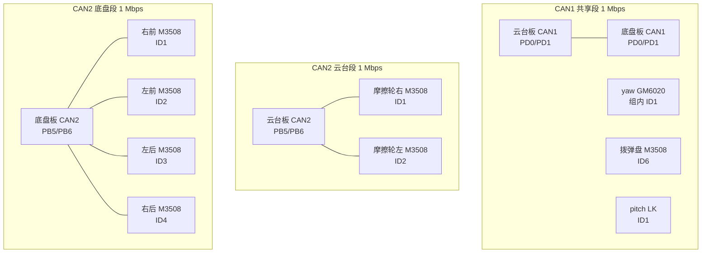
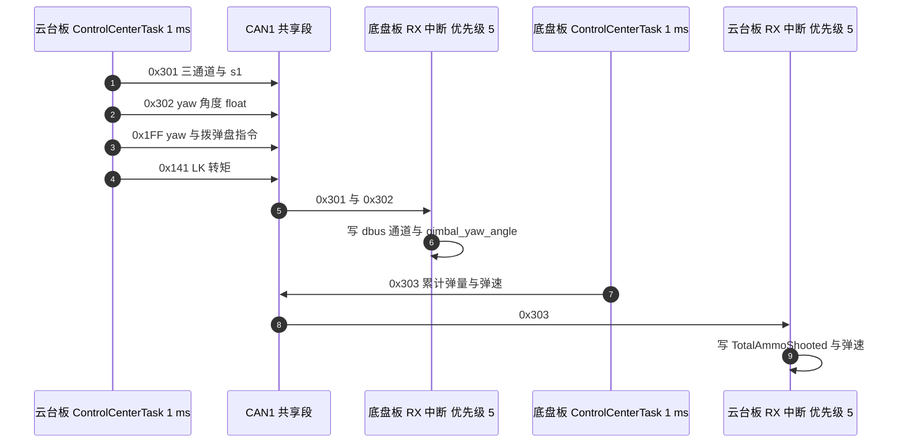

# 上下板 CAN 拓扑

哨兵的主控由两块 STM32F407 板组成：云台板 `2026OmniSentryGimbal` 与底盘板 `2026OmniSentryChassis`。两块板各有一路 CAN1 与一路 CAN2，共四个 bxCAN 控制器（bxCAN 是 STM32 内置的 CAN 外设），物理上却只有三段总线。云台板 CAN1 与底盘板 CAN1 用导线连成一段，yaw 电机、拨弹盘电机与 pitch 电机也挂在这一段上；每块板的 CAN2 各自独立，只带自己一侧的电机。

拓扑由接线决定，软件改不了接法。软件能决定的只有引脚复用、位定时、过滤器与标识符分派。理解这一点之后，很多看起来像“两块板互不通信”的问题会落到线束与终端电阻上，而不是回到代码里找。

下面列出每段的节点清单、引脚与中断配置，以及帧在两块板之间的走向。读完后应当能回答：为什么底盘板能读到 yaw 电机的反馈、为什么两条 CAN2 上的同名 ID 不冲突、以及板间报文占用的是哪一段总线。

> 云台板源码根目录 `/home/wyx/rm/2026SentriOmeniGimbal/2026OmniSentryGimbal`，底盘板 `/home/wyx/rm/2026SentriOmeniChassis/2026OmniSentryChassis`。下文相对路径都相对于这两个根目录。

## 四个控制器怎么连成三段总线

两块板的 CAN1 引脚都配置在 PD0 与 PD1，复用功能 AF9；CAN2 引脚都配置在 PB5 与 PB6（云台板与底盘板同名的 `Core/Src/can.c`）。引脚固定之后，拓扑由接线决定，不由软件决定。

| 物理段 | 参与的板 | 挂载的执行器 | 是否共享 |
| --- | --- | --- | --- |
| CAN1 | 云台板与底盘板 | yaw、拨弹盘、pitch | 是，两块板与三个执行器同段 |
| CAN2 云台段 | 云台板 | 两个摩擦轮 | 否 |
| CAN2 底盘段 | 底盘板 | 四个轮子 | 否 |

共享带来的直接后果：CAN1 上的标识符由全部参与者共同使用，负载率也要按整段核算。两条 CAN2 之间没有任何电气连接，同一个标识符在两段上各用一次不会冲突。



图中三段总线的位速率都是 1 Mbps，这一数值由电机侧固定，两块板没有调整空间。总线长度不足一米、节点数不超过 10，属于短距离多节点的布置。

## 从任务到总线：发送函数按句柄分组

发送侧的函数按总线分成两组，`BSP_CAN1_*` 一组走向 `hcan1`，`BSP_CAN2_*` 一组走向 `hcan2`。两组函数的帧头与数据填充写法相同，最后一步都调用 `HAL_CAN_AddTxMessage`，区别只在传入的句柄（云台板 `BSP/Src/bsp_can.cpp` 与 `BSP/Src/bsp_can.cpp`，底盘板同文件 `BSP/Src/bsp_can.cpp` 与 `BSP/Src/bsp_can.cpp`）。

接收侧的入口是 FIFO0 中断，回调函数用 `hcan->Instance` 区分两条总线（云台板 `BSP/Src/bsp_can.cpp` 与 `BSP/Src/bsp_can.cpp`，底盘板 `BSP/Src/bsp_can.cpp` 与 `BSP/Src/bsp_can.cpp`），再按 `RxHeader.StdId` 分发到各个电机结构体。两级分派的写法如下，先选总线再选标识符，可以避免两条总线上的同名 ID 互相覆盖：

```cpp
/* 简化：发送侧按句柄分组，接收侧先按控制器再按标识符分派 */
void BSP_CAN1_Send(uint16_t stdId, uint8_t *data) {
    HAL_CAN_AddTxMessage(&hcan1, &txHeader, data, &mailbox);
}
void BSP_CAN2_Send(uint16_t stdId, uint8_t *data) {
    HAL_CAN_AddTxMessage(&hcan2, &txHeader, data, &mailbox);
}

if (hcan->Instance == CAN1) {       /* 共享段：两板与三个执行器 */
    switch (RxHeader.StdId) { case 0x205: /* yaw 反馈 */ break; }
} else {                            /* 本板独占的 CAN2 段 */
    switch (RxHeader.StdId) { case 0x201: /* 本板轮子 */ break; }
}
```

中断优先级两块板都取 5（云台板 `Core/Src/can.c`，底盘板同名文件），HAL 时基 TIM2 的中断优先级取 15（`Core/Inc/stm32f4xx_hal_conf.h`），FreeRTOS 的 PendSV 取 15（`Core/Inc/FreeRTOSConfig.h`）。数值越小优先级越高，因此 CAN 接收中断可以打断时基中断与任务切换。

各任务的发送节奏由 `osDelay` 决定，FreeRTOS 的节拍为 1000 Hz（`Core/Inc/FreeRTOSConfig.h`），所以延时实参的单位是毫秒：

| 任务 | 周期 | 发出内容 | 源码 |
| --- | --- | --- | --- |
| 云台板 `StartControlCenterTask` | 1 ms | 0x200（CAN2）、0x1FF、0x141 转矩、0x301、0x302 | `Task/Src/ControlCenterTask.cpp` |
| 云台板 `StartGimbalTask` | 2 ms | 0x141 读状态2 | `Task/Src/GimbalTask.cpp`、`Task/Src/GimbalTask.cpp` |
| 底盘板 `StartControlCenterTask` | 1 ms | 0x200（CAN2）、0x303 | 底盘板 `Task/Src/ControlCenterTask.cpp` |

云台板的控制中心任务在 1 ms 循环里发五帧，其中四帧落在 CAN1 上；底盘板的同任务在 1 ms 循环里发两帧，一帧落在 CAN2、一帧落在 CAN1。底盘板的 `osDelay(100)`（`Task/Src/ControlCenterTask.cpp`）只是进入循环前的等待，不参与周期。

## CAN1 共享段上的节点与帧

| 节点 | 发出的帧 | 帧头与方向 | 周期 | 源码 |
| --- | --- | --- | --- | --- |
| 云台板 | yaw 与拨弹盘控制 | 0x1FF 下行 | 1 ms | 云台板 `Task/Src/ControlCenterTask.cpp` |
| 云台板 | LK pitch 转矩 | 0x141 下行 | 1 ms | `Task/Src/ControlCenterTask.cpp` |
| 云台板 | LK 读状态2 | 0x141 下行 | 2 ms | 云台板 `Task/Src/GimbalTask.cpp` |
| 云台板 | 遥控器通道 | 0x301 下行 | 1 ms | `Task/Src/ControlCenterTask.cpp` |
| 云台板 | yaw 角度 | 0x302 下行 | 1 ms | `Task/Src/ControlCenterTask.cpp` |
| 底盘板 | 累计弹量与弹速 | 0x303 上行 | 1 ms | 底盘板 `Task/Src/ControlCenterTask.cpp` |
| yaw 电机 | 转子反馈 | 0x205 上行 | 规格 1 ms | 云台板 `BSP/Src/bsp_can.cpp` |
| 拨弹盘电机 | 转子反馈 | 0x206 上行 | 规格 1 ms | `BSP/Src/bsp_can.cpp` |
| pitch 电机 | 状态反馈 | 0x181 上行 | 由驱动器应答策略决定，待实测 | `BSP/Src/bsp_can.cpp`（case 行在 641） |

两块板都解析 0x205：云台板把它写入 `motor_5`（`BSP/Src/bsp_can.cpp`），底盘板写入 `yaw_motor_5`（底盘板 `BSP/Src/bsp_can.cpp`），后者用于底盘跟随的转角换算（底盘板 `Task/Src/ControlCenterTask.cpp`）。同一帧被两个节点各自接收是共享总线的正常行为，两块板的解析互不影响。

0x309 在两棵树里都没有出现：底盘板只发 0x303（`BSP/Src/bsp_can.cpp`），云台板回调里也没有 0x309 的 case。因此底盘 wz 没有回到云台板，云台板的 `control_target.chassis_wz` 只在 `Task/Src/ControlCenterTask.cpp` 初始化为 0，0x1FF 发送直接取 `yaw_current_out`。

## 两条 CAN2 各带自己的执行器

| 段落 | 执行器 | 控制帧头与槽位 | 反馈帧头 | 源码 |
| --- | --- | --- | --- | --- |
| 云台段 | 摩擦轮右 ID1 | 0x200 槽位1 | 0x201 | 云台板 `BSP/Src/bsp_can.cpp` |
| 云台段 | 摩擦轮左 ID2 | 0x200 槽位2 | 0x202 | `BSP/Src/bsp_can.cpp` |
| 底盘段 | 右前 ID1 | 0x200 槽位1 | 0x201 | 底盘板 `BSP/Src/bsp_can.cpp` |
| 底盘段 | 左前 ID2 | 0x200 槽位2 | 0x202 | `BSP/Src/bsp_can.cpp` |
| 底盘段 | 左后 ID3 | 0x200 槽位3 | 0x203 | `BSP/Src/bsp_can.cpp` |
| 底盘段 | 右后 ID4 | 0x200 槽位4 | 0x204 | `BSP/Src/bsp_can.cpp` |

云台段两个摩擦轮的槽位分配见云台板 `Task/Src/ControlCenterTask.cpp`，底盘段四个轮子的顺序见底盘板 `Task/Src/ControlCenterTask.cpp` 的注释与 `Task/Src/ControlCenterTask.cpp` 的调用。两段的控制帧头相同、周期也相同，都是 1 ms。

## 板间三条报文与两条只有接收分支的帧

板间通信复用 CAN1，共三条在用的报文与两条只有接收分支的报文：

| 帧 | 方向 | 载荷 | 发送点 | 接收点 |
| --- | --- | --- | --- | --- |
| 0x301 | 云台板到底盘板 | X、Y、Z 通道与 s1 | 云台板 `Task/Src/ControlCenterTask.cpp` | 底盘板 `BSP/Src/bsp_can.cpp` |
| 0x302 | 云台板到底盘板 | yaw 角度，1 个 float | `Task/Src/ControlCenterTask.cpp` | 底盘板 `BSP/Src/bsp_can.cpp` |
| 0x303 | 底盘板到云台板 | 累计弹量与弹速 | 底盘板 `Task/Src/ControlCenterTask.cpp` | 云台板 `BSP/Src/bsp_can.cpp` |
| 0x401 | 无发送点 | 底盘 IMU 三轴角度 | 两棵树都没有发送函数 | 云台板 `BSP/Src/bsp_can.cpp`、底盘板 `BSP/Src/bsp_can.cpp` |
| 0x501 | 无发送点 | 底盘旋转量 | 两棵树都没有发送函数 | 云台板 `BSP/Src/bsp_can.cpp`、底盘板 `BSP/Src/bsp_can.cpp` |

0x309 在两棵树的收发代码里都没有出现：云台板回调的 case 只有 0x201、0x202、0x205、0x206、0x181、0x303、0x401、0x501（`BSP/Src/bsp_can.cpp`），底盘板也没有对应的发送函数。因此不存在「底盘 wz 回到云台板做 yaw 前馈」这条通道。

底盘板的 0x301 分支没有 `break`，会继续执行 0x302 的解析体（底盘板 `BSP/Src/bsp_can.cpp`）。这意味着每收到一帧 0x301，`gimbal_yaw_angle` 也会被这帧的前四字节覆盖一次；两条帧都以 1 ms 到达，该变量在两次到达之间交替为错误值与正确值。底盘跟随换算读取它（`Task/Src/ControlCenterTask.cpp`），现场若出现跟随角度抖动，这是一个可查的落点。该缺陷只影响取值，不影响帧清单与负载核算。



## 常见判断偏差

| # | 判断偏差 | 表现 | 依据 |
| --- | --- | --- | --- |
| 1 | 认为两块板的 CAN2 也互连 | 按共享总线去规划两条 CAN2 的标识符，白做冲突规避 | 两块板各有独立收发器，`can.c` 中 CAN2 只配 PB5/PB6 |
| 2 | 认为 CAN1 上只有本板发出的帧 | 负载率与冲突分析只算一侧，结果偏低 | 接收回调里出现对端板的帧，如底盘板解析 0x205 与 0x301 |
| 3 | 按 `项目概述.md` 的接线文字判断总线 | 接线的描述与源码的函数句柄可能不一致 | 以 `bsp_can` 各函数末尾传入的句柄为准 |
| 4 | 把 0x401 与 0x501 当成在用报文 | 排查时去追一条没有发送点的帧 | 两棵树的发送函数清单里没有这两个帧头 |
| 5 | 忽略 CAN 中断优先级与任务优先级的差别 | 以为回调会被任务调度延迟很久 | 回调优先级 5，高于 TIM2 与 PendSV 的 15 |
| 6 | 把云台板控制周期当成 5 ms | 负载率与帧率被严重低估 | `Task/Src/ControlCenterTask.cpp` 是 `osDelay(1)` |
| 7 | 认为段内节点数不影响负载 | 新增一台电机后帧率上限下降 | 三段总线必须分别核算占用，见第 4 篇 |
| 8 | 把 0x301 与 0x302 当成完全独立的两个分支 | 忽略 0x301 会落入 0x302 的解析体 | 底盘板 `BSP/Src/bsp_can.cpp` 缺 `break` |

## 小结

### 核心概念

- 四个 bxCAN 控制器对应三段总线：CAN1 是两块板与 yaw、拨弹盘、pitch 共享的一段；两条 CAN2 各自独立。
- CAN1 与 CAN2 的引脚固定为 PD0/PD1 与 PB5/PB6，AF9，两块板相同。
- CAN 接收中断优先级为 5，HAL 时基 TIM2 与 PendSV 为 15，接收中断可以抢占时基与任务切换。
- 板间在用报文三条：0x301、0x302 由云台板发往底盘板，0x303 反向；0x401 与 0x501 只有接收分支，0x309 不存在。
- 0x205 由 yaw 电机发出，两块板都在解析。
- 任务周期为云台板控制 1 ms、底盘板控制 1 ms、云台 PID 2 ms，它们决定三段总线上的命令帧率。

### 设计权衡

| 权衡点 | 本工程的选择 | 代价与收益 |
| --- | --- | --- |
| 板间连接 | 用 CAN1 把两块板连成一段 | 省一对收发器与线束；代价是两块板共享标识符空间与带宽 |
| 板间数据 | 复用 CAN1 而不是另开一路串口 | 与电机帧共用链路，接线简单；代价是板间流量计入 CAN1 负载 |
| 参数同步 | 板间只正向传 yaw 角度与遥控通道 | 底盘跟随成立；代价是云台侧拿不到底盘 wz，缺少反向参数 |
| 未用帧头 | 保留 0x401 与 0x501 的接收分支 | 便于以后再接；代价是阅读时容易误判为在用路径 |

## 练习

### 基础题

1. 写出 CAN1 共享段上的全部节点，并说明底盘板为什么能读到 yaw 电机的反馈帧。
2. 两块板的 CAN2 上都有 ID1 与 ID2 的 M3508，说明这不构成标识符冲突的原因。
3. 查 `Core/Src/can.c` 的 `HAL_CAN_MspInit`，写出 CAN1 与 CAN2 的 GPIO 端口、引脚号与复用编号。
4. 说明 CAN 接收中断优先级 5 与 PendSV 优先级 15 之间，谁可以打断谁。

### 挑战题

5. 0x301 只装了 X、Y、Z 三个通道与 s1，底盘板的遥控器通道 ch[0] 与 ch[1] 从哪来？给出结论与源码依据。
6. 若在 CAN1 共享段上新增一台 M3508，它的控制帧头应当选 0x200、0x1FF 还是 0x2FF？说明理由并列出该段上已经被占用的反馈标识符。
7. 设计一张上电自检表：只靠两块板各自的接收回调计数，判断 CAN1 的哪一段接线（云台板到总线、底盘板到总线）断开。写出用到的帧与判据。
8. 给底盘板的 0x301 分支补上 `break`，说明这一处改动会影响哪些变量与哪些下游计算，并写出验证方法。

## 附：本页引用的固件路径

| 路径 | 用途 |
| --- | --- |
| `Core/Src/can.c` | CAN1 与 CAN2 引脚（`Core/Src/can.c`、`Core/Src/can.c`）、中断优先级（`Core/Src/can.c`、`Core/Src/can.c`） |
| `BSP/Src/bsp_can.cpp` | 发送函数按句柄分组（`BSP/Src/bsp_can.cpp`）、接收回调（`BSP/Src/bsp_can.cpp`） |
| `Task/Src/ControlCenterTask.cpp` | 云台板发送点与 1 ms 周期（`Task/Src/ControlCenterTask.cpp`） |
| `Task/Src/GimbalTask.cpp` | LK 读状态2 的 2 ms 循环（`Task/Src/GimbalTask.cpp`、`Task/Src/GimbalTask.cpp`） |
| `Core/Inc/FreeRTOSConfig.h` | 节拍 1000 Hz（`Core/Inc/FreeRTOSConfig.h`）、PendSV 优先级（`Core/Inc/FreeRTOSConfig.h`、`Core/Inc/FreeRTOSConfig.h`） |
| `Core/Inc/stm32f4xx_hal_conf.h` | 时基中断优先级 15（`Core/Inc/stm32f4xx_hal_conf.h`） |
| `底盘板 BSP/Src/bsp_can.cpp` | 底盘板发送函数、接收回调与 0x301 分支（`BSP/Src/bsp_can.cpp`、`BSP/Src/bsp_can.cpp`、`BSP/Src/bsp_can.cpp`） |
| `底盘板 Task/Src/ControlCenterTask.cpp` | 底盘板发送点与 1 ms 周期（`Task/Src/ControlCenterTask.cpp`）、轮序注释（`Task/Src/ControlCenterTask.cpp`）、跟随换算（`Task/Src/ControlCenterTask.cpp`） |
| `底盘板 项目概述.md` | 接线与帧头的文字描述（`项目概述.md`） |
