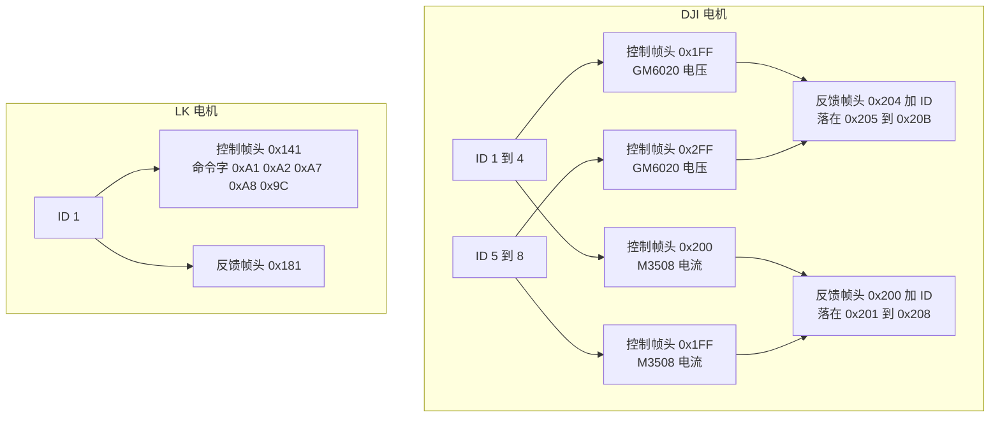
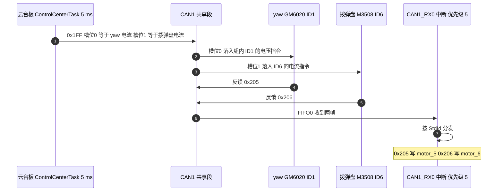

# 电机 ID 与帧头分配表

帧头由电机的型号与 ID 共同决定，与板无关。两块板用的是同一批 DJI 电机与 LK 电机，帧头规则相同，区别只在哪台电机挂在哪条总线上。本文先给出三套编号规则，再落到本工程八台电机的实际分配，最后标出与 `项目概述.md` 文字描述不一致的地方。

> 云台板源码根目录 `/home/wyx/rm/2026SentriOmeniGimbal/2026OmniSentryGimbal`，底盘板 `/home/wyx/rm/2026SentriOmeniChassis/2026OmniSentryChassis`。下文行号分别取自这两个根目录。

## 1. 概念：ID 落在哪一段，帧头就是哪一个

DJI 两家电机的控制指令都是一帧带四台电机，数据区 8 字节切成 4 个有符号 16 位槽位，因此一条下行帧只覆盖 ID 连续的四台。段与帧头的对应：

| 电机系列 | ID 1 到 4 的控制帧头 | ID 5 到 8 的控制帧头 | 反馈帧头 | 槽位量纲 |
| --- | --- | --- | --- | --- |
| M3508 | 0x200 | 0x1FF | 0x200 + ID | 转矩电流，范围 ±16384 |
| GM6020 | 0x1FF | 0x2FF | 0x204 + ID | 电压，范围 ±30000 |
| LK | 0x140 + ID | 同左 | 0x180 + ID | 由数据区首字节的命令字区分 |

LK 电机与两家的差别在于下行帧的粒度：每个 ID 独占一个帧头，一帧只控制一台电机。上行方向则都是每台电机各发各的。

两家的反馈区间在 0x205 到 0x208 完全重合，只看反馈帧头判不出型号。

## 2. 机制：0x1FF 的两种身份与工程编号

0x1FF 是本工程最容易读错的一帧。同一个帧头，对 M3508 是 ID 5 到 8 的电流指令，对 GM6020 是 ID 1 到 4 的电压指令。判断某台电机到底属于哪种解释，要看它响应哪条下行帧、以及它的反馈帧头是否自洽。

本工程的软件变量名是另一套编号：`motor_1` 到 `motor_8` 与 `LK_motor_1`。对 GM6020，工程编号 5 到 8 对应组内 ID 1 到 4，两者相差 4；对 M3508，工程编号与物理 ID 一致。这层换算是纯软件约定，不改变总线上的字节。

以云台板一次控制周期为例，槽位与标识符的往返关系：

## 3. 落到本项目

### 3.1 云台板

| 电机 | 型号 | 物理 ID | 总线 | 控制帧头与槽位 | 反馈帧头 | 解析变量 | 源码 |
| --- | --- | --- | --- | --- | --- | --- | --- |
| 摩擦轮右 | M3508 | 1 | CAN2 | 0x200 槽位0 | 0x201 | `motor_1` | 云台板 `bsp_can.cpp:599-606` |
| 摩擦轮左 | M3508 | 2 | CAN2 | 0x200 槽位1 | 0x202 | `motor_2` | `:607-613` |
| yaw | GM6020 | 1 | CAN1 | 0x1FF 槽位0 | 0x205 | `motor_5` | `:631-640` |
| 拨弹盘 | M3508 | 6 | CAN1 | 0x1FF 槽位1 | 0x206 | `motor_6` | `:620-629` |
| pitch | LK | 1 | CAN1 | 0x141 | 0x181 | `LK_motor_1` | `:643-673` |

控制侧的发送点：摩擦轮走 `bsp_can2_djimotorcmd`（云台板 `ControlCenterTask.cpp:132`），yaw 与拨弹盘走 `bsp_can1_djimotorcmdfive2eight`（`:133`），pitch 走 `bsp_can1_lkmotortorquecmd`（`:134`）。三行在同一个 5 ms 循环里。

### 3.2 底盘板

| 电机 | 型号 | 物理 ID | 总线 | 控制帧头与槽位 | 反馈帧头 | 解析变量 | 源码 |
| --- | --- | --- | --- | --- | --- | --- | --- |
| 右前轮 | M3508 | 1 | CAN2 | 0x200 槽位0 | 0x201 | `chassis_motor_1` | 底盘板 `bsp_can.cpp:592-599` |
| 左前轮 | M3508 | 2 | CAN2 | 0x200 槽位1 | 0x202 | `chassis_motor_2` | `:600-606` |
| 左后轮 | M3508 | 3 | CAN2 | 0x200 槽位2 | 0x203 | `chassis_motor_3` | `:607-613` |
| 右后轮 | M3508 | 4 | CAN2 | 0x200 槽位3 | 0x204 | `chassis_motor_4` | `:614-620` |

四个轮子共用一条 0x200，发送点为 `bsp_can2_djimotorcmd`（底盘板 `ControlCenterTask.cpp:150`），周期 2 ms。轮序为右前 1、左前 2、左后 3、右后 4，见 `项目概述.md:13` 与底盘板 `ControlCenterTask.cpp:80-83` 的注释。

底盘板还解析 0x205，写入 `yaw_motor_5`（底盘板 `bsp_can.cpp:629-638`）。这一帧由云台板一侧的 yaw 电机发出，属于 CAN1 共享段，两块板都收。

### 3.3 与 `项目概述.md` 的两处记录差异

`项目概述.md:12` 把 yaw 记作 6020 的 ID2，把拨弹盘记作 3508 的 ID2。按帧头规则反推，这两个数值与固件的收发帧对不上：

| 电机 | `项目概述.md:12` 的记法 | 按型号与帧规则推 | 判据 |
| --- | --- | --- | --- |
| yaw | GM6020 ID2 | GM6020 ID1 | 控制落在 0x1FF 槽位0，反馈为 0x205，即 0x204 加 1 |
| 拨弹盘 | M3508 ID2 | M3508 ID6 | 控制落在 0x1FF 槽位1，反馈为 0x206，即 0x200 加 6 |

需要说明的是，帧本身只能把范围缩小到两个候选：控制落 0x1FF 槽位0、反馈为 0x205 的组合，既可能是 GM6020 的 ID1，也可能是 M3508 的 ID5；0x1FF 槽位1 配 0x206，既可能是 M3508 的 ID6，也可能是 GM6020 的 ID2。型号来自 `项目概述.md:12` 的文字描述，ID 则按该型号对应的段反推。现场应当核对两台电机外壳上的 ID 拨码，并把 `项目概述.md:12` 的数字改成与固件一致的一份。

## 4. 易错点

| # | 易错点 | 表现 | 依据 |
| --- | --- | --- | --- |
| 1 | 认为 0x1FF 只属于一个系列 | 按帧头判断电机型号，判错量纲 | M3508 的 ID5 到 8 与 GM6020 的 ID1 到 4 都用 0x1FF |
| 2 | 把工程编号当物理 ID | 给 GM6020 算反馈帧头时按 0x205 到 0x20B 去套工程编号 5 到 8 | 工程编号 5 到 8 对应组内 ID 1 到 4，相差 4 |
| 3 | 把 `motor_5` 当成物理 ID 5 | 由变量名反推物理 ID | 变量名是软件编号，判断依据仍是收发帧 |
| 4 | 认为两条 CAN2 上的 ID1 与 ID2 冲突 | 花时间去改其中一段的拨码 | 两条 CAN2 无电气连接，标识符各段独立 |
| 5 | 只用反馈帧头判型号 | 0x205 到 0x208 两家重合，判不出 | 结合下行帧与型号 |
| 6 | 直接采用 `项目概述.md` 的 ID 数字 | 与固件解析的帧头不匹配 | 以固件的收发帧反推，现场核对拨码 |

## 5. 小结

### 核心概念

- M3508 与 GM6020 都用一帧四槽的广播控制帧，槽位与组内 ID 一一对应。
- 段与帧头：M3508 的 ID1 到 4 用 0x200、ID5 到 8 用 0x1FF；GM6020 的 ID1 到 4 用 0x1FF、ID5 到 8 用 0x2FF。
- 反馈帧头：M3508 为 0x200 加 ID，GM6020 为 0x204 加 ID，两家在 0x205 到 0x208 重合。
- LK 电机每个 ID 独占下行帧头 0x140 加 ID 与上行帧头 0x180 加 ID，本工程用 ID1，对应 0x141 与 0x181。
- 云台板：摩擦轮 M3508 的 ID1 与 ID2 在 CAN2；yaw 在 0x1FF 槽位0 且反馈 0x205，拨弹盘在槽位1 且反馈 0x206，pitch 走 0x141。
- 底盘板：四个轮子 ID1 到 4 共用 CAN2 的 0x200，轮序为右前、左前、左后、右后。

### 设计权衡

| 权衡点 | 本工程的选择 | 代价与收益 |
| --- | --- | --- |
| 帧头复用 | 沿用 DJI 原厂约定 | 接线与代码都能照官方例程；代价是 0x1FF 双重身份，读代码时容易误判 |
| 云台 CAN 分配 | yaw 与拨弹盘留在 CAN1，摩擦轮放 CAN2 | CAN1 承接板间报文，CAN2 只带摩擦轮；代价是 CAN1 帧种类最多 |
| LK 下行粒度 | 每台电机独占一帧 | 一台一帧，指令互不影响；代价是帧数与 ID 一一绑定 |
| ID 记录 | 以固件与拨码为准 | 与代码一致；代价是 `项目概述.md` 的文字需要同步修改 |

## 6. 练习

### 基础题

1. 写出 M3508 ID7 的控制帧头、槽位序号与反馈帧头。
2. 写出 GM6020 ID3 的控制帧头与反馈帧头，并说明为什么它和 M3508 ID3 的控制帧头不同。
3. 列出本工程 CAN1 共享段上已经出现过的全部反馈标识符。

### 挑战题

4. 云台板的 yaw 电机若改为 M3508，保持 0x1FF 槽位0 与反馈 0x205 不变，应当给电机拨成哪个 ID，量纲要不要改？写出改动点。
5. 设计一段代码：只根据接收回调收到的标识符，判断 0x205 上那台电机是 GM6020 还是 M3508。写出可用的判据与局限。
6. 在底盘板 CAN2 上再加一台 M3508，ID 选 5。写出它的控制帧头、槽位、需要修改的发送函数与调用点，并说明为什么不能沿用现有的 0x200 调用。

---

### 附：本页引用的固件路径

| 路径 | 用途 |
| --- | --- |
| `/home/wyx/rm/2026SentriOmeniGimbal/2026OmniSentryGimbal/BSP/Src/bsp_can.cpp` | DJI 与 LK 发送函数（:89-557）、接收回调与 ID 分发（:590-715） |
| `/home/wyx/rm/2026SentriOmeniGimbal/2026OmniSentryGimbal/Task/Src/ControlCenterTask.cpp` | 云台板控制帧调用点（:132-134） |
| `/home/wyx/rm/2026SentriOmeniGimbal/2026OmniSentryGimbal/Task/Src/GimbalTask.cpp` | yaw 电流限幅（:83）、pitch 电流限幅（:102） |
| `/home/wyx/rm/2026SentriOmeniChassis/2026OmniSentryChassis/BSP/Src/bsp_can.cpp` | 底盘板发送函数（:83-211）、接收回调（:583-689） |
| `/home/wyx/rm/2026SentriOmeniChassis/2026OmniSentryChassis/Task/Src/ControlCenterTask.cpp` | 轮序注释（:80-83）、四轮控制帧调用点（:150） |
| `/home/wyx/rm/2026SentriOmeniChassis/2026OmniSentryChassis/项目概述.md` | 帧头与接线文字（:5-13） |
