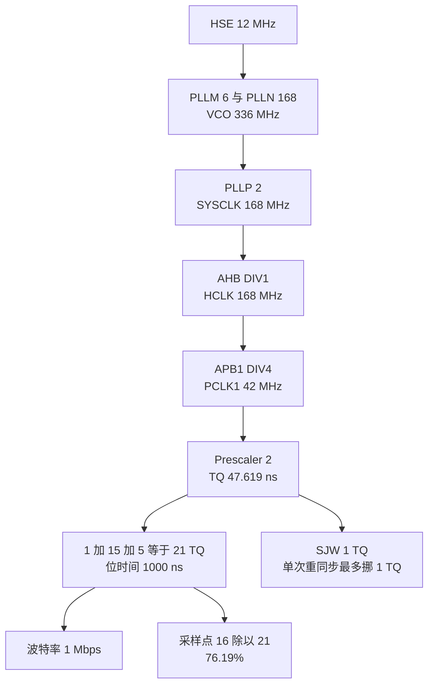
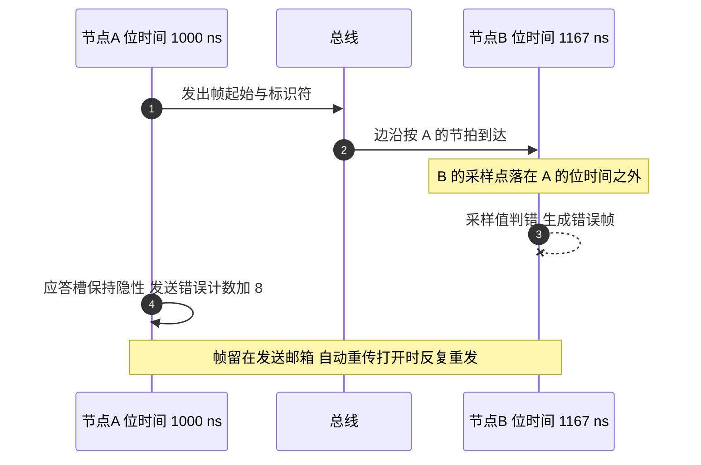
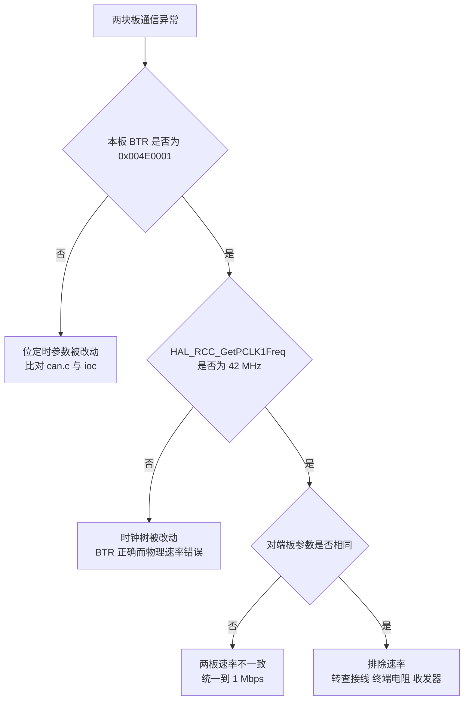

# 两板波特率一致性与采样点

CAN1 把云台板与底盘板连在同一段总线上，两个控制器的位定时参数必须一致。不一致的表现不是“收不到帧”这么简单：发送方会把帧发出去，接收方在错误的时刻采样，随后回一个错误帧，发送方的错误计数上升，帧留在邮箱里被反复重发。现象看起来像发送函数坏了，实际根因在时间参数上。

两块板的 `Core/Src/can.c` 在这几行逐字相同，ioc 里保存的计算结果也相同。这组参数的推导、采样点的位置、与电机规格的核对方法，以及两板不一致时的判别顺序如下。时钟树的完整来历与一次波特率失效的复盘放在 `01-CAN外设与过滤器/04-波特率与采样点.md`，这里保留与两板一致性有关的部分。

> 云台板源码根目录 `/home/wyx/rm/2026SentriOmeniGimbal/2026OmniSentryGimbal`，底盘板 `/home/wyx/rm/2026SentriOmeniChassis/2026OmniSentryChassis`。

## 位时间的四段与采样点公式

CAN 的每一位按时间份额（Time Quantum，缩写 TQ）切分。一个位时间由同步段、时间段 1 与时间段 2 组成，同步段固定 1 TQ。采样点位于时间段 1 的末尾，接收端在这一点读取总线的电平。

$$t_{bit} = (1 + BS1 + BS2) \cdot TQ$$

$$TQ = \frac{Prescaler}{f_{PCLK1}}$$

$$f_{baud} = \frac{f_{PCLK1}}{Prescaler \cdot (1 + BS1 + BS2)}$$

$$p_s = \frac{1 + BS1}{1 + BS1 + BS2}$$

四个式子里只有 `Prescaler`、`BS1`、`BS2` 三个量可以调，第四个量 SJW 只影响重同步，不改变位时间与采样点。bxCAN 的取值为 BS1 不超过 16 TQ，BS2 不超过 8 TQ。三个量互相制约：在给定 PCLK1 下，位时间由三者乘积决定，采样点只由 BS1 与 BS2 的比值决定。

## 从 12 MHz 晶振到 1 Mbps 的时钟链

两板共用的时钟链：外部晶振 12 MHz 经 PLLM 6 分频得到 2 MHz，经 PLLN 168 倍频得到 336 MHz，经 PLLP 2 分频得到 SYSCLK 168 MHz；AHB 不分频，APB1 取 `RCC_HCLK_DIV4`，得到 PCLK1 42 MHz。bxCAN 挂在 APB1 上，输入时钟就是 42 MHz。两块板的 ioc 都记录 `RCC.APB1Freq_Value=42000000`（云台板 `2026sentriomeni.ioc`，底盘板同名文件），`RCC.HCLK_Freq_Value` 为 168000000，`RCC.HSE_VALUE` 为 12000000。

代入第 1 节的式子：

$$TQ = \frac{2}{42 \times 10^{6}} = 47.619\ \text{ns}$$

$$t_{bit} = (1 + 15 + 5) \times 47.619\ \text{ns} = 1000\ \text{ns}$$

$$f_{baud} = \frac{1}{1000\ \text{ns}} = 1\ \text{Mbps}$$

$$p_s = \frac{1 + 15}{21} = 76.19\%$$

位定时参数写进 `BTR` 寄存器时取的是减一值：`BRP` 位域存 `Prescaler - 1`，`TS1` 存 `BS1 - 1`，`TS2` 存 `BS2 - 1`，`SJW` 存 `SJW - 1`。本组参数的期望值是 `0x004E0001`，用调试器在两块板上各读一次就能比对。

当两个节点的位时间不一致时，失效从应答槽开始：

## 两块板取值相同的那 9 个参数

| 参数 | 取值 |
| --- | --- |
| `Prescaler` | 2 |
| `Mode` | `CAN_MODE_NORMAL` |
| `SyncJumpWidth` | `CAN_SJW_1TQ` |
| `TimeSeg1` | `CAN_BS1_15TQ` |
| `TimeSeg2` | `CAN_BS2_5TQ` |
| `AutoBusOff` | `ENABLE` |
| `AutoRetransmission` | `ENABLE` |
| `ReceiveFifoLocked` | `DISABLE` |
| `TransmitFifoPriority` | `DISABLE` |

两组表格都取两块板同名的文件：上表对应 `Core/Src/can.c`，下表对应 `2026sentriomeni.ioc`。两块板的这些参数逐字相同，因此四个控制器的位时间都是 1000 ns。

表里除了位定时三项，还有几个模式位会影响故障时的表现。`AutoBusOff` 为 `ENABLE` 表示进入总线关闭状态后由硬件自动恢复；`AutoRetransmission` 为 `ENABLE` 表示发送失败会自动重传；`ReceiveFifoLocked` 为 `DISABLE` 表示接收 FIFO 满时新报文覆盖旧报文；`TransmitFifoPriority` 为 `DISABLE` 表示发送邮箱按标识符大小仲裁。这四项在两块板上也一致。

## ioc 里的计算结果与它的时效性

| ioc 键 | 取值 |
| --- | --- |
| `CAN1.CalculateTimeQuantum` | 47.61904761904762 |
| `CAN1.CalculateTimeBit` | 1000 |
| `CAN1.CalculateBaudRate` | 1000000 |
| `CAN2.CalculateTimeQuantum` | 47.61904761904762 |
| `CAN2.CalculateTimeBit` | 1000 |
| `CAN2.CalculateBaudRate` | 1000000 |
| `CAN1.NART` | `ENABLE` |
| `NVIC.CAN1_RX0_IRQn` | 优先级 5 |

这些数值由 CubeMX 按生成时的时钟树算出并写进 ioc，不随后续改动自动更新。它们能证明“生成那一刻”的参数，不能证明当前运行时的参数。要判断当前速率，读 `BTR` 与 `HAL_RCC_GetPCLK1Freq()` 的返回值。

## 76.19% 的采样点意味着什么

| 取值 | 本工程 | 常见目标 |
| --- | --- | --- |
| 总 TQ | 21 | 由 Prescaler 与 PCLK1 决定 |
| BS1 | 15 TQ | 上限 16 TQ |
| BS2 | 5 TQ | 上限 8 TQ |
| 采样点 | 76.19% | 87.5% 附近 |
| SJW | 1 TQ | 不超过 BS2 |

在同一波特率下，BS1 取 16、BS2 取 4 可以把采样点抬到 80.95%，这是 21 TQ 方案的上限，因为 BS1 不能超过 16 TQ。要再靠近 87.5%，需要换 Prescaler 与总 TQ 数。本工程的总线长度不足一米、节点数不超过 10，76.19% 在可接受范围内。若把线束延长或更换晶振，应先复核 BS2 与 SJW 的余量。

## 与电机规格核对：本段没有降速余地

本段上的节点除了两块板，还有三个电机，它们的速率不可配置：

| 节点 | 速率 | 出处 |
| --- | --- | --- |
| DJI M3508 配 C620 电调 | 固定 1 Mbps | DJI 电调说明书，源码中无该参数 |
| DJI GM6020 内置驱动 | 固定 1 Mbps | DJI 电机说明书，源码中无该参数 |
| LK 电机 | 出厂默认 1 Mbps | 瓴控 CAN 协议文档，源码中无该参数 |

1 Mbps 由电机决定，两块板没有调整空间。想通过降速来缓解负载率的做法在本段上行不通。

## 两板不一致时的判别顺序

若 PCLK1 从 42 MHz 变成 36 MHz，位定时参数不动时实际波特率为

$$f_{baud} = \frac{36 \times 10^{6}}{2 \times 21} = 857143\ \text{bps}$$

与 1 Mbps 相差 14.29%。这个数值是工作记录里那次失效的签名，排查过程见 `05-调试案例与排查顺序.md`。

## 常见判断偏差

| # | 检查手段 |
| --- | --- |
| 1 | 两份 can.c 逐行比对，或读两块板的 BTR |
| 2 | 用 `HAL_RCC_GetPCLK1Freq()` 反算 |
| 3 | 期望值 `0x004E0001` 对照位域 |
| 4 | 核对电机说明书 |
| 5 | 先定总 TQ 再选 BS1 |
| 6 | SJW 不进入 $p_s$ 的分子与分母 |
| 7 | 观察 TSR 的 TME 位 |
| 8 | 先确认总线长度与节点数 |

## 小结

### 核心概念

- 位时间 $t_{bit} = (1 + BS1 + BS2) \cdot TQ$，采样点 $p_s = (1 + BS1)/(1 + BS1 + BS2)$。
- 两板 PCLK1 都为 42 MHz，`Prescaler` 为 2，TQ 为 47.619 ns，位时间 1000 ns，波特率 1 Mbps。
- 本组参数下采样点为 76.19%，SJW 为 1 TQ，两块板与四个控制器完全一致。
- 期望的 `BTR` 值为 `0x004E0001`，位域都存减一值。
- 电机侧的速率固定为 1 Mbps，本段没有降速的余地。
- 两板不一致时先比 BTR，再比 PCLK1，最后才查物理层。

### 设计权衡

| 权衡点 | 本工程的选择 | 代价与收益 |
| --- | --- | --- |
| Prescaler | 2 | TQ 最小，位内分段最细；代价是采样点上限受 BS1 的 16 TQ 限制 |
| BS1 与 BS2 | 15 与 5 | BS2 保留 5 TQ，重同步余量足；代价是采样点偏前到 76.19% |
| SJW | 1 TQ | 与高精度晶振匹配；代价是晶振偏差大的现场容易出错 |
| 参数来源 | 由 CubeMX 写进 ioc | 生成代码与 ioc 便于互相核对；代价是 ioc 数值不随时钟树更新 |
| 波特率 | 1 Mbps | 满足命令侧 1 kHz 与反馈侧 1 kHz 的帧率需求（帧率核算见第 4 篇）；代价是线长与节点数受限 |

## 练习

### 基础题

1. 用第 1 节的公式复算：`Prescaler` 改为 3、BS1 取 11、BS2 取 2 时，位时间、波特率与采样点各是多少。
2. 写出本工程 `BTR` 期望值 `0x004E0001` 的四个位域取值与对应的物理量。
3. 说明 `CAN1.CalculateBaudRate=1000000` 为什么不能作为波特率正确的证据。
4. 解释为什么 SJW 不改变采样点，却会影响重同步能力。

### 挑战题

5. PCLK1 保持 42 MHz，列出把采样点落在 80% 到 88% 区间的全部可行组合，并说明各组合的 SJW 上限。
6. 设计一段上电自检：不依赖外部设备，只靠寄存器与错误计数判断本板速率是否与对端一致。写出用到的寄存器、判据与失败处理。
7. 两块板一块为 1 Mbps、另一块为 950 kbps，推导通信能否成功，并说明发送错误计数会如何变化。
8. 把 BS2 从 5 TQ 改为 2 TQ、SJW 保持 1 TQ，采样点、重同步能力与两板一致性各有什么变化。

## 附：本页引用的固件路径

| 路径 | 用途 |
| --- | --- |
| `Core/Src/can.c` | 云台板 CAN1 与 CAN2 位定时与模式位 |
| `底盘板 Core/Src/can.c` | 底盘板同段参数 |
| `2026sentriomeni.ioc` | 云台板 CAN 计算结果与时钟树键 |
| `底盘板 2026sentriomeni.ioc` | 底盘板 CAN 计算结果与时钟树键 |
| `Drivers/STM32F4xx_HAL_Driver/Src/stm32f4xx_hal_can.c` | BTR 写入 |
| `/home/wyx/Work-Summary-and-Diary/工作记录/can通信波特率问题.md` | 857142 Hz 的实测记录与根因 |
| `docs/03-CAN 与电机/01-CAN外设与过滤器/04-波特率与采样点.md` | 时钟树推导与失效复盘 |
