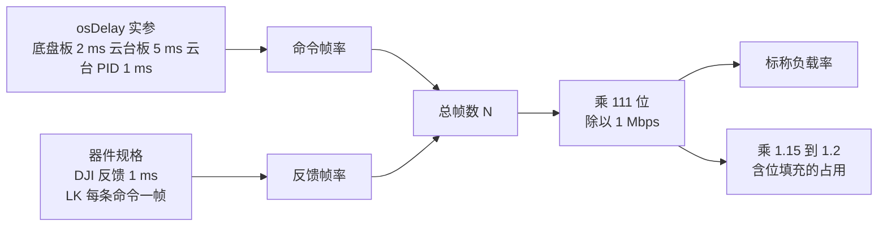
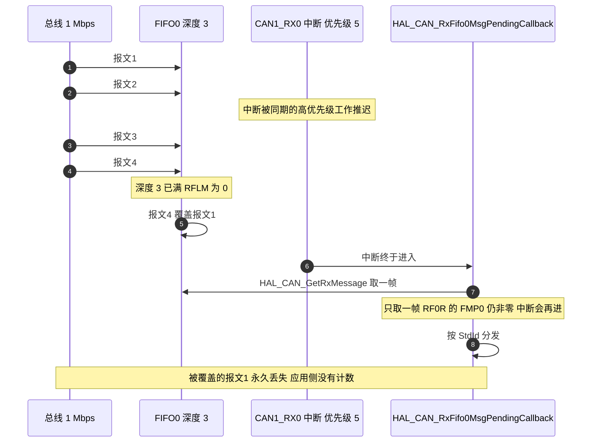

# 总线负载与丢帧

CAN 的位填充与仲裁让负载率不能只看数据字节。本文给出标准帧的位数、命令帧率的来源、反馈帧率的取值方式，按三段总线分别核算占用，再说明接收 FIFO 的深度与覆盖模式如何造成丢帧，最后列出可以节流的发送点。

> 云台板源码根目录 `/home/wyx/rm/2026SentriOmeniGimbal/2026OmniSentryGimbal`，底盘板 `/home/wyx/rm/2026SentriOmeniChassis/2026OmniSentryChassis`。

## 1. 概念：一帧占多少位

标准数据帧不计位填充时的位数：

| 字段 | 位数 |
| --- | --- |
| 帧起始 SOF | 1 |
| 标准标识符 StdId | 11 |
| RTR、IDE、r0 | 3 |
| DLC | 4 |
| 数据段 | 64 |
| CRC 与 CRC 定界 | 16 |
| ACK 槽与 ACK 定界 | 2 |
| 帧结束 EOF | 7 |
| 帧间隔 IFS | 3 |
| 合计 | 111 |

1 Mbps 下单帧占用

$$T_{frame} = \frac{111}{10^{6}} = 111\ \mu s$$

理论的帧率上限为 $1 / 111\ \mu s \approx 9010$ 帧每秒。实际负载率按帧数折算：

$$L = \frac{N_{frame} \cdot 111}{f_{baud}} \times 100\%$$

位填充会把真实占用再抬高。最坏情况约多出两成，工程上按 1.15 到 1.2 倍估算比较稳妥。

## 2. 机制：帧率来自两个地方

命令帧率由任务周期决定，反馈帧率由器件规格决定，两者相加就是总帧数：

接收侧的风险在 FIFO。每个控制器有两个接收 FIFO，每个 FIFO 深度 3。`ReceiveFifoLocked` 在本工程为 `DISABLE`（`Core/Src/can.c:51` 与 `:83`），HAL 据此把 `MCR` 的 `RFLM` 位清零（`Drivers/STM32F4xx_HAL_Driver/Src/stm32f4xx_hal_can.c:417-423`），FIFO 满之后新报文覆盖最旧的一帧。回调每次只取一帧（云台板 `BSP/Src/bsp_can.cpp:593`，底盘板同位置），当帧率乘上服务延迟超过三个位置时就会出现覆盖。

## 3. 落到本项目

### 3.1 CAN1 共享段

| 帧 | 来源 | 周期 | 帧率 |
| --- | --- | --- | --- |
| 0x205 yaw 反馈 | yaw GM6020 | 规格 1 ms | 1000 |
| 0x206 拨弹盘反馈 | 拨弹盘 M3508 | 规格 1 ms | 1000 |
| 0x181 LK 反馈 | pitch LK | 每条命令一帧 | 约 1200 |
| 0x1FF 控制 | 云台板 `ControlCenterTask.cpp:133` | 5 ms | 200 |
| 0x141 转矩 | 云台板 `ControlCenterTask.cpp:134` | 5 ms | 200 |
| 0x141 读状态2 | 云台板 `GimbalTask.cpp:87` | 1 ms | 1000 |
| 0x301 遥控器 | 云台板 `ControlCenterTask.cpp:135` | 5 ms | 200 |
| 0x302 yaw 角度 | 云台板 `ControlCenterTask.cpp:136` | 5 ms | 200 |
| 0x303 弹量与弹速 | 底盘板 `ControlCenterTask.cpp:152` | 2 ms | 500 |
| 0x309 热量与 wz | 底盘板 `ControlCenterTask.cpp:153` | 2 ms | 500 |
| 合计 | | | 6000 |

$$L_{CAN1} = \frac{6000 \times 111}{10^{6}} = 66.6\%$$

含位填充按 1.15 到 1.2 倍折算，占用落在 76.6% 到 79.9%。

0x181 的帧率取决于 LK 电机对每条命令回一帧的设定，源码里没有这个数字。若该电机只对转矩命令应答，则去掉 1000 帧，合计降到 5000 帧每秒，负载率 55.5%。下面两条 CAN2 的表不受这个取值影响。

### 3.2 CAN2 底盘段

| 帧 | 来源 | 周期 | 帧率 |
| --- | --- | --- | --- |
| 0x201 到 0x204 | 四个 M3508 | 规格 1 ms | 4000 |
| 0x200 控制 | 底盘板 `ControlCenterTask.cpp:150` | 2 ms | 500 |
| 合计 | | | 4500 |

$$L_{CAN2底盘} = \frac{4500 \times 111}{10^{6}} = 49.95\%$$

含位填充后落在 57.4% 到 59.9%。

### 3.3 CAN2 云台段

| 帧 | 来源 | 周期 | 帧率 |
| --- | --- | --- | --- |
| 0x201 与 0x202 | 两个 M3508 | 规格 1 ms | 2000 |
| 0x200 控制 | 云台板 `ControlCenterTask.cpp:132` | 5 ms | 200 |
| 合计 | | | 2200 |

$$L_{CAN2云台} = \frac{2200 \times 111}{10^{6}} = 24.42\%$$

含位填充后落在 28.1% 到 29.3%。

### 3.4 三段对照

| 段落 | 标称负载 | 含位填充 | 主导项 |
| --- | --- | --- | --- |
| CAN1 共享段 | 66.6% | 76.6% 到 79.9% | LK 读状态2 与其反馈 |
| CAN2 底盘段 | 49.95% | 57.4% 到 59.9% | 四个轮子的 1 kHz 反馈 |
| CAN2 云台段 | 24.42% | 28.1% 到 29.3% | 两个摩擦轮的 1 kHz 反馈 |

CAN1 的占用比两条 CAN2 都高，原因不在电机数量，而在两件事：LK 读状态2 在 1 ms 循环里发送，以及底盘板把两条裁判系统报文按 2 ms 周期推送。

### 3.5 仲裁次序

`TransmitFifoPriority` 为 `DISABLE`，发送邮箱按标识符大小定优先级，数值小的先发。CAN1 上的次序为 0x141、0x181、0x1FF、0x205、0x206、0x301、0x302、0x303、0x309。两条裁判系统报文排在最后，负载高时它们的等待时间最长。底盘段 CAN2 上 0x200 的控制帧小于 0x201 到 0x204 的反馈帧，控制帧先发。

### 3.6 丢帧的观察手段

| 手段 | 位置 | 说明 |
| --- | --- | --- |
| 覆盖标志 | `RF0R` 的 `FOV0` | 置位表示 FIFO0 发生过覆盖 |
| HAL 错误码 | `HAL_CAN_ERROR_RX_FOV0` 等于 0x200、`RX_FOV1` 等于 0x400 | 定义在 `stm32f4xx_hal_can.h:302-303` |
| 发送失败 | `HAL_CAN_ERROR_TX_ALST0` 到 `TERR2` | 定义在 `:304-309` |

本工程没有任何一处读取 `hcan->ErrorCode`，覆盖与发送失败都不产生日志。要观察丢帧，需要在回调里加计数器，或周期读取 `RF0R`。

### 3.7 可节流的发送点

| 帧 | 当前帧率 | 依据 | 建议 | 可省帧率 |
| --- | --- | --- | --- | --- |
| 0x141 读状态2 | 1000 | 云台板 `GimbalTask.cpp:87` 在 1 ms 循环内 | 接收回调只处理 0xA1、0xA2、0xA7、0xA8（`bsp_can.cpp:643-673`），0x9C 应答进 `default` 分支被丢弃，可降频或删除 | 约 2000，含反馈 |
| 0x303 与 0x309 | 各 500 | 底盘板 `ControlCenterTask.cpp:152-153` 在 2 ms 循环内 | 裁判系统数据变化远慢于 500 Hz，降到 50 Hz | 约 900 |
| 0x301 与 0x302 | 各 200 | 云台板 `ControlCenterTask.cpp:135-136` | DBUS 的帧率约 71 Hz，转发降到 100 Hz | 约 200 |
| 0x1FF、0x141 转矩 | 各 200 | 命令带宽 | 保留 | 0 |
| 电机反馈 | 固定 | 器件规格 | 无法调整 | 0 |

三项合计可省约 3100 帧每秒，CAN1 从 6000 帧每秒降到约 2900 帧每秒，标称负载从 66.6% 降到 32.2%。

## 4. 易错点

| # | 易错点 | 表现 | 依据 |
| --- | --- | --- | --- |
| 1 | 只按数据字节算负载 | 漏掉帧头、CRC 与帧间隔，结果偏低约三成 | 8 字节数据只占 111 位中的 64 位 |
| 2 | 忽略位填充 | 实际占用比标称高一到两成 | 最坏情况按 1.2 倍 |
| 3 | 认为 1 kHz 反馈可以降频 | 反馈由电调自主发送 | 命令帧率可调，反馈帧率不可调 |
| 4 | 认为两条 CAN2 共享负载 | 三段总线的占用要分别核算 | 两块板的 CAN2 无电气连接 |
| 5 | 忽略 FIFO0 只有三个位置 | 认为高帧率不会丢帧 | 深度 3，覆盖模式 |
| 6 | 把回调读一帧当成吞吐不足 | 未命中时会再次进入中断 | RF0R 的 FMP0 仍非零即再次触发 |
| 7 | 不看 `ErrorCode` | 覆盖与发送失败都被静默吞掉 | 全树没有读取点 |
| 8 | 忽略仲裁次序 | 认为各帧平等竞争 | 邮箱优先级由标识符决定 |

## 5. 小结

### 核心概念

- 标准数据帧 8 字节数据共 111 位，1 Mbps 下单帧 111 微秒。
- 负载率 $L = N \cdot 111 / f_{baud}$，含位填充再乘 1.15 到 1.2。
- CAN1 共享段标称 66.6%，CAN2 底盘段 49.95%，CAN2 云台段 24.42%。
- 命令帧率来自任务周期，反馈帧率来自器件规格，后者不可调。
- RX FIFO0 深度 3，`RFLM` 为 0，满时覆盖最旧一帧，覆盖不产生应用层记录。
- 发送邮箱按标识符定优先级，CAN1 上两条裁判系统报文优先级最低。
- 可节流的三项合计约 3100 帧每秒，其中 LK 读状态2 一项占约 2000。

### 设计权衡

| 权衡点 | 本工程的选择 | 代价与收益 |
| --- | --- | --- |
| 反馈帧 | 让电机按 1 kHz 自主上报 | 速度环反馈新；代价是固定占用三段总线的一半左右 |
| 控制周期 | 底盘 2 ms、云台 5 ms | 与速度环带宽匹配；代价是 CAN1 上命令帧数偏多 |
| 板间裁判数据 | 2 ms 周期推送 | 云台侧数据及时；代价是 CAN1 增加 1000 帧每秒 |
| LK 读状态2 | 1 ms 周期发送 | 便于读取状态；代价是应答被丢弃，占去约三分之一的 CAN1 带宽 |
| 错误处理 | 不检查返回值与 `ErrorCode` | 代码简洁；代价是丢帧与发送失败不可见 |

## 6. 练习

### 基础题

1. 写出标准数据帧 111 位的构成，并说明 8 字节数据在其中占多少位。
2. 计算 1 Mbps 下单帧占用时间与理论帧率上限。
3. 算出 CAN2 底盘段的标称负载率，并给出含位填充的区间。

### 挑战题

4. 用一条公式表示 CAN1 的负载率与 `osDelay` 实参、反馈帧率、LK 应答策略四者的关系，并求负载率降到 50% 以下需要满足的条件。
5. 写一段代码：在 `HAL_CAN_RxFifo0MsgPendingCallback` 里统计 `RF0R` 的覆盖标志，输出每秒覆盖次数。说明为什么不能只在回调里数帧数来判丢帧。
6. 若 CAN1 上新增一台反馈 1 kHz 的电机，重算负载率，并给出至少两种把总占用压回 60% 以下的方案及其代价。
7. 位填充最坏情况按 1.2 倍估算，说明这个系数的来源，并给出一种在总线上实测真实占用的方法。

---

### 附：本页引用的固件路径

| 路径 | 用途 |
| --- | --- |
| `/home/wyx/rm/2026SentriOmeniGimbal/2026OmniSentryGimbal/Task/Src/ControlCenterTask.cpp` | 云台板命令帧调用点（:132-136）与 5 ms 周期（:137） |
| `/home/wyx/rm/2026SentriOmeniGimbal/2026OmniSentryGimbal/Task/Src/GimbalTask.cpp` | 0x141 读状态2 的 1 ms 循环（:87、:104） |
| `/home/wyx/rm/2026SentriOmeniGimbal/2026OmniSentryGimbal/BSP/Src/bsp_can.cpp` | 接收回调与 0x181 分支（:590-715） |
| `/home/wyx/rm/2026SentriOmeniGimbal/2026OmniSentryGimbal/Core/Src/can.c` | `ReceiveFifoLocked` 与位定时（:42-52、:74-84） |
| `/home/wyx/rm/2026SentriOmeniChassis/2026OmniSentryChassis/Task/Src/ControlCenterTask.cpp` | 四轮控制与两条裁判报文（:150-154） |
| `/home/wyx/rm/2026SentriOmeniGimbal/2026OmniSentryGimbal/Drivers/STM32F4xx_HAL_Driver/Src/stm32f4xx_hal_can.c` | `RFLM` 写入（:417-423） |
| `/home/wyx/rm/2026SentriOmeniGimbal/2026OmniSentryGimbal/Drivers/STM32F4xx_HAL_Driver/Inc/stm32f4xx_hal_can.h` | 错误码定义（:302-309） |
