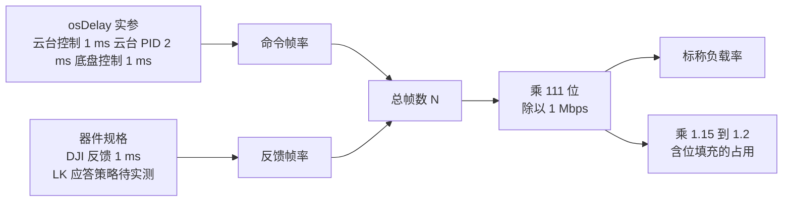
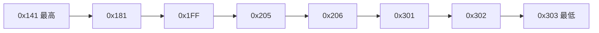
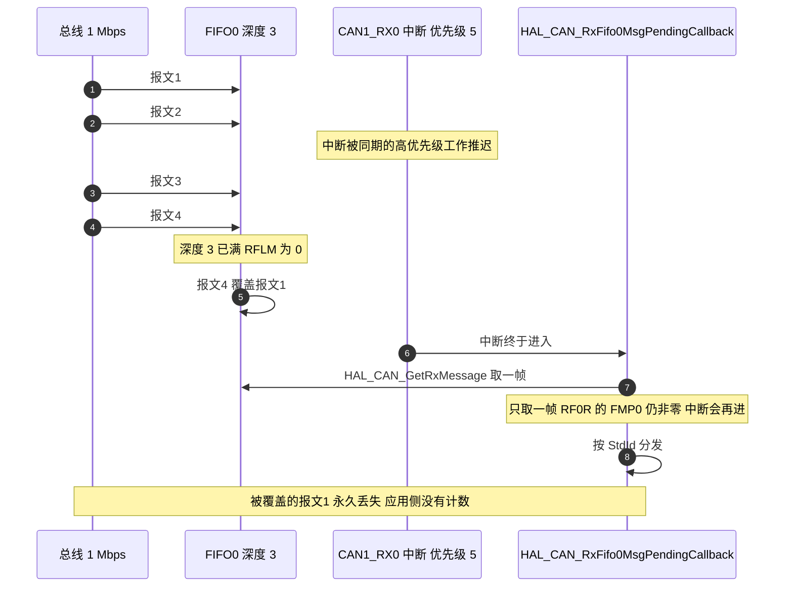
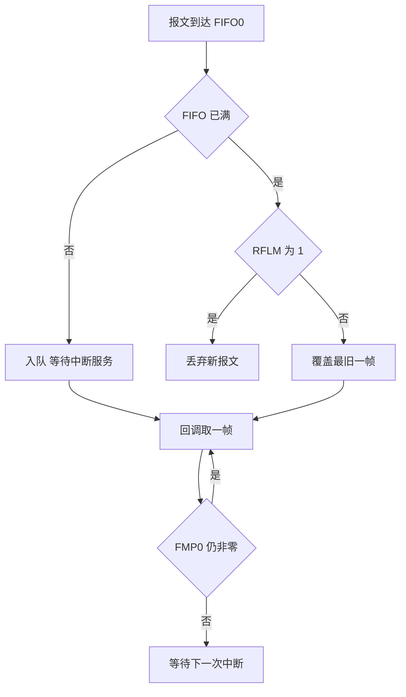

# 总线负载与丢帧

CAN 的位填充与仲裁让负载率不能只看数据字节。一帧标准数据帧的 8 字节数据只占整帧 111 位中的 64 位，剩下的帧头、CRC、应答与帧间隔都要计入；位填充再在真实波形上多出一到两成。按 8 字节除以位速率去做估算，结果会明显偏低。

标准帧的位数、命令帧率的来源、反馈帧率的取值方式说清之后，按三段总线分别核算占用，再说明接收 FIFO 的深度与覆盖模式如何造成丢帧，最后列出当前帧集上可以节流的发送点。读完后应当能回答：CAN1 为什么比两条 CAN2 都忙、FIFO 满时丢的是哪一帧、以及把读状态2 降频能省下多少。

> 云台板源码根目录 `/home/wyx/rm/2026SentriOmeniGimbal/2026OmniSentryGimbal`，底盘板 `/home/wyx/rm/2026SentriOmeniChassis/2026OmniSentryChassis`。

## 111 位是怎么算出来的

标准数据帧不计位填充时的位数：

| 字段 | 位数 |
| --- | --- |
| 帧起始 SOF | 1 |
| 标准标识符 StdId | 11 |
| RTR、IDE、r0 | 3 |
| DLC | 4 |
| 数据段 | 64 |
| CRC 与 CRC 定界 | 16 |
| ACK 槽与 ACK 定界 | 2 |
| 帧结束 EOF | 7 |
| 帧间隔 IFS | 3 |
| 合计 | 111 |

数据段只占 64 位，其余 47 位都是协议开销，接近四成。1 Mbps 下单帧占用

$$T_{frame} = \frac{111}{10^{6}} = 111\ \mu s$$

理论的帧率上限为 $1 / 111\ \mu s \approx 9010$ 帧每秒。实际负载率按帧数折算：

$$L = \frac{N_{frame} \cdot 111}{f_{baud}} \times 100\%$$

位填充会把真实占用再抬高。最坏情况约多出两成，工程上按 1.15 到 1.2 倍估算比较稳妥。

## 帧率来自任务周期与器件规格两个地方

命令帧率由任务周期决定，反馈帧率由器件规格决定，两者相加就是总帧数：

两条来源的控制方式完全不同。改变 `osDelay` 的实参就能改命令帧率，而反馈帧率由电调或驱动器固件决定，主控只能接受。三段总线的核算方法相同，区别只在参与的帧与周期。

## CAN1 共享段的逐帧核算

| 帧 | 来源 | 周期 | 帧率 |
| --- | --- | --- | --- |
| 0x205 yaw 反馈 | yaw GM6020 | 规格 1 ms | 1000 |
| 0x206 拨弹盘反馈 | 拨弹盘 M3508 | 规格 1 ms | 1000 |
| 0x1FF 控制 | 云台板 `Task/Src/ControlCenterTask.cpp:106` | 1 ms | 1000 |
| 0x141 转矩 | 云台板 `Task/Src/ControlCenterTask.cpp:107` | 1 ms | 1000 |
| 0x141 读状态2 | 云台板 `Task/Src/GimbalTask.cpp:83` | 2 ms | 500 |
| 0x301 遥控器 | 云台板 `Task/Src/ControlCenterTask.cpp:109` | 1 ms | 1000 |
| 0x302 yaw 角度 | 云台板 `Task/Src/ControlCenterTask.cpp:110` | 1 ms | 1000 |
| 0x303 弹量与弹速 | 底盘板 `Task/Src/ControlCenterTask.cpp:127` | 1 ms | 1000 |
| 不含 0x181 的小计 | | | 7500 |
| 0x181 LK 反馈 | pitch LK | 由应答策略决定，见下 | 500 或 1500 |
| 合计 | | | 8000 到 9000 |

$$L_{CAN1} = \frac{7500 \times 111}{10^{6}} = 83.25\%$$

把 0x181 的两种取值代进去：只对 0x9C 应答时为

$$L_{CAN1} = \frac{8000 \times 111}{10^{6}} = 88.8\%$$

每条 LK 命令都应答时为

$$L_{CAN1} = \frac{9000 \times 111}{10^{6}} = 99.9\%$$

含位填充按 1.15 到 1.2 倍折算，上表三种口径分别落在 95.7% 到 99.9%、102.1% 到 106.6%、114.9% 到 119.9%。后两种已经超过 100%，说明按当前的命令周期，CAN1 处在饱和边缘：能否稳定运行取决于 LK 的应答策略与实际位填充分布，必须上台架实测，本页不给“可以正常工作”的结论。

0x181 的帧率源码里没有答案：LK 命令有 0x9C 读状态2（`Task/Src/GimbalTask.cpp:83`，500 帧每秒）与 0xA1 转矩（`Task/Src/ControlCenterTask.cpp:107`，1000 帧每秒）两类，驱动器对每一类是否回帧由型号与配置决定。台架实测的方法是：只发 0x9C 一段，用逻辑分析仪统计 0x181 的到达率；再只发 0xA1，得到另一组。把两次结果代入上表即可确定唯一口径。

表里有一项容易被漏看：0x141 出现了两次，一次是 1 ms 的转矩命令，一次是 2 ms 的读状态2。两条报文同为 0x141，区别在数据区首字节的命令字，负载核算时按两条独立帧计数。

## 两条 CAN2 的核算

CAN2 底盘段：

| 帧 | 来源 | 周期 | 帧率 |
| --- | --- | --- | --- |
| 0x201 到 0x204 | 四个 M3508 | 规格 1 ms | 4000 |
| 0x200 控制 | 底盘板 `Task/Src/ControlCenterTask.cpp:126` | 1 ms | 1000 |
| 合计 | | | 5000 |

$$L_{CAN2底盘} = \frac{5000 \times 111}{10^{6}} = 55.5\%$$

含位填充后落在 63.8% 到 66.6%。

CAN2 云台段：

| 帧 | 来源 | 周期 | 帧率 |
| --- | --- | --- | --- |
| 0x201 与 0x202 | 两个 M3508 | 规格 1 ms | 2000 |
| 0x200 控制 | 云台板 `Task/Src/ControlCenterTask.cpp:105` | 1 ms | 1000 |
| 合计 | | | 3000 |

$$L_{CAN2云台} = \frac{3000 \times 111}{10^{6}} = 33.3\%$$

含位填充后落在 38.3% 到 40.0%。

两段的差别来自节点数与命令帧数：底盘段四台电机按 1 kHz 上传，云台段只有两台，反馈帧率相差一倍；两段的控制帧都是 1 ms 一条。

## 三段对照与主导项

| 段落 | 标称负载 | 含位填充 | 主导项 |
| --- | --- | --- | --- |
| CAN1 共享段 | 83.25% 到 99.9% | 95.7% 到 119.9% | 两条 1 kHz 反馈、四条 1 kHz 命令与 LK 应答 |
| CAN2 底盘段 | 55.5% | 63.8% 到 66.6% | 四个轮子的 1 kHz 反馈 |
| CAN2 云台段 | 33.3% | 38.3% 到 40.0% | 两个摩擦轮的 1 kHz 反馈 |

CAN1 的占用比两条 CAN2 都高，原因不在电机数量，而在命令帧的数量：云台板控制中心任务在 1 ms 循环里向 CAN1 发四帧，底盘板在 1 ms 循环里向 CAN1 发一帧，加上 LK 读状态2 与三个电机的反馈，共享段每秒要送出 7500 到 9000 帧。旧口径按“云台控制 5 ms、底盘控制 2 ms”计算，把命令帧率低估了二到五倍，因此得到 66.6% 这类偏低的数字。

把三段放在一起看：后续要加帧，应当优先从 CAN1 上减帧，而不是从 CAN2 上腾位置。两条 CAN2 都还有余量。

## 仲裁次序与等待时间

`TransmitFifoPriority` 为 `DISABLE`，发送邮箱按标识符大小定优先级，数值小的先发。CAN1 上的次序为 0x141、0x181、0x1FF、0x205、0x206、0x301、0x302、0x303。两条 0x141 排在最先，底盘板的 0x303 排在最后，负载高时它的等待时间最长。底盘段 CAN2 上 0x200 的控制帧小于 0x201 到 0x204 的反馈帧，控制帧先发。

等待时间的量级可以按占用率估算：总线占用越高，一帧从进入邮箱到发出波形的排队时间越长。CAN1 每个 1 ms 窗口内平均有 7.5 到 9 帧待发，排在末尾的 0x303 等待最久。它承载的是累计弹量与弹速，用于发弹计数与摩擦轮初速补偿，抖动只影响这两个用途，不影响电机控制帧。

## FIFO 深度 3 与覆盖模式下的丢帧路径

接收侧的风险在 FIFO。每个控制器有两个接收 FIFO，每个 FIFO 深度 3。`ReceiveFifoLocked` 在本工程为 `DISABLE`（`Core/Src/can.c:51` 与 `Core/Src/can.c:83`），HAL 据此把 `MCR` 的 `RFLM` 位清零（`Drivers/STM32F4xx_HAL_Driver/Src/stm32f4xx_hal_can.c:417-423`），FIFO 满之后新报文覆盖最旧的一帧。回调每次只取一帧（云台板 `BSP/Src/bsp_can.cpp:591`，底盘板同位置），当帧率乘上服务延迟超过三个位置时就会出现覆盖。

覆盖是否会发生，取决于三次服务周期内到达的帧数。CAN1 上按 7500 帧每秒算，平均每 0.133 ms 到一帧，三个 FIFO 位置对应 0.4 ms；按 9000 帧每秒算则是每 0.111 ms 一帧，对应 0.33 ms。只要中断服务的间隔短于这个窗口，就不会发生覆盖。CAN 回调的优先级是 5，高于时基与任务，正常情况下不会被任务推迟这么久，但同优先级或更高优先级中断里的长操作会把它顶开。

## 丢帧的四种观察手段

| 手段 | 位置 | 说明 |
| --- | --- | --- |
| 覆盖标志 | `RF0R` 的 `FOV0` | 置位表示 FIFO0 发生过覆盖 |
| HAL 错误码 | `HAL_CAN_ERROR_RX_FOV0` 等于 0x200、`RX_FOV1` 等于 0x400 | 定义在 `Drivers/STM32F4xx_HAL_Driver/Inc/stm32f4xx_hal_can.h:302-303` |
| 发送失败 | `HAL_CAN_ERROR_TX_ALST0` 到 `TERR2` | 定义在 `Drivers/STM32F4xx_HAL_Driver/Inc/stm32f4xx_hal_can.h:304-309` |
| 计数对比 | 发送侧计数与接收侧计数之差 | 需要自行添加，不依赖外设寄存器 |

本工程没有任何一处读取 `hcan->ErrorCode`，覆盖与发送失败都不产生日志。要观察丢帧，需要在回调里加计数器，或周期读取 `RF0R`。四种手段里前三种是现成的寄存器状态，第四种要改代码但能直接给出丢帧比例。

## 可以节流的三个发送点

| 帧 | 当前帧率 | 依据 | 建议 | 可省帧率 |
| --- | --- | --- | --- | --- |
| 0x141 读状态2 与其 0x181 应答 | 500 加 500 | 云台板 `Task/Src/GimbalTask.cpp:83` 在 2 ms 循环内；接收回调只处理 0xA1、0xA2、0xA7、0xA8（`BSP/Src/bsp_can.cpp:641-672`），0x9C 应答落 `default` 被丢弃 | 不再读取状态，或把读取降到 10 Hz | 约 1000 |
| 0x303 | 1000 | 底盘板 `Task/Src/ControlCenterTask.cpp:127` 在 1 ms 循环内 | 裁判数据变化远慢于 1 kHz，降到 50 Hz | 约 950 |
| 0x302 | 1000 | 云台板 `Task/Src/ControlCenterTask.cpp:110` | 底盘跟随只需要角度，降到 100 Hz | 约 900 |
| 0x301 | 1000 | 云台板 `Task/Src/ControlCenterTask.cpp:109` | 底盘遥控通道由它提供（底盘板 `BSP/Src/bsp_can.cpp:608-613`），不建议降频 | 0 |
| 0x1FF、0x141 转矩 | 各 1000 | 命令带宽 | 保留 | 0 |
| 电机反馈 | 固定 | 器件规格 | 无法调整 | 0 |

三项合计可省约 2850 帧每秒。按不含 0x181 的口径，CAN1 从 7500 帧每秒降到约 4650 帧每秒，标称负载从 83.25% 降到 51.6%；按含 0x181 的口径，从 8000 到 9000 帧每秒降到约 5150 到 6150 帧每秒，标称负载落在 57.2% 到 68.3%。

节流表里影响最大的是第一行：读状态2 的应答根本没有对应的解析分支，500 帧每秒的命令与对应的 500 帧每秒应答全被丢弃。保留它的唯一理由是把状态字段读出来，而当前代码既没有读取 `LK_motor_1` 的速度字段（`rotor_speed` 未参与闭环），也没有别的消费者。

## 常见判断偏差

| # | 判断偏差 | 表现 | 依据 |
| --- | --- | --- | --- |
| 1 | 只按数据字节算负载 | 漏掉帧头、CRC 与帧间隔，结果偏低约三成 | 8 字节数据只占 111 位中的 64 位 |
| 2 | 忽略位填充 | 实际占用比标称高一到两成 | 最坏情况按 1.2 倍 |
| 3 | 沿用“云台控制 5 ms、底盘控制 2 ms” | 命令帧率低估二到五倍，负载率偏低 | `Task/Src/ControlCenterTask.cpp:111` 与 `Task/Src/ControlCenterTask.cpp:128` 都是 `osDelay(1)` |
| 4 | 认为 1 kHz 反馈可以降频 | 反馈由电调自主发送 | 命令帧率可调，反馈帧率不可调 |
| 5 | 认为两条 CAN2 共享负载 | 三段总线的占用要分别核算 | 两块板的 CAN2 无电气连接 |
| 6 | 忽略 FIFO0 只有三个位置 | 认为高帧率不会丢帧 | 深度 3，覆盖模式 |
| 7 | 把回调读一帧当成吞吐不足 | 未命中时会再次进入中断 | `RF0R` 的 `FMP0` 仍非零即再次触发 |
| 8 | 不看 `ErrorCode` | 覆盖与发送失败都被静默吞掉 | 全树没有读取点 |
| 9 | 把 0x141 的两条帧当成一条 | 核算时少算 500 帧 | 转矩与读状态2 是两条独立报文 |
| 10 | 把 0x309 计入帧集 | 合计与负载率偏高，且该帧并不存在 | 两棵树都没有它的发送点，见第 1 篇 |

## 小结

### 核心概念

- 标准数据帧 8 字节数据共 111 位，1 Mbps 下单帧 111 微秒，理论上限约 9010 帧每秒。
- 负载率 $L = N \cdot 111 / f_{baud}$，含位填充再乘 1.15 到 1.2。
- 命令帧率由周期决定：云台控制 1 ms、底盘控制 1 ms、云台 PID 2 ms；反馈帧率由器件规格决定。
- CAN1 共享段不含 0x181 时为 7500 帧每秒，标称 83.25%；含 0x181 后为 8000 到 9000 帧每秒，标称 88.8% 到 99.9%，处在饱和边缘。
- CAN2 底盘段标称 55.5%，CAN2 云台段 33.3%。
- RX FIFO0 深度 3，`RFLM` 为 0，满时覆盖最旧一帧，覆盖不产生应用层记录。
- 发送邮箱按标识符定优先级，CAN1 上 0x141 最先、0x303 最后。
- 可节流的三项合计约 2850 帧每秒，其中 LK 读状态2 与其应答占约 1000。

### 设计权衡

| 权衡点 | 本工程的选择 | 代价与收益 |
| --- | --- | --- |
| 反馈帧 | 让电机按 1 kHz 自主上报 | 速度环反馈新；代价是固定占用三段总线的一半左右 |
| 控制周期 | 云台控制 1 ms、底盘控制 1 ms、云台 PID 2 ms | 与速度环带宽匹配；代价是 CAN1 上命令帧数偏多 |
| 板间裁判数据 | 1 ms 周期推送 0x303 | 发弹计数及时；代价是 CAN1 增加 1000 帧每秒 |
| LK 读状态2 | 2 ms 周期发送 | 便于读取状态；代价是应答被丢弃，占去约 1000 帧每秒 |
| 错误处理 | 不检查返回值与 `ErrorCode` | 代码简洁；代价是丢帧与发送失败不可见 |

## 练习

### 基础题

1. 写出标准数据帧 111 位的构成，并说明 8 字节数据在其中占多少位。
2. 计算 1 Mbps 下单帧占用时间与理论帧率上限。
3. 算出 CAN2 底盘段的标称负载率，并给出含位填充的区间。
4. 用本页的周期数据复算 CAN1 不含 0x181 时的帧数与标称负载率，并与旧口径 66.6% 对比，指出差在哪一项。

### 挑战题

5. 用一条公式表示 CAN1 的负载率与三个任务周期、反馈帧率、LK 应答策略四者的关系，并求出负载率降到 60% 以下需要满足的条件。
6. 写一段代码：在 `HAL_CAN_RxFifo0MsgPendingCallback` 里统计 `RF0R` 的覆盖标志，输出每秒覆盖次数。说明为什么不能只在回调里数帧数来判丢帧。
7. 若 CAN1 上新增一台反馈 1 kHz 的电机，按 8000 帧每秒的基线重算负载率，并给出至少两种把总占用压回 60% 以下的方案及其代价。
8. 设计一次实测：在台架上分别只发 0x9C 与只发 0xA1，用逻辑分析仪统计 0x181 的到达率，确定上表该取 500 还是 1500 帧每秒。
9. 位填充最坏情况按 1.2 倍估算，说明这个系数的来源，并给出一种在总线上实测真实占用的方法。

## 附：本页引用的固件路径

| 路径 | 用途 |
| --- | --- |
| `/home/wyx/rm/2026SentriOmeniGimbal/2026OmniSentryGimbal/Task/Src/ControlCenterTask.cpp` | 云台板命令帧调用点（`Task/Src/ControlCenterTask.cpp:105-110`）与循环周期（`Task/Src/ControlCenterTask.cpp:111`） |
| `/home/wyx/rm/2026SentriOmeniGimbal/2026OmniSentryGimbal/Task/Src/GimbalTask.cpp` | 0x141 读状态2（`Task/Src/GimbalTask.cpp:83`）与循环延时（`Task/Src/GimbalTask.cpp:100`） |
| `/home/wyx/rm/2026SentriOmeniGimbal/2026OmniSentryGimbal/BSP/Src/bsp_can.cpp` | 接收回调与 0x181 分支（`BSP/Src/bsp_can.cpp:588-704`） |
| `/home/wyx/rm/2026SentriOmeniGimbal/2026OmniSentryGimbal/Core/Src/can.c` | `ReceiveFifoLocked` 与位定时（`Core/Src/can.c:42-52`、`Core/Src/can.c:74-84`） |
| `/home/wyx/rm/2026SentriOmeniChassis/2026OmniSentryChassis/Task/Src/ControlCenterTask.cpp` | 四轮控制与裁判报文发送（`Task/Src/ControlCenterTask.cpp:126-128`） |
| `/home/wyx/rm/2026SentriOmeniChassis/2026OmniSentryChassis/BSP/Src/bsp_can.cpp` | 底盘板接收回调与 0x301 分支（`BSP/Src/bsp_can.cpp:551-657`、`BSP/Src/bsp_can.cpp:608-613`） |
| `/home/wyx/rm/2026SentriOmeniGimbal/2026OmniSentryGimbal/Drivers/STM32F4xx_HAL_Driver/Src/stm32f4xx_hal_can.c` | `RFLM` 写入（`Drivers/STM32F4xx_HAL_Driver/Src/stm32f4xx_hal_can.c:417-423`） |
| `/home/wyx/rm/2026SentriOmeniGimbal/2026OmniSentryGimbal/Drivers/STM32F4xx_HAL_Driver/Inc/stm32f4xx_hal_can.h` | 错误码定义（`Drivers/STM32F4xx_HAL_Driver/Inc/stm32f4xx_hal_can.h:302-309`） |
