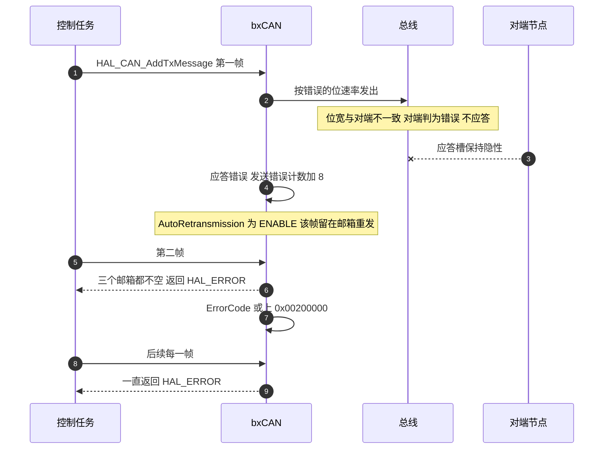
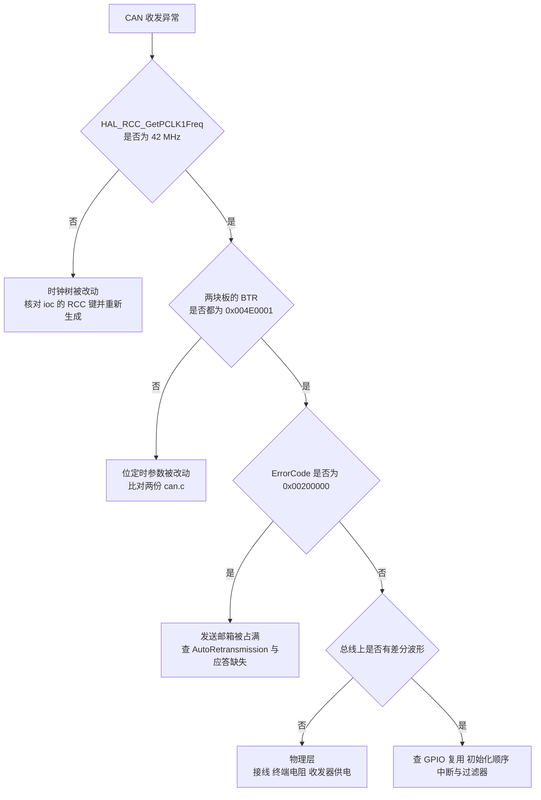

# 调试案例与排查顺序

工作记录 `can通信波特率问题.md` 记下一次 CAN 全体失效：底盘板的 CAN1 与 CAN2 都收不到报文，发送函数第一次返回 `HAL_OK`，之后一直返回 `HAL_ERROR`，假期前代码是正常的。记录给出的根因是时钟树被改动导致 APB1 频率变化。本文按源码口径重建这条链路，修正记录里两处与头文件不符的描述，并整理一份可复用的排查顺序。

> 涉及的源码：云台板 `/home/wyx/rm/2026SentriOmeniGimbal/2026OmniSentryGimbal` 与底盘板 `/home/wyx/rm/2026SentriOmeniChassis/2026OmniSentryChassis`。两块板的 `Core/Src/can.c` 与 HAL 驱动相同，行号通用。工作记录位于 `/home/wyx/Work-Summary-and-Diary/工作记录/can通信波特率问题.md`。

## 1. 概念：三条寄存器线索

记录里用调试器读回的三个值：

| 寄存器 | 读回值 |
| --- | --- |
| `hcan2.ErrorCode` | 0x00200000 |
| MSR | 0x0C08 |
| TSR | 0x82000004 |

按 CMSIS 头文件与 HAL 头文件的位定义逐位解析：

| 值 | 位定义 | 含义 | 出处 |
| --- | --- | --- | --- |
| ErrorCode 0x00200000 | `HAL_CAN_ERROR_PARAM` | 最近一次失败的调用属于参数类失败 | `stm32f4xx_hal_can.h:314` |
| MSR 0x0C08 的 bit3 | `CAN_MSR_WKUI` | 唤醒中断挂起 | `stm32f407xx.h:1813-1815` |
| MSR 0x0C08 的 bit10 | `CAN_MSR_SAMP` | 最近一次采样点的电平 | `:1825-1827` |
| MSR 0x0C08 的 bit11 | `CAN_MSR_RX` | CANRX 引脚电平 | `:1828-1830` |
| TSR 0x82000004 的 bit2 | `CAN_TSR_ALST0` | 邮箱 0 仲裁失败 | `:1839-1841` |
| TSR 0x82000004 的 bit25:24 | `CAN_TSR_CODE` | 值为 2，下一次请求使用邮箱 2 | `:1878-1880` |
| TSR 0x82000004 的 bit28:26 | `CAN_TSR_TME2` 到 `TME0` | 全为 0，三个发送邮箱都没有空位 | `:1885-1893` |
| TSR 0x82000004 的 bit31 | `CAN_TSR_LOW2` | 邮箱 2 处于最低优先级 | `:1904-1906` |

记录的文字描述里有两处与头文件对不上，按源码口径更正：

| 记录里的写法 | 源码口径 |
| --- | --- |
| 0x00200000 等于 `HAL_CAN_ERROR_NOT_STARTED` | 0x00200000 是 `HAL_CAN_ERROR_PARAM`；`NOT_STARTED` 是 0x00100000（`stm32f4xx_hal_can.h:313-314`） |
| MSR 0x0C08 表示 ERRI 挂起 | ERRI 是 MSR 的 bit2，0x0C08 的 bit2 为 0；置位的是 bit3、bit10 与 bit11 |

`HAL_CAN_ERROR_NOT_STARTED` 的产生点在 `HAL_CAN_Stop@@ 里（`stm32f4xx_hal_can.c:1088`、`:1128`），与本次现象无关。

## 2. 机制：第一次成功、之后一直失败

`HAL_CAN_AddTxMessage` 的结构决定了这两种返回值来自不同分支（`Drivers/STM32F4xx_HAL_Driver/Src/stm32f4xx_hal_can.c:1252-1342`）：

1. 先判断外设状态必须是 `READY` 或 `LISTENING`（`:1273-1274`）。
2. 读一次 TSR，检查三个 `TME` 位里是否有任意一位为 1（`:1276-1279`）。有一位为空，就填入该邮箱、置请求位并返回 `HAL_OK`（`:1281-1325`）。
3. 三个邮箱都满时，走 `else` 分支，把 `ErrorCode` 或上 `HAL_CAN_ERROR_PARAM` 并返回 `HAL_ERROR`（`:1327-1333`）。
4. 状态不满足时，或上 `HAL_CAN_ERROR_NOT_INITIALIZED`（`:1335-1341`）。

因此读到的 0x00200000 只能来自第 3 步，也就是三个邮箱全满。把这条约束与 `AutoRetransmission` 的取值放在一起，现象就能还原。两块板的 `AutoRetransmission` 都是 `ENABLE`（`Core/Src/can.c:50` 与 `:82`），发送失败或未获应答的帧会留在邮箱里自动重发。

第一次进邮箱是软件动作，与总线状态无关，所以返回 `HAL_OK`。之后失败是因为第一帧占着邮箱不肯离开。

## 3. 落到本项目

### 3.1 波特率偏差量

记录给出的根因是时钟树配置被修改，APB1 频率随 `RCC.APB1CLKDivider` 与 PLL 参数变化。位定时参数不动时，把 PCLK1 从 42 MHz 换成 36 MHz：

$$TQ = \frac{2}{36 \times 10^{6}} = 55.556\ \text{ns}$$

$$t_{bit} = 21 \times 55.556\ \text{ns} = 1166.67\ \text{ns}$$

$$f_{baud} = \frac{1}{1166.67\ \text{ns}} = 857143\ \text{bps}$$

与目标 1 Mbps 相差 14.29%。记录里写的计算波特率 857142 Hz 与这个数值一致，说明当时的 PCLK1 约为 36 MHz。仓库当前的两份 `Core/Src/can.c` 位定时参数相同，ioc 的 `RCC.APB1Freq_Value` 也都是 42000000（云台板 `2026sentriomeni.ioc:364`，底盘板 `:367`），修复已经落到代码里。

### 3.2 为什么 CAN1 与 CAN2 同时失效

两个 bxCAN 控制器都挂在 APB1 上，共用同一个 PCLK1。时钟树改动会影响两个控制器的实际位速率，因此 CAN1 与共享段上的对端板、CAN2 与四个轮子同时失去通信。这一点是判断根因在时钟树而非单条总线接线的重要依据：一条总线的故障通常只影响一条。

### 3.3 排查顺序

记录给出的优先级是时钟、GPIO 复用、外设初始化顺序、中断、物理层、应用逻辑。按第 1 节与第 2 节的推导，这个顺序对本工程成立，其中第 1 项与第 2 项的判断依据如下：

时钟树排在第一位的原因：BTR 的值不会随时钟树变化，读回来仍是 `0x004E0001`，而物理速率已经错了。寄存器正确、速率错误这一组合是本次最难判断的地方。

## 4. 易错点

| # | 易错点 | 表现 | 依据 |
| --- | --- | --- | --- |
| 1 | 按数值猜 HAL 错误码的含义 | 把 0x00200000 记成 `NOT_STARTED` | `stm32f4xx_hal_can.h:313-314` |
| 2 | 只看 ErrorCode 不看产生分支 | 把邮箱占满误判为未启动 | `stm32f4xx_hal_can.c:1276-1279` 与 `:1327-1333` |
| 3 | 相信 ioc 里的 `CalculateBaudRate` | 该值不随时钟树更新 | 用 `HAL_RCC_GetPCLK1Freq()` 反算 |
| 4 | 把 TSR 的 TME 位当成接收错误 | TME 为 0 表示邮箱没有空位 | `stm32f407xx.h:1885-1893` |
| 5 | 把 MSR 的 bit3 当 ERRI | ERRI 在 bit2 | `:1812-1815` |
| 6 | 只怀疑一块板 | 共享段上两块板都要核对，且两条 CAN2 各自独立 | 见 `01-上下板CAN拓扑.md` |
| 7 | 把第一次返回 `HAL_OK` 当成通信可用 | 进邮箱与上线是两件事 | `HAL_CAN_AddTxMessage` 的返回只表示入队 |
| 8 | 不检查发送函数的返回值 | 本例的持续失败在调用点被丢掉 | 两块板的调用点都没有接收返回值 |
| 9 | 忽略 `AutoRetransmission` | 邮箱被一帧长期占用，现象像驱动坏了 | `Core/Src/can.c:50`、`:82` |

## 5. 小结

### 核心概念

- 0x00200000 是 `HAL_CAN_ERROR_PARAM`，来自 `HAL_CAN_AddTxMessage` 三个邮箱全满的分支；`NOT_STARTED` 是 0x00100000。
- TSR 0x82000004 表示邮箱 0 仲裁失败、三个邮箱都没有空位、下一次请求指向邮箱 2。
- MSR 0x0C08 的 bit2 为 0，记录的 ERRI 结论与位定义不符；置位的是 bit3、bit10 与 bit11。
- `AutoRetransmission` 为 `ENABLE` 时，未获应答的帧留在邮箱重发，后续发送全部返回 `HAL_ERROR`。
- 两个控制器共用 PCLK1，时钟树改动会让 CAN1 与 CAN2 同时失效。
- 排查顺序里时钟树排在第一位，因为 BTR 值正确并不说明物理速率正确。

### 设计权衡

| 权衡点 | 本工程的选择 | 代价与收益 |
| --- | --- | --- |
| 根因定位 | 记录按时钟、GPIO、初始化、中断、物理层、逻辑排序 | 覆盖了共享 PCLK1 这一层；代价是每一步都要读寄存器，耗时长 |
| 错误码使用 | 记录用数值记错误码 | 排查时信息集中；代价是数值与文字对不上时容易被误导 |
| 自动重传 | `ENABLE` | 偶发仲裁失败能自恢复；代价是速率错误时现象具有误导性 |
| 返回值处理 | 调用点不接收 | 代码简洁；代价是持续失败不可见 |
| BTR 核对 | 期望值 `0x004E0001` | 一眼可比对；代价是时钟树变化不在这个寄存器里体现 |

## 6. 练习

### 基础题

1. 写出 `HAL_CAN_ERROR_PARAM` 与 `HAL_CAN_ERROR_NOT_STARTED` 的数值，并指出各自的产生分支。
2. 逐位写出 TSR 0x82000004 的四个字段与取值。
3. 说明第一次发送返回 `HAL_OK`、第二次返回 `HAL_ERROR` 的原因。

### 挑战题

4. 若把 `AutoRetransmission` 改成 `DISABLE`，本次失效的现象会怎样变化？邮箱还会被长期占用吗？
5. 设计一段上电自检：用 `HAL_RCC_GetPCLK1Freq()` 与 `BTR` 两个读数算出实际波特率，与 1 Mbps 比较并在偏差超过 1% 时停机。写出判据与处理。
6. 记录里 MSR 的 bit3 与 bit11 都置位。结合 `MCR` 的 `SLEEP` 位，说明 `WKUI` 置位可能的来因，以及在判断总线状态时应当如何取舍这两位。
7. 假设只有底盘板 CAN2 失效、CAN1 正常，按本文的排查顺序写出最短路径，并说明为什么可以直接排除时钟树。

---

### 附：本页引用的固件路径

| 路径 | 用途 |
| --- | --- |
| `/home/wyx/rm/2026SentriOmeniGimbal/2026OmniSentryGimbal/Drivers/STM32F4xx_HAL_Driver/Src/stm32f4xx_hal_can.c` | `HAL_CAN_AddTxMessage` 全满分支（:1276-1279、:1327-1333）、状态分支（:1273-1274、:1335-1341）、`HAL_CAN_Stop`（:1088、:1128） |
| `/home/wyx/rm/2026SentriOmeniGimbal/2026OmniSentryGimbal/Drivers/STM32F4xx_HAL_Driver/Inc/stm32f4xx_hal_can.h` | 错误码定义（:292-319） |
| `/home/wyx/rm/2026SentriOmeniGimbal/2026OmniSentryGimbal/Drivers/CMSIS/Device/ST/STM32F4xx/Include/stm32f407xx.h` | MSR 位域（:1806-1830）、TSR 位域（:1836-1906） |
| `/home/wyx/rm/2026SentriOmeniGimbal/2026OmniSentryGimbal/Core/Src/can.c` | 位定时（:42-46、:74-78）、`AutoRetransmission`（:50、:82） |
| `/home/wyx/rm/2026SentriOmeniGimbal/2026OmniSentryGimbal/2026sentriomeni.ioc` | 时钟树与波特率计算结果（:363-390） |
| `/home/wyx/rm/2026SentriOmeniChassis/2026OmniSentryChassis/2026sentriomeni.ioc` | 底盘板同段键（:366-393） |
| `/home/wyx/Work-Summary-and-Diary/工作记录/can通信波特率问题.md` | 失效现象、寄存器读回值与根因记录 |
