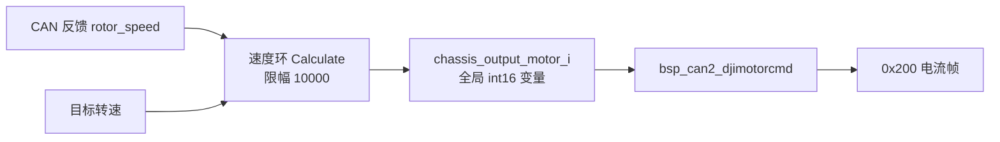
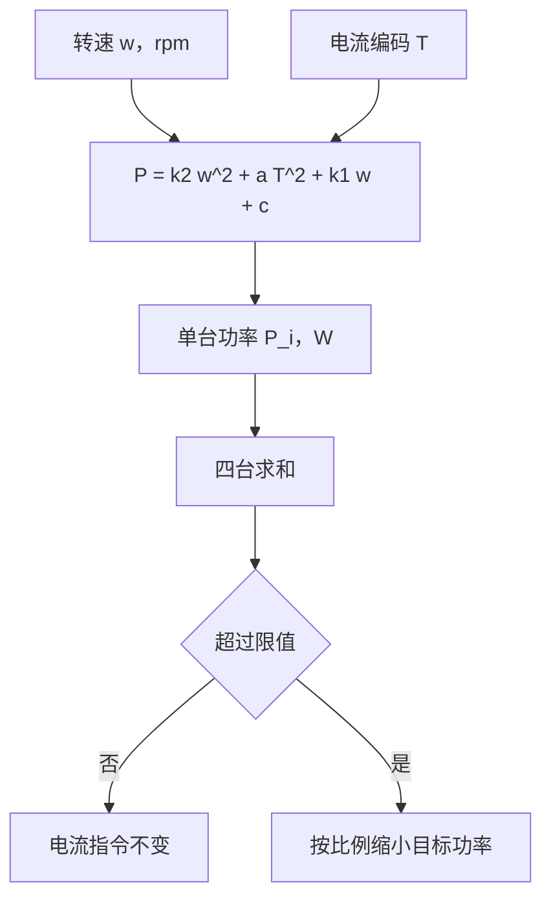

# 功率模型

底盘功率限制要把转速与电流指令换算成整车电功率，换算关系通常写成一条以转速和电流为自变量的多项式。当前检出的两块固件里没有这条多项式，也没有任何限制环节：底盘速度环算出的电流写进全局变量后，由控制中心任务直接打包成 0x200 帧发出；裁判系统下发的底盘功率上限被解出来放进全局结构体，没有任何读取点。

当前检出的真实链路与字段落点是起点；若要接入限制，模型需要处理哪些量、每个量的单位从哪里来，这些随后说明，最后给出一条通用的二次损耗模型形式。正文里凡是标注「早前记录」的内容，都指与当前检出不一致的历史叙述，结论以源码为准。

## 当前检出的底盘功率链路

底盘板的速度环在 `Task/Src/ChassisTask.cpp` 里，四个 `SpeedPID` 实例共用一组参数，输出限幅 `OUT_BOUNDARY` 是 10000（`Task/Src/ChassisTask.cpp`），每个周期的计算与写回在同一段代码里：

```cpp
chassis_output_motor_1 = motor_1_PID.Calculate(motor_1_target, chassis_motor_1.rotor_speed, dt);
chassis_output_motor_2 = motor_2_PID.Calculate(motor_2_target, chassis_motor_2.rotor_speed, dt);
chassis_output_motor_3 = motor_3_PID.Calculate(motor_3_target, chassis_motor_3.rotor_speed, dt);
chassis_output_motor_4 = motor_4_PID.Calculate(motor_4_target, chassis_motor_4.rotor_speed, dt);
```

这段代码在 `Task/Src/ChassisTask.cpp`，循环末尾是 `osDelay(1)`（`Task/Src/ChassisTask.cpp`）。四个结果没有经过任何功率换算，直接落在全局变量上。控制中心任务把它们取走并打包：

```cpp
bsp_can2_djimotorcmd(chassis_output_motor_1,chassis_output_motor_2,chassis_output_motor_3,chassis_output_motor_4);
bsp_can1_sendreferee(TotalAmmoShooted,g_referee_info.bullet_speed);
osDelay(1);  // 1ms控制周期
```

调用点与周期在 `Task/Src/ControlCenterTask.cpp`。两个任务都以 1 ms 运行，链路中间只有一个全局变量，没有预留功率环节的位置。



## 裁判系统里的两个功率相关字段

底盘板通过 UART6 接收裁判系统数据帧，`onFrame` 按命令码分发（`Communication/Src/referee_decode.cpp`）。与功率、能量有关的是两个命令码：

| 命令码 | 分支位置 | 拷贝进结构体的字段 |
| --- | --- | --- |
| 0x0201 机器人状态 | `Communication/Src/referee_decode.cpp` | `chassis_power_limit`（`Communication/Src/referee_decode.cpp`）与三路输出使能（`Communication/Src/referee_decode.cpp`） |
| 0x0202 功率与热量 | `Communication/Src/referee_decode.cpp` | `buffer_energy`（`Communication/Src/referee_decode.cpp`）与 17mm、42mm 热量（`Communication/Src/referee_decode.cpp`） |

这些字段落在 `RefereeInfo` 上：功率上限在 `Communication/Inc/referee_decode.h`，缓冲能量在 `Communication/Inc/referee_decode.h`，两个热量字段在 `Communication/Inc/referee_decode.h`。协议侧的结构体定义在 `Communication/Inc/referee_decode.h` 与 `Communication/Inc/referee_decode.h`。

全树搜索这些字段的读取点，结果只有一项：`bullet_speed` 被底盘控制中心任务用于累计发弹数并随 0x303 发出（`Task/Src/ControlCenterTask.cpp`、`Task/Src/ControlCenterTask.cpp`）。功率上限、缓冲能量、三路输出使能与两个热量字段都没有消费者，云台板连 `g_referee_info` 都没有引用。

| 字段 | 写入点 | 消费者 |
| --- | --- | --- |
| `chassis_power_limit` | `Communication/Src/referee_decode.cpp` | 无 |
| `buffer_energy` | `Communication/Src/referee_decode.cpp` | 无 |
| `shooter_heat_17mm` 与 `shooter_heat_42mm` | `Communication/Src/referee_decode.cpp` | 无 |
| `gimbal_output`、`chassis_output`、`shooter_output` | `Communication/Src/referee_decode.cpp` | 无 |
| `bullet_speed` | `Communication/Src/referee_decode.cpp` | `Task/Src/ControlCenterTask.cpp`、`Task/Src/ControlCenterTask.cpp` |

## 功率限制要面对的量与单位

裁判系统下发的是功率上限，单位瓦；底盘板能直接决定的是四路电流指令。两者之间隔着一层换算，模型要补的就是这一层。参与换算的量与它们的来源如下：

| 量 | 来源 | 单位 | 备注 |
| --- | --- | --- | --- |
| 转子转速 | CAN 反馈 `rotor_speed` | rpm | 类型 `int16_t`（`BSP/Inc/bsp_can.h`） |
| 电流指令 | 速度环输出 | 编码值 | 限幅正负 10000（`Task/Src/ChassisTask.cpp`） |
| 单台功率 | 模型计算 | W | 当前检出没有 |
| 功率上限 | `g_referee_info.chassis_power_limit` | W | 已解出，未使用 |

电流编码与安培之间的换算关系按电调手册确定，常见写法是编码满量程对应 20 A 左右。本仓库里没有这段换算代码，也没有把编码折算成安培的调用点，因此模型如果直接用编码值，系数的量纲就绑在编码定义上，编码范围一改系数必须重算。

## 单台电机功率模型的一般形式

电功率由机械输出与损耗两部分组成。按损耗来源拆成四类，可以把单台功率写成转速与电流的二次式：

$$P_i = k_2 \omega_i^2 + a T_i^2 + k_1 \omega_i + c$$

| 项 | 物理来源 | 量纲 | 与转速、电流的关系 |
| --- | --- | --- | --- |
| $k_2\omega^2$ | 铁损与风阻 | $\text{W}/\text{rpm}^2$ | 与转速平方相关 |
| $aT^2$ | 铜损 | $\text{W}/\text{code}^2$ | 与电流平方相关 |
| $k_1\omega$ | 机械阻尼 | $\text{W}/\text{rpm}$ | 与转速一次方相关 |
| $c$ | 静态损耗 | W | 与工况无关 |

这个形式里没有机械功率项 $T\omega$。省掉它的代价是模型对电流方向不敏感：同一转速下 $+T$ 与 $-T$ 的估计功率相同，回馈制动时的实际取电会被高估，限制器因此提前介入。保留它的代价是系数拟合更难分开阻尼项与机械项。

需要强调的是，上面只是模型形式。当前检出里没有任何一组 $k_2$、$a$、$k_1$、$c$ 常量，`Algorithm/Src/motor_power_control.c` 与 `Algorithm/Inc/motor_power_control.h` 两棵树都没有，`chassis_move_t`、`motor_power_limit`、`max_power_W` 全树搜索也没有命中。早前记录里出现过一组具体系数与以它为基础的算例，那些数值无法在本机复现，本页不再引用。

```c
/* 设计示意，当前检出没有对应实现 */
static const fp32 k1 = ...;   /* W/rpm    */
static const fp32 k2 = ...;   /* W/rpm^2  */
static const fp32 a  = ...;   /* W/code^2 */
static const fp32 c  = ...;   /* W        */

power[i] = k2 * w * w + a * T * T + k1 * w + c;
```



## 两个输入的口径核对

模型本身不检查单位，单位写错只会得到一个数值上看起来合理的功率。接入之前先把可用与不可用的口径并排列出：

| 输入 | 可用口径 | 常见错用 | 错用后的表现 |
| --- | --- | --- | --- |
| 转速 | 转子 rpm，取自 CAN 反馈 | 底盘线速度（米每秒） | 转速项偏小，高速时低估功率 |
| 转速 | 转子 rpm | 弧度每秒 | 系数需按 $\pi/30$ 折算，否则低估 |
| 电流 | 速度环输出的编码值 | 安培或牛米 | 电流项相差几个数量级 |
| 电流 | 本轮速度环输出 | 上一轮或他轮的输出 | 单台估计互相串位 |
| 轮次 | 与反馈同一个下标 | 下标错位 | 某台电机功率被反复计入 |

最后一行的错误不会被数值大小暴露：转速与电流都取对，只是配错了轮次，总量看起来正常而单台限幅错位。核对时把四个下标与 CAN 反馈的标识符一起打印。

## 常见判断偏差

| # | 判断偏差 | 纠正方法 | 源码位置 |
| --- | --- | --- | --- |
| 1 | 认为当前固件有功率限制器 | 链路里没有换算与比较，输出直发 0x200 | `Task/Src/ChassisTask.cpp`、`Task/Src/ControlCenterTask.cpp` |
| 2 | 认为裁判系统的功率上限已生效 | 字段只被写入，全树没有读取点 | `Communication/Src/referee_decode.cpp` |
| 3 | 把文档里的系数当成实现 | 两棵树都没有那份文件 | 见「单台电机功率模型的一般形式」 |
| 4 | 把缓冲能量当成瞬时功率 | 前者单位焦，后者单位瓦 | `Communication/Src/referee_decode.cpp` |
| 5 | 认为两个任务的刷新节奏不同 | 都是 1 ms | `Task/Src/ChassisTask.cpp`、`Task/Src/ControlCenterTask.cpp` |
| 6 | 认为模型能表达回馈制动 | 没有机械功率项，正负电流估计相同 | 见「单台电机功率模型的一般形式」 |

## 小结

### 核心概念

- 当前检出的底盘功率链路是速度环输出直发 0x200，没有功率换算与限制环节。
- 裁判系统的功率上限、缓冲能量、输出使能与两个热量字段都已解出，除了 `bullet_speed` 之外没有消费者。
- 模型的一般形式是转速与电流的二次式，四项分别对应铁损、铜损、阻尼与静态损耗。
- 模型缺少机械功率项，对电流方向不敏感，接入后会在回馈制动时偏保守。
- 输入口径固定为转子 rpm 与电流编码，换单位必须重新拟合系数。

### 设计权衡

| 权衡点 | 可选的取舍 | 收益与代价 |
| --- | --- | --- |
| 解析式还是标定表 | 二次解析式 | 不需要标定数据；代价是系数固定，换电机要重拟合 |
| 是否含机械功率项 | 不含 | 表达式简单；代价是回馈制动时高估功率 |
| 常数项是否保留 | 保留 | 低转速时更接近实测；代价是四台固定多算一项 |
| 电流用编码还是安培 | 编码 | 与速度环输出直接对接；代价是系数量纲依赖编码定义 |
| 限值来源 | 裁判系统字段 | 跟随规则变化；代价是断连时需要定义回落值 |

## 练习

### 基础题

1. 按「当前检出的底盘功率链路」，写出从目标转速到 0x200 帧的调用顺序与所在函数。
2. 在源码里找出 `chassis_power_limit` 的全部出现位置，说明它为什么没有消费者。
3. 写出四项损耗各自的量纲，并说明把转速单位从 rpm 改成 rad/s 后哪些系数需要折算。
4. 说明为什么电流用编码值时，改电调或改编码范围必须重新拟合系数。

### 挑战题

5. 设计一次台架实验：采集转速、电流指令与母线功率，拟合一组合适的 $k_2$、$a$、$k_1$、$c$，说明采样周期与样本配对方法。
6. 给模型补上机械功率项 $T\omega$，推导它与 $k_1\omega$ 的关系，说明实测时两者难以分开的原因。
7. 把限制器接入当前链路：列出需要改动的调用点、数据结构与默认限值，并说明放错位置时会破坏什么。
8. 统计四台电机在一个 1 ms 周期内的功率估计开销，说明为什么这类计算不能放在 CAN 接收回调里。

## 附：本页引用的固件路径

| 路径 | 用途 |
| --- | --- |
| `底盘板 Task/Src/ChassisTask.cpp` | 速度环输出与限幅、循环周期（`Task/Src/ChassisTask.cpp`、`Task/Src/ChassisTask.cpp`、`Task/Src/ChassisTask.cpp`） |
| `底盘板 Task/Src/ControlCenterTask.cpp` | 0x200 发送与周期（`Task/Src/ControlCenterTask.cpp`）、发弹数累计（`Task/Src/ControlCenterTask.cpp`） |
| `底盘板 Communication/Src/referee_decode.cpp` | 功率上限与缓冲能量的写入点（`Communication/Src/referee_decode.cpp`、`Communication/Src/referee_decode.cpp`） |
| `底盘板 Communication/Inc/referee_decode.h` | 协议结构体与 `RefereeInfo`（`Communication/Inc/referee_decode.h`、`Communication/Inc/referee_decode.h`） |
| `底盘板 BSP/Inc/bsp_can.h` | `rotor_speed` 类型（`BSP/Inc/bsp_can.h`） |
