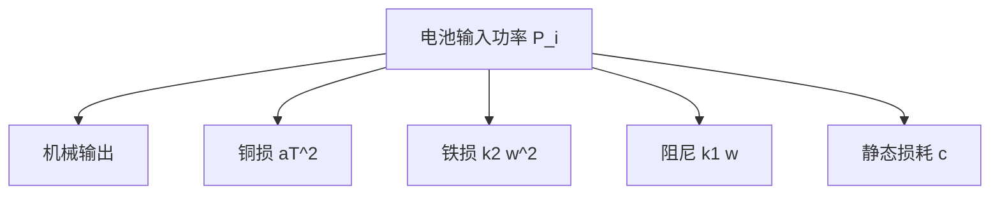
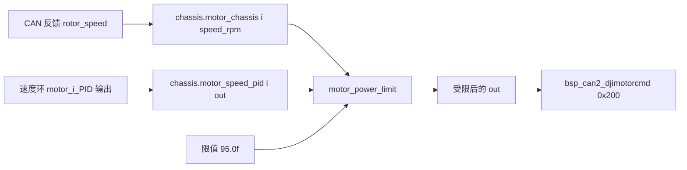

# 功率模型

底盘功率限制要把转速与电流指令换算成整车电功率。本工程用一条二次多项式做这个换算，四个系数固定在源码里，正向估计与反向求解共用同一组系数。本文说明这条多项式的物理来源、每个系数的量纲，以及两个输入量在固件里的来源。

## 1. 概念：被约束的量

裁判系统下发的限制是底盘功率上限，单位瓦。底盘板能直接决定的是四路电流编码；转速由负载、路面与运动学解算共同决定。两者之间差一个映射，模型的作用就是补上它。

| 量 | 符号 | 固件来源 | 单位 |
| --- | --- | --- | --- |
| 转子转速 | $\omega_i$ | `chassis_motor_i.rotor_speed` | rpm |
| 电流编码 | $T_i$ | 速度环 `motor_i_PID.Calculate` 的输出 | 编码值 |
| 单台功率 | $P_i$ | 模型计算 | W |
| 限制值 | $P_{\max}$ | 调用点实参 | W |

电流编码与安培的换算关系是 $I = \text{code} \times 20 / 16384\ \text{A}$。模型只用编码值，不换算成安培，也不换算成牛米。

## 2. 模型：损耗的分解

电机从电池取的电功率分成机械输出与损耗两部分。损耗按来源分成四类：

| 损耗 | 成因 | 与转速、力矩的关系 |
| --- | --- | --- |
| 铜损（Copper Loss） | 绕组电阻上的 $I^2R$ | 与电流平方成正比，电流近似正比于力矩 |
| 铁损（Iron Loss） | 磁滞与涡流 | 与转速、转速平方相关 |
| 机械阻尼 | 减速箱摩擦与风阻 | 与转速相关 |
| 静态损耗 | 驱动电路、传感器、控制器 | 与工况无关的常数 |

把这些项归并，本工程使用的单台电机功率模型是：

$$P_i = k_2 \omega_i^2 + a T_i^2 + k_1 \omega_i + c$$

**常数项** $c$ 对应静态损耗。M3508 在转速与力矩都接近零时并不消耗零功率，驱动板、编码器与散热风扇都有固定开销。这一项同时吸收了拟合过程中的整体偏置。

模型里没有机械功率项 $T\omega$。常见的底盘模型会把机械输出写成 $\tau\omega$，回馈制动时该项为负。本工程没有这一项，$k_1\omega$ 在正向计算中又与力矩无关，因此 $P_i(\omega, +T)$ 与 $P_i(\omega, -T)$ 数值相同。



### 2.1 系数量纲

以 $\omega$ 取 rpm、$T$ 取电流编码为单位，各系数的量纲如下。

| 系数 | 值 | 固件行 | 量纲 | 数值含义 |
| --- | --- | --- | --- | --- |
| `k2` | `1.453e-07f` | `motor_power_control.c:4` | $\text{W}/\text{rpm}^2$ | 转速平方项的权重 |
| `a` | `1.23e-07f` | `:5` | $\text{W}/\text{code}^2$ | 电流编码平方项的权重 |
| `k1` | `1.99688994e-6f` | `:3` | $\text{W}/\text{rpm}$ | 转速一次项的权重 |
| `constant` | `4.081f` | `:6` | W | 静态损耗 |

### 2.2 数值量级

取电流编码 $T = 10000$（速度环输出上限），逐项列出各转速下的贡献：

| 转速 rpm | $k_1\omega$ | $k_2\omega^2$ | $aT^2$ | $c$ | $P_i$ |
| --- | --- | --- | --- | --- | --- |
| 0 | 0.0000 | 0.0000 | 12.3000 | 4.081 | 16.381 |
| 2000 | 0.0040 | 0.5812 | 12.3000 | 4.081 | 16.966 |
| 4000 | 0.0080 | 2.3248 | 12.3000 | 4.081 | 18.714 |
| 6000 | 0.0120 | 5.2308 | 12.3000 | 4.081 | 21.624 |
| 8000 | 0.0160 | 9.2992 | 12.3000 | 4.081 | 25.696 |

$k_1\omega$ 在底盘转速区间内不到 0.02 W，$c$ 固定占 4.081 W，主要变化来自 $aT^2$ 与 $k_2\omega^2$。四台电机同时满电流、8000 rpm 时总量约 102.8 W。

单台功率随转速与电流编码的变化：

| 转速（rpm）/ 编码 $T$ | 3000 | 6000 | 10000 |
| --- | --- | --- | --- |
| 3000 | 6.50 | 9.82 | 17.70 |
| 5000 | 8.83 | 12.15 | 20.02 |
| 7000 | 12.32 | 15.64 | 23.52 |

同表数值乘 4 得到整车估计。7000 rpm 与满电流时四台合计 94.1 W，已经逼近调用点的 95 W。

## 3. 落到本项目

系数定义在 `Algorithm/Src/motor_power_control.c:3-6`，正向计算在 `:17`：

```c
static const fp32 k1 = 1.99688994e-6f;
static const fp32 k2 = 1.453e-07f;
static const fp32 a  = 1.23e-07f;
static const fp32 constant = 4.081f;

power[i] = k2 * w * w + a * T * T + k1 * w + constant;
if (power[i] < 0) power[i] = 0;
```

`fp32` 是 `float` 的别名（`Algorithm/Inc/motor_power_control.h:11`）。计算结果为负时直接置 0（`:18`）。以当前系数计算，$P_i$ 对 $\omega$ 的极小值出现在 $\omega = -k_1/(2k_2) \approx -6.9$ rpm，最小值约为 $aT^2 + 4.081 - 6.9\times10^{-6}$，恒大于零，这一分支不会被触发。

模型的两个输入由调用方在调用前填好：

| 结构体字段 | 填入内容 | 行号 |
| --- | --- | --- |
| `motor_chassis[i].speed_rpm` | 对应电机的 `rotor_speed` | `Task/Src/ControlCenterTask.cpp:133-136` |
| `motor_speed_pid[i].out` | 对应电机的速度环输出 | `:138-141` |
| 限值 | `95.0f` | `:143` |

`motor_chassis[i].speed_rpm` 的类型是 `int16_t`（`Algorithm/Inc/motor_power_control.h:20`），`rotor_speed` 也是 `int16_t`（`BSP/Inc/bsp_can.h:12`），赋值不丢精度。速度环输出的限幅是正负 10000（`Task/Src/ChassisTask.cpp:41` 的 `OUT_BOUNDARY`），所以 $T$ 的输入范围是 $[-10000, 10000]$。



## 4. 易错点

| # | 易错点 | 后果 | 源码位置 |
| --- | --- | --- | --- |
| 1 | 把 $T$ 当成牛米 | 系数 $a$ 按编码值拟合，换成牛米后数值差几个数量级 | `motor_power_control.c:5` |
| 2 | 把 $\omega$ 当成底盘线速度 | 模型输入是转子 rpm，用线速度会让转速项严重偏小 | `:15` |
| 3 | 忽略常数项 | 四台合计少算 16.3 W，低速大电流时偏差最大 | `:6` |
| 4 | 认为 $k_1\omega$ 可以删掉 | 正向计算里它确实小，反向求解把同一个量当作了 $T$ 的系数 | `:32` |
| 5 | 把 $\omega$ 当成弧度每秒 | 系数按 rpm 拟合，换成弧度每秒要重算 $k_1$ 与 $k_2$ | `:4`、`:3` |
| 6 | 认为 `:18` 的置零分支会触发 | 模型对 $\omega$ 的极小值仍大于 $c$ | `:18` |

第 4 条牵涉到正向模型与解方程之间的系数位置差异，在功率限制算法一页展开。

## 5. 小结

### 核心概念

- 单台电机功率用 $P_i = k_2\omega^2 + aT^2 + k_1\omega + c$ 估计，单位分别是 W、rpm 与电流编码。
- $aT^2$ 对应铜损，$k_2\omega^2$ 与 $k_1\omega$ 对应铁损与阻尼，$c$ 对应静态损耗。
- 模型不含机械功率项 $T\omega$，$P_i$ 对 $T$ 是偶函数。
- $P_i$ 对 $\omega$ 的极小值出现在约 -6.9 rpm，最小值仍大于 $c$，`:18` 的置零分支不触发。
- 输入来自四轮转速反馈与本轮速度环输出，调用点在 `ControlCenterTask.cpp:143`，限值写成 `95.0f`。

### 设计权衡

| 权衡点 | 本工程的选择 | 收益与代价 |
| --- | --- | --- |
| 解析模型还是标定表 | 二次解析式 | 不需要标定；代价是系数固定，换电机或减速比要重新拟合 |
| 是否含机械功率项 | 不含 | 表达式简单；代价是回馈制动时的功率被高估 |
| 常数项是否保留 | 保留 | 低转速时的估计更接近实测；代价是四台固定多算 16.3 W |
| 用编码值还是安培 | 编码值 | 与速度环输出直接对接；代价是系数量纲依赖编码定义 |

## 6. 练习

### 基础题

1. 用 `motor_power_control.c:3-6` 的系数，计算 $\omega = 4000$ rpm、$T = 8000$ 时单台电机的功率与四台合计。
2. 写出 $k_1\omega$ 与 $c$ 两项在 $\omega = 0$ 时的取值，并说明此时 $P_i$ 不为零的原因。
3. 把 $\omega$ 的单位从 rpm 改成 rad/s 后，$k_1$ 与 $k_2$ 应如何折算。

### 挑战题

4. 用台架数据拟合一组自己的系数：说明需要采集哪些量、采样周期如何选、怎样把转速与电流编码配成回归样本。
5. 给模型补上机械功率项 $T\omega$，推导它与 $k_1\omega$ 的关系，说明实测时两者难以分开的原因。
6. 设计一个只读的观测点，在不改 `motor_power_limit` 接口的前提下输出每周期四台电机的 $P_i$ 与总量。

### 附：本页引用的固件路径

| 路径 | 用途 |
| --- | --- |
| `/home/wyx/rm/2026SentriOmeniChassis/2026OmniSentryChassis/Algorithm/Src/motor_power_control.c` | 系数定义与正向计算（`:3-18`） |
| `/home/wyx/rm/2026SentriOmeniChassis/2026OmniSentryChassis/Algorithm/Inc/motor_power_control.h` | `fp32`、`motor_pid_t`、`motor_measure_t`、`chassis_move_t`（`:11-26`） |
| `/home/wyx/rm/2026SentriOmeniChassis/2026OmniSentryChassis/Task/Src/ControlCenterTask.cpp` | 输入填充与调用点（`:133-143`） |
| `/home/wyx/rm/2026SentriOmeniChassis/2026OmniSentryChassis/Task/Src/ChassisTask.cpp` | 速度环输出限幅 `OUT_BOUNDARY`（`:41`） |
| `/home/wyx/rm/2026SentriOmeniChassis/2026OmniSentryChassis/BSP/Inc/bsp_can.h` | `rotor_speed` 类型（`:12`） |
