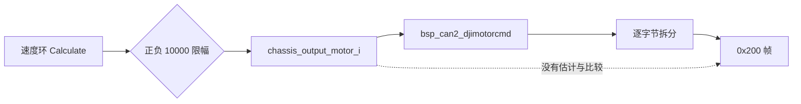
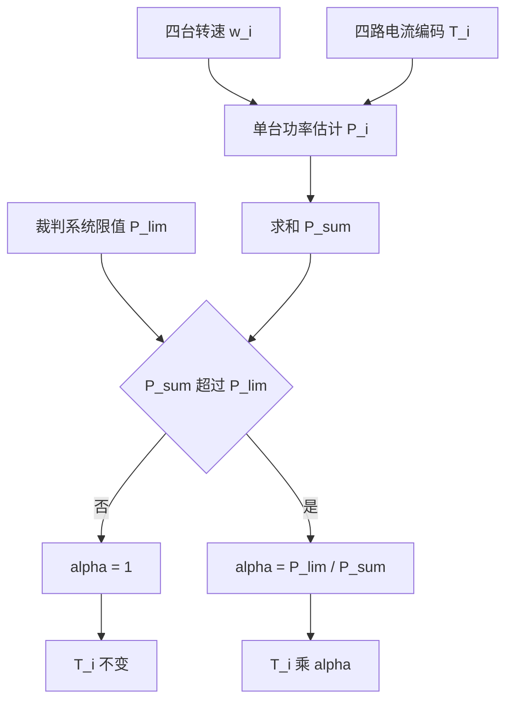

# 功率限制算法

功率限制算法要回答两个问题：整车功率超过限值时把哪一路电流改多少；在给定转速下，单台电机的功率上限对应多大的电流编码。当前检出的底盘固件只回答了第一个问题的前一半，四路电流指令从速度环出来就被打包发走，中间没有估计、比较与缩放三步中的任何一步。

要说明这条算法为什么现在不存在，得先把 0x200 帧的生成路径走一遍，再看裁判系统下发的限值停在哪一层。这两段都确认之后，才谈得上把限制器插在什么位置、用什么策略分配、怎样从功率反解电流。下文凡涉及具体实现的部分都标注为设计意图，当前检出没有对应代码。

## 当前检出里没有限制环节

底盘板的四路电流指令来自速度环，写入 `chassis_output_motor_1` 到 `chassis_output_motor_4`（`Task/Src/ChassisTask.cpp:89-92`），声明为 `int16_t`（`Task/Src/ChassisTask.cpp:15-18`）。控制中心任务把它们原样转给 CAN 封装：

```cpp
bsp_can2_djimotorcmd(chassis_output_motor_1,chassis_output_motor_2,chassis_output_motor_3,chassis_output_motor_4);
```

这一句在 `Task/Src/ControlCenterTask.cpp:126`。C 封装 `bsp_can2_djimotorcmd` 转到类方法 `BSP_CAN2_DJIMotorCmd`（`BSP/Src/bsp_can.cpp:667-671`），后者把四个 int16 逐字节拆进 8 字节数据区（`BSP/Src/bsp_can.cpp:83-109`），帧头 StdId 固定为 0x200（`BSP/Src/bsp_can.cpp:91`）。这条路径上没有功率两个字。

链路上确实存在两个边界，但都不构成功率限制：

| 边界 | 位置 | 作用 | 是否涉及功率 |
| --- | --- | --- | --- |
| 速度环输出限幅 | `Task/Src/ChassisTask.cpp:41` | 把 PID 输出钳在正负 10000 | 否，与转速无关 |
| int16 打包 | `BSP/Src/bsp_can.cpp:97-104` | 保证字节拆分不溢出 | 否，只保护数据类型 |
| 全局变量的类型 | `Task/Src/ControlCenterTask.cpp:25-28` | 声明为 `uint16_t`，定义为 `int16_t` | 否，但会改变负值语义 |

第三行需要单独看一眼：全局量在 `Task/Src/ChassisTask.cpp:15-18` 定义成 `int16_t`，在 `Task/Src/ControlCenterTask.cpp:25-28` 声明成 `uint16_t`，而封装函数形参是 `int16_t`（`BSP/Inc/bsp_can.h:99`）。实参在传参时按 `int16_t` 重新解释，负值仍能正确还原，但任何在声明侧做的比较都会把负值当成大正数。限制器如果加在这两个声明之间，必须先统一类型。



## 裁判系统功率上限能提供什么

裁判系统在 0x0201 帧里给出底盘功率上限，解码后落在 `g_referee_info.chassis_power_limit`（`Communication/Src/referee_decode.cpp:65`，结构体成员在 `Communication/Inc/referee_decode.h:470`）。0x0202 帧另外给出缓冲能量与两个热量值（`Communication/Src/referee_decode.cpp:86-89`）。这些字段的读取点在全树搜索里为零，云台板连 `g_referee_info` 都没有引用。

限制器要运转，除了限值本身还需要三样东西，当前都没有定义：

| 需要的输入 | 现状 | 说明 |
| --- | --- | --- |
| 功率限值 | 已解出，未使用 | 单位瓦，随规则变化 |
| 功率估计 | 不存在 | 需要转速与电流两类量 |
| 分配策略 | 不存在 | 决定超限时缩减哪一路 |
| 失效回落 | 不存在 | 裁判系统断连时用哪个限值 |

最后一列不是实现细节。裁判系统未接入时 `chassis_power_limit` 保持初值 0（`Communication/Inc/referee_decode.h:470`），如果限制器直接拿 0 当限值，四路电流会被压到零，整车上电即失去动力。接入时必须先判断数据是否有效，再决定用实测限值还是保守上限。

## 超限后的分配策略

估计功率超过限值时，缩减量的分配有几种做法，取舍点在于各轮负载是否允许重新分配：

| 策略 | 做法 | 优点 | 代价 |
| --- | --- | --- | --- |
| 等比缩放 | 四路乘同一个系数 $\alpha$ | 转向特性不变，实现最简单 | 单轮过载时整体变慢 |
| 单轮优先 | 只缩减负载最轻的一路 | 其他轮保持输出 | 会产生额外偏航力矩 |
| 减速优先 | 先降转速目标，再降电流 | 物理量更接近功率来源 | 增加与速度环的耦合 |
| 只降上限 | 提高速度环限幅的触发阈值 | 不改发送层 | 与功率没有直接关系 |

等比缩放的计算量最小，也最容易验证：先按模型算出四台估计功率之和 $P_{\text{sum}}$，再取

$$\alpha = \min\left(1, \frac{P_{\text{lim}}}{P_{\text{sum}}}\right)$$

四路电流指令分别乘 $\alpha$ 后再进入限幅。这条式子只保证估计功率不超限，不保证分配后仍然满足转向需求，因此 $\alpha$ 的下降速率通常还要加一阶滤波，避免负载突变时指令抖动。



## 从功率上限反解电流目标

单台功率模型写成转速与电流的二次式后，反解就是解一个一元二次方程。设限值平均到四台为 $P_{i,\text{lim}} = P_{\text{lim}}/4$，与转速有关的部分记为

$$K(\omega_i) = k_2\omega_i^2 + k_1\omega_i + c$$

电流项满足 $a T_i^2 = P_{i,\text{lim}} - K(\omega_i)$。若右侧为负，说明该转速下的空载损耗已经超过单台限值，电流目标只能取零；否则

$$T_i = \operatorname{sign}(T_{i,\text{pid}}) \cdot \sqrt{\frac{P_{i,\text{lim}} - K(\omega_i)}{a}}$$

符号取自速度环输出，因为平方根只给出幅值。算出目标后再按速度环原有的 10000 限幅与 int16 范围各钳一次，才能交给发送层。整个过程只用到四则运算与一次开方，开销足够放进 1 ms 的循环（`Task/Src/ControlCenterTask.cpp:128`、`Task/Src/ChassisTask.cpp:94`）。

```c
/* 设计示意，当前检出没有对应实现 */
p_i    = k2 * w * w + k1 * w + c;      /* W，与电流无关的部分 */
head   = P_lim / 4.0f - p_i;
target = (head <= 0.0f) ? 0.0f
                        : copysignf(sqrtf(head / a), T_pid);
target = fminf(fmaxf(target, -10000.0f), 10000.0f);
out[i] = (int16_t)target;
```

| 边界情形 | 判别式或右侧取值 | 处理 |
| --- | --- | --- |
| 转速很低、电流很大 | $P_{i,\text{lim}} - K > 0$ 且很大 | 开方后由 10000 限幅截断 |
| 转速很高、电流为零 | $P_{i,\text{lim}} - K \le 0$ | 目标取零，四轮全部失去输出 |
| 转速接近零 | $K \approx c$ | 开方结果对 $c$ 的误差敏感 |
| 电流目标与速度环符号相反 | 符号取反会变成制动 | 符号一律跟速度环输出 |

第二行是这类算法最需要警惕的工况：限值一旦低于四台空载损耗，算法会把电流全部清零，整车在高速时反而失去动力。工程上通常不直接把目标清零，而是保留一个与限值同方向的最小输出，具体数值需要实测。

## 落地需要改动的位置

| 改动项 | 位置 | 说明 |
| --- | --- | --- |
| 估计与缩放 | `Task/Src/ControlCenterTask.cpp:126` 之前 | 只有这一处同时拿到四路电流与裁判数据 |
| 转速输入 | `Task/Src/ChassisTask.cpp:89-92` 用到的 `rotor_speed` | 同一个反馈源，可直接复用 |
| 类型统一 | `Task/Src/ControlCenterTask.cpp:25-28` | 与 `Task/Src/ChassisTask.cpp:15-18` 对齐为有符号 |
| 限值来源 | `Communication/Src/referee_decode.cpp:65` | 加有效性判断后再使用 |
| 默认限值 | 无 | 需要按实测与规则确定，本仓库没有依据 |
| 周期 | 两个任务都是 1 ms | 估计与发送同拍，不需要额外同步 |

插入点选在 CCT 的原因是四路电流在这里汇合。放在 `ChassisTask.cpp` 里只能看到单台，放不进总和；放在发送函数里拿不到转速。插入点之前还需要一次有效性判断，否则会出现上一节提到的零限值问题。

## 常见判断偏差

| # | 判断偏差 | 纠正方法 |
| --- | --- | --- |
| 1 | 认为 0x200 帧里有功率字段 | 帧内容只有四路 int16 电流，`BSP/Src/bsp_can.cpp:97-104` |
| 2 | 把速度环限幅当成功率限制 | 限幅值是固定常数 10000，`Task/Src/ChassisTask.cpp:41` |
| 3 | 认为 $α$ 只影响功率 | $α$ 同时改变四轮推力，须与转向环一起验证 |
| 4 | 用声明侧类型做比较 | 全局量在 CCT 里声明为 `uint16_t`，`Task/Src/ControlCenterTask.cpp:25-28` |
| 5 | 断连时直接用解出的限值 | 初值为 0，会把电流清零，`Communication/Inc/referee_decode.h:470` |
| 6 | 认为算法能处理回馈制动 | 模型没有机械功率项，正负电流估计相同 |

## 小结

### 核心概念

- 当前检出的链路是速度环输出直接进 0x200 帧，估计、比较、缩放三步都不存在。
- 裁判系统已给出功率上限，但没有任何读取点，接入前要先定义有效性判断与回落值。
- 超限后的分配以等比缩放最易实现，系数取限值与估计总功率之比。
- 单台电流目标由功率模型反解，符号必须跟随速度环输出，再依次经过 10000 与 int16 两次钳位。
- 高速低限值工况会把电流目标压到零，需要保留最小输出。

### 设计权衡

| 权衡点 | 可选做法 | 收益与代价 |
| --- | --- | --- |
| 分配策略 | 等比缩放 | 转向特性不变；代价是整体变慢 |
| 插入位置 | 控制中心任务 | 四路汇聚；代价是所有底盘功率计算集中在一处 |
| 估计频率 | 与发送同拍 | 无额外同步；代价是每 1 ms 重复一次开方 |
| 限值失效处理 | 保守上限 | 保持可控；代价是与实测相差大 |
| 目标下限 | 保留最小输出 | 避免高速失动力；代价是可能超限 |

## 练习

### 基础题

1. 写出从 `chassis_output_motor_1` 到 0x200 帧的完整调用链与行号。
2. 说明 `chassis_output_motor_i` 在 CCT 与 ChassisTask 里的类型差异会造成什么后果。
3. 设四台估计功率之和为 300 W、限值为 180 W，求缩放系数 $\alpha$。
4. 写出反解公式中右侧为负时电流目标应取的值，并说明原因。

### 挑战题

5. 给定一组转速与电流，推导 $a$ 的估计方法，说明为什么不能用单一工况拟合出 $a$。
6. 设计 $α$ 的一阶滤波器，给出系数选择依据，并分析滤波带来的超限持续时间。
7. 把估算改成先分配总功率再反解电流，比较两种实现的计算量与超限幅度。
8. 设计一次整车实验：同时记录母线功率、四路电流与裁判系统限值，验证限制器是否按预期介入。

## 附：本页引用的固件路径

| 路径 | 用途 |
| --- | --- |
| `/home/wyx/rm/2026SentriOmeniChassis/2026OmniSentryChassis/Task/Src/ControlCenterTask.cpp` | 0x200 发送与周期、全局量声明（`Task/Src/ControlCenterTask.cpp:25-28`、`Task/Src/ControlCenterTask.cpp:126-128`） |
| `/home/wyx/rm/2026SentriOmeniChassis/2026OmniSentryChassis/Task/Src/ChassisTask.cpp` | 速度环输出与限幅（`Task/Src/ChassisTask.cpp:15-18`、`Task/Src/ChassisTask.cpp:41`、`Task/Src/ChassisTask.cpp:89-94`） |
| `/home/wyx/rm/2026SentriOmeniChassis/2026OmniSentryChassis/BSP/Src/bsp_can.cpp` | 0x200 帧头与打包（`BSP/Src/bsp_can.cpp:83-109`）、C 封装（`BSP/Src/bsp_can.cpp:667-671`） |
| `/home/wyx/rm/2026SentriOmeniChassis/2026OmniSentryChassis/BSP/Inc/bsp_can.h` | 封装函数形参（`BSP/Inc/bsp_can.h:99`） |
| `/home/wyx/rm/2026SentriOmeniChassis/2026OmniSentryChassis/Communication/Src/referee_decode.cpp` | 功率上限与能量字段写入（`Communication/Src/referee_decode.cpp:65`、`Communication/Src/referee_decode.cpp:86-89`） |
| `/home/wyx/rm/2026SentriOmeniChassis/2026OmniSentryChassis/Communication/Inc/referee_decode.h` | `chassis_power_limit` 初值与成员（`Communication/Inc/referee_decode.h:470`、`Communication/Inc/referee_decode.h:477`） |
