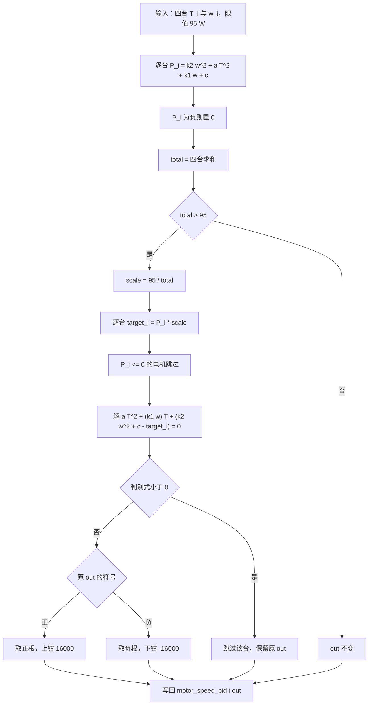
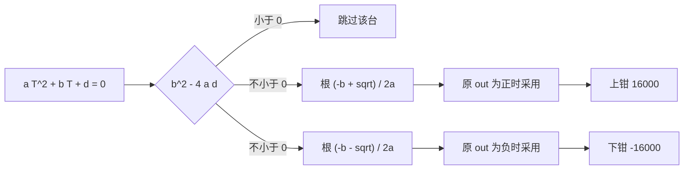

# 功率限制算法

功率限制器拿到四台电机的转速与本轮电流指令，先估计总功率，超过限值时把每台电机的目标功率按比例缩小，再逐台反解电流指令。本文按 `Algorithm/Src/motor_power_control.c` 的顺序逐行对照，重点在二次方程的根、判别式小于零的分支，以及正向模型与反向方程之间的系数位置差异。

## 1. 概念：受限下的分配

四台电机的电流指令构成四个自由变量。功率约束给出一条等式，可行域从四维降到三维。分配策略决定在这三维里怎么选：

| 策略 | 做法 | 特点 |
| --- | --- | --- |
| 等比缩放 | 每台目标功率乘同一个系数 | 各轮牵引力比例不变，实现简单 |
| 按误差分配 | 把功率优先分给误差大的轮 | 响应快，需要额外的置信度设计 |
| 直接截断 | 只减超限的那一台 | 会改变整车受力方向 |

本工程用等比缩放。

## 2. 算法流程

## 3. 逐行对照

| 行号 | 代码 | 作用 |
| --- | --- | --- |
| `:8` | `void motor_power_limit(chassis_move_t *chassis, fp32 max_power_W)` | 接口，就地修改结构体 |
| `:10` | `fp32 power[4] = {0};` | 单台功率数组 |
| `:11` | `fp32 total = 0;` | 总功率累加器 |
| `:13-16` | 循环读取 `motor_speed_pid[i].out` 与 `motor_chassis[i].speed_rpm` | 取本轮输入 |
| `:17` | `power[i] = k2*w*w + a*T*T + k1*w + constant;` | 正向模型 |
| `:18` | `if (power[i] < 0) power[i] = 0;` | 负功率置零 |
| `:22` | `if (total > max_power_W)` | 超限判据 |
| `:23` | `fp32 scale = max_power_W / total;` | 缩放比 |
| `:25-26` | 循环，`power[i] <= 0` 时 `continue` | 跳过零功率电机 |
| `:28-30` | 计算 `target_power`、`T_orig`、`w` | 单台目标功率与原始输出 |
| `:32` | `fp32 b = k1 * w;` | 二次方程的一次项系数 |
| `:33` | `fp32 c = k2*w*w - target_power + constant;` | 常数项 |
| `:34` | `fp32 disc = b*b - 4.0f*a*c;` | 判别式 |
| `:36` | `if (disc < 0) continue;` | 无实根则跳过 |
| `:38-40` | 原输出为正时取 $(-b + \sqrt{\text{disc}})/(2a)$，上限 16000 | 正根分支 |
| `:41-43` | 原输出为负时取 $(-b - \sqrt{\text{disc}})/(2a)$，下限 -16000 | 负根分支 |

## 4. 反解与根的符号

把目标功率代回正向模型：

$$P_i' = k_2\omega_i^2 + aT_i^2 + k_1\omega_i + c$$

移项得到关于 $T_i$ 的一元二次方程。源码按下面的形式排列（`:32-33`）：

$$aT_i^2 + (k_1\omega_i)T_i + \left(k_2\omega_i^2 + c - P_i'\right) = 0$$

记 $b = k_1\omega_i$、$d = k_2\omega_i^2 + c - P_i'$，则

$$T_i = \frac{-b \pm \sqrt{b^2 - 4ad}}{2a}$$

两根的符号由 $b$ 与 $d$ 决定。$d < 0$（目标功率高于 $k_2\omega^2 + c$）时两根异号，源码按原始输出的符号选根（`:38-43`），电流方向不变。$d > 0$ 且 $\omega > 0$ 时 $b > 0$，两根之和为 $-b/a$、两根之积为 $d/a$，两根同为负：原输出为正时取到的是绝对值小的负根，原输出为零或负时取到的是绝对值大的负根，钳位后为 -16000。

取三台 $\omega = 8500$、$T = 10000$ 与一台 $\omega = 8500$、$T = 0$，总量 95.284 W，缩放比 0.99702。第四台的目标功率是 14.5525 W，$d = k_2\omega^2 + c - P' = 0.0265 > 0$：

| 该台原输出 | 取根 | 结果 |
| --- | --- | --- |
| 0 | 负根 | -137994.9，钳位后 -16000 |
| 1 | 正根 | -1.56 |

原输出在 0 与 1 之间跳变时，受限后的输出相差三个数量级。

判别式小于零时平方根项不存在，源码用 `continue` 跳过该台（`:36`）。由 $d$ 的定义，$b^2 - 4ad < 0$ 等价于

$$P_i' < k_2\omega_i^2 + c - \frac{(k_1\omega_i)^2}{4a}$$

$k_1^2/(4a) = 8.1\times10^{-6}$，而 $k_2 = 1.45\times10^{-7}$，所以阈值主要由常数项决定。阈值大于零要求 $|\omega_i|$ 低于约 716 rpm，超过这个转速后阈值转负，判别式不会小于零。$\omega_i = 0$、$T_i = 0$ 时单台功率正好等于 $c$，缩放比略小于 1 即可触发；这类工况要求其余电机把总量推过 95 W，按每台 $P(\omega, 10000)$ 计算，它们的转速要读到约 9800 rpm。该分支的后果是这台电机保留未缩放的原输出，四台的总功率高于目标。

## 5. 落到本项目

### 5.1 调用点与数据类型

调用在 `Task/Src/ControlCenterTask.cpp:143`，实参是 `95.0f`，而 `:132` 的注释写的是 100W。结构体 `chassis_move_t` 的成员在 `Algorithm/Inc/motor_power_control.h:23-26`。

| 字段 | 类型 | 写入点 |
| --- | --- | --- |
| `motor_speed_pid[4].out` | `float` | `ControlCenterTask.cpp:138-141` |
| `motor_chassis[4].speed_rpm` | `int16_t` | `ControlCenterTask.cpp:133-136` |

受限后的值在 `:145-148` 取回并截断为 `int16_t`，随后由 `:150` 打包进 0x200 帧。

### 5.2 算例一：正转矩、四轮同工况

取四台电机 $\omega = 8000$ rpm、$T = 10000$，限值 95 W。

| 步骤 | 数值 |
| --- | --- |
| 单台功率 | 25.696 W |
| 总功率 | 102.785 W |
| 缩放比 | 0.9243 |
| 单台目标功率 | 23.750 W |
| $b$、$d$、判别式 | 0.015975、-10.3698、$2.603\times10^{-4}$ |
| 源码解出的 $T$ | 645.9 |
| 按 `:17` 模型直接解出的 $T$ | 9174.8 |

两列差一个数量级，原因在 5.4 节。

### 5.3 算例二：负转矩分支

取三台电机 $\omega = 8000$ rpm、$T = 10000$，一台 $\omega = 8000$ rpm、$T = -10000$，限值 95 W。前三台与算例一相同，第四台的解：

| 步骤 | 数值 |
| --- | --- |
| 单台功率 | 25.696 W（与正转矩相同） |
| 目标功率 | 23.750 W |
| 负根 | -130524.9 |
| 钳位后 | -16000 |

$b$ 很小而 $a$ 只有 $1.23\times10^{-7}$，负根的量级由 $-b/a$ 决定，$-k_1\omega/a \approx -16.2\omega$。转速超过约 986 rpm 后，负根必然越过 -16000 的下钳位，该台电机的实际功率高于它的目标值。

### 5.4 正向模型与反向方程的系数位置

正向计算（`:17`）把 $k_1\omega$ 当作与 $T$ 无关的常数项；反向方程（`:32-33`）把同一个量放到了 $T$ 的一次项系数上。两处只有在下述模型下才自洽：

$$P_i = aT_i^2 + k_1\omega_i T_i + k_2\omega_i^2 + c$$

以 `:17` 为准时，方程应当是

$$aT_i^2 + \left(k_2\omega_i^2 + k_1\omega_i + c - P_i'\right) = 0$$

即一次项系数为 0，且常数项要包含 $k_1\omega_i$。源码的常数项 $d$ 也少了这一项。两种读法的差别在算例一里是 645.9 与 9174.8，在负转矩分支上表现为根的量级从十万级降到万级。

$k_1\omega$ 在正向计算里不到 0.02 W，放到 $T$ 的系数位置后，因为 $a$ 极小，$-b/a$ 达到 $-16.2\omega$，对根的影响远大于它对功率的影响。这一处列为待核实。

## 6. 易错点

| # | 易错点 | 表现 | 源码位置 |
| --- | --- | --- | --- |
| 1 | 把注释里的 100W 当限值 | 实参是 `95.0f` | `ControlCenterTask.cpp:132`、`:143` |
| 2 | 先下发再限幅 | 顺序反了等于没有限制 | `:143`、`:150` |
| 3 | 认为 `power[i] <= 0` 常见 | 模型对 $\omega$ 的极小值约为 $aT^2 + 4.08$，该分支不触发 | `motor_power_control.c:18` |
| 4 | 漏掉判别式分支 | 该台保留未缩放的输出，总功率仍可能超限 | `:36` |
| 5 | 跳过一台后不再归一 | 其余电机仍按原 `scale` 输出，总量高于目标 | `:25-45` |
| 6 | 认为正负钳位对称 | 正根上限几乎不触发，负根几乎总触发 | `:40`、`:43` |
| 7 | 用整型承接中间量 | $a$ 与 $b$ 都很小，整型会直接截断 | `:32-34` |
| 8 | 认为选根总能保持方向 | $d > 0$ 时两根同号，原输出为 0 的电机被钳到 -16000 | `:38-43` |

## 7. 小结

### 核心概念

- 超限后先算 `scale = max_power_W / total`，把每台的目标功率按同一比例缩小。
- 反解用的方程是 $aT^2 + (k_1\omega)T + (k_2\omega^2 + c - P') = 0$，按原输出符号选根。
- 判别式小于零的触发条件是 $P' < k_2\omega^2 + c - (k_1\omega)^2/(4a)$，实际只出现在转速接近零的电机上。
- 根再钳到正负 16000；正根分支受速度环的 10000 限幅约束，几乎不触发，负根分支常触发。
- 正向计算与反向方程对 $k_1\omega$ 的使用位置不同，同一工况下两者的解相差一个数量级。
- $d > 0$ 时两根同号，原输出为 0 的电机取到大幅负根，钳位到 -16000。

### 设计权衡

| 权衡点 | 本工程的选择 | 收益与代价 |
| --- | --- | --- |
| 等比缩放 | 采用 | 牵引力比例不变；代价是最耗电的一台拉低其余三轮 |
| 判别式为负就跳过 | 采用 | 不产生无意义的根；代价是该台不再受限 |
| 钳位用 16000 | 采用 | 与电流编码上限 16384 接近；代价是负转矩分支的输出被反向放大 |
| 限值写常量 | `95.0f` | 便于调整；代价是与裁判系统下发的 `chassis_power_limit` 脱钩 |

## 8. 练习

### 基础题

1. 用算例一的中间值核对 $b$、$d$、判别式与两根的数值。
2. 推导判别式小于零的等价条件，并算出 $\omega = 0$ 与 $\omega = 5000$ rpm 时的目标功率阈值。
3. 说明两个根一正一负的原因，以及按符号选根的作用。

### 挑战题

4. 把 `:32-33` 改成按 `:17` 的模型求解，计算算例一的新输出，并说明负转矩分支的变化。
5. 设计二次分配方案：某台电机被判别式分支跳过后，把它的未用功率重新分给其余电机。
6. 写出正根上限触发所需的 $\omega$ 与 $T$ 组合，说明它与速度环 `OUT_BOUNDARY` 的关系。

### 附：本页引用的固件路径

| 路径 | 用途 |
| --- | --- |
| `/home/wyx/rm/2026SentriOmeniChassis/2026OmniSentryChassis/Algorithm/Src/motor_power_control.c` | 完整算法（`:8-47`） |
| `/home/wyx/rm/2026SentriOmeniChassis/2026OmniSentryChassis/Algorithm/Inc/motor_power_control.h` | `chassis_move_t` 定义（`:23-28`） |
| `/home/wyx/rm/2026SentriOmeniChassis/2026OmniSentryChassis/Task/Src/ControlCenterTask.cpp` | 调用点、输入填充与回读（`:132-150`） |
| `/home/wyx/rm/2026SentriOmeniChassis/2026OmniSentryChassis/Task/Src/ChassisTask.cpp` | 速度环输出限幅（`:38-52`） |
| `/home/wyx/rm/2026SentriOmeniChassis/2026OmniSentryChassis/BSP/Src/bsp_can.cpp` | 受限值打包进 0x200（`:83-113`） |
