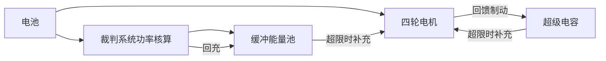
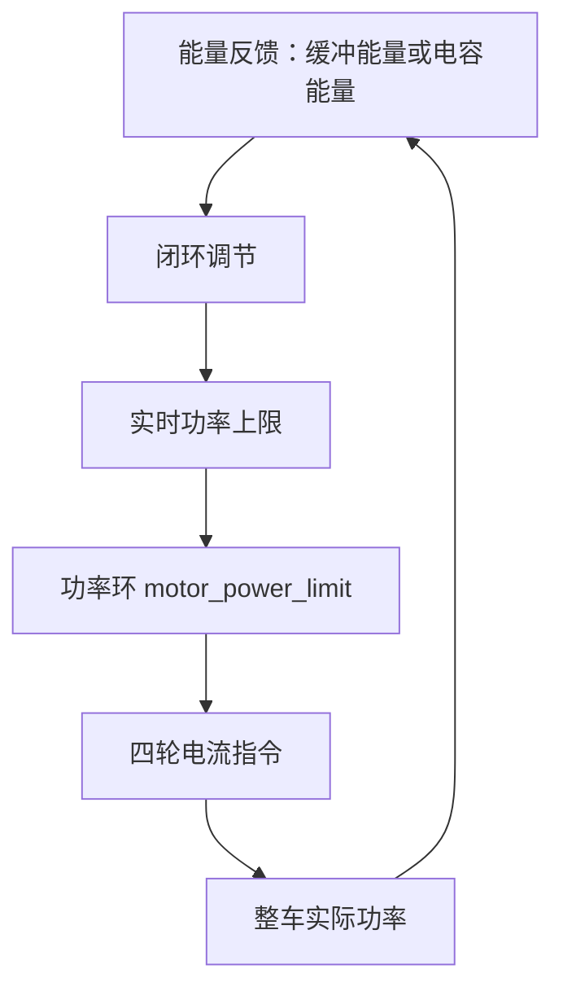
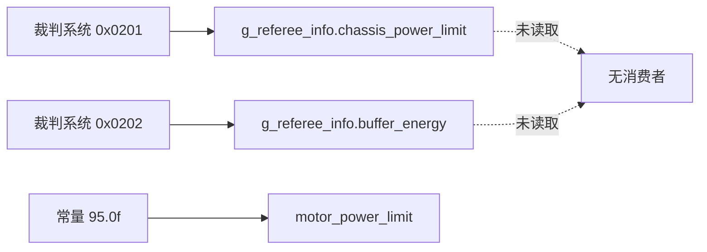

# 能量缓冲与电容

功率模型给出的是瞬时可消耗功率的上限。赛场上的起步、上坡与陀螺旋转都会让瞬时需求超过这个上限，把超出部分摊到时间上需要一层能量缓冲。本文说明缓冲能量与超级电容在控制里承担的角色，以及本工程没有接入这一层的原因。

## 1. 概念：功率约束与能量约束

功率上限是瞬时约束，单位瓦；缓冲是能量约束，单位焦。两者的关系是

$$\Delta E = \int (P_{\text{out}} - P_{\max})\,dt$$

当 $P_{\text{out}} > P_{\max}$ 时 $\Delta E$ 为正，缓冲能量下降；$P_{\text{out}} < P_{\max}$ 时缓冲回充。裁判系统在 0x0202 帧里下发底盘缓冲能量，超级电容则把电能存在电容里。

缓冲层的收益是爆发能力，代价是需要能量状态的反馈；没有反馈就无法判断池子里还剩多少。

## 2. 机制：功率环与能量环

只用功率环时，上限是一个固定值。加入能量环后，上限由能量状态决定：

能量充足时抬高上限，允许底盘长时间大功率输出；能量偏低时把上限压到裁判系统限值以下，给缓冲回充。两个环的周期不同：功率环随控制周期运行，能量环按更慢的节拍运行。

## 3. 落到本项目

### 3.1 缓冲能量字段的状态

裁判系统的 0x0202 帧里有 `buffer_energy` 字段（`Communication/Inc/referee_decode.h:177`），解帧后写入 `g_referee_info.buffer_energy`（`Communication/Src/referee_decode.cpp:86`，结构体字段在 `referee_decode.h:477`）。全仓库对该字段只有写入，没有读取点：

| 环节 | 位置 | 状态 |
| --- | --- | --- |
| 协议定义 | `referee_decode.h:177` | 有 |
| 解帧写入 | `referee_decode.cpp:86` | 有 |
| 消费点 | 无 | 缺失 |

### 3.2 没有电容相关代码

两块固件板都没有超级电容的通信、采样或能量管理代码。底盘板发送的标识符集中在 0x100、0x141、0x1FF、0x200、0x2FF、0x301、0x303、0x309，以及与 ID 相加的 0x100 与 0x200（`BSP/Src/bsp_can.cpp:91-527`），没有电容厂商常用的收发帧。`Task/` 目录下也没有能量管理任务，没有电容电压的采样通道。

### 3.3 功率上限的取值

功率上限在调用点写成常量 `95.0f`（`Task/Src/ControlCenterTask.cpp:143`），与裁判系统下发的 `chassis_power_limit` 无关。后者在 `referee_decode.cpp:65` 写入 `g_referee_info.chassis_power_limit`，同样没有读取点。

### 3.4 未接入带来的限制

| 能力 | 现状 | 缺口 |
| --- | --- | --- |
| 跟随裁判系统限值 | 常量 `95.0f` | 缺少对 `chassis_power_limit` 的读取与滤波 |
| 短时爆发 | 不支持 | 缺少能量状态反馈与能量环 |
| 回馈制动回收 | 不支持 | 缺少电容硬件与控制代码 |
| 缓冲耗尽的降级 | 不触发 | 缺少对缓冲能量下限的判断 |

## 4. 接入需要补齐的部分

| 部分 | 需要的接口 | 底盘板上已有的基础 |
| --- | --- | --- |
| 能量反馈 | 读 `g_referee_info.buffer_energy` | 解帧已完成 |
| 限值来源 | 读 `g_referee_info.chassis_power_limit` | 解帧已完成 |
| 上限调节 | 以能量误差为输入的闭环 | 无，需要新增 |
| 电容硬件 | CAN 或串口收发、电压采样 | 无 |
| 降级逻辑 | 反馈断连时回落到保守限值 | 无 |

## 5. 易错点

| # | 易错点 | 表现 | 源码位置 |
| --- | --- | --- | --- |
| 1 | 认为 `buffer_energy` 已在用 | 只有写入，没有读取 | `referee_decode.cpp:86` |
| 2 | 把 `95.0f` 当成裁判系统下发值 | 它是写死的常量 | `ControlCenterTask.cpp:143` |
| 3 | 把缓冲能量当功率 | 前者单位焦，后者单位瓦 | `referee_decode.h:177` |
| 4 | 认为电容断连就使功率环失效 | 功率环只依赖模型与电机反馈 | `motor_power_control.c:13-20` |
| 5 | 用能量环的慢周期直接改 `out` | 两个环周期不同，直接改会与功率环冲突 | `ControlCenterTask.cpp:143` |

## 6. 小结

### 核心概念

- 功率上限是瞬时约束，缓冲能量是能量约束，两者通过 $\Delta E = \int (P-P_{\max})dt$ 关联。
- 裁判系统在 0x0202 帧下发 `buffer_energy`，本工程解帧后没有使用。
- 两块板都没有超级电容的收发与能量管理代码。
- 底盘功率上限是常量 `95.0f`，与裁判系统下发的 `chassis_power_limit` 没有关联。
- 接入能量缓冲需要能量反馈、上限调节与降级逻辑三部分。

### 设计权衡

| 权衡点 | 本工程的选择 | 收益与代价 |
| --- | --- | --- |
| 是否接电容 | 不接 | 硬件简单；代价是没有爆发与回馈回收能力 |
| 限值来源 | 常量 | 调试时行为固定；代价是换机器人等级要改代码 |
| 是否读缓冲能量 | 不读 | 逻辑简单；代价是无法判断缓冲余量 |

## 7. 练习

### 基础题

1. 写出缓冲能量的积分式，说明 $P_{\text{out}} > P_{\max}$ 与 $P_{\text{out}} < P_{\max}$ 两种情况下缓冲能量各自的变化方向。
2. 在源码里找出 `g_referee_info.buffer_energy` 的全部出现位置，说明它成为只写字段的原因。
3. 说明功率环与能量环在周期与作用对象上的区别。

### 挑战题

4. 设计一个只读的能量观测点，把 `buffer_energy` 与按模型估计的整车功率输出到调试变量。
5. 给出一个能量环方案：以缓冲能量为反馈输出实时功率上限，说明限值上下界怎样取。
6. 说明缓冲能量反馈断连时功率上限应当回落到哪个值，并给出判断断连的依据。

### 附：本页引用的固件路径

| 路径 | 用途 |
| --- | --- |
| `/home/wyx/rm/2026SentriOmeniChassis/2026OmniSentryChassis/Communication/Inc/referee_decode.h` | 0x0202 结构体与 `RefereeInfo`（`:170-181`、`:456-508`） |
| `/home/wyx/rm/2026SentriOmeniChassis/2026OmniSentryChassis/Communication/Src/referee_decode.cpp` | 缓冲能量与功率上限的写入点（`:65`、`:86`） |
| `/home/wyx/rm/2026SentriOmeniChassis/2026OmniSentryChassis/Task/Src/ControlCenterTask.cpp` | 常量限值调用点（`:143`） |
| `/home/wyx/rm/2026SentriOmeniChassis/2026OmniSentryChassis/Algorithm/Src/motor_power_control.c` | 功率环本体（`:13-20`） |
| `/home/wyx/rm/2026SentriOmeniChassis/2026OmniSentryChassis/BSP/Src/bsp_can.cpp` | 底盘板发送标识符清单（`:91-527`） |
| `/home/wyx/rm/2026SentriOmeniGimbal/2026OmniSentryGimbal/Communication/Src/referee_decode.cpp` | 云台板同源解帧（`:65`、`:86`） |
