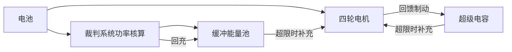
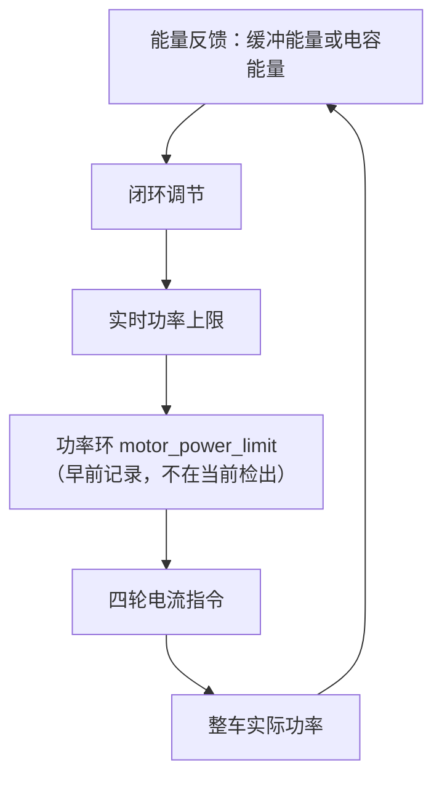
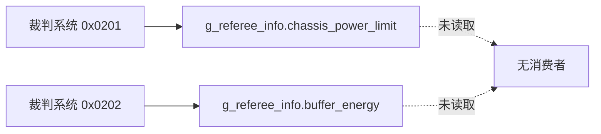

# 能量缓冲与电容

功率模型给出的是瞬时可消耗功率的上限。赛场上的起步、上坡与陀螺旋转都会让瞬时需求超过这个上限，把超出部分摊到时间上需要一层能量缓冲。本文说明缓冲能量与超级电容在控制里承担的角色，以及本工程没有接入这一层的原因。

区分两个约束是理解这一层的关键：功率上限限制的是“此刻能取多少”，缓冲能量限制的是“总共还能多取多少”。前者用一个数就能表达，后者需要一个随时间变化的积分量。当前检出两者都没有接入：裁判系统下发的功率上限与缓冲能量都只解出、没有消费者，因此底盘既不受限值约束，也没有超发能力。

## 瞬时约束与能量约束差一个积分

功率上限是瞬时约束，单位瓦；缓冲是能量约束，单位焦。两者的关系是

$$\Delta E = \int (P_{\text{out}} - P_{\max})\,dt$$

当 $P_{\text{out}} > P_{\max}$ 时 $\Delta E$ 为正，缓冲能量下降；$P_{\text{out}} < P_{\max}$ 时缓冲回充。裁判系统在 0x0202 帧里下发底盘缓冲能量，超级电容则把电能存在电容里。

缓冲层的收益是爆发能力，代价是需要能量状态的反馈；没有反馈就无法判断池子里还剩多少。图中两条补充路径互相独立：裁判系统的缓冲由官方规则维护，超级电容是随车硬件，可以只接其中一条。

## 功率环与能量环的双环结构

只用功率环时，上限是一个固定值。加入能量环后，上限由能量状态决定：

能量充足时抬高上限，允许底盘长时间大功率输出；能量偏低时把上限压到裁判系统限值以下，给缓冲回充。两个环的周期不同：功率环随控制周期运行，能量环按更慢的节拍运行。周期不同意味着能量环不能直接改电流指令，它只能改功率环的限值实参。

## 电容储能的量化关系

电容储存的能量与电压平方成正比：

$$E = \frac{1}{2} C U^2$$

可用能量按放电前后两个电压算：

$$\Delta E = \frac{1}{2} C \left(U_{\text{high}}^2 - U_{\text{low}}^2\right)$$

电压越高储得越多，但放电到低压侧的能量利用并不线性：从 24 V 放到 16 V 拿到的能量是满电能量的 $1 - (16/24)^2 = 55.6\%$，剩下的 44.4% 存在低压侧取不出来。取一个示例参数 $C = 50\ \text{F}$、$U$ 从 24 V 放到 16 V，$\Delta E = 0.5 \times 50 \times (576 - 256) = 8000\ \text{J}$。这一组数值只是示例，本工程没有电容硬件，实际参数按所选型号确定。

| 量 | 关系 | 示例值 |
| --- | --- | --- |
| 满电能量 | $\frac{1}{2}CU_{\text{high}}^2$ | 14400 J |
| 低压侧剩余 | $\frac{1}{2}CU_{\text{low}}^2$ | 6400 J |
| 可用能量 | 两者之差 | 8000 J |
| 能量利用率 | $1 - (U_{\text{low}}/U_{\text{high}})^2$ | 55.6% |

## 从储能到允许的超发时间

给定可用能量与超发功率，可维持的时间由除法给出：

$$t = \frac{\Delta E}{\Delta P}$$

用上面的示例储能 8000 J：超发 30 W 可维持约 267 s，超发 100 W 可维持 80 s，超发 300 W 可维持约 27 s。把超发功率与限值相加就是允许的瞬时上限。这个估算说明电容的作用不在于提高峰值多少倍，而在于把短时超发摊成分钟级的余量。

这三组数字也说明为什么电容容量通常按几十法拉起：要支撑几十秒的超发，储能必须落在千焦量级，而电压受器件耐压限制，容量就只能大。容量越大，充满所需的时间与体积也越大，这是接入电容时最先要权衡的东西。

反过来也可以估算裁判系统缓冲的尺度：若缓冲只有几十焦，同样的超发功率只能维持不到一秒，那么它的作用就限于吸收开关瞬间的功率尖峰，而不是支撑一次上坡。缓冲的实际容量由规则给出，源码里只有字段，没有数值。

## 本工程的两处字段：只写不读

裁判系统的 0x0202 帧里有 `buffer_energy` 字段（`Communication/Inc/referee_decode.h`），解帧后写入 `g_referee_info.buffer_energy`（`Communication/Src/referee_decode.cpp`，结构体字段在 `referee_decode.h`）。全仓库对该字段只有写入，没有读取点：

| 环节 | 位置 | 状态 |
| --- | --- | --- |
| 协议定义 | `referee_decode.h` | 有 |
| 解帧写入 | `referee_decode.cpp` | 有 |
| 消费点 | 无 | 缺失 |

只写不读的字段有一个副作用：解帧是否正常无法从行为上看出来。要确认 0x0202 的接收与解析，需要额外加观测点。

## 没有电容相关代码

两块固件板都没有超级电容的通信、采样或能量管理代码。底盘板发送的标识符集中在 0x100、0x141、0x1FF、0x200、0x2FF、0x301、0x303，以及与 ID 相加的 0x100 与 0x200（`BSP/Src/bsp_can.cpp`），没有电容厂商常用的收发帧。早前记录里还有一条 0x309，当前检出里没有这个帧。`Task/` 目录下也没有能量管理任务，没有电容电压的采样通道。

从标识符清单还能得到一个更强的结论：底盘板的下行帧只有 DJI 与 LK 两类电机的控制帧，没有留给第三方硬件的空档。接电容需要新增一路 CAN 或串口，不能复用现有帧头。

## 功率上限在调用点没有落脚处

当前检出里没有任何限值环节：`ChassisTask` 算出的输出直接进 0x200（`Task/Src/ChassisTask.cpp`、`Task/Src/ControlCenterTask.cpp`），中间没有比较与缩放。裁判系统的 `chassis_power_limit` 在 `Communication/Src/referee_decode.cpp` 写入 `g_referee_info.chassis_power_limit`，同样没有读取点。早前记录里出现过写在调用点的常量 `95.0f` 与一个功率环文件，两者都不在当前检出，本页不把它们当成现状引用；它们唯一还有意义的地方是提醒：限值的来源需要显式定义，代码里没有现成数值可继承。

两条虚线是同一类缺口：数据到了内存，没有人使用。要判断解帧是否正常，只能额外加观测点，不能从底盘行为反推。早前记录的常量限值在调试时行为固定，代价是换机器人等级或规则变化时要改代码重新编译；当前检出连这一层也没有，因此接入的第一个动作是把限值来源与回落值显式定下来。

## 接入需要补齐的部分

| 部分 | 需要的接口 | 底盘板上已有的基础 |
| --- | --- | --- |
| 能量反馈 | 读 `g_referee_info.buffer_energy` | 解帧已完成 |
| 限值来源 | 读 `g_referee_info.chassis_power_limit` | 解帧已完成 |
| 上限调节 | 以能量误差为输入的闭环 | 无，需要新增 |
| 电容硬件 | CAN 或串口收发、电压采样 | 无 |
| 降级逻辑 | 反馈断连时回落到保守限值 | 无 |

五项里前两项是纯软件改动，成本最低；第三项要处理两个环的周期配合；后两项涉及硬件改动。按这个顺序推进，可以先拿到“跟随裁判系统限值”的收益，再考虑电容。

## 断连时应当回落到哪里

接入限值来源之后必须先定义失败行为，否则裁判系统一断连限值就是未定义的值：

| 情形 | 建议动作 | 理由 |
| --- | --- | --- |
| 0x0201 超时未到 | 回落到按规则确定的保守上限 | 本仓库没有该数值，需要显式定义 |
| 限值字段为 0 | 回落到同一个保守上限 | 0 W 会让底盘完全不动，属于危险值 |
| 限值明显偏大 | 取上限截断 | 防止错误数据把功率放开 |
| 缓冲能量超时未到 | 关闭能量环，只保留功率环 | 没有反馈就没有能量约束 |

四条规则里第二条最容易被忽略：协议字段在未初始化时为 0，如果直接把 0 写进限值，底盘会失去动力。

这四条规则也决定了新代码的测试方法：可以在断连、限值为零、限值偏大三种状态下各观察一次底盘行为，确认都落在预期分支上，而不需要在赛场上等这些状态自然出现。

## 常见判断偏差

| # | 判断偏差 | 表现 | 源码位置 |
| --- | --- | --- | --- |
| 1 | 认为 `buffer_energy` 已在用 | 只有写入，没有读取 | `referee_decode.cpp` |
| 2 | 把文档里的 `95.0f` 当成裁判系统下发值 | 当前检出没有这个常量，限值字段也没有读取点 | `Communication/Src/referee_decode.cpp` |
| 3 | 把缓冲能量当功率 | 前者单位焦，后者单位瓦 | `referee_decode.h` |
| 4 | 认为电容断连就使功率环失效 | 早前记录的功率环只依赖模型与电机反馈；当前检出没有功率环 | `motor_power_control.c` 第 13-20 行（不在当前检出） |
| 5 | 用能量环的慢周期直接改 `out` | 两个环周期不同，直接改会与功率环冲突 | 当前检出的输出写入见 `Task/Src/ChassisTask.cpp` |
| 6 | 认为电容储能与电压线性相关 | 能量正比于电压平方，低压侧取不出 | 电容储能的量化关系一节 |
| 7 | 忽略协议字段未初始化时为零 | 直接把 0 当作限值 | `referee_decode.cpp` |

## 小结

### 核心概念

- 功率上限是瞬时约束，缓冲能量是能量约束，两者通过 $\Delta E = \int (P-P_{\max})dt$ 关联。
- 裁判系统在 0x0202 帧下发 `buffer_energy`，本工程解帧后没有使用。
- 两块板都没有超级电容的收发与能量管理代码。
- 当前检出的底盘功率上限没有落脚处，`chassis_power_limit` 与 `buffer_energy` 都只解出不使用；早前记录里的常量限值不在检出，不能作为回落值。
- 电容可用能量为 $\frac{1}{2}C(U_{\text{high}}^2 - U_{\text{low}}^2)$，电压区间决定利用率。
- 接入能量缓冲需要能量反馈、上限调节与降级逻辑三部分。

### 设计权衡

| 权衡点 | 本工程的选择 | 收益与代价 |
| --- | --- | --- |
| 是否接电容 | 不接 | 硬件简单；代价是没有爆发与回馈回收能力 |
| 限值来源 | 当前检出没有限值环节，裁判系统字段未被读取 | 逻辑简单；代价是接入时要自行定义保守上限与回落规则 |
| 是否读缓冲能量 | 不读 | 逻辑简单；代价是无法判断缓冲余量 |
| 超发能力 | 不实现 | 功率环独立可测；代价是瞬时需求只能被削平 |
| 硬件通道 | 不预留 | 接线与代码都少；代价是接电容时需要新增一路通信 |

## 练习

### 基础题

1. 写出缓冲能量的积分式，说明 $P_{\text{out}} > P_{\max}$ 与 $P_{\text{out}} < P_{\max}$ 两种情况下缓冲能量各自的变化方向。
2. 在源码里找出 `g_referee_info.buffer_energy` 的全部出现位置，说明它成为只写字段的原因。
3. 说明功率环与能量环在周期与作用对象上的区别。
4. 用 $E = \frac{1}{2}CU^2$ 计算 $C = 50\ \text{F}$ 从 24 V 放到 16 V 的可用能量，并与满电能量的比值对照。

### 挑战题

5. 设计一个只读的能量观测点，把 `buffer_energy` 与按模型估计的整车功率输出到调试变量。
6. 给出一个能量环方案：以缓冲能量为反馈输出实时功率上限，说明限值上下界怎样取。
7. 说明缓冲能量反馈断连时功率上限应当回落到哪个值，并给出判断断连的依据。
8. 已知可用能量与超发功率，写出允许超发时间的表达式；若要支撑 300 W 超发 30 s，反推所需电容容量。

## 附：本页引用的固件路径

| 路径 | 用途 |
| --- | --- |
| `底盘板 Communication/Inc/referee_decode.h` | 0x0202 结构体与 `RefereeInfo`（`Communication/Inc/referee_decode.h`、`Communication/Inc/referee_decode.h`） |
| `底盘板 Communication/Src/referee_decode.cpp` | 缓冲能量与功率上限的写入点（`Communication/Src/referee_decode.cpp`、`Communication/Src/referee_decode.cpp`） |
| `底盘板 Task/Src/ControlCenterTask.cpp` | 0x200 发送点（`Task/Src/ControlCenterTask.cpp`）；早前记录的常量限值调用点不在当前检出 |
| `Algorithm/Src/motor_power_control.c` | 该文件不在当前检出，功率环本体无对应实现（早前记录的 ） |
| `底盘板 BSP/Src/bsp_can.cpp` | 底盘板发送标识符清单（`BSP/Src/bsp_can.cpp`） |
| `Communication/Src/referee_decode.cpp` | 云台板同源解帧（`Communication/Src/referee_decode.cpp`、`Communication/Src/referee_decode.cpp`） |
