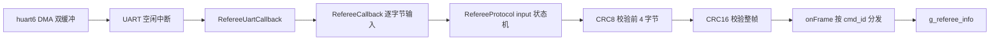
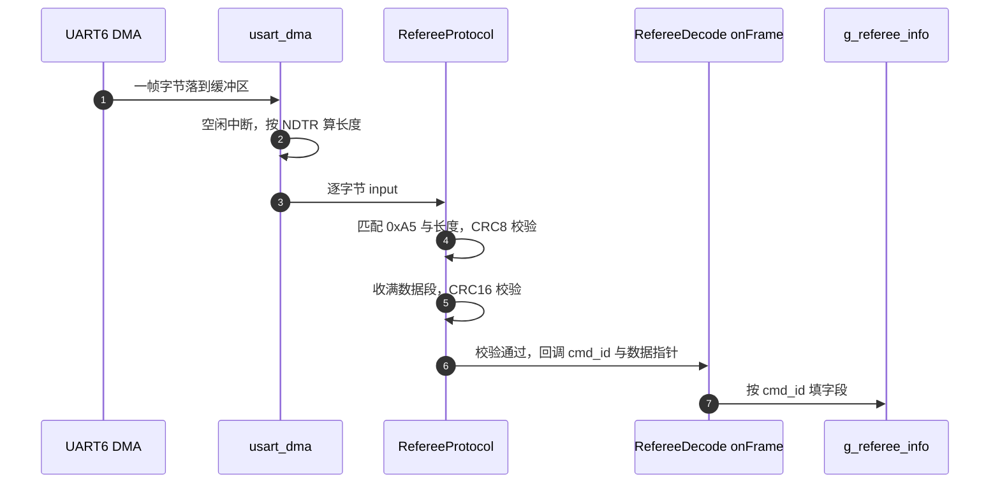
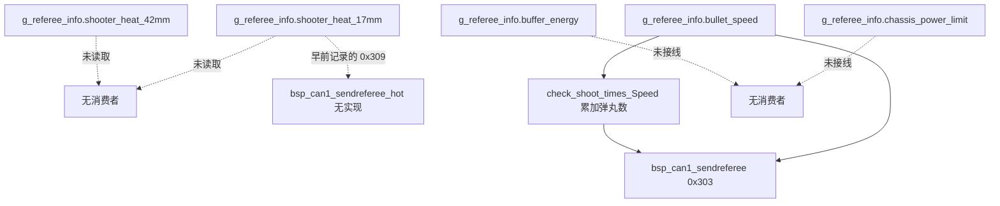

# 裁判系统热量与功率上限

底盘功率上限与射击热量上限都来自裁判系统，通过串口按帧下发。底盘板把这两类数据解出来放进全局结构体，但全树搜索的结果是：这些字段里只有弹速被控制中心任务消费，热量与功率上限都停在内存里，既没有限制逻辑，也没有实际发出的转发帧。

关注点不在解帧本身，而在字段的落点与去向：同一个结构体里的字段，有的被两处消费，有的没有任何读取点。把“谁在用、谁没用”列清楚，才能判断哪些限制实际生效。读完后应当能在源码里指出热量上限为什么没有对应成员、0x309 的第一个字段到底是什么。

## 两个命令码覆盖哪些字段

裁判系统通过 UART6 连续下发数据帧，帧长从 7 字节到 200 多字节不等。底盘板关心的两类信息在两个命令码里：

| 命令码 | 名称 | 本工程关心的字段 |
| --- | --- | --- |
| 0x0201 | 机器人性能体系数据 | `chassis_power_limit`、三路输出使能位 |
| 0x0202 | 实时底盘缓冲能量和射击热量数据 | `buffer_energy`、17mm 与 42mm 热量 |

0x0201 里还有 `shooter_barrel_cooling_value` 与 `shooter_barrel_heat_limit`，协议头文件定义了字段，解帧函数没有拷贝它们。两个命令码的字段合起来覆盖了功率、能量、热量与输出使能四类信息。这些字段里唯一有消费者的是弹速：它在 `Task/Src/ControlCenterTask.cpp:123` 被用于累计发弹数，并随 0x303 发出（`Task/Src/ControlCenterTask.cpp:127`）。

## 从 DMA 缓冲到全局结构体的解帧链路



帧的字段顺序是：起始字节 0xA5、数据长度（2 字节小端）、包序号、CRC8、命令码（2 字节小端）、数据段、CRC16（2 字节小端）。状态机在 `Communication/Src/referee_protocol.cpp:26-134`，共十个状态（`referee_protocol.h:25-37`）。

| 环节 | 位置 | 说明 |
| --- | --- | --- |
| DMA 双缓冲 | `Communication/Src/usart_dma.cpp:40-44` | 两个缓冲区交替接收 |
| 空闲中断 | `usart_dma.cpp:81-99` | 按 `NDTR` 算本次长度 |
| 回调注册 | `Core/Src/main.c:132` | `Uart_Init(&huart6, RefereeUartCallback)` |
| 逐字节输入 | `usart_dma.cpp:106-116`、`main.c:79-81`、`referee_decode.cpp:159-165` | 一次空闲中断喂完整包 |
| 长度保护 | `referee_protocol.cpp:49-52` | 数据长度超过 200 丢弃 |



两级校验的分工需要单独记：CRC8 只覆盖前 4 字节，用来快速确认帧头与长度；CRC16 覆盖整帧，用来确认数据段完整。长度保护在收满数据段之前就把超长帧丢掉，避免状态机被长数据段拖住。

## 0x0201 的字段落点

| 协议字段 | 结构体成员 | 处理函数行号 | 后续使用 |
| --- | --- | --- | --- |
| `robot_id`、`robot_level` | `g_referee_info.robot_id`、`.robot_level` | `referee_decode.cpp:59-60` | USB 上报 |
| `current_HP`、`maximum_HP` | `.current_hp`、`.max_hp` | `:62-63` | USB 上报 |
| `chassis_power_limit` | `.chassis_power_limit` | `:65` | 无 |
| `power_management_*_output` | `.gimbal_output`、`.chassis_output`、`.shooter_output` | `:67-69` | 无 |
| `shooter_barrel_cooling_value` | 未拷贝 | 无 | 无 |
| `shooter_barrel_heat_limit` | 未拷贝 | 无 | 无 |

`RefereeInfo`（`referee_decode.h:456-499`）里没有热量上限与冷却值字段，`onFrame` 即使拷贝也无处存放。底盘板在上报上位机时把这两个值写成常量：

```cpp
robot_status_data.shooter_barrel_cooling_value = 30;
robot_status_data.shooter_barrel_heat_limit = 260;
```

这两行按早前记录写在 `Task/Src/UsbConnectTask.cpp`，但当前检出里全文没有 `shooter_barrel` 的写入点：上报入口是 `Task/Src/UsbConnectTask.cpp:332` 的 `USB_Transmit_RobotStatus`，实现里没有对这两个字段的赋值，它们只在 `Task/Inc/UsbConnectTask.h:186-187` 声明。这个上报函数在全树没有调用点，函数体还用了 `sizeof(gimbal_angle_data_t)` 与 `GIMBAL_ANGLE_PACKET_ID` 组装帧（`Task/Src/UsbConnectTask.cpp:332-340`），因此它不能作为热量或热量上限的去向。这一段早前记录与当前检出不符。

输出使能三位同样没有消费者。它们表示裁判系统是否允许云台、底盘与发射机构输出，本工程既没有读也没有用于禁用，这一点与功率上限的状态相同。

## 0x0202 的字段落点与热量的去向

| 协议字段 | 结构体成员 | 处理函数行号 | 后续使用 |
| --- | --- | --- | --- |
| `buffer_energy` | `.buffer_energy` | `referee_decode.cpp:86` | 无消费者 |
| `shooter_17mm_heat` | `.shooter_heat_17mm` | `referee_decode.cpp:88` | 无（上报函数无调用点，0x309 帧也不在当前检出） |
| `shooter_42mm_heat` | `.shooter_heat_42mm` | `:89` | 无 |

热量当前没有任何去向。底盘板循环里实际发出的裁判相关帧只有 0x303，它承载的是弹丸数与弹速；0x309 与 `BSP_CAN1_SendReferee_Hot` 都不在当前检出里，两棵树的 `StdId` 赋值与函数名搜索都没有它们：

| 标识符 | 函数 | 数据段 | 调用点 |
| --- | --- | --- | --- |
| 0x303 | `BSP_CAN1_SendReferee`（`BSP/Src/bsp_can.cpp:488-518`） | 累计弹丸数 2 字节 + 弹速 4 字节（`:501-510`） | 底盘板 `Task/Src/ControlCenterTask.cpp:127` |
| 0x309 | 当前检出中不存在 | 早前记录为热量 2 字节 + 底盘旋转速度 4 字节 | 无 |



0x303 的数据段是累计弹丸数与弹速，接收侧是云台板的 0x303 解析分支。0x309 对应的发送函数不存在，热量既不进 CAN 帧，也不进 USB 上报（上报函数无调用点），因此它在当前检出里没有去向。早前记录里出现过「两帧数据段长度相同、第一字段含义不同」的说法，按当前检出无法复现。

## 热量限制的缺口

热量只被转发与上报，没有任何比较或限制逻辑。全仓库没有以热量为输入的发射抑制点，也没有对 `shooter_barrel_heat_limit` 的读取。云台板是执行发射的一侧，它的 `Task/` 目录里同样没有热量相关代码。

缺口的实际后果是：热量数值到了内存就断了，上位机与其他板都拿不到，操作手也没有可看的数据。自动停火需要三条链打通：热量与上限解出、两者比较、比较结果作用到发射控制，当前三条都不成立。

`referee/Src/RefereeReading.cpp:14-18` 提供了 `check_shoot_times_Speed`，作用是把弹速变化累计成发弹数，与热量限制无关：

```cpp
uint8_t check_shoot_times_Speed(float Speed) {
    static float lastspeed;
    if (Speed!=lastspeed){lastspeed=Speed;    return 1;}
    else {lastspeed=Speed;return 0;}
}
```

函数用 `!=` 比较浮点，两个分支都写 `lastspeed`，第一次调用时 `lastspeed` 为 0，若弹速恰为 0 则返回 0。同名头文件里另外声明了 `check_shoot_times_Heat`（`referee/Inc/RefereeReading.h:12`），对应的实现整段注释在 `referee/Src/RefereeReading.cpp:9-13`，全树没有调用点。

把这段代码与上面的字段表放在一起，可以看清一件事：热量相关的函数名与热量限制无关，做限制的函数从未实现。按名称搜索“热量”会找到它，按功能搜索则找不到任何限制点。

## 常见判断偏差

| # | 判断偏差 | 表现 | 源码位置 |
| --- | --- | --- | --- |
| 1 | 认为功率上限来自裁判系统 | 当前检出没有功率限制调用点，速度环输出直接进 0x200 | `Task/Src/ChassisTask.cpp:89-92`、`Task/Src/ControlCenterTask.cpp:126` |
| 2 | 认为热量上限已解出 | 协议有字段，`RefereeInfo` 没有成员 | `referee_decode.h:159`、`referee_decode.h:456-499` |
| 3 | 把 0x309 当成在用的帧 | 当前检出没有 0x309 的发送函数 | 两棵树均无 `BSP_CAN1_SendReferee_Hot` |
| 4 | 把 0x303 与 0x309 混淆 | 只有 0x303 存在，数据段是弹丸数与弹速 | `BSP/Src/bsp_can.cpp:488-518` |
| 5 | 认为 `check_shoot_times_Speed` 做热量判断 | 它只比较弹速是否变化 | `RefereeReading.cpp:14-18` |
| 6 | 忽略长度保护 | 数据长度超过 200 时状态机复位 | `referee_protocol.cpp:49-52` |
| 7 | 认为 CRC8 覆盖整帧 | CRC8 只覆盖前 4 字节 | `referee_protocol.cpp:68` |
| 8 | 认为输出使能位已被使用 | 三位都只解出、不读 | `referee_decode.cpp:67-69` |
| 9 | 把上位机里的常量热量上限当成实时值 | 当前检出没有这两处赋值，字段留空 | `Task/Inc/UsbConnectTask.h:186-187` |

## 小结

### 核心概念

- 裁判系统数据走 UART6 的 DMA 双缓冲，空闲中断触发解帧，帧头 0xA5，尾部 CRC16。
- CRC8 覆盖 `0xA5`、长度两字节与包序号共 4 字节；CRC16 覆盖除校验位外的整帧。
- 0x0201 的 `chassis_power_limit` 与 0x0202 的 `buffer_energy` 都已解出，没有消费者。
- `shooter_barrel_heat_limit` 与冷却值在协议结构体里有字段，解帧时没有拷贝，`RefereeInfo` 也没有对应成员。
- 热量与功率上限都没有消费者；USB 上报函数没有调用点，早前记录的 0x309 帧在当前检出里也没有实现，不存在限制逻辑。
- 输出使能三位同样没有读取点。

### 设计权衡

| 权衡点 | 本工程的选择 | 收益与代价 |
| --- | --- | --- |
| 解帧与业务分离 | 回调只填结构体 | 结构清晰；代价是字段没有消费者时不易发现 |
| 热量与功率字段一并解出 | 统一存进 `RefereeInfo` | 便于转发；代价是部分字段长期闲置 |
| 上位机上报 | `USB_Transmit_RobotStatus` 无调用点 | 结构体字段保留；代价是这些字段没有赋值来源与出口 |
| 热量只解出不限制 | 没有比较与抑制点 | 控制逻辑简单；代价是超热风险留在人身上 |
| 状态机独立成文件 | 与解帧分离 | 可单测；代价是两级校验跨两个文件 |

## 练习

### 基础题

1. 按第 2 节的链路，写出从 DMA 缓冲到 `g_referee_info.shooter_heat_17mm` 的完整调用顺序与行号（`usart_dma.cpp:106-116`、`main.c:79-81`、`referee_decode.cpp:79-89`）。
2. 说明 CRC8 与 CRC16 各自覆盖的字节范围。
3. 列出 `RefereeInfo` 中已解出但没有读取点的字段。
4. 写出 0x303 帧的数据段布局、发送函数与接收方，并说明为什么 0x309 无法按同样方式回答。

### 挑战题

5. 给 `RefereeInfo` 补上热量上限与冷却值字段，写出对应的拷贝语句，说明改动会波及哪些文件。
6. 设计一个热量限制点：以 `shooter_heat_17mm` 与 `shooter_barrel_heat_limit` 为输入，输出是否允许发射，说明放在哪块板。
7. 已知两棵树里都没有 0x309 的发送函数，给出两条排查线索：裁判系统命令码里的 0x0309（`referee_decode.h:67`）与 CAN 帧号的区别，以及 0x303 数据段里还能放什么。
8. 设计一次上电自检：在没有真实裁判系统的情况下，用构造帧验证 CRC8、CRC16 与长度保护三条路径都能正确拒绝畸形帧。

## 附：本页引用的固件路径

| 路径 | 用途 |
| --- | --- |
| `/home/wyx/rm/2026SentriOmeniChassis/2026OmniSentryChassis/Communication/Inc/referee_decode.h` | 命令码枚举（`referee_decode.h:28-81`）、0x0201 与 0x0202 结构体（`referee_decode.h:151-181`）、`RefereeInfo`（`referee_decode.h:456-499`） |
| `/home/wyx/rm/2026SentriOmeniChassis/2026OmniSentryChassis/Communication/Src/referee_decode.cpp` | `onFrame` 分发（`referee_decode.cpp:23-158`）、0x0201 与 0x0202 分支（`referee_decode.cpp:52-93`）、`RefereeCallback`（`referee_decode.cpp:159-165`） |
| `/home/wyx/rm/2026SentriOmeniChassis/2026OmniSentryChassis/Communication/Src/referee_protocol.cpp` | 解帧状态机与两级校验（`referee_protocol.cpp:26-133`） |
| `/home/wyx/rm/2026SentriOmeniChassis/2026OmniSentryChassis/Communication/Src/usart_dma.cpp` | DMA 双缓冲与空闲中断（`usart_dma.cpp:33-116`） |
| `/home/wyx/rm/2026SentriOmeniChassis/2026OmniSentryChassis/Core/Src/main.c` | 回调注册与转发（`Core/Src/main.c:79-81`、`Core/Src/main.c:132`） |
| `/home/wyx/rm/2026SentriOmeniChassis/2026OmniSentryChassis/BSP/Src/bsp_can.cpp` | 0x303 发送（`BSP/Src/bsp_can.cpp:488-518`）；0x309 无实现 |
| `/home/wyx/rm/2026SentriOmeniChassis/2026OmniSentryChassis/referee/Src/RefereeReading.cpp` | 发弹数累计函数（`referee/Src/RefereeReading.cpp:14-17`） |
| `/home/wyx/rm/2026SentriOmeniChassis/2026OmniSentryChassis/Task/Inc/UsbConnectTask.h` | 上位机结构体的热量上限与冷却值字段（`Task/Inc/UsbConnectTask.h:186-187`）；当前检出没有赋值点 |
