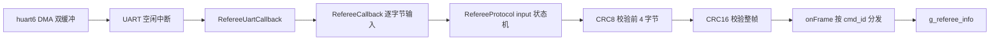
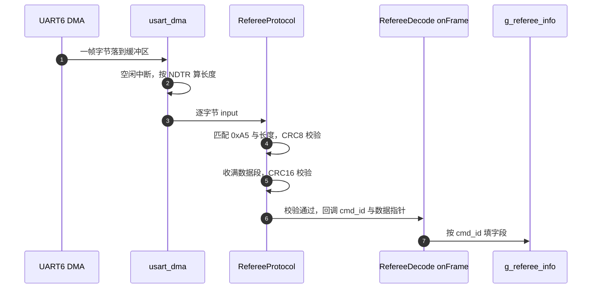
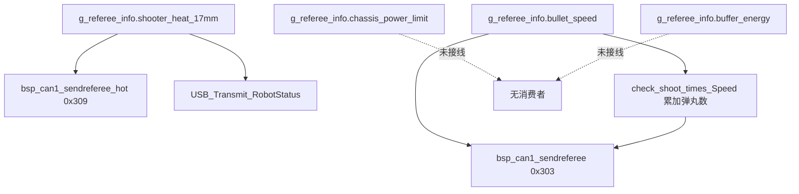

# 裁判系统热量与功率上限

底盘功率上限与射击热量上限都来自裁判系统，通过串口按帧下发。底盘板把这两类数据解出来放进全局结构体，其中热量被转发到云台板与上位机，功率上限没有被使用。本文说明解帧链路、字段落点，以及热量限制缺失的部分。

## 1. 概念：数据来源

裁判系统通过 UART6 连续下发数据帧，帧长从 7 字节到 200 多字节不等。底盘板关心的两类信息在两个命令码里：

| 命令码 | 名称 | 本工程关心的字段 |
| --- | --- | --- |
| 0x0201 | 机器人性能体系数据 | `chassis_power_limit`、三路输出使能位 |
| 0x0202 | 实时底盘缓冲能量和射击热量数据 | `buffer_energy`、17mm 与 42mm 热量 |

0x0201 里还有 `shooter_barrel_cooling_value` 与 `shooter_barrel_heat_limit`，协议头文件定义了字段，解帧函数没有拷贝它们。

## 2. 解帧链路



帧的字段顺序是：起始字节 0xA5、数据长度（2 字节小端）、包序号、CRC8、命令码（2 字节小端）、数据段、CRC16（2 字节小端）。状态机在 `Communication/Src/referee_protocol.cpp:26-134`，共十个状态（`referee_protocol.h:25-37`）。

| 环节 | 位置 | 说明 |
| --- | --- | --- |
| DMA 双缓冲 | `Communication/Src/usart_dma.cpp:40-44` | 两个缓冲区交替接收 |
| 空闲中断 | `usart_dma.cpp:81-99` | 按 `NDTR` 算本次长度 |
| 回调注册 | `Core/Src/main.c:132` | `Uart_Init(&huart6, RefereeUartCallback)` |
| 逐字节输入 | `usart_dma.cpp:106-116`、`main.c:79-81`、`referee_decode.cpp:182-188` | 一次空闲中断喂完整包 |
| 长度保护 | `referee_protocol.cpp:49-52` | 数据长度超过 200 丢弃 |



## 3. 落到本项目

### 3.1 0x0201 的字段落点

| 协议字段 | 结构体成员 | 处理函数行号 | 后续使用 |
| --- | --- | --- | --- |
| `robot_id`、`robot_level` | `g_referee_info.robot_id`、`.robot_level` | `referee_decode.cpp:59-60` | USB 上报 |
| `current_HP`、`maximum_HP` | `.current_hp`、`.max_hp` | `:62-63` | USB 上报 |
| `chassis_power_limit` | `.chassis_power_limit` | `:65` | 无 |
| `power_management_*_output` | `.gimbal_output`、`.chassis_output`、`.shooter_output` | `:67-69` | 无 |
| `shooter_barrel_cooling_value` | 未拷贝 | 无 | 无 |
| `shooter_barrel_heat_limit` | 未拷贝 | 无 | 无 |

`RefereeInfo`（`referee_decode.h:456-508`）里没有热量上限与冷却值字段，`onFrame` 即使拷贝也无处存放。底盘板在上报上位机时把这两个值写成常量：

```cpp
robot_status_data.shooter_barrel_cooling_value = 30;
robot_status_data.shooter_barrel_heat_limit = 260;
```

这两行在 `Task/Src/UsbConnectTask.cpp:190-191`。

### 3.2 0x0202 的字段落点

| 协议字段 | 结构体成员 | 处理函数行号 | 后续使用 |
| --- | --- | --- | --- |
| `buffer_energy` | `.buffer_energy` | `referee_decode.cpp:86` | 无 |
| `shooter_17mm_heat` | `.shooter_heat_17mm` | `:88` | 0x309 帧、USB 上报 |
| `shooter_42mm_heat` | `.shooter_heat_42mm` | `:89` | 无 |

热量有两条去向。底盘板每 2 ms 发两帧到 CAN1：

| 标识符 | 函数 | 数据段 | 调用点 |
| --- | --- | --- | --- |
| 0x303 | `BSP_CAN1_SendReferee` | 累计弹丸数 2 字节 + 弹速 4 字节 | `ControlCenterTask.cpp:152` |
| 0x309 | `BSP_CAN1_SendReferee_Hot` | 热量 2 字节 + 底盘旋转速度 4 字节 | `ControlCenterTask.cpp:153` |



### 3.3 热量限制的缺口

热量只被转发与上报，没有任何比较或限制逻辑。全仓库没有以热量为输入的发射抑制点，也没有对 `shooter_barrel_heat_limit` 的读取。云台板是执行发射的一侧，它的 `Task/` 目录里同样没有热量相关代码。

`referee/Src/RefereeReading.cpp:14-18` 提供了 `check_shoot_times_Speed`，作用是把弹速变化累计成发弹数，与热量限制无关：

```cpp
uint8_t check_shoot_times_Speed(float Speed) {
    static float lastspeed;
    if (Speed!=lastspeed){lastspeed=Speed;    return 1;}
    else {lastspeed=Speed;return 0;}
}
```

函数用 `!=` 比较浮点，两个分支都写 `lastspeed`，第一次调用时 `lastspeed` 为 0，若弹速恰为 0 则返回 0。同名头文件里还有一个注释掉的 `check_shoot_times_Heat`（`RefereeReading.h:12`、`RefereeReading.cpp:9-13`），没有实现。

## 4. 易错点

| # | 易错点 | 表现 | 源码位置 |
| --- | --- | --- | --- |
| 1 | 认为功率上限来自裁判系统 | 实参是常量 `95.0f` | `ControlCenterTask.cpp:143` |
| 2 | 认为热量上限已解出 | 协议有字段，`RefereeInfo` 没有成员 | `referee_decode.h:159`、`:456-508` |
| 3 | 把 0x309 的第一个参数当发弹数 | 传入的是 `shooter_heat_17mm` | `ControlCenterTask.cpp:153` |
| 4 | 把 0x303 与 0x309 混淆 | 数据段长度相同，第一字段含义不同 | `bsp_can.cpp:488`、`:520` |
| 5 | 认为 `check_shoot_times_Speed` 做热量判断 | 它只比较弹速是否变化 | `RefereeReading.cpp:14-18` |
| 6 | 忽略长度保护 | 数据长度超过 200 时状态机复位 | `referee_protocol.cpp:49-52` |
| 7 | 认为 CRC8 覆盖整帧 | CRC8 只覆盖前 4 字节 | `referee_protocol.cpp:68` |

## 5. 小结

### 核心概念

- 裁判系统数据走 UART6 的 DMA 双缓冲，空闲中断触发解帧，帧头 0xA5，尾部 CRC16。
- CRC8 覆盖 `0xA5`、长度两字节与包序号共 4 字节；CRC16 覆盖除校验位外的整帧。
- 0x0201 的 `chassis_power_limit` 与 0x0202 的 `buffer_energy` 都已解出，没有消费者。
- `shooter_barrel_heat_limit` 与冷却值在协议结构体里有字段，解帧时没有拷贝，`RefereeInfo` 也没有对应成员。
- 热量被转发到 0x309 帧与上位机，不存在限制逻辑。

### 设计权衡

| 权衡点 | 本工程的选择 | 收益与代价 |
| --- | --- | --- |
| 解帧与业务分离 | 回调只填结构体 | 结构清晰；代价是字段没有消费者时不易发现 |
| 热量与功率字段一并解出 | 统一存进 `RefereeInfo` | 便于转发；代价是部分字段长期闲置 |
| 上位机热量上限用常量 | 写 260 | 上报字段完整；代价是与实际等级脱钩 |

## 6. 练习

### 基础题

1. 按第 2 节的链路，写出从 DMA 缓冲到 `g_referee_info.shooter_heat_17mm` 的完整调用顺序与对应行号。
2. 说明 CRC8 与 CRC16 各自覆盖的字节范围。
3. 列出 `RefereeInfo` 中已解出但没有读取点的字段。

### 挑战题

4. 给 `RefereeInfo` 补上热量上限与冷却值字段，写出对应的拷贝语句，说明改动会波及哪些文件。
5. 设计一个热量限制点：以 `shooter_heat_17mm` 与 `shooter_barrel_heat_limit` 为输入，输出是否允许发射，说明放在哪块板。
6. 说明把 0x309 的第一个参数从热量改回发弹数会影响哪些接收方。

### 附：本页引用的固件路径

| 路径 | 用途 |
| --- | --- |
| `/home/wyx/rm/2026SentriOmeniChassis/2026OmniSentryChassis/Communication/Inc/referee_decode.h` | 命令码、0x0201 与 0x0202 结构体、`RefereeInfo`（`:28-81`、`:151-181`、`:456-508`） |
| `/home/wyx/rm/2026SentriOmeniChassis/2026OmniSentryChassis/Communication/Src/referee_decode.cpp` | `onFrame` 分发与 `RefereeCallback`（`:52-93`、`:181-188`） |
| `/home/wyx/rm/2026SentriOmeniChassis/2026OmniSentryChassis/Communication/Src/referee_protocol.cpp` | 解帧状态机与两级校验（`:26-134`） |
| `/home/wyx/rm/2026SentriOmeniChassis/2026OmniSentryChassis/Communication/Src/usart_dma.cpp` | DMA 双缓冲与空闲中断（`:33-116`） |
| `/home/wyx/rm/2026SentriOmeniChassis/2026OmniSentryChassis/Core/Src/main.c` | 回调注册与转发（`:79-81`、`:132`） |
| `/home/wyx/rm/2026SentriOmeniChassis/2026OmniSentryChassis/BSP/Src/bsp_can.cpp` | 0x303 与 0x309 发送（`:488-550`） |
| `/home/wyx/rm/2026SentriOmeniChassis/2026OmniSentryChassis/referee/Src/RefereeReading.cpp` | 发弹数累计函数（`:14-18`） |
| `/home/wyx/rm/2026SentriOmeniChassis/2026OmniSentryChassis/Task/Src/UsbConnectTask.cpp` | 上位机上报的常量热量上限（`:190-191`） |
