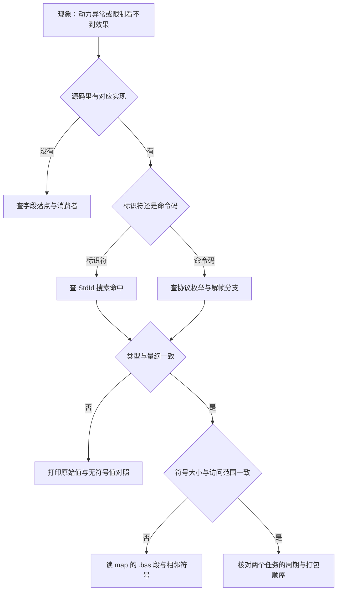
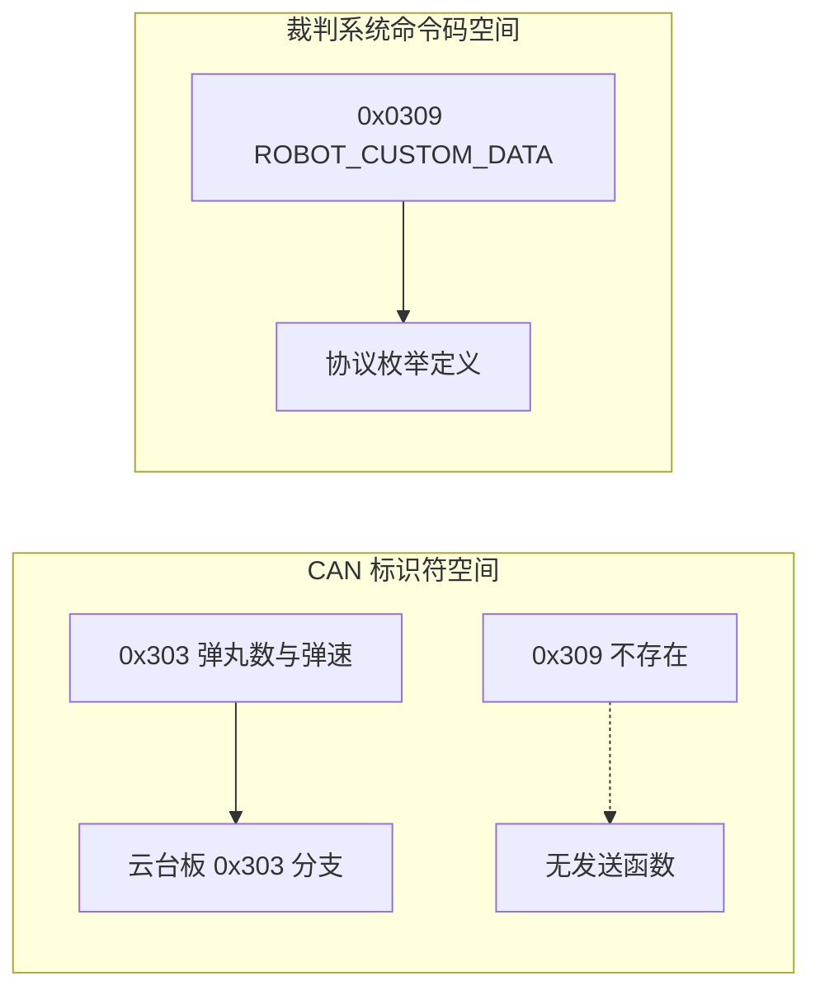
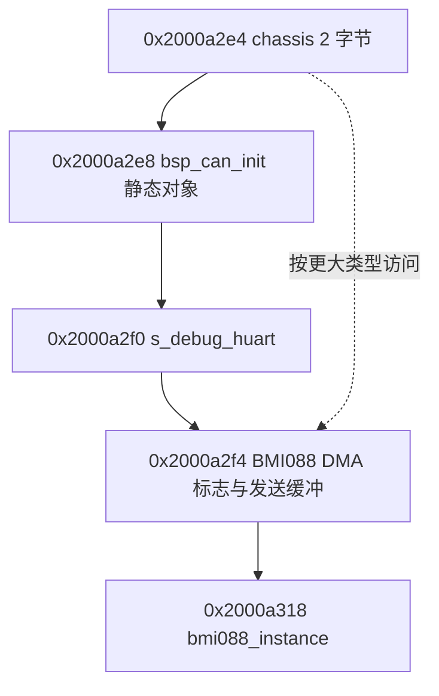

# 易错点与排查顺序

功率控制相关的排查在当前检出里有一个特殊前提：多数人以为存在的三层，也就是功率模型、限制器与热量转发帧，都不存在。因此第一步应当先确认被排查的对象在源码里是否真的存在，而不是先动参数。只有确认链路存在之后，系数、量纲与符号这些层次才有意义。

四层排查顺序是链路是否存在、帧号与命令码、类型与量纲、符号与内存布局，最后补一条调用时序的核对。每一层都给出可以在不改动固件的情况下完成的证据来源，改动越少的检查排在越前面。

## 排查顺序

顺序的依据是取证成本。消费者搜索与标识符搜索都只读代码；类型与量纲核对需要一个调试变量；内存布局要用构建产物；时序核对涉及两个任务，改动风险最高。把成本低的放在前面，可以在多数情况下提前结束排查。

## 第一层：链路是否存在

当前检出的底盘控制链只有一条：速度环输出进全局变量，控制中心任务打包成 0x200 帧。任何与功率限制有关的行为，如果在这条链上找不到消费者，就不可能被观察到。

| 环节 | 写入点 | 消费者 |
| --- | --- | --- |
| 速度环输出 | `Task/Src/ChassisTask.cpp:89-92` | `Task/Src/ControlCenterTask.cpp:126` 打包 0x200 |
| 功率上限 | `Communication/Src/referee_decode.cpp:65` | 无 |
| 缓冲能量 | `Communication/Src/referee_decode.cpp:86` | 无 |
| 17mm 与 42mm 热量 | `Communication/Src/referee_decode.cpp:88-89` | 无 |
| 弹速 | `Communication/Src/referee_decode.cpp:146` | `Task/Src/ControlCenterTask.cpp:123`、`Task/Src/ControlCenterTask.cpp:127` |

上位机那条路常被当成热量的出口，实际也断了。`USB_Transmit_RobotStatus` 只有声明与定义（`Task/Src/UsbConnectTask.cpp:332-340`），全树没有调用点，函数体里用的还是 `sizeof(gimbal_angle_data_t)` 与 `GIMBAL_ANGLE_PACKET_ID`（`Task/Src/UsbConnectTask.cpp:335`）。热量相关的字段只在 `Task/Inc/UsbConnectTask.h:186-188` 声明，没有任何赋值来源。

这一层的判据很简单：对任何字段先搜它的读取点。搜索命中为零时，先不要解释现象，先确认该功能是否实现。

## 第二层：帧号与命令码

第二类误判来自两套编号体系。CAN 标准标识符是 11 位帧号，裁判系统命令码是 16 位协议字段，两者数值上可以长得像，含义完全不同：

| 编号 | 属于 | 是否存在 | 位置 |
| --- | --- | --- | --- |
| 0x303 | CAN 标识符 | 存在 | `BSP/Src/bsp_can.cpp:488-518`，数据段在 `BSP/Src/bsp_can.cpp:501-510` |
| 0x309 | CAN 标识符 | 不存在 | 两棵树均无 `BSP_CAN1_SendReferee_Hot` |
| 0x0309 | 裁判系统命令码 | 存在 | `Communication/Inc/referee_decode.h:67`，`ROBOT_CUSTOM_DATA` |

判据是搜索关键字。查帧号用 `StdId` 赋值与接收分支的 `case`；查命令码用协议枚举名。把两套编号混在一起搜索，会得到“存在与不存在同时成立”的混乱结论。

## 第三层：类型与量纲

第三类误判来自类型声明不一致。四路电流指令在底盘任务里定义成 `int16_t`（`Task/Src/ChassisTask.cpp:15-18`），在控制中心任务里声明成 `uint16_t`（`Task/Src/ControlCenterTask.cpp:25-28`），封装函数的形参又是 `int16_t`（`BSP/Inc/bsp_can.h:99`）。传入时按形参重新解释，负值能正确还原，但任何按声明类型做的比较都会把负值当成接近 65535 的正数。

| 量 | 单位或口径 | 常见混淆 |
| --- | --- | --- |
| 功率 | W | 与能量 J 混用 |
| 缓冲能量 | J | 当成瞬时功率 |
| 转速 | rpm，来自 `rotor_speed` | 与线速度、弧度每秒混用 |
| 电流指令 | 编码值，限幅正负 10000 | 与安培、牛米混用 |
| 热量 | 协议自带刻度 | 当成功率上限 |

判据是把同一个变量以有符号与无符号两种格式各打印一次。两种输出差别出现在负值上时，问题就落在声明类型这一层。

## 第四层：符号与内存布局

第四类误判来自共用全局符号。底盘板有一个名为 `chassis` 的全局变量（`BSP/Src/bsp_can.cpp:27`），类型 `chassis_data`（`BSP/Inc/bsp_can.h:55-57`）只含一个 `int16_t`，构建产物里大小也是 2 字节：

| 证据 | 内容 |
| --- | --- |
| 符号表 | `chassis` 位于 `0x2000a2e4`，大小 `0x2` |
| 映射表 | `.bss.chassis` 来自 `BSP/Src/bsp_can.cpp.obj`，大小 `0x2`（`build/Debug/sentriomeni2026.map:10154-10155`） |
| 相邻对象 | `0x2000a2e8` 起是 `bsp_can_init` 的静态对象，`0x2000a2f0` 起是 `s_debug_huart`，`0x2000a2f4` 与 `0x2000a2f8` 起是 BMI088 的 DMA 标志与发送缓冲，`0x2000a318` 起是 `bmi088_instance` |

这一段来自当前构建产物的实际布局：`chassis` 后面紧邻三个模块的 BSS 对象，任何按更大结构体访问这个符号的代码都会落到它们身上，而且编译与链接都不会报错。将来新增功率状态时，正确做法是给状态量单独定义符号，而不是复用 `chassis`。

判据是读 map 的 `.bss` 段，把目标符号与后续符号的大小、地址一起列出，再与源码里的类型对照。

## 第五层：调用与时序

最后核对发送顺序。两个任务的循环周期都是 `osDelay(1)`（`Task/Src/ChassisTask.cpp:94`、`Task/Src/ControlCenterTask.cpp:128`），0x200 帧由控制中心任务在 `Task/Src/ControlCenterTask.cpp:126` 打包，帧头与字节拆分在 `BSP/Src/bsp_can.cpp:91-104`。

| 核对项 | 预期 | 证据 |
| --- | --- | --- |
| 两个任务周期 | 都是 1 ms | `Task/Src/ChassisTask.cpp:94`、`Task/Src/ControlCenterTask.cpp:128` |
| 输出写入先于打包 | 全局量在同一周期内被读取 | `Task/Src/ChassisTask.cpp:89-92`、`Task/Src/ControlCenterTask.cpp:126` |
| 0x200 帧头 | 0x200，8 字节 | `BSP/Src/bsp_can.cpp:91`、`BSP/Src/bsp_can.cpp:97-104` |
| 负值编码 | 高字节补 1，可还原 | `BSP/Src/bsp_can.cpp:97-104` |

同周期意味着两个任务谁先执行不由周期决定，而由调度器决定。观察到某一帧里四个输出属于不同轮次时，先看两个任务的优先级与阻塞点，再看打包代码。

## 从现象反查的对照表

| 现象 | 优先怀疑的层 | 需要的证据 |
| --- | --- | --- |
| 限制怎么调都没有效果 | 第一层 链路不存在 | 搜限值字段的读取点 |
| 换机器人等级后动力不匹配 | 第一层 限值未接入 | `Communication/Src/referee_decode.cpp:65` |
| 上位机看不到热量 | 第一层 上报函数无调用点 | `Task/Src/UsbConnectTask.cpp:332` |
| 负电流显示成极大正数 | 第三层 声明类型 | `Task/Src/ControlCenterTask.cpp:25-28` |
| 抓不到 0x309 | 第二层 帧不存在 | `BSP/Src/bsp_can.cpp:488-518` |
| 新增全局量后相邻模块异常 | 第四层 符号复用 | map 的 `.bss.chassis` 与相邻符号 |
| 帧里四个输出分属不同轮次 | 第五层 调度顺序 | 两个任务的优先级与阻塞点 |

## 待核实清单

| 事项 | 现状 | 核实方式 |
| --- | --- | --- |
| 电流编码到安培的换算 | 仓库里没有代码 | 按所选电调手册确定 |
| 保守上限与断连回落值 | 仓库里没有数值 | 按规则与实测确定 |
| 是否计划接入功率限制 | 无调用点 | 查看后续提交 |
| 热量上限是否补齐 | `RefereeInfo` 无对应成员 | 查看后续提交 |
| 电容硬件 | 无通信与采样代码 | 确认硬件方案 |
| `USB_Transmit_RobotStatus` 的预期用途 | 无调用点且组装参数不符 | 询问作者 |

## 小结

### 核心概念

- 当前检出里功率模型、限制器与热量转发帧都不存在，排查第一步是确认链路是否存在。
- 被消费的裁判字段只有弹速；功率上限、缓冲能量、热量与输出使能都没有读取点。
- 0x303 是存在的 CAN 帧，0x309 不存在，0x0309 是裁判系统命令码，三者分属两套编号。
- 四路电流指令在两处声明类型不同，按声明类型比较负值会得到错误的大正数。
- `chassis` 符号只有 2 字节，后面紧邻三个模块的 BSS 对象，新增状态量应当另立符号。
- 两个任务周期相同，帧内四个输出的轮次一致性由调度顺序决定。

### 设计权衡

| 权衡点 | 本工程的选择 | 收益与代价 |
| --- | --- | --- |
| 解帧与业务分离 | 回调只填结构体 | 结构清晰；代价是字段闲置时不易发现 |
| 跨文件共享全局量 | 两处各按自己的类型声明 | 省去传递参数；代价是类型口径不一致 |
| 全局符号复用 | `chassis` 保持 2 字节 | 内存占用小；代价是任何更大访问都会越界 |
| 排查从只读证据开始 | 先搜消费者再看构建产物 | 改动少；代价是内存层问题取证依赖 map |
| 限值来源 | 当前没有落脚处 | 行为由代码直接决定；代价是与裁判系统脱钩 |

## 练习

### 基础题

1. 写出消费者搜索的三条命令，分别用于找字段读取点、`StdId` 赋值与协议枚举。
2. 说明 0x303、0x309、0x0309 各属于哪套编号，并给出各自的存在性结论。
3. 解释为什么 `chassis_output_motor_1` 在两处声明类型不同时仍能正确传参，却会影响比较。
4. 按第四层的表格，写出 `chassis` 之后三个相邻对象的地址与用途。

### 挑战题

5. 设计一个上电自检：用 `sizeof` 与 map 里的符号大小对照，判断新增状态量是否越界。
6. 把 `chassis` 替换为独立的状态符号，列出需要改动的文件与顺序。
7. 设计一次观测方案，在不加 CAN 帧的前提下确认 0x0202 的缓冲能量字段解析正确。
8. 画出一张完整的排查路径图，把四个层次与“可以只读代码完成”的边界标出来。

## 附：本页引用的固件路径

| 路径 | 用途 |
| --- | --- |
| `/home/wyx/rm/2026SentriOmeniChassis/2026OmniSentryChassis/BSP/Inc/bsp_can.h` | `chassis_data` 与封装形参（`BSP/Inc/bsp_can.h:55-57`、`BSP/Inc/bsp_can.h:99`） |
| `/home/wyx/rm/2026SentriOmeniChassis/2026OmniSentryChassis/BSP/Src/bsp_can.cpp` | `chassis` 定义与 0x200 打包（`BSP/Src/bsp_can.cpp:27`、`BSP/Src/bsp_can.cpp:91-104`）、0x303 发送（`BSP/Src/bsp_can.cpp:488-518`） |
| `/home/wyx/rm/2026SentriOmeniChassis/2026OmniSentryChassis/Task/Src/ChassisTask.cpp` | 速度环输出、限幅与周期（`Task/Src/ChassisTask.cpp:15-18`、`Task/Src/ChassisTask.cpp:41`、`Task/Src/ChassisTask.cpp:89-94`） |
| `/home/wyx/rm/2026SentriOmeniChassis/2026OmniSentryChassis/Task/Src/ControlCenterTask.cpp` | 全局量声明、0x200 发送与周期（`Task/Src/ControlCenterTask.cpp:25-28`、`Task/Src/ControlCenterTask.cpp:126-128`） |
| `/home/wyx/rm/2026SentriOmeniChassis/2026OmniSentryChassis/Task/Src/UsbConnectTask.cpp` | 无调用点的上报函数（`Task/Src/UsbConnectTask.cpp:332-340`） |
| `/home/wyx/rm/2026SentriOmeniChassis/2026OmniSentryChassis/Communication/Src/referee_decode.cpp` | 功率、能量、热量与弹速的写入点（`Communication/Src/referee_decode.cpp:65`、`Communication/Src/referee_decode.cpp:86-89`、`Communication/Src/referee_decode.cpp:146`） |
| `/home/wyx/rm/2026SentriOmeniChassis/2026OmniSentryChassis/Communication/Inc/referee_decode.h` | 命令码枚举与 `RefereeInfo`（`Communication/Inc/referee_decode.h:67`、`Communication/Inc/referee_decode.h:456-499`） |
| `/home/wyx/rm/2026SentriOmeniChassis/2026OmniSentryChassis/build/Debug/sentriomeni2026.map` | `.bss.chassis` 的符号大小与相邻对象 |
