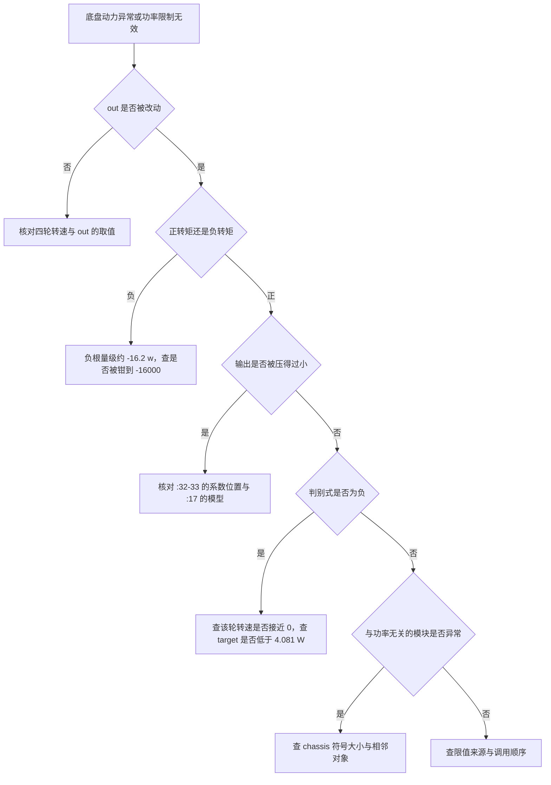
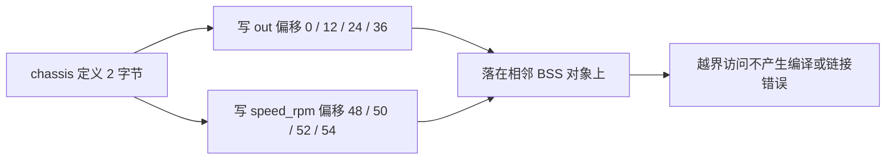

# 易错点与排查顺序

功率限制的故障表现为两类：限制不生效，或者限制过强导致底盘动作异常。两者都可能来自模型系数、方程解算、内存访问或裁判系统数据中的任意一环。本文把这五类归拢，给出可以按顺序执行的排查路径。

## 1. 概念：五类归属

| 类别 | 典型表现 | 主要证据 |
| --- | --- | --- |
| 模型与量纲 | 估计功率与实际相差成倍 | 系数、转速与电流编码的单位 |
| 方程与分支 | 输出被压得很小或放大到钳位 | $b$、$d$、判别式的中间值 |
| 内存与符号 | 与功率无关的模块出现异常值 | 链接产物里的符号大小与相邻对象 |
| 裁判系统 | 限值与等级不匹配、热量不生效 | 0x0201 与 0x0202 的字段落点 |
| 调用与时序 | 顺序错误、周期不匹配 | 调用点行号与任务周期 |

## 2. 排查顺序

## 3. 落到本项目

### 3.1 符号大小与访问范围

`BSP/Src/bsp_can.cpp:27` 定义了一个名为 `chassis` 的全局变量，类型是 `chassis_data`（`BSP/Inc/bsp_can.h:55-57`），成员只有一个 `int16_t spinvelocity`，大小 2 字节。`Task/Src/ControlCenterTask.cpp:22` 用同名外部声明把它当作 `chassis_move_t` 使用，后者含四个 `motor_pid_t` 与四个 `motor_measure_t`，大小 56 字节（`Algorithm/Inc/motor_power_control.h:23-26`）。

构建产物里的符号大小与源文件一致：

| 证据 | 内容 |
| --- | --- |
| 符号表 | `chassis` 位于 `0x2000a410`，大小 `0x2` |
| 映射表 | `.bss.chassis` 来自 `BSP/Src/bsp_can.cpp.obj`，大小 `0x2` |
| 目标文件 | `bsp_can.cpp.obj` 中 `chassis` 为定义，`ControlCenterTask.cpp.obj` 中为未定义引用 |
| 相邻对象 | `0x2000a414` 起是 `bsp_can_init` 的静态对象，`0x2000a41c` 起是 `debug.cpp` 的 `s_debug_huart`，`0x2000a420` 起是 BMI088 的 DMA 标志与发送缓冲 |

功率限制按 56 字节读写这块内存，写点落在相邻对象上。`ControlCenterTask.cpp:133-141` 每周期都会写入八个字段，这条路径的越界写与 `total` 是否超限无关。上述映射来自 `build/Debug` 里 2026-03-28 的产物，而 `ControlCenterTask.cpp` 的修改时间更晚，重新构建后相邻对象的排列会变，越界写入这一事实不变。

### 3.2 正向模型与反向方程的系数位置

`motor_power_control.c:17` 的正向计算把 `k1 * w` 当作与 $T$ 无关的常数项；`:32` 又把同一个量当作 $T$ 的一次项系数。同一工况下两种读法的解相差一个数量级：

| 工况 | 源码解出的 $T$ | 按 `:17` 模型解出的 $T$ |
| --- | --- | --- |
| $\omega = 8000$、四轮 $T = 10000$、限值 95 W | 645.9 | 9174.8 |
| 同上，其中一台 $T = -10000$ | -16000（钳位） | -9371.0 |
| $\omega = 8500$、三台 $T = 10000$、一台 $T = 0$ | -16000（钳位） | 无解，目标低于该转速的最小功率 |

### 3.3 负转矩分支与方向翻转

$d < 0$ 时两根异号。$b = k_1\omega$ 很小而 $a = 1.23\times10^{-7}$，负根的量级由 $-b/a \approx -16.2\omega$ 决定，超过约 986 rpm 后必然越过 -16000 的下钳位。表现是回馈制动的一台电流被从较小的原值放大到 -16000。正向模型对 $T$ 是偶函数，同一转速下 $+T$ 与 $-T$ 的估计功率相同。

$d > 0$ 且 $\omega > 0$ 时两根同为负，符号选择不再保持方向。三台 $\omega = 8500$、$T = 10000$ 加一台 $\omega = 8500$、$T = 0$，总量 95.284 W，第四台原输出为 0 时取负根得到 -137994.9，钳位后 -16000；原输出改为 1 时取正根得到 -1.56。

### 3.4 判别式小于零

`:36` 的跳过分支等价于 $P' < k_2\omega^2 + c - (k_1\omega)^2/(4a)$，阈值大于零要求 $|\omega|$ 低于约 716 rpm。$\omega = 0$、$T = 0$ 的电机功率正好等于 $c$，缩放比略小于 1 即可触发，其余三轮需要把总量推过 95 W，转速要读到约 9800 rpm。被跳过的电机保留未缩放的原输出，四台的总功率高于目标。

### 3.5 限值与热量

| 项 | 源码状态 | 关联位置 |
| --- | --- | --- |
| 功率限值 | 常量 `95.0f` | `ControlCenterTask.cpp:143`，注释写 100W 在 `:132` |
| 裁判系统功率上限 | 已解出未读取 | `referee_decode.cpp:65` |
| 缓冲能量 | 已解出未读取 | `referee_decode.cpp:86` |
| 热量上限 | 协议有字段，解帧未拷贝 | `referee_decode.h:159` |
| 热量限制 | 无 | 热量只转发，见 `ControlCenterTask.cpp:153` |

### 3.6 调用与时序

`motor_power_limit` 必须在速度环输出写回 `int16_t` 之前调用，`ControlCenterTask.cpp:143` 位于 `:145-148` 之前。`ChassisTask` 与 `ControlCenterTask` 都是 `osDelay(2)`（`ChassisTask.cpp:94`、`ControlCenterTask.cpp:154`），两个任务各自维护目标值，功率限制只作用于 `ControlCenterTask` 这一侧写入的输出。

## 4. 待核实清单

| 事项 | 现状 | 核实方式 |
| --- | --- | --- |
| `chassis` 符号的实际访问范围 | 定义 2 字节，使用 56 字节 | 在写点前后用调试器检查相邻对象 |
| 正向与反向的系数位置 | 两处不一致 | 询问作者或按实测功率回归 |
| 系数来源 | 无注释与标定记录 | 查找拟合数据或重新拟合 |
| `95.0f` 的来源 | 注释写 100W，实参 95.0f | 询问作者 |
| 负转矩是否应参与限制 | 源码按符号选根 | 台架对比制动工况 |
| 判别式分支的期望行为 | 保留原输出 | 设计二次分配后对比总功率 |
| $d > 0$ 时原输出为 0 的期望行为 | 取负根后钳到 -16000 | 台架对比该轮的响应 |
| 裁判系统字段是否计划接入 | 已解出未读取 | 查看后续提交 |
| 热量限制的归属板 | 两块板都无 | 确认云台板后续计划 |

## 5. 小结

### 核心概念

- 排查顺序按内存与符号、模型与量纲、方程与分支、裁判系统、时序推进，前一层不通过时后面都是噪声。
- `chassis` 在链接产物里是 2 字节，功率限制按 56 字节访问，越界写不产生编译或链接错误。
- 正向模型与反向方程对 `k1 * w` 的使用位置不同，正转矩工况下解相差一个数量级。
- 负转矩分支的根量级约为 $-16.2\omega$，常被钳到 -16000。
- $d > 0$ 时两根同号，原输出为 0 的电机被钳到 -16000，输出在 0 附近不连续。
- 判别式小于零只出现在转速接近零的电机上，阈值在 $\omega = 0$ 时为 4.081 W。
- 功率限值是常量，缓冲能量与裁判系统功率上限都没有消费者，热量只转发不限制。

### 设计权衡

| 权衡点 | 本工程的选择 | 收益与代价 |
| --- | --- | --- |
| 跨文件共享一个全局变量 | 两处各按自己的类型使用 `chassis` | 省去传递参数；代价是访问范围超出定义 |
| 常量限值 | `95.0f` | 行为固定；代价是与裁判系统脱钩 |
| 热量只上报 | 不接入发射抑制 | 逻辑简单；代价是热量上限不生效 |
| 模型与解算共用系数 | 共用 `k1`、`k2`、`a` | 便于调整；代价是两处的使用位置要一致 |

## 6. 练习

### 基础题

1. 列出排查顺序里的前三个检查点，并给出每个检查点需要的证据。
2. 写出 `chassis_data` 与 `chassis_move_t` 的成员与大小差异。
3. 写出负转矩分支被钳位后，该台电机的估计功率与目标功率之间的关系。

### 挑战题

4. 写一个上电自检：用 `sizeof(chassis)` 与 `sizeof(chassis_move_t)` 判断符号大小是否匹配，说明这个问题无法在编译期发现的原因。
5. 给判别式分支设计二次分配，说明被跳过的功率怎样分给其余电机，并给出总功率的新表达式。
6. 设计一次台架实验，同时定下待核实清单里的前三项。

### 附：本页引用的固件路径

| 路径 | 用途 |
| --- | --- |
| `/home/wyx/rm/2026SentriOmeniChassis/2026OmniSentryChassis/BSP/Inc/bsp_can.h` | `chassis_data` 与 `DJI_motor_info` 定义（`:10-57`） |
| `/home/wyx/rm/2026SentriOmeniChassis/2026OmniSentryChassis/BSP/Src/bsp_can.cpp` | `chassis` 的定义（`:27`） |
| `/home/wyx/rm/2026SentriOmeniChassis/2026OmniSentryChassis/Algorithm/Inc/motor_power_control.h` | `chassis_move_t` 定义（`:11-26`） |
| `/home/wyx/rm/2026SentriOmeniChassis/2026OmniSentryChassis/Algorithm/Src/motor_power_control.c` | 模型与解算（`:3-47`） |
| `/home/wyx/rm/2026SentriOmeniChassis/2026OmniSentryChassis/Task/Src/ControlCenterTask.cpp` | 调用点与越界写入路径（`:22`、`:132-154`） |
| `/home/wyx/rm/2026SentriOmeniChassis/2026OmniSentryChassis/Task/Src/ChassisTask.cpp` | 速度环周期与限幅（`:41`、`:94`） |
| `/home/wyx/rm/2026SentriOmeniChassis/2026OmniSentryChassis/Communication/Src/referee_decode.cpp` | 功率上限与缓冲能量的写入点（`:65`、`:86`） |
| `/home/wyx/rm/2026SentriOmeniChassis/2026OmniSentryChassis/build/Debug/sentriomeni2026.map` | 符号大小与相邻对象（`.bss.chassis`） |
