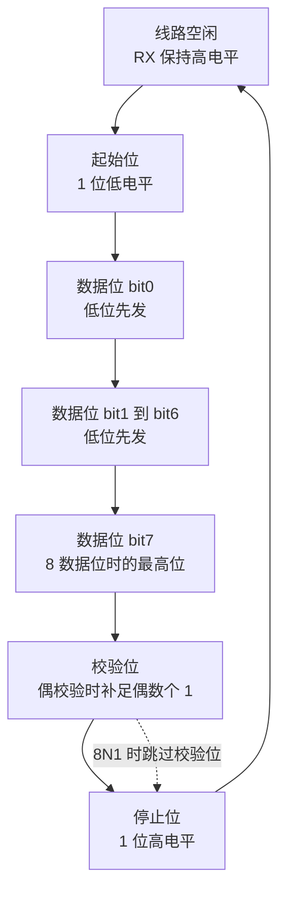
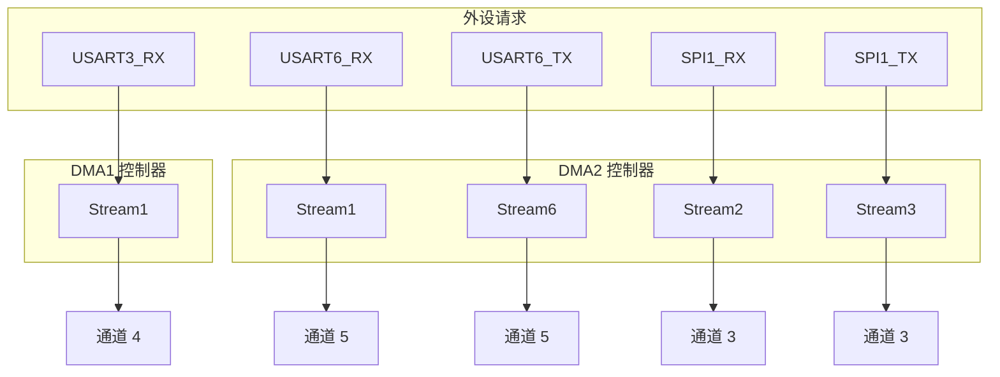
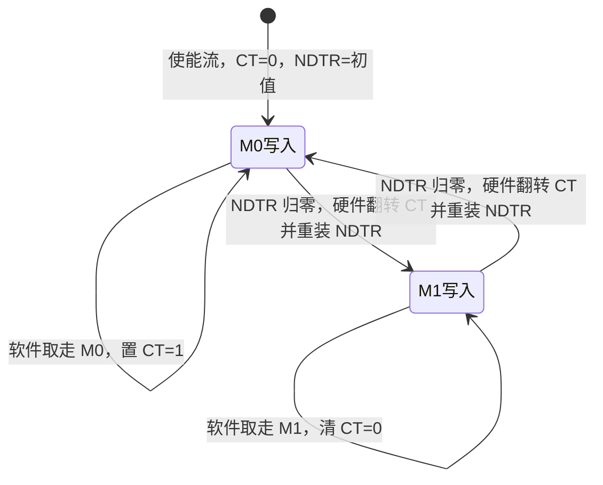

# UART 与 DMA 基础

遥控接收每 1 ms 送来一帧数据。如果主循环里轮询着逐字节去读，留给控制环的时间会被这串字节吃掉；改成每来一个字节进一次中断，CPU 又要为中断进出和 HAL 状态判断付费。云台板固件 `2026OmniSentryGimbal` 与底盘板固件 `2026OmniSentryChassis` 的串口参数逐字相同，初始化都在 `Core/Src/usart.c`，两边的取舍完全一样。三路串口各自接什么、引脚与 DMA 流怎么分在 `03-本项目USART外设分配`，空闲中断与双缓冲的运行时行为在 `02-空闲中断与双缓冲接收`。

异步串口没有时钟线。收发双方约定同一个波特率，每个字节用起始位做相位对齐，用停止位保证线路上有确定的空闲电平。发送方按位串出，接收方按位采样，一位一位地还原。

这条链路上有两个独立的成本。协议成本是每个字节实际占用的线时间，8 数据位、无校验、1 停止位的一帧是 10 个位时间；搬运成本是 CPU 在接收或发送缓冲之间搬字节的开销，每来一个字节就进一次中断，中断进出与 HAL 的状态判断会随字节率线性增长。

DMA 消掉的是第二项：外设的每次数据请求由 DMA 控制器直接读写内存，CPU 只在整帧结束时处理一次。串口协议本身（帧格式、波特率、校验）不因 DMA 改变。

| 帧格式 | 每位字节的位时间 | 100000 波特下每字节时间 | 每秒字节数上限 |
| --- | --- | --- | --- |
| 8N1 | 10 | 100 微秒 | 10000 |
| 8E1 | 11 | 110 微秒 | 9090 |
| 9N1 | 11 | 110 微秒 | 9090 |

DBUS 的 18 字节一帧按 8E1 计算，线上占用约 `18 × 110 = 1980` 微秒，帧周期按 DJI 公布的约 14 毫秒（按手册），线路占用率约 14%。这个量级说明串口侧的余量很大，瓶颈从不在波特率上。

> 源码索引

| 路径 | 作用 |
| --- | --- |
| `Core/Src/usart.c` | 三路 USART 的帧格式与 DMA 配置 |
| `Core/Src/main.c` | 时钟树与初始化调用 |
| `Core/Src/dma.c` | DMA 控制器时钟与 NVIC |
| `Communication/Src/usart_dma.cpp` | 自研接收启动与双缓冲入口 |
| HAL 头文件与源码 | BRR 宏、CR1 写入、双缓冲回调 |

## 一帧的逐位结构与三类错误标志

一帧从空闲态（线上为高）开始，发送方拉低一个位时间作为起始位，接收方在起始位的下降沿同步自己的位采样时钟。

接收方在每个位时间的中间采样，避免边沿抖动。停止位为高说明本帧正常结束；停止位为低置帧错误 `FE`；校验位不符置校验错误 `PE`；上一个字节还没被读走又来了新字节置溢出错误 `ORE`。三个错误位在同一状态寄存器里，HAL 的 `__HAL_UART_CLEAR_IDLEFLAG` 会先读 `SR` 再读 `DR`，这一对读操作同时清掉了 `IDLE`、`RXNE`、`ORE`、`FE`、`NE`（`Drivers/STM32F4xx_HAL_Driver/Inc/stm32f4xx_hal_uart.h:502-508`、`:540`）。

三类错误的共同点是都由硬件置位、都需要软件读写寄存器清除。漏清的后果是标志长期挂起，中断反复进入或状态判断失真。

## 过采样与波特率容差

USART 的接收采样时钟由 `PCLK` 分频得到。过采样 16 倍时，每个位时间被切成 16 个采样时钟；接收方取第 8、9、10 个采样点做多数表决，因此对波特率偏差的容忍度约为正负 3%。过采样 8 倍把采样点压缩到 3 个，容忍度下降到一半，最高可用速率提高到 `PCLK/8`。

两个板都取 `UART_OVERSAMPLING_16`（`Core/Src/usart.c:53`、`:82`、`:111`），所以 `CR1` 的 `OVER8` 位为 0。选 16 倍的理由是容差更大，代价是相同 `PCLK` 下的最高波特率减半。本工程三路串口的波特率都不超过 115200，远未触及上限。

## BRR 由分频值换算而来

过采样 16 倍时，分频值由波特率反推：

$$USARTDIV = \frac{f_{PCLK}}{16 \cdot Baud}$$

`USARTDIV` 的高 12 位是整数部分（尾数），低 4 位是小数部分。HAL 不直接用浮点，而是把公式放大 100 倍后用整数运算，再拆回尾数和小数（`stm32f4xx_hal_uart.h:860-868`）：

$$DIV100 = \left\lfloor \frac{f_{PCLK} \times 25}{4 \cdot Baud} \right\rfloor, \quad mant = \left\lfloor DIV100 / 100 \right\rfloor, \quad frac = \left\lfloor \frac{(DIV100 - 100 \cdot mant) \times 16 + 50}{100} \right\rfloor$$

写寄存器的值 `BRR = (mant << 4) + frac`。`UART_SetConfig` 在判断外设挂在哪条总线上之后调用这组宏：`USART1` 与 `USART6` 取 `PCLK2`，`USART2/3` 等取 `PCLK1`（`stm32f4xx_hal_uart.c:3764-3792`）。

云台板的时钟链是 HSE 12 MHz 经 `PLLM=6` 得 2 MHz，`PLLN=168` 得 336 MHz，`PLLP=2` 得 SYSCLK 168 MHz；`APB1CLKDivider = RCC_HCLK_DIV4` 得 `PCLK1 = 42 MHz`，`APB2CLKDivider = RCC_HCLK_DIV2` 得 `PCLK2 = 84 MHz`（`Core/Src/main.c:165-185`）。两条总线的分频比不同，同一个波特率算出的 `BRR` 也不同。

| 实例 | 总线 | `PCLK` | 目标波特率 | `USARTDIV` | 尾数 | 小数 | `BRR` | 实际波特率 | 偏差 |
| --- | --- | --- | --- | --- | --- | --- | --- | --- | --- |
| USART3 | APB1 | 42 MHz | 100000 | 26.25 | 26 | 4 | 0x1A4 | 100000 | 0 |
| USART1 | APB2 | 84 MHz | 115200 | 45.5729 | 45 | 9 | 0x2D9 | 115226 | +0.023% |
| USART6 | APB2 | 84 MHz | 115200 | 45.5729 | 45 | 9 | 0x2D9 | 115226 | +0.023% |

## 10 万波特为什么能精确命中

常被引用的 9600、115200 都是 2 的整数次幂分频能命中的值，而 100000 不是。它在 F4 上能配得干净，靠的是小数分频：42 MHz 下 `USARTDIV = 26.25`，小数 0.25 正好是 4/16，不需要舍入，实际波特率与目标完全一致。

换一条 `PCLK` 就未必。若 `PCLK1` 从 42 MHz 变成 36 MHz，同样的 `BRR` 会得到 `36e6 / 420 = 85714` 波特，与 100000 差 14.3%。串口与 CAN 共享同一个时钟树，改 `APB1CLKDivider` 会同时打坏两者，这一点在 `03-CAN 与电机/01-CAN外设与过滤器` 的排查记录里有完整案例。

## 三路串口的帧格式与校验口径

三路串口的帧格式来自 `Core/Src/usart.c`，逐项如下。

| 实例 | 波特率 | `WordLength` | `Parity` | `StopBits` | `Mode` | 出处 |
| --- | --- | --- | --- | --- | --- | --- |
| USART1 | 115200 | `UART_WORDLENGTH_8B` | `UART_PARITY_NONE` | 1 | `UART_MODE_TX_RX` | `usart.c:47-51` |
| USART3 | 100000 | `UART_WORDLENGTH_8B` | `UART_PARITY_EVEN` | 1 | `UART_MODE_RX` | `usart.c:76-80` |
| USART6 | 115200 | `UART_WORDLENGTH_8B` | `UART_PARITY_NONE` | 1 | `UART_MODE_TX_RX` | `usart.c:105-109` |

这三个字段由 `UART_SetConfig` 拼进 `CR1`：`WordLength` 决定 `M` 位，`Parity` 决定 `PCE` 与 `PS` 位（`stm32f4xx_hal_uart.c:3754-3757`）。USART3 写进去的组合是 `M=0`、`PCE=1`、`PS=0`，即偶校验。

需要标出的一处口径冲突（按手册推断，待实测）：

- 按 STM32F4 的 USART 手册，`M=0` 且 `PCE=1` 的帧是 7 数据位加 1 个校验位，校验位在数据寄存器里占最高位。HAL 的中断接收路径也按这个理解，对 8 位字长加校验的组合只取 `DR` 的低 7 位（`stm32f4xx_hal_uart.c:3650-3657`）。
- DBUS 规定的是 8 数据位加偶校验。若严格按手册，USART3 的 `M=0` 少了一个数据位。
- 本工程的接收走 DMA，DMA 按字节搬 `DR` 的低 8 位，会把校验位所在的那一位一并搬进缓冲区。由此推断 8 个原始数据位仍可能被完整重组，但这条推断没有在硬件上验证，标为待实测。
- 若要和 DBUS 的 8 数据位严格对齐，正确组合是 9 位字长加偶校验（`M=1`、`PCE=1`，即 8 数据位加 1 校验位）。同批次其它 RoboMaster 工程在相同波特率下普遍用这个组合。

## DMA 控制器的流与通道

STM32F4 有 DMA1 与 DMA2 两个控制器，每个控制器 8 条流（stream），每条流 8 个通道（channel）。三个概念的关系是：

- 流是独立的传输引擎，有自己的外设地址寄存器 `PAR`、内存地址寄存器 `M0AR` 与 `M1AR`、剩余计数 `NDTR`、配置寄存器 `CR` 和 FIFO 控制寄存器 `FCR`。一条流同一时刻只能服务一个请求。
- 通道是请求源的选择器。外设的 DMA 请求接到哪条流的哪个通道由硬件走线固定，软件只能通过 `CR` 的 `CHSEL` 位从该流可选的请求里挑一个，不能任意改接。
- 同一条流不能同时被两个外设占用。选流时先查请求映射表，再看该流的通道是否已被占用。

图中同时画出 SPI1 的两条请求，是为了说明 DMA2 上多外设共存时的通道占用（SPI1_RX 走 `DMA2_Stream2`、SPI1_TX 走 `DMA2_Stream3`，都属于通道 3；本单元正文只讨论串口三条，SPI1 的配置在 `Core/Src/spi.c`）。

映射关系按外设数据手册的 DMA 请求表确定，不来自代码。本工程实际用到的三对是 `USART3_RX → DMA1_Stream1 通道 4`、`USART6_RX → DMA2_Stream1 通道 5`、`USART6_TX → DMA2_Stream6 通道 5`（`Core/Src/usart.c:180-181`、`:226-227`、`:244-245`，以及 `2026sentriomeni.ioc` 的 `Dma.*` 项）。

## 普通模式、循环模式与双缓冲

| 模式 | `NDTR` 归零后的行为 | `EN` 位 | 适用场景 |
| --- | --- | --- | --- |
| 普通 Normal | 停止，等软件重装 `NDTR` | 硬件清零 | 定长块传输 |
| 循环 Circular | 自动重装为初值，继续覆盖同一缓冲区 | 保持 1 | 连续数据流、环形缓冲 |

循环模式省掉了软件重装，代价是缓冲区被反复覆盖，软件必须在下一次回卷前把数据取走。外设地址不递增（`PINC=0`），内存地址递增（`MINC=1`），所以 DMA 每响应一次请求就把外设寄存器的一个字节搬到内存的下一个位置。

双缓冲（`DMA_SxCR_DBM`）在一条流上准备两块内存 `M0AR` 与 `M1AR`，`CT` 位指出当前正在写入哪一块，写满时硬件自动翻转并重装 `NDTR`。`CT` 的逐拍时序、回调时刻它指向哪一块、以及 `NDTR` 为什么变成当前块进度，完整推导在 `02-空闲中断与双缓冲接收`；本页只保留上面的模式层面结论。

## 自研 Init 如何覆盖 CubeMX 的缓冲模式

本工程没有走 HAL 的 DMA 收发接口，而是自建 `UsartDma` 类。它的 `Init()` 先把 `CR3` 的 `DMAR` 与 `DMAT` 位置上，再用 `DMAEx_MultiBufferStart_NoIT` 打开 `DBM` 并启动流（`Communication/Src/usart_dma.cpp:33-48`、`:118-178`）。因此 CubeMX 生成时给每条流选的循环或普通模式，在启动后不再决定运行时行为，`DBM` 成为实际的缓冲策略。细节见 `02-空闲中断与双缓冲接收`。

| 句柄 | 外设 | 流与通道 | CubeMX 写入的模式 | 自研 `Init()` 之后的实际行为 |
| --- | --- | --- | --- | --- |
| `hdma_usart3_rx` | USART3 RX | DMA1_Stream1 通道 4 | `DMA_CIRCULAR` | 打开 `DBM`，按空闲中断手动切块 |
| `hdma_usart6_rx` | USART6 RX | DMA2_Stream1 通道 5 | `DMA_NORMAL` | 同样被打开 `DBM`，与 USART3 走同一条代码路径 |
| `hdma_usart6_tx` | USART6 TX | DMA2_Stream6 通道 5 | `DMA_CIRCULAR` | 未被 `Init()` 触碰，若走 HAL 发送则保持循环 |

`hdma_usart6_tx` 的 `DMA_CIRCULAR` 在发送侧是不合适的取值：循环模式下发送流写满缓冲后自动重发，HAL 的传输完成回调会被反复触发，发送没有自然终点。本工程全工程没有 `Uart_Transmit_DMA` 的调用点，所以这条配置目前只是潜在问题，未在线路上表现（`04-收发实现与回调链` 有完整核对）。

HAL 的 `HAL_DMA_Init` 负责把 `CR` 的其余字段写进去（`stm32f4xx_hal_dma.c:227-250`），自研启动函数只在此之后改 `DBM` 与地址，不改通道号。`__HAL_DMA_ENABLE` 与 `__HAL_DMA_SET_COUNTER` 是后续重装用到的两个宏（`stm32f4xx_hal_dma.h:417`、`:627`）。

## 基础层面的易错点

| 易错点 | 现象 | 对应位置 |
| --- | --- | --- |
| 把 `BRR` 当波特率 | 直接用目标值或整数分频写寄存器 | `stm32f4xx_hal_uart.c:3784-3792` 由宏算出分频值 |
| 忽略 `PCLK` 来源 | USART1/6 与 USART3 用了同一条总线的分频假设 | `stm32f4xx_hal_uart.c:3764-3783` 区分 `PCLK1` 与 `PCLK2` |
| 8 位字长加校验等于 8 数据位 | DBUS 口径按 8 数据位理解 | 按手册 `M=0`、`PCE=1` 为 7 数据位加校验，待实测 |
| 认为 `NDTR` 是已传输字节数 | 用 `NDTR` 直接当长度 | `NDTR` 是剩余数，已传输数为 `初值 - NDTR` |
| 认为 DMA 通道可自由选择 | 把请求接到任意流的任意通道 | 流与通道的对应由硬件固定，只能查表 |
| 忽略流的独占性 | 两个外设抢同一条流 | 同一条流同一时刻只服务一个请求 |
| 认为 CubeMX 的 DMA 模式在运行时生效 | 按 `CIRCULAR` 推演接收行为 | 自研 `Init()` 置 `DBM`，模式被覆盖 |

## 小结

### 核心概念

- 异步串口靠起始位对齐，靠停止位收尾；8E1 每字节 11 个位时间。
- 过采样 16 倍时 `USARTDIV = PCLK / (16 × Baud)`，BRR 是尾数左移 4 位加 4 位小数；小数分频让 100000 这类非标波特率也能精确命中原值。
- USART1 与 USART6 挂 APB2 取 `PCLK2`，USART3 挂 APB1 取 `PCLK1`，两块板分别是 84 MHz 与 42 MHz。
- STM32F4 的 DMA 由流与通道两层构成：流是传输引擎，通道是固定的请求选择；一条流同一时刻只服务一个请求。
- 普通模式停在 `NDTR` 归零，循环模式自动重装；双缓冲用两块内存与 `CT` 位，把 `NDTR` 语义从总长度变成当前块的进度。
- 本工程的接收 DMA 由自研 `Init()` 打开 `DBM`，CubeMX 的循环或普通模式在启动后不再生效。

### 设计权衡

| 决策 | 选择 | 收益 | 代价 |
| --- | --- | --- | --- |
| 搬运方式 | DMA 而非逐字节中断 | CPU 只在帧结束时介入 | 引入 `NDTR`、`CT` 等状态，出错更难复现 |
| 接收策略 | 双缓冲加空闲中断 | 不丢字节，帧结束即回调 | 依赖空闲间隙，超过缓冲长度的连续流会失效 |
| 波特率 | 100000 小数分频 | 与 DBUS 规定一致，无舍入误差 | 换 `PCLK` 后偏差会被放大 |
| 帧格式 | 8 位字长加偶校验 | 与 CubeMX 常见写法一致 | 按手册少一个数据位，口径待实测 |
| 过采样 | 16 倍 | 波特率容差约正负 3% | 最高可用速率减半 |
| 发送 DMA | USART6 TX 配循环 | 未接线，暂无影响 | 一旦启用会反复发送，需要改回普通模式 |

## 练习

### 基础题

1. 写出 8E1 一帧的位序列，并计算 100000 波特下每字节的线时间与每秒字节数上限。
2. 云台板 `PCLK1 = 42 MHz`，目标是 200000 波特、过采样 16 倍。写出 `USARTDIV`、尾数、小数与 `BRR`，并判断实际波特率是否精确。
3. 说明 `NDTR` 与本次已传输字节数的关系，并给出从 `NDTR` 还原长度的表达式。
4. 列出本工程三对串口 DMA 的流与通道，并说明为什么不能把 `USART6_TX` 改接到 DMA1。

### 挑战题

5. 若 USART3 改用 `M=1`、`PCE=1`，同样的 100000 波特下 `BRR` 是否需要改？说明理由，并写出数据位数与校验位的分布。
6. 一条流被配置为普通模式、`NDTR=18`、内存不递增。分析它能服务哪种串口用法，以及在什么条件下会丢失数据。
7. 在保持 `PCLK1=42 MHz` 的前提下，列出 100000 附近 1% 以内所有能被过采样 16 倍精确表示的波特率，并说明取值间隔。

---

### 附：本页引用的固件路径

| 路径 | 用途 |
| --- | --- |
| `2026OmniSentryGimbal/Core/Src/usart.c` | 三路 USART 的帧格式（:46-53、:75-82、:104-111）与 DMA/NVIC 配置（:180-199、:226-263） |
| `2026OmniSentryGimbal/Core/Src/main.c` | 时钟树（:165-185）与 `Uart_Init` 调用（:125） |
| `2026OmniSentryGimbal/Core/Src/dma.c` | DMA 控制器时钟与 NVIC 使能（:39-63） |
| `2026OmniSentryGimbal/Communication/Src/usart_dma.cpp` | 自研接收启动与双缓冲入口（:33-48、:118-178） |
| `2026OmniSentryGimbal/Drivers/STM32F4xx_HAL_Driver/Src/stm32f4xx_hal_uart.c` | BRR 与 `CR1` 写入（:3731-3792）、中断接收的位宽处理（:3650-3657） |
| `2026OmniSentryGimbal/Drivers/STM32F4xx_HAL_Driver/Inc/stm32f4xx_hal_uart.h` | BRR 宏（:860-878）、清空闲标志序列（:502-508、:540） |
| `2026OmniSentryGimbal/Drivers/STM32F4xx_HAL_Driver/Src/stm32f4xx_hal_dma.c` | `HAL_DMA_Init` 写 `CR`（:227-250）、双缓冲中断回调（:804-825、:878-898） |
| `2026OmniSentryGimbal/Drivers/STM32F4xx_HAL_Driver/Inc/stm32f4xx_hal_dma.h` | `__HAL_DMA_ENABLE`（:417）、`__HAL_DMA_SET_COUNTER`（:627） |
| `2026OmniSentryChassis/Core/Src/usart.c` | 与云台板逐字相同的串口配置 |
