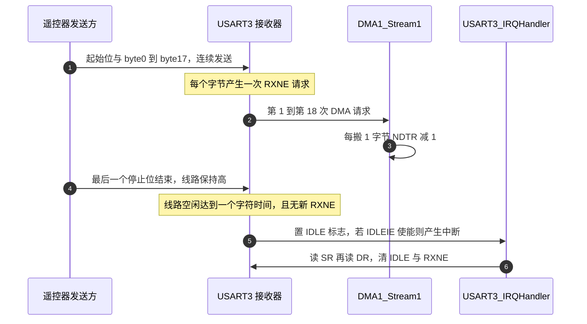
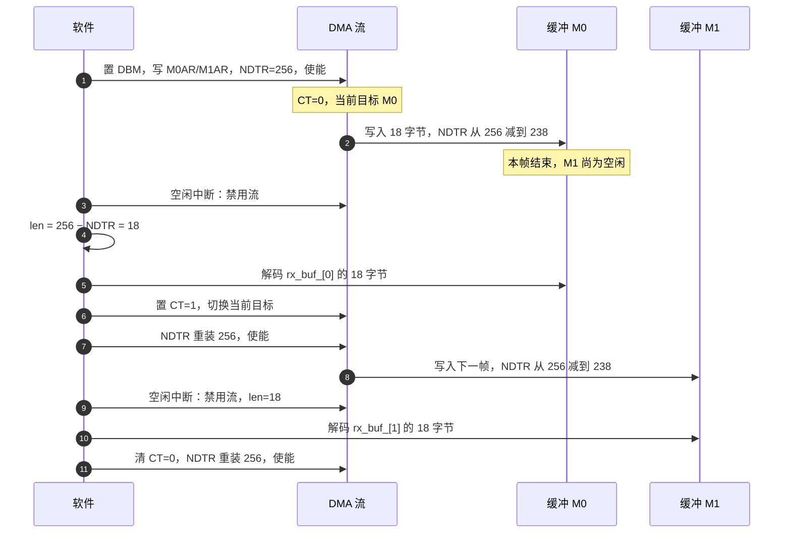
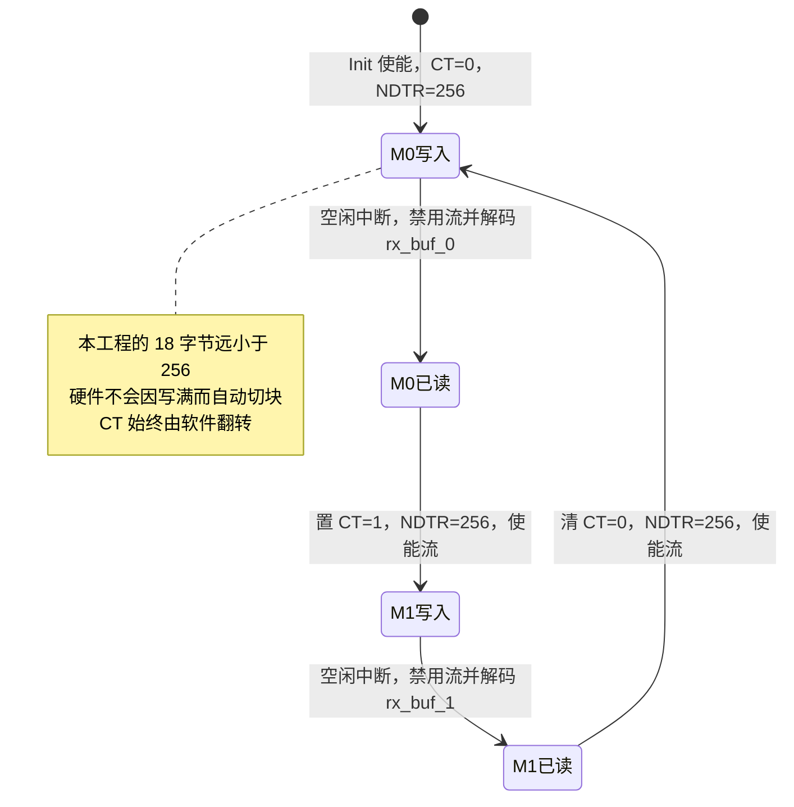

# 空闲中断与双缓冲接收

> 代码来自云台板固件 `2026OmniSentryGimbal/Communication/Src/usart_dma.cpp` 与头文件 `Communication/Inc/usart_dma.h`，底盘板同名文件内容相同。中断入口在两块板的 `Core/Src/stm32f4xx_it.c`。
>
> 串口外设与 DMA 的寄存器背景见 `01-UART与DMA基础`；本页只讲接收运行时的定帧与切缓冲。

接收方要处理的数据单元是一帧，而不是单个字节。界定帧结束有几种做法，本工程对 USART3 与 USART6 的接收都选了空闲间隔：线路持续一个字符时间的高电平即认为本帧结束。这个判据与协议无关，也不需要帧头带长度，代价是要求帧与帧之间存在可测的间隙。

定帧之后是缓冲策略。单块 DMA 缓冲在软件取走数据之前会被覆盖，双缓冲把内存分成两块，用 `CT` 位指出当前写入目标，软件处理完一块再翻转 `CT` 归还控制权。本工程的帧长 18 字节远小于 256 字节的缓冲，因此硬件永远不会写满自动切块，`CT` 的控制权完全在软件手里。

本页按帧结束信号的取法、`IDLE` 的置位与清零、`NDTR` 与 `CT` 的语义、启动与空闲回调的逐步动作、以及失效条件展开。

> 源码索引

| 路径 | 作用 |
| --- | --- |
| `Communication/Src/usart_dma.cpp` | 接收启动、中断分派、空闲处理、切块回调 |
| `Communication/Inc/usart_dma.h` | 缓冲长度、双缓冲成员与重入标志 |
| `Core/Src/stm32f4xx_it.c` | 中断入口 |
| HAL 头文件与源码 | 清标志序列与双缓冲回调 |

## 帧结束信号有四种取法

| 做法 | 依据 | 前提 | 本工程 |
| --- | --- | --- | --- |
| 固定长度 | 数满 N 个字节即一帧 | 所有帧等长 | DBUS 是 18 字节，可变长协议不适用 |
| 分隔符 | 收到约定的结束字节 | 结束字节不出现在载荷中 | 未使用 |
| 长度字段 | 帧头自带长度 | 需要先解析头部 | 裁判系统用，见 `05-裁判系统协议` |
| 空闲间隔 | 线路出现一段空闲即认为一帧结束 | 帧与帧之间有可测的间隙 | USART3 与 USART6 接收都用这一条 |

空闲间隔之所以能当帧结束信号，是因为异步串口在空闲态持续为高，而连续发送的两个字节之间没有低于一个位时间的空隙。接收方一旦检测到线路上持续一个字符时间的高电平，就说明本帧的数据字节已经发完。

四种做法的可靠性依赖不同：固定长度最省事但只适配一种帧；分隔符要求载荷不出现特殊字节；长度字段需要先成功解析头部；空闲间隔依赖发送方的帧间隔。DBUS 的 18 字节恰好也是定长的，所以这一路即使不用空闲中断，理论上也能靠固定长度收帧，但换成裁判系统那种变长协议就不成立。

## IDLE 标志何时置位、如何清零

STM32F4 的 USART 提供 `IDLE` 标志。接收方在收到最后一个停止位之后，若 RX 线保持空闲达到一个字符时间（约 10 到 11 个位时间，随帧格式而定，按手册），且数据寄存器尚未产生新的 `RXNE`，硬件就置 `IDLE`。使能 `CR1` 的 `IDLEIE` 位后，该标志会产生中断。

`IDLE` 的清零是一次两段读：先读状态寄存器 `SR`，再读数据寄存器 `DR`。HAL 把这一对读封装成 `__HAL_UART_CLEAR_PEFLAG`，并在 `__HAL_UART_CLEAR_IDLEFLAG` 里复用（`Drivers/STM32F4xx_HAL_Driver/Inc/stm32f4xx_hal_uart.h`）。同一对读还会清掉 `RXNE`、`ORE`、`FE`、`NE`。

100000 波特、8E1 时，一个字符时间是 11 个位时间即 110 微秒。DBUS 的 18 字节在本帧内连续发出，耗时约 1980 微秒，之后到下一帧有约 12 毫秒的空闲（帧间隔按 DJI 公布的约 14 毫秒计，按手册），`IDLE` 的检测窗口远小于帧间隔。



## 双缓冲把 NDTR 变成当前块的进度

普通接收 DMA 只朝一块内存写，软件取走数据必须在下一次回卷前完成，否则旧数据被覆盖。双缓冲（`DMA_SxCR_DBM`）把内存分成 `M0AR` 与 `M1AR` 两块，用 `CR` 的 `CT` 位标记当前写入目标：

- `NDTR` 在 `DBM` 下表示当前那一块的剩余计数，不是两块的总长度。
- 当前块写满（`NDTR` 归零）时，硬件自动翻转 `CT`、把 `NDTR` 重装为初值，继续写另一块。软件不必重装计数。
- 软件要主动切块时，翻转 `CT` 即可，下一字节写向新目标；已写满或半满的块可以安全读取，只要 DMA 不在写它。

HAL 在中断回调里对 `CT` 的取值解释了它的方向：传输完成且 `DBM` 置位时，`CT` 为 0 调用 `XferM1CpltCallback`，`CT` 为 1 调用 `XferCpltCallback`（`Drivers/STM32F4xx_HAL_Driver/Src/stm32f4xx_hal_dma.c`）。回调发生时硬件已经切到下一块，所以 `CT` 指向下一块，刚写完的是另一块。本工程不依赖这两个回调，而是自己在空闲中断里读 `CT` 并翻转。



## 启动路径的五步

自研类的接收启动与空闲处理集中在 `Communication/Src/usart_dma.cpp`。启动路径（ `Init`）：

1. `__HAL_UART_CLEAR_IDLEFLAG(huart_)` 先清一次可能残留的 `IDLE`。
2. `__HAL_UART_ENABLE_IT(huart_, UART_IT_IDLE)` 打开 `IDLEIE`。
3. `SET_BIT(huart_->Instance->CR3, USART_CR3_DMAR)` 让 USART 的接收请求接到 DMA。
4. `DMAEx_MultiBufferStart_NoIT(huart_->hdmarx, &DR, rx_buf_[0], rx_buf_[1], UART_RX_BUF_LEN)` 置 `DBM`、写两个内存地址与 `NDTR`、使能流。
5. `SET_BIT(huart_->Instance->CR3, USART_CR3_DMAT)` 打开发送请求，发送侧目前没有使用。

五步的顺序有依赖：`IDLE` 必须在 `IDLEIE` 之前清，否则上一次运行残留的标志会立即触发中断；`DMAR` 必须在流使能之前置位，否则最早的几个字节不会产生 DMA 请求而直接进 `DR`。

## 中断里的分派与重入保护

中断入口与分派（ `IRQHandler`、`Core/Src/stm32f4xx_it.c`）：

1. `USART3_IRQHandler` 先调用 `Uart_IRQHandler(&huart3)`，随后调用 `HAL_UART_IRQHandler(&huart3)`。
2. `Uart_IRQHandler` 转发到 `UsartDma::IRQHandler`，后者用 `findInstance` 按 `huart` 找回实例。
3. 若 `IDLE` 标志与 `IDLEIE` 都成立，且 `callback_busy_` 为 0，调用 `uartRxIdleCallback`。
4. 若 `TC` 标志与 `TCIE` 都成立，调用 `uartTxCpltCallback` 清 `tx_busy_`。

`callback_busy_` 是一个单字节重入标志。它在空闲回调开头置 1、结尾置 0，作用是挡住在处理过程中再次进入空闲回调。它挡不住的是更早到达的下一次 `IDLE`：那时标志已复位，新的一次中断会正常处理。

HAL 的 `HAL_UART_IRQHandler` 也被调用，但它只在 `ReceptionType == UART_RECEPTION_TOIDLE` 时处理 `IDLE`（`stm32f4xx_hal_uart.c`），本工程从未设置该字段，所以 `IDLE` 的实际处理完全落在自研函数里。

## 空闲回调的九个动作


1. `callback_busy_ = 1` 置重入保护。
2. `__HAL_UART_CLEAR_IDLEFLAG(huart_)` 清 `IDLE`。
3. `__HAL_DMA_DISABLE(huart_->hdmarx)` 停流，保证接下来读的缓冲不再被写。
4. `rx_data_len_ = UART_RX_BUF_LEN - huart_->hdmarx->Instance->NDTR`，`NDTR` 是剩余数，相减得到本块已写入的字节数。
5. 读 `CR` 的 `CT` 位：为 1 走 `dmaM1RxCpltCallback`，为 0 走 `dmaM0RxCpltCallback`。
6. `dmaM0RxCpltCallback` 置 `CT` 并解码 `rx_buf_[0]`；`dmaM1RxCpltCallback` 清 `CT` 并解码 `rx_buf_[1]`。
7. `__HAL_DMA_SET_COUNTER(huart_->hdmarx, UART_RX_BUF_LEN)` 把 `NDTR` 重装为 256。
8. `__HAL_DMA_ENABLE(huart_->hdmarx)` 重新使能流。
9. `callback_busy_ = 0`。

对应的源码（摘自 `Communication/Src/usart_dma.cpp`）：

```cpp
void UsartDma::uartRxIdleCallback()
{
    callback_busy_ = 1;
    __HAL_UART_CLEAR_IDLEFLAG(huart_);
    __HAL_DMA_DISABLE(huart_->hdmarx);
    rx_data_len_ = UART_RX_BUF_LEN - huart_->hdmarx->Instance->NDTR;
    if (huart_->hdmarx->Instance->CR & DMA_SxCR_CT)
        dmaM1RxCpltCallback();
    else
        dmaM0RxCpltCallback();
    __HAL_DMA_SET_COUNTER(huart_->hdmarx, UART_RX_BUF_LEN);
    __HAL_DMA_ENABLE(huart_->hdmarx);
    callback_busy_ = 0;
}
```

两个顺序要点都在这里：先清 `IDLE` 再停流，先停流再读 `NDTR`——停流之前读到的计数还在变，停流之后这段缓冲才不会被继续写。

第 3 步的停流是整个过程里唯一的排他手段。停流之前不读缓冲，停流之后到重新使能之间的这段窗口里到达的字节不会被 DMA 接收。对 100000 波特来说，一个字节时间 110 微秒，窗口只要短于这个量级就不会丢字节；解析耗时越长，风险越大。



## 边界与失效条件

| 条件 | 行为 | 依据 |
| --- | --- | --- |
| 一帧短于 256 字节 | 空闲中断先到，软件按实际长度解码并切块 | `usart_dma.cpp` |
| 连续流超过 256 字节且没有空闲 | 硬件自动翻转 `CT` 并重装 `NDTR`，软件的 `CT` 假设与硬件错位，可能解码正在写入的那一块 | 按手册，属推断，待实测 |
| 禁用流到重新使能之间到达字节 | 流未响应请求，`DR` 未被读走，可能置 `ORE` 或丢字节 | 属推断，待实测 |
| `callback_busy_` 为 1 时空闲到达 | 本次不处理，`IDLE` 未清，退出后中断挂起并再次进入 | `usart_dma.cpp` |
| 没有实例注册 | `findInstance` 返回空，直接返回，不处理 | `usart_dma.cpp` |

四类边界里只有第一类在本工程的正常帧格式下经常发生。第二类需要连续流长度超过 256 字节，第三类需要解析耗时接近一个字节时间，都属异常工况。

## 接收层面的易错点

| 易错点 | 现象 | 对应位置 |
| --- | --- | --- |
| 把 `NDTR` 当已传输数 | 长度算成剩余数本身 | 正确式为 `256 - NDTR` |
| 用 `IDLE` 标志判断却不清标志 | 中断反复触发 | `usart_dma.cpp` 先清再处理 |
| 在 DBM 下用两块的合计长度 | `NDTR` 被当成 512 | `DBM` 下 `NDTR` 只覆盖当前块 |
| 依赖硬件自动切块 | 连续大流量下解码写一半的缓冲 | 本工程帧长 18，远小于 256，实际不会触发 |
| 认为 `HAL_UART_IRQHandler` 会处理 `IDLE` | 找不到处理代码 | HAL 只在 `ReceptionType==TOIDLE` 时处理（`stm32f4xx_hal_uart.c`），本工程从未设置该字段 |
| 在空闲中断里做长耗时的解析 | 解析期间后续中断被同一优先级阻塞 | 解析当前在 `decode_cb_` 内同步执行，见 `05-易错点与调试` |
| 认为 `callback_busy_` 能挡住所有重入 | 标志在回调结尾已复位 | 它只挡住回调执行期间的重入 |
| 只清 `IDLE` 不管 `ORE` | 溢出错误长期挂起 | 同一对读会一并清 `ORE`、`FE`、`NE` |

## 小结

### 核心概念

- 空闲中断用线路空闲一个字符时间作为帧结束信号，适配变长协议；100000 波特、8E1 下窗口是 110 微秒。
- `IDLE` 由读 `SR` 再读 `DR` 清零，同一对读一并清 `RXNE` 与各类错误标志。
- 双缓冲在一条流上提供两块内存，`CT` 指向当前写入目标，`NDTR` 是当前块的剩余计数。
- 本工程在空闲中断里禁用流、算长度、解码、翻转 `CT`、重装 `NDTR`、再使能，硬件自动切块没有参与。
- 帧长 18 字节远小于缓冲 256 字节，因此每帧必然由空闲中断收尾，软件独占 `CT` 的控制权。
- 启动路径的五步有依赖顺序，清标志先于使能中断，置 `DMAR` 先于使能流。

### 设计权衡

| 决策 | 选择 | 收益 | 代价 |
| --- | --- | --- | --- |
| 定帧方式 | 空闲中断 | 不需要长度字段或分隔符 | 依赖帧间空闲，连续流会失效 |
| 缓冲策略 | 两块各 256 字节 | 解码时另一块可继续收 | 占用 512 字节静态内存 |
| 切块时机 | 在空闲中断里手动翻转 `CT` | 与解码边界严格对齐 | 逻辑依赖帧长小于缓冲这一前提 |
| 计数重装 | 每次处理完重装 256 | 每帧长度从零起算 | 处理窗口内不能丢字节 |
| 重入保护 | `callback_busy_` 单字节标志 | 实现简单 | 只挡空闲回调，不挡解析耗时 |

## 练习

### 基础题

1. 写出 `NDTR` 初值 256、当前值 238 时本块的已写入字节数，并说明为什么用减法。
2. 100000 波特、8E1 下，空闲检测窗口是多少微秒？与 DBUS 的帧间隔相比差几个数量级？
3. 说明 `__HAL_UART_CLEAR_IDLEFLAG` 为什么是一次读 `SR` 加一次读 `DR`，并列出它同时清掉的标志。
4. 画出一次完整接收中 `CT` 的取值变化，从 `Init` 到第二帧解码结束。

### 挑战题

5. 若把缓冲长度从 256 改成 16，DBUS 的 18 字节一帧会发生什么？给出至少两种可能的失败形式。
6. 在空闲中断里把解码改为投递到队列、由任务处理，需要动哪几行？说明这样改之后 `CT` 翻转与 `NDTR` 重装是否还必须留在中断里。
7. 设计一种机制，在不改动帧格式的前提下检测连续流超过 256 字节导致的 `CT` 错位，并写出判据。

---

### 附：本页引用的固件路径

| 路径 | 用途 |
| --- | --- |
| `2026OmniSentryGimbal/Communication/Inc/usart_dma.h` | 缓冲长度 256、双缓冲与 `callback_busy_` |
| `2026OmniSentryGimbal/Communication/Src/usart_dma.cpp` | 接收启动、中断分派、空闲处理、切块回调 |
| `2026OmniSentryGimbal/Core/Src/stm32f4xx_it.c` | `USART3_IRQHandler` 调用自研处理 |
| `2026OmniSentryGimbal/Drivers/STM32F4xx_HAL_Driver/Inc/stm32f4xx_hal_uart.h` | 清 `IDLE` 的读序列 |
| `2026OmniSentryGimbal/Drivers/STM32F4xx_HAL_Driver/Src/stm32f4xx_hal_uart.c` | HAL 只在待空闲接收时处理 `IDLE` |
| `2026OmniSentryGimbal/Drivers/STM32F4xx_HAL_Driver/Src/stm32f4xx_hal_dma.c` | 双缓冲下 `CT` 与回调的对应 |
