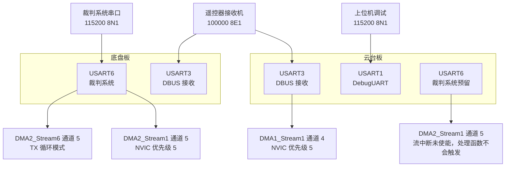
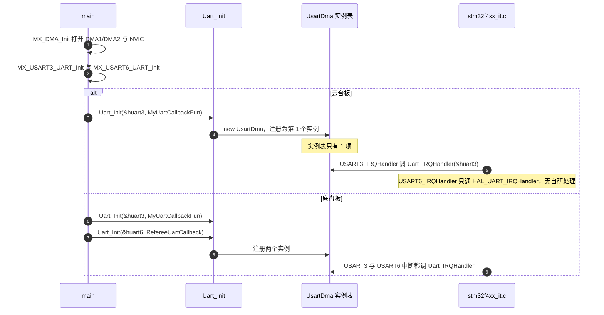

# 本项目 USART 外设分配

> 本页对照云台板固件 `2026OmniSentryGimbal` 与底盘板固件 `2026OmniSentryChassis`。两块板的 `Core/Src/usart.c` 逐字相同，差异全部出现在 `Core/Src/main.c` 的注册调用与 `Core/Src/stm32f4xx_it.c` 的中断入口。
>
> 帧格式与 DMA 原理见 `01-UART与DMA基础`，接收运行时见 `02-空闲中断与双缓冲接收`。

两块板都初始化了 USART1、USART3、USART6 三个实例，各自面向一条独立链路：调试打印、遥控器接收机、裁判系统。三路里只有 USART3 的接收链路在两块板上都在工作；USART1 没有配 DMA 也没有开中断，USART6 在云台板上没有注册回调。

分配表本身很短，容易出错的是它的三个隐含约束：外设挂在哪条总线上决定 `PCLK` 与 `BRR`，引脚复用号决定是否要改 `GPIO_AF`，中断优先级必须落在 FreeRTOS 允许调用内核接口的区间里。本文按这三条约束展开。

> 源码索引

| 路径 | 作用 |
| --- | --- |
| `Core/Src/usart.c` | 三路 USART 参数、引脚与优先级 |
| `Core/Src/dma.c` | DMA 时钟与流中断使能 |
| `Core/Src/main.c` | 初始化顺序与注册调用 |
| `Core/Src/stm32f4xx_it.c` | 五个中断入口 |
| `Core/Inc/FreeRTOSConfig.h` | 优先级位宽与 syscall 门槛 |
| `Communication/Src/*.cpp` | 回调与未接线链路 |

## 三路串口各自接什么

| 实例 | 角色 | 链路 | 数据方向 | 说明 |
| --- | --- | --- | --- | --- |
| USART1 | `DebugUART` | 调试串口 | 双向，实际只发 | 在 IMU 任务里初始化，用于打印 |
| USART3 | DBUS 接收 | 遥控器接收机 | 只收 | 云台与底盘都注册 |
| USART6 | 裁判系统 | 裁判系统串口 | 双向 | 底盘注册，云台板预留未注册 |

USART1 的初始化不在 `main.c` 里，而是由 `Task/Src/ImuTask.cpp` 的 `DebugUART_Init(&huart1)` 触发。因此它的初始化时机晚于 USART3 与 USART6，这也解释了初始化顺序表里它排在最后。

## 时钟域、引脚复用与中断优先级

USART1 与 USART6 挂 APB2，USART3 挂 APB1。云台板的 `APB2CLKDivider = RCC_HCLK_DIV2`、`APB1CLKDivider = RCC_HCLK_DIV4`（`Core/Src/main.c`），对应 `PCLK2 = 84 MHz` 与 `PCLK1 = 42 MHz`。HAL 在 `UART_SetConfig` 里按实例判断取哪个 `PCLK`（`Drivers/STM32F4xx_HAL_Driver/Src/stm32f4xx_hal_uart.c`）。

三个实例都走 GPIO 复用功能模式：`GPIO_MODE_AF_PP`、`GPIO_NOPULL`、`GPIO_SPEED_FREQ_VERY_HIGH`。复用号按外设分布：USART1 与 USART3 用 `GPIO_AF7`，USART6 用 `GPIO_AF8`（`Core/Src/usart.c`）。

| 实例 | RX 引脚 | TX 引脚 | 复用号 | 出处 |
| --- | --- | --- | --- | --- |
| USART1 | PB7 | PA9 | `GPIO_AF7_USART1` | `usart.c` |
| USART3 | PC11 | PC10 | `GPIO_AF7_USART3` | `usart.c` |
| USART6 | PG9 | PG14 | `GPIO_AF8_USART6` | `usart.c` |

USART1 的引脚分布需要单记：RX 在 PB7、TX 在 PA9，不在同一个端口上。这是 CubeMX 按可用复用功能自动选出的组合，迁移到别的板子时不一定能原样保留。

中断优先级方面，所有外设中断的抢占优先级都是 5，由 `usart.c` 与 `dma.c` 里的 `HAL_NVIC_SetPriority` 写入（`Core/Src/usart.c`；`Core/Src/dma.c`）。FreeRTOS 侧的门槛值 `configLIBRARY_MAX_SYSCALL_INTERRUPT_PRIORITY` 也是 5（`Core/Inc/FreeRTOSConfig.h`），`configPRIO_BITS` 为 4，`configLIBRARY_LOWEST_INTERRUPT_PRIORITY` 为 15。

数值大于等于 5 的中断才允许调用 FreeRTOS 的 `FromISR` 接口，5 是允许调用的边界值。本工程的串口与 DMA 中断正好卡在这个边界上，优先级不能再调小，否则在 ISR 里调用内核接口会触发断言。

## 三路串口的完整参数对照

| 项目 | USART1 | USART3 | USART6 |
| --- | --- | --- | --- |
| 波特率 | 115200 | 100000 | 115200 |
| 字长 | `UART_WORDLENGTH_8B` | `UART_WORDLENGTH_8B` | `UART_WORDLENGTH_8B` |
| 校验 | `UART_PARITY_NONE` | `UART_PARITY_EVEN` | `UART_PARITY_NONE` |
| 停止位 | 1 | 1 | 1 |
| 模式 | `UART_MODE_TX_RX` | `UART_MODE_RX` | `UART_MODE_TX_RX` |
| 过采样 | 16 倍 | 16 倍 | 16 倍 |
| DMA | 无 | RX：DMA1_Stream1 通道 4，循环 | RX：DMA2_Stream1 通道 5，普通；TX：DMA2_Stream6 通道 5，循环 |
| NVIC | 未使能 | 优先级 5 | 优先级 5 |
| 帧格式出处 | `usart.c` | `usart.c` | `usart.c` |
| DMA 出处 | 无 | `usart.c` | `usart.c` |

USART3 的 `Init.Mode = UART_MODE_RX` 只置了接收使能位，发送引脚 PC10 虽然配成复用，但 `TE` 位没有打开，硬件不发数据。

表中 USART3 的 `UART_WORDLENGTH_8B` 加 `UART_PARITY_EVEN` 不能单读成已核实的 8E1：按 STM32F4 手册，`M=0` 且 `PCE=1` 实为 7 数据位加 1 个校验位，HAL 的中断接收路径也只取 `DR` 的低 7 位（`Drivers/STM32F4xx_HAL_Driver/Src/stm32f4xx_hal_uart.c`）。本工程接收走 DMA，按字节搬 `DR` 低 8 位，8 个数据位能否完整重组属按手册推断，标为待实测；完整分析见 `01-UART与DMA基础` 的「三路串口的帧格式与校验口径」。

表中 DMA 一列的循环与普通模式来自 CubeMX，运行时会被自研 `Init` 的 `DBM` 覆盖（`02-空闲中断与双缓冲接收` 有完整推导）。排查接收行为时以 `CR` 的 `DBM` 与 `CT` 为准，不按这里的模式推演。

## 初始化顺序与两块板的注册差异

`MX_DMA_Init` 先于 USART 初始化执行（`Core/Src/main.c`），顺序是 `MX_DMA_Init`、`MX_CAN1_Init`、`MX_USART3_UART_Init`、`MX_USART6_UART_Init`、`MX_CAN2_Init`、`MX_SPI1_Init`、`MX_I2C3_Init`、`MX_TIM10_Init`、`MX_USART1_UART_Init`。DMA 控制器时钟与 NVIC 在 `MX_DMA_Init` 里打开（`Core/Src/dma.c`），USART 的 `HAL_UART_MspInit` 随后才引用 `hdma_usart3_rx` 等句柄。

初始化完成后进入自研注册。两块板的差别只有一处：

云台板的注册在 `Core/Src/main.c`，回调 `MyUartCallbackFun` 在 `main.c`，函数体只有一句 `DBUS_Decode(buf, len)`。底盘板的注册在 `Core/Src/main.c`，回调分别是 `main.c` 的 `MyUartCallbackFun` 与 `main.c` 的 `RefereeUartCallback`。

`MX_DMA_Init` 排在最前的原因不是习惯：`HAL_UART_MspInit` 内部要把 DMA 句柄挂到 `huart->hdmarx` 上，而这些句柄的时钟与中断使能在 `MX_DMA_Init` 里完成。顺序颠倒会让 USART 的 DMA 通道没有时钟。

## 五个中断入口

| 中断 | 云台板处理函数 | 底盘板处理函数 | 出处 |
| --- | --- | --- | --- |
| `USART3_IRQn` | 先 `Uart_IRQHandler(&huart3)`，再 `HAL_UART_IRQHandler(&huart3)` | 同左 | 云台 `stm32f4xx_it.c` |
| `USART6_IRQn` | 只有 `HAL_UART_IRQHandler(&huart6)` | 先 `Uart_IRQHandler(&huart6)`，再 `HAL_UART_IRQHandler(&huart6)` | 云台 `stm32f4xx_it.c`，底盘 `stm32f4xx_it.c` |
| `DMA1_Stream1_IRQn` | `HAL_DMA_IRQHandler(&hdma_usart3_rx)` | 同左 | 云台与底盘 `stm32f4xx_it.c` |
| `DMA2_Stream1_IRQn` | `HAL_DMA_IRQHandler(&hdma_usart6_rx)` | 同左 | 云台与底盘 `stm32f4xx_it.c` |
| `DMA2_Stream6_IRQn` | `HAL_DMA_IRQHandler(&hdma_usart6_tx)` | 同左 | 云台与底盘 `stm32f4xx_it.c` |

DMA 流的 NVIC 虽然使能，但自研启动函数只置了 `CR` 的 `EN` 位，没有打开 `TCIE`、`HTIE`，所以三条流的传输完成与半传输中断不会产生，`HAL_DMA_IRQHandler` 目前不会被调用。相关调用链见 `04-收发实现与回调链`。

两处顺序需要留意。第一，`USART3_IRQHandler` 里自研处理排在 HAL 处理之前，`USART6_IRQHandler` 在云台板上没有自研处理。第二，回调链是先按句柄找实例，找不到就直接返回，因此底盘板注册了 `huart6` 之后，同一个 `Uart_IRQHandler` 能同时服务两个串口。

## 未接线的三处

定义了回调却没有注册点的链路会编译通过、永远不执行，这种「空转代码」在代码评审里最容易被跳过。下面三处都属于这一类，排查数据来源时要把它们与真正生效的注册点区分开。

1. 云台板没有注册 `huart6`。`Communication/Src/referee_decode.cpp` 定义了 `RefereeCallback`，`referee_decode.cpp` 有全局的 `refereeproto` 与 `referee_decode`，但云台板上没有任何 `Uart_Init(&huart6, ...)` 调用，也没有 `Uart_IRQHandler(&huart6)`，裁判系统数据在云台板上没有接收通路。底盘板由 `Core/Src/main.c` 补上这一环。
2. `Communication/Src/usart_decode.cpp` 定义 `MyUartCallback`、`proto6`、`decoder6`（`usart_decode.cpp`），全工程没有调用点：`Uart_Init` 只收到 `MyUartCallbackFun`（`main.c`）。这条链路属于未接线实现。
3. `Communication_Summary.md` 里出现的 `Uart_Init(&huart1, DBUS_Decode)`、`Uart_Init(&huart6, MyUartCallback)` 是说明文档中的示例，不是实际调用点。

## 外设分配相关的易错点

| 易错点 | 现象 | 对应位置 |
| --- | --- | --- |
| 认为两块板串口配置不同 | 去底盘板找不同的波特率 | 两个 `usart.c` 逐字相同 |
| 在云台板上找裁判系统数据 | 数据全为初始值 | 云台板未注册 `huart6` |
| 忽略 `PCLK` 差异 | 用同一 `BRR` 套三个实例 | USART3 取 42 MHz，USART1/6 取 84 MHz |
| 认为 USART3 能发 | 写发送函数等数据 | `UART_MODE_RX` 未置 `TE` |
| 认为 DMA 流中断在跑 | 在 `HAL_DMA_IRQHandler` 里设断点等命中 | 自研启动未开 `TCIE`/`HTIE` |
| 把示例文档当调用点 | 顺着 `Communication_Summary.md` 找注册 | 实际注册只在 `main.c` |
| 调低中断优先级 | 串口中断改成 4 后内核接口断言 | 所有外设中断都是 5，等于门槛值 |
| 按 `usart.c` 的 DMA 模式推演接收 | 与运行时行为不符 | 模式被自研 `Init` 的 `DBM` 覆盖 |

## 小结

### 核心概念

- 两块板的三路 USART 参数逐字相同，差异只在注册与中断入口。
- USART1 是调试口，无 DMA 无中断；USART3 是 DBUS 只收口，双缓冲加空闲中断；USART6 是裁判系统口，底盘板使用，云台板预留。
- USART1 与 USART6 挂 APB2 取 84 MHz，USART3 挂 APB1 取 42 MHz。
- USART1 与 USART3 用 `GPIO_AF7`，USART6 用 `GPIO_AF8`；USART1 的 RX 与 TX 分布在不同端口。
- 所有外设中断优先级为 5，等于 FreeRTOS 的 `configLIBRARY_MAX_SYSCALL_INTERRUPT_PRIORITY`。
- 云台板没有注册 `huart6`，`usart_decode.cpp` 的协议链路与裁判链路在云台板上未接线。

### 设计权衡

| 决策 | 选择 | 收益 | 代价 |
| --- | --- | --- | --- |
| 调试口 | USART1 轮询式收发、无 DMA | 不占 DMA 流与中断 | 打印量大时会阻塞 |
| DBUS 口 | USART3 只收 | 省一条发送链路与 DMA 流 | 无法向遥控器回发 |
| 裁判口 | USART6 收发均配 DMA | 为双向预留 | 云台板未注册，代码空转 |
| DMA 资源 | USART3 占 DMA1_Stream1，USART6 占 DMA2 | 分散在两个控制器 | 流与通道固定，重映射时要查表 |
| 中断优先级 | 全部取 5 | 与 FreeRTOS 门槛一致，允许调 `FromISR` | 无优先级区分，串口与 DMA 互不抢占 |
| 初始化位置 | 三路都在 `main.c`，调试口在任务里 | 早期链路一次配齐 | USART1 的初始化时机隐式依赖任务启动顺序 |

## 练习

### 基础题

1. 列出三路 USART 的总线归属、`PCLK`、引脚与复用号。
2. 说明云台板与底盘板在 `Uart_Init` 调用上的唯一差异，并指出差异所在的文件与行号。
3. 解释为什么 `HAL_DMA_IRQHandler` 在三条流的中断入口里却不会被触发。
4. 写出 `configLIBRARY_MAX_SYSCALL_INTERRUPT_PRIORITY` 的取值与含义，并说明串口中断能否在 ISR 里调用 `xQueueSendFromISR`。

### 挑战题

5. 若把 `huart6` 在云台板上按底盘板的方式注册，需要新增哪几处代码？说明回调应指向哪个函数。
6. USART1 若要改成 DMA 发送，在不与现有 CAN、SPI、USART 冲突的前提下，列出可选流与通道，并说明依据。
7. 设计一个上电自检，判断 `huart3` 的 `BRR` 是否与 `PCLK1=42 MHz`、100000 波特一致，写出判据与容差。

---

### 附：本页引用的固件路径

| 路径 | 用途 |
| --- | --- |
| `2026OmniSentryGimbal/Core/Src/usart.c` | 三路 USART 参数与引脚、优先级 |
| `2026OmniSentryGimbal/Core/Src/dma.c` | DMA 时钟与流中断使能 |
| `2026OmniSentryGimbal/Core/Src/main.c` | 外设初始化顺序、`Uart_Init`、回调 |
| `2026OmniSentryGimbal/Core/Src/stm32f4xx_it.c` | 五个中断入口 |
| `2026OmniSentryGimbal/Core/Inc/FreeRTOSConfig.h` | `configPRIO_BITS`、最低优先级、syscall 门槛 |
| `2026OmniSentryGimbal/Task/Src/ImuTask.cpp` | `DebugUART_Init(&huart1)` |
| `2026OmniSentryGimbal/Communication/Src/referee_decode.cpp` | 裁判对象与回调 |
| `2026OmniSentryGimbal/Communication/Src/usart_decode.cpp` | 未接线的协议链路 |
| `2026OmniSentryChassis/Core/Src/main.c` | 底盘板注册 `huart3` 与 `huart6`、`RefereeUartCallback` |
| `2026OmniSentryChassis/Core/Src/stm32f4xx_it.c` | 底盘板 `USART6_IRQHandler` 调 `Uart_IRQHandler` |
