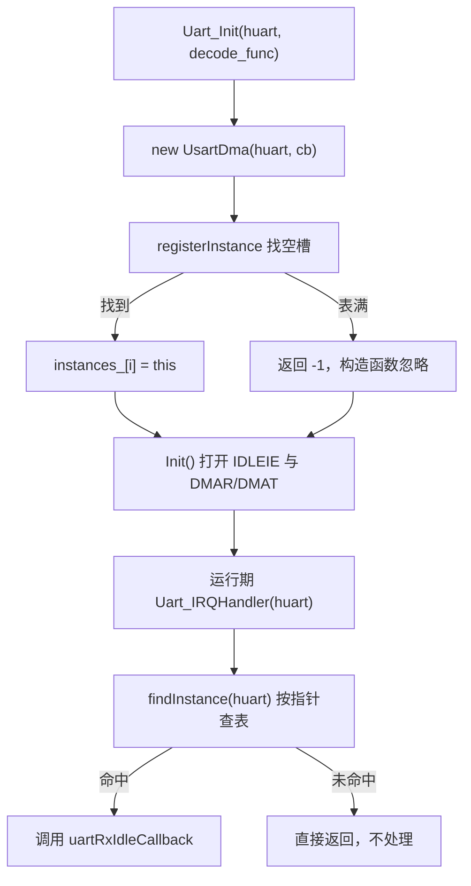
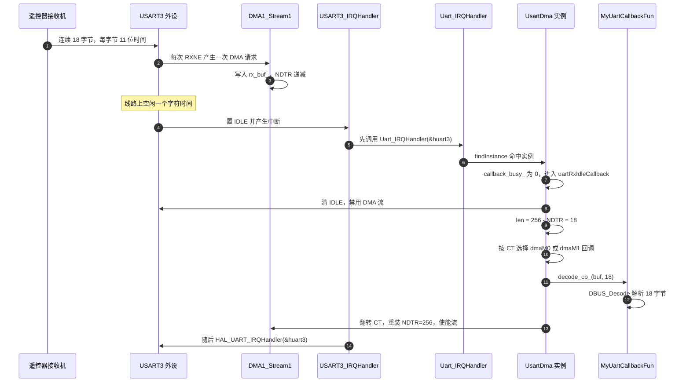
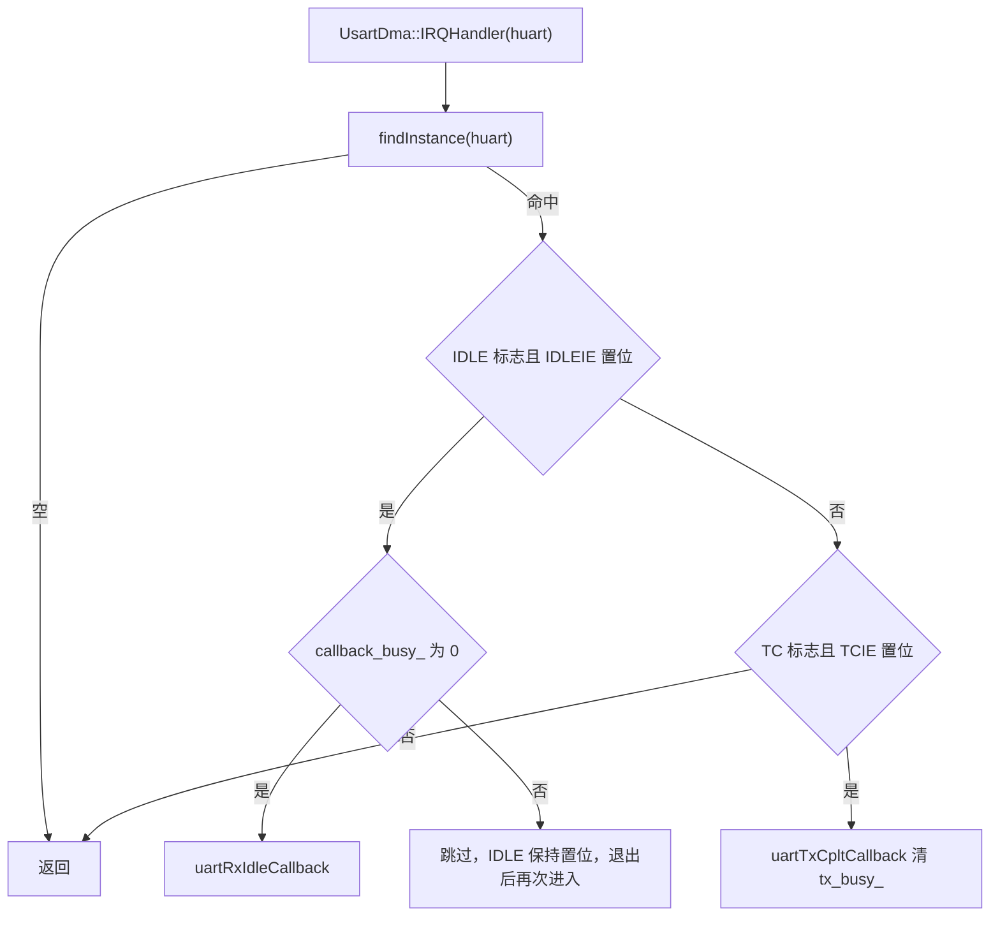

# 收发实现与回调链

> 代码来自 `2026OmniSentryGimbal/Communication/Inc/usart_dma.h` 与 `Communication/Src/usart_dma.cpp`，两块板同名文件内容相同。中断入口在 `Core/Src/stm32f4xx_it.c`。
>
> 双缓冲的寄存器语义见 `01-UART与DMA基础` 与 `02-空闲中断与双缓冲接收`；本页只追踪代码路径。

HAL 提供了 `HAL_UART_Receive_DMA` 与 `HAL_UART_Transmit_DMA`，但两者都不直接支持用空闲中断给每帧定界、用双缓冲换块的组合。本工程保留了 UART 句柄与 DMA 句柄，自己写一个薄封装 `UsartDma`：按句柄登记实例，打开 `CR3` 的请求位与 `IDLEIE`，把接收 DMA 置于双缓冲并启动，在空闲中断里算长度、切块、重装计数，另提供一个带忙标志的发送入口。

这套封装的关键取舍是绕过 HAL 的收发状态机，直接改寄存器。好处是能精确控制 `DBM` 与中断使能，代价是与 HAL 的状态判断脱节：流被置为忙态后不复位，HAL 的完成回调也不会被触发。本文按实例表、`Init`、双缓冲启动函数、接收链、分派与发送链的顺序逐段追踪。

> 源码索引

| 路径 | 作用 |
| --- | --- |
| `Communication/Inc/usart_dma.h` | 类接口、实例表与缓冲成员 |
| `Communication/Src/usart_dma.cpp` | 全部实现 |
| `Core/Src/stm32f4xx_it.c` | 中断入口与调用顺序 |
| `Core/Src/usart.c` | 发送流的循环模式 |
| HAL 源码 | `HAL_UART_Transmit_DMA` 与发送完成分支 |

## 自研类承担什么

`UsartDma` 的职责有四项：

1. 按 UART 句柄登记实例，中断里能由句柄反查回对象。
2. 打开 `CR3` 的 `DMAR`/`DMAT`，打开 `IDLEIE`，把接收 DMA 置于双缓冲并启动。
3. 在空闲中断里算出本帧长度、切块、重装计数、重新使能。
4. 提供 DMA 发送入口，并用忙标志挡住重入。

类只暴露一个构造入口与三个 C 接口（`usart_dma.h:72-81`）：`Uart_Init`、`Uart_IRQHandler`、`Uart_Transmit_DMA`。前两个是必需接线，第三个当前无调用点。

四项职责里前三项都围绕接收。第三项的算法依赖一个前提：帧长必须小于缓冲长度，否则硬件会自动切块，软件对 `CT` 的判断不再成立。本工程帧长 18、缓冲 256，前提成立。

## 实例表按句柄指针登记与查找

类的实例表是固定长度 3 的静态数组（`DT7DMA_MAX_INSTANCES`，`usart_dma.h:12-14`、`:46`）。构造时先登记再初始化（`usart_dma.cpp:3-11`）：

- `registerInstance` 从下标 0 开始找第一个空槽写入，返回下标；表满返回 -1（`:13-21`）。
- 构造函数收到 -1 后只做 `(void)idx` 丢弃，不做断言也不阻止后续初始化（`:8`）。
- `findInstance` 遍历表，按 `huart_` 指针相等匹配，返回对象指针或空（`:23-31`）。
- 对象由 `Uart_Init` 里的 `new UsartDma(...)` 在堆上创建（`:184`），返回值同样未判空。

查找按句柄指针，不按外设编号。同一个句柄重复 `Uart_Init` 会占用两个槽，两个对象各自持有同一组 DMA 句柄并先后启动，后启动者覆盖前者的内存地址配置。全工程每个句柄只注册一次，这个情形不会出现。

固定长度静态表省掉了动态容器的内存管理，代价是容量写死在头文件里。当前云台板注册 1 个、底盘板注册 2 个，都在上限之内；新增链路时第 4 个对象不会登记，中断里查不到，表现为静默无收。

## Init 直接改寄存器而绕过 HAL

`Init()` 没有调用任何 HAL 的收发函数，直接改寄存器（`usart_dma.cpp:33-48`）：

| 步骤 | 代码 | 作用 |
| --- | --- | --- |
| 1 | `__HAL_UART_CLEAR_IDLEFLAG(huart_)` | 清可能残留的 `IDLE` |
| 2 | `__HAL_UART_ENABLE_IT(huart_, UART_IT_IDLE)` | 置 `CR1` 的 `IDLEIE` |
| 3 | `SET_BIT(huart_->Instance->CR3, USART_CR3_DMAR)` | 接收请求接到 DMA |
| 4 | `DMAEx_MultiBufferStart_NoIT(...)` | 置 `DBM`、写两块地址与 `NDTR`、使能流 |
| 5 | `SET_BIT(huart_->Instance->CR3, USART_CR3_DMAT)` | 发送请求接到 DMA |

五步里没有一步经过 HAL 的 `gState`/`RxState` 状态判断，因此调用 `Init()` 之前必须先完成 `HAL_UART_Init`，否则 `CR1` 的使能位与波特率都还没配好。本工程的调用顺序由 `main.c` 的初始化段保证。

## 自研启动函数与 HAL 的 _IT 版对照

自研的 `DMAEx_MultiBufferStart_NoIT`（`:118-178`）是 HAL `HAL_DMAEx_MultiBufferStart_IT` 的裁剪版：

| 项目 | HAL 的 `_IT` 版本 | 本工程的 `_NoIT` 版本 |
| --- | --- | --- |
| 参数校验 | 有，含方向与对齐 | 只拒绝 `MEMORY_TO_MEMORY`（`:127-131`） |
| 加锁 | `__HAL_LOCK` | 同样加锁（`:133`） |
| 置 `DBM` 与两块地址 | 有 | 有（`:148-155`） |
| 使能 `TCIE`/`HTIE`/`TEIE` | 有 | 没有，只置 `EN`（`:173`） |
| 状态机 | 结束时回到 `READY` | 置为 `BUSY` 后不复位（`:144`） |
| 完成回调 | 由 HAL 的 DMA 中断调用 | 不用，切块在空闲中断里做 |

因为没有打开 DMA 流的中断，`DMA1_Stream1`、`DMA2_Stream1`、`DMA2_Stream6` 虽然 NVIC 已使能，`HAL_DMA_IRQHandler` 却不会被触发。切块完全靠 USART 的空闲中断。

这一处裁剪同时消掉了 HAL 的完成回调链。如果以后改用 `_IT` 版本，回调与空闲中断都会尝试切块，需要先决定由谁主导。

## 一次接收的完整路径

从线路到解析函数的每一跳如下。

## 中断里的标志分派

中断内的标志分派在 `UsartDma::IRQHandler`（`usart_dma.cpp:50-72`）：

注意调用顺序：`USART3_IRQHandler` 先执行自研处理，再执行 `HAL_UART_IRQHandler`（`Core/Src/stm32f4xx_it.c:249-252`）。自研处理已经清掉 `IDLE`，而 HAL 只在 `ReceptionType` 为待空闲接收时才处理 `IDLE`（`stm32f4xx_hal_uart.c:2484-2486`），本工程从未设置该字段，所以两者没有重复处理。

分派里的两条分支各对应一个标志位：`IDLE` 走接收空闲处理，`TC` 走发送完成处理。`TC` 分支只有在 `TCIE` 被打开时才可能进入，而自研启动函数没有打开任何 DMA 流中断；发送侧的 `TCIE` 由 HAL 在普通模式的发送完成回调里打开，见下一节。

## 发送链的三层与回调分支

发送入口有三层（`usart_dma.cpp:74-79`、`:192-201`）：

1. C 接口 `Uart_Transmit_DMA` 用 `GetInstance` 找实例，找不到返回 `HAL_ERROR`。
2. `UsartDma::Transmit_DMA` 先查 `tx_busy_`，为 1 返回 `HAL_BUSY`，否则置 1 后调用 `HAL_UART_Transmit_DMA`。
3. `HAL_UART_Transmit_DMA` 配置 `hdmatx` 的三个回调，再用 `HAL_DMA_Start_IT` 启动发送流，最后置 `CR3` 的 `DMAT`（`stm32f4xx_hal_uart.c:1399-1429`）。

完成侧存在一条容易漏看的条件分支。HAL 的 DMA 发送完成回调 `UART_DMATransmitCplt` 按流的模式分流（`stm32f4xx_hal_uart.c:3015-3042`）：

- 普通模式：清 `DMAT`，打开 UART 的 `TCIE`，等最后一个字节移出后由 `TC` 中断收尾。
- 循环模式：直接调用 `HAL_UART_TxCpltCallback`，不打开 `TCIE`，也不结束 `gState`。

USART6 的 `hdma_usart6_tx` 恰好是 `DMA_CIRCULAR`（`Core/Src/usart.c:251`）。一旦真的调用发送，走的是循环分支，`TC` 中断不会产生，自研的 `uartTxCpltCallback` 也就不会执行，`tx_busy_` 会停在 1，后续所有发送返回 `HAL_BUSY`。同时流会反复重发同一缓冲。发送侧当前无调用点，这条问题处于潜伏状态。

发送链的其余两处薄弱点：

- `Transmit_DMA` 在调用 HAL 之前就把 `tx_busy_` 置 1。若 HAL 返回 `HAL_BUSY` 或 `HAL_ERROR`，`tx_busy_` 不会复位（`:76-78`）。
- USART3 只链接了 `hdmarx`，`hdmatx` 为空。对 `huart3` 调用 `Uart_Transmit_DMA` 会在 HAL 里解引用空指针。

## 收发链层面的易错点

| 易错点 | 现象 | 对应位置 |
| --- | --- | --- |
| 在空闲中断外重装 `NDTR` | 与 DMA 写指针竞争 | 重装只在 `uartRxIdleCallback` 内，且流已禁用 |
| 认为 DMA 流中断在跑 | 在 `HAL_DMA_IRQHandler` 设断点不命中 | 自研启动未开 `TCIE`/`HTIE` |
| 忽略 `tx_busy_` 的复位条件 | 发送一次后一直 `HAL_BUSY` | 循环模式下 `TCIE` 不被打开 |
| 把失败返回留在忙态 | HAL 返回错误后 `tx_busy_` 不复位 | `usart_dma.cpp:76-78` |
| 对 USART3 调用发送 | 空 `hdmatx` 解引用 | `huart3` 只链接了 `hdmarx` |
| 实例表溢出后静默 | 第 4 个对象不登记，中断里查不到 | `usart_dma.cpp:8` 丢弃 -1 |
| `new` 失败未判空 | 后续 `Init()` 解引用空对象 | `usart_dma.cpp:184` |
| 以为 HAL 会处理 `IDLE` | 找不到对应分支 | `stm32f4xx_hal_uart.c:2484-2486` 要求 `ReceptionType` |
| 重复登记同一句柄 | 两个对象先后启动，内存配置被覆盖 | 全工程每句柄只注册一次 |

## 小结

### 核心概念

- `UsartDma` 用固定长度 3 的静态实例表按 `huart` 指针登记与查找，构造即初始化。
- `Init()` 直接改寄存器：清 `IDLE`、开 `IDLEIE`、置 `DMAR`/`DMAT`，并调用自研双缓冲启动函数。
- 自研启动函数与 HAL 的 `_IT` 版本差别在于：不打开 DMA 流中断，状态停在 `BUSY`，切块交给空闲中断。
- 接收链是 `USART3_IRQHandler → Uart_IRQHandler → UsartDma::IRQHandler → 空闲回调 → decode_cb_ → DBUS_Decode`。
- 发送链是 `Uart_Transmit_DMA → UsartDma::Transmit_DMA → HAL_UART_Transmit_DMA`，当前没有调用点。
- USART6 发送流是循环模式，HAL 在循环模式下不打开 `TCIE`，自研的 `tx_busy_` 无法复位。

### 设计权衡

| 决策 | 选择 | 收益 | 代价 |
| --- | --- | --- | --- |
| 封装粒度 | 按 UART 句柄建对象 | 中断里可由句柄反查 | 静态表上限 3，超出即静默失效 |
| 实例存储 | 堆上 `new` | 构造参数直接传入 | 未判空，失败后仍继续初始化 |
| 启动方式 | 绕过 HAL 直接改寄存器 | 完全控制 `DBM` 与中断使能 | 与 HAL 状态机脱节，`State` 停在 `BUSY` |
| 切块时机 | 空闲中断里手动翻转 `CT` | 与帧边界对齐 | 依赖帧长小于缓冲 |
| 发送忙标志 | 单字节 `tx_busy_` | 挡住重入 | 失败或循环模式下不复位 |
| 中断顺序 | 自研先于 HAL | 自研能抢先清 `IDLE` | 两套状态判断需要分别理解 |

## 练习

### 基础题

1. 写出从 `USART3_IRQHandler` 到 `DBUS_Decode` 的完整调用链，标出每一跳所在文件与行号。
2. 说明 `DMAEx_MultiBufferStart_NoIT` 与 HAL 的 `HAL_DMAEx_MultiBufferStart_IT` 在中断使能上的差别，以及由此产生的行为差异。
3. `tx_busy_` 在什么情况下会被清 0？在循环模式发送下会怎样？
4. 解释实例表按指针查找而不是按外设编号查找的原因，并说明表满时的行为。

### 挑战题

5. 发送侧若要投入使用，列出需要修改的点，使 `tx_busy_` 在普通与循环两种模式下都能正确复位。
6. 在 `Init()` 里把 `HDMA` 的中断也打开、并改用 HAL 的回调切块，会与现有的空闲中断切块产生什么冲突？给出两种消除冲突的方案。
7. 设计一个不改变类接口的实例表扩容方案，说明为什么扩容后仍要保留“找不到实例就返回”的行为。

---

### 附：本页引用的固件路径

| 路径 | 用途 |
| --- | --- |
| `2026OmniSentryGimbal/Communication/Inc/usart_dma.h` | 类接口与静态实例表（:12-14、:20-62、:72-81） |
| `2026OmniSentryGimbal/Communication/Src/usart_dma.cpp` | 构造与登记（:3-31）、`Init`（:33-48）、中断分派（:50-72）、收发回调（:74-116）、双缓冲启动（:118-178）、C 接口（:180-202） |
| `2026OmniSentryGimbal/Core/Src/stm32f4xx_it.c` | `USART3_IRQHandler` 的调用顺序（:247-256） |
| `2026OmniSentryGimbal/Core/Src/usart.c` | USART6 发送流循环模式（:251） |
| `2026OmniSentryGimbal/Drivers/STM32F4xx_HAL_Driver/Src/stm32f4xx_hal_uart.c` | `HAL_UART_Transmit_DMA`（:1379-1435）、循环模式的发送完成分支（:3015-3042） |
| `2026OmniSentryGimbal/Drivers/STM32F4xx_HAL_Driver/Src/stm32f4xx_hal_dma.c` | 双缓冲回调与 `CT` 的对应（:878-898） |
| `2026OmniSentryGimbal/Core/Src/main.c` | 云台板唯一注册点（:125） |
