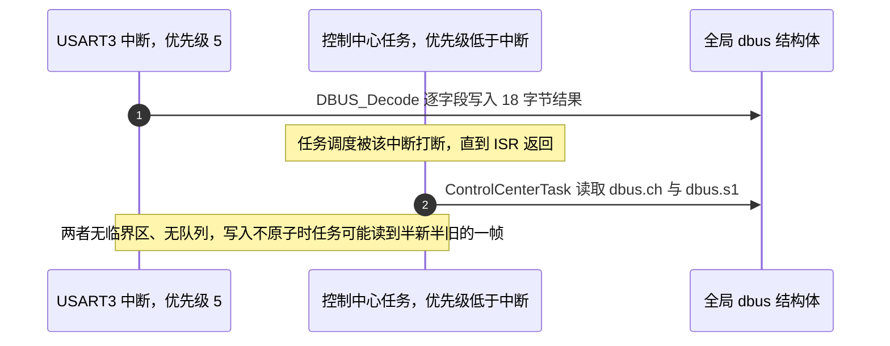
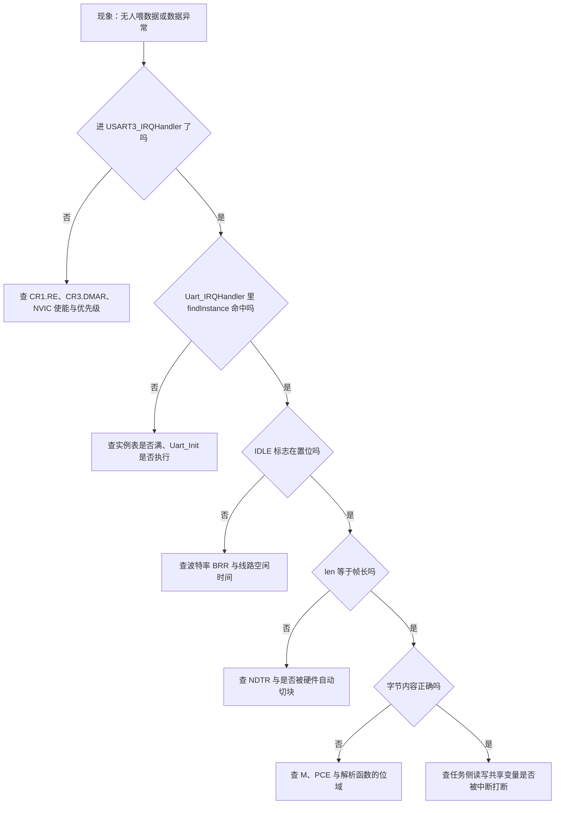

# 易错点与调试

> 排查对象是云台板 `2026OmniSentryGimbal` 与底盘板 `2026OmniSentryChassis` 的 USART3 接收链，以及 USART6 的预留链。所有行号都已按两块板的当前源码核对。
>
> 机制背景见 `01-UART与DMA基础`、`02-空闲中断与双缓冲接收`、`04-收发实现与回调链`。本页只讲判断与定位。

串口接收失效的表现可以按数据走到哪一层断掉来分类，每类指向不同的层次。先定位层次再进寄存器，比一上来怀疑物理层有效得多：从线路上有波形到解析函数被调用，中间要连续成立六七个条件，逐个排除远比换线缆快。

本页先把症状分成四类并给出各自的观测点，再逐项列出十二项真实易错点，最后给出从现象入手的调试流程图与取值核对表。

> 源码索引

| 路径 | 作用 |
| --- | --- |
| `Communication/Src/usart_dma.cpp` | 实例登记、Init、空闲处理与 C 接口 |
| `Communication/Inc/usart_dma.h` | 实例表上限与缓冲长度 |
| `Communication/Src/dbus.cpp` | 全局 `dbus` 定义与写入 |
| `Task/Src/ControlCenterTask.cpp` | 任务侧读写 `dbus` |
| `Core/Src/usart.c` | 帧格式、DMA 模式与优先级 |
| `Core/Src/stm32f4xx_it.c` | 中断入口 |

## 症状按四类分层的判据

| 症状 | 可能层次 | 先查什么 |
| --- | --- | --- |
| 完全没有回调 | 外设使能、DMA 请求、中断入口 | `CR1` 的 `RE`、`CR3` 的 `DMAR`、`NDTR` 是否在减 |
| 回调有但长度不对 | 空闲检测、缓冲切换 | `NDTR` 与 `IDLE` 标志 |
| 长度对但数据错 | 位宽、校验、字节序 | `CR1` 的 `M`/`PCE` 与解析函数 |
| 偶发丢帧或数值跳变 | 中断上下文、数据竞争 | 解析耗时与共享变量的读写方 |

四类症状与源码位置一一对应：第一类落在 `CR1`/`CR3` 与 NVIC，第二类落在 `usart_dma.cpp` 的长度计算与切块，第三类落在帧格式配置与 `DBUS_Decode`，第四类落在中断优先级与临界区。分类的意义是把“没有数据”这类模糊描述映射到唯一的入口函数上。

## 可观测的寄存器与软件断点

### 关键寄存器

| 寄存器 | 位或字段 | 观察点 |
| --- | --- | --- |
| `USART_SR` | `IDLE`、`RXNE`、`ORE`、`FE`、`PE` | 是否有未清的错误标志 |
| `USART_CR1` | `RE`、`IDLEIE`、`M`、`PCE`、`PS`、`OVER8` | 接收使能与帧格式 |
| `USART_CR3` | `DMAR`、`DMAT` | DMA 请求是否接通 |
| `USART_BRR` | 尾数与小数 | 反算实际波特率 |
| `DMA_SxCR` | `EN`、`DBM`、`CT`、`CHSEL`、`CIRC` | 流是否在跑、当前写哪块 |
| `DMA_SxNDTR` | 当前块剩余计数 | 本帧已写入的字节数 |
| `DMA_SxM0AR`/`M1AR` | 两块内存地址 | 是否与类里缓冲区一致 |

`BRR` 与波特率的关系在 `01-UART与DMA基础` 第 3 节，反算时用 `PCLK1 = 42 MHz`（USART3）或 `PCLK2 = 84 MHz`（USART1/6）。

### 软件侧

- `USART3_IRQHandler` 的第一条语句是 `Uart_IRQHandler(&huart3)`，在这里下断点能区分“没进中断”与“进了但没回调”（`Core/Src/stm32f4xx_it.c`）。
- `UsartDma::IRQHandler` 的 `findInstance` 返回空会直接退出，实例表满或未注册时表现为静默无收（`Communication/Src/usart_dma.cpp`）。
- `NDTR` 只在空闲中断里被重装，运行中看到它接近初值说明本帧刚开始，接近 0 说明快写满。

软件侧的三个断点覆盖了硬件寄存器解释不了的部分：中断入口、实例查找、长度计算。三者依次下断，能定位到具体是哪一跳断掉。

## 十二项真实易错点的判据

下面按条目给出判据，源码位置集中在 `十二项易错点的源码位置` 一节。

- CubeMX 的 DMA 模式被自研 `Init` 覆盖：判据取运行期 `DMA_SxCR` 的 `DBM` 与 `CT`，不按 `usart.c` 的 `Init.Mode` 推演（`Core/Src/usart.c`；`usart_dma.cpp`）。

- `NDTR` 是当前块的剩余计数：长度 `len = 256 - NDTR`（`usart_dma.cpp`），把它当已传输数会让长度方向相反；它在 `DBM` 下只覆盖当前块，完整推导见 `02-空闲中断与双缓冲接收`。长度还原与切块判据落到代码只有两行（摘自 `Communication/Src/usart_dma.cpp`）：

```cpp
rx_data_len_ = UART_RX_BUF_LEN - huart_->hdmarx->Instance->NDTR;
if (huart_->hdmarx->Instance->CR & DMA_SxCR_CT)  dmaM1RxCpltCallback();
else                                            dmaM0RxCpltCallback();
```

`NDTR` 是剩余数，减法才是已写入长度；`CT` 指出 DMA 当前写的是哪一块，软件据此决定处理并翻转哪一块。

- 解析在中断上下文里执行：`decode_cb_` 在空闲中断内同步调用（`usart_dma.cpp`），`MyUartCallbackFun` 调 `DBUS_Decode`（`Core/Src/main.c`），18 字节解析与 `dbus` 写入都发生在 `USART3_IRQHandler` 里。优先级 5 等于 FreeRTOS 的 `configLIBRARY_MAX_SYSCALL_INTERRUPT_PRIORITY`（`Core/Inc/FreeRTOSConfig.h`），ISR 内只能调用 `FromISR` 接口；`dbus` 由中断写、任务读且无临界区（`Communication/Src/dbus.cpp`；`Task/Src/ControlCenterTask.cpp`）。



- 发送入口无调用点：`Uart_Transmit_DMA` 只有定义、声明与文档示例（`Communication/Src/usart_dma.cpp`、`Communication/Inc/usart_dma.h`），两块板都没有调用点。

- 分配与容量：`new UsartDma(...)` 的返回值未判空（`usart_dma.cpp`），实例表上限 `DT7DMA_MAX_INSTANCES = 3`（`usart_dma.h`），登记失败返回 -1 后被 `(void)idx` 丢弃（`usart_dma.cpp`），新增链路时不会报错。

- 校验位与字长口径：USART3 的 `M=0`、`PCE=1` 按手册是 7 数据位加校验位（`Core/Src/usart.c`；`stm32f4xx_hal_uart.c`），DMA 按字节搬 `DR` 低 8 位，8 个数据位能否完整重组待实测。

- 中断使能与注册：三条流的 NVIC 已使能但自研启动未开 `TCIE`/`HTIE`，`HAL_DMA_IRQHandler` 不会触发（`Core/Src/dma.c`）；云台板未注册 `huart6` 且 `USART6_IRQHandler` 只调 `HAL_UART_IRQHandler`（`Core/Src/stm32f4xx_it.c`）；`usart_decode.cpp` 的 `MyUartCallback`、`proto6`、`decoder6` 无调用点（`Communication/Src/usart_decode.cpp`）。

- 缓冲重装与写指针：`NDTR` 与 `CT` 的重装必须发生在流已禁用之后（`usart_dma.cpp` 前后），否则与写指针竞争，现象是偶发数据错位。

- 实例表与句柄重复：实例表按 `huart_` 指针匹配，同一句柄注册两次会占两个槽并互相覆盖地址配置，只有新增链路时才会触发。

- 波特率随总线分频变化：USART3 取 `PCLK1`、USART1/6 取 `PCLK2`，改 `APB1CLKDivider` 会同时改串口与 CAN 的速率，核对方式是读出 `BRR` 反算。

- 中断优先级被调小：优先级 5 是调用 `FromISR` 的边界，调成 4 后在内核接口处触发断言；同级之间不互相抢占，长 ISR 会排队。

## 从波形到解析函数的调试顺序



配套的取值核对：

| 步骤 | 期望 | 依据 |
| --- | --- | --- |
| `CR1` | `RE=1`、`IDLEIE=1` | `usart_dma.cpp` 与 USART3 的初始化 |
| `CR3` | `DMAR=1` | `usart_dma.cpp` |
| `DMA_SxCR` | `EN=1`、`DBM=1` | `usart_dma.cpp` |
| `NDTR` | 每帧结束前在 238 附近 | 18 字节已写入 256 的缓冲 |
| `BRR` | USART3 为 0x1A4 | 42 MHz 与 100000 波特 |
| 中断优先级 | 全为 5 | `Core/Src/usart.c`、`Core/Src/dma.c` |

## 十二项易错点的源码位置

上一节给出判据，本表只补充各自的源码位置，不重复现象描述。

| # | 易错点 | 源码位置 |
| --- | --- | --- |
| 1 | 按 CubeMX 模式推演 | `usart_dma.cpp`；`Core/Src/usart.c` |
| 2 | 把 `NDTR` 当已传输数 | `usart_dma.cpp` |
| 3 | 忽略解析在中断里 | `usart_dma.cpp`；`Core/Src/main.c` |
| 4 | 共享结构无保护 | `dbus.cpp` 与 `ControlCenterTask.cpp` |
| 5 | 找串口发送调用点 | `usart_dma.cpp`；`usart_dma.h` |
| 6 | 忽略实例表上限 | `usart_dma.h` |
| 7 | `new` 不判空 | `usart_dma.cpp` |
| 8 | 8 位字长加校验的位宽 | `Core/Src/usart.c`；`stm32f4xx_hal_uart.c`（待实测） |
| 9 | 在 DMA 流中断设断点 | 自研启动未开流中断（`usart_dma.cpp`） |
| 10 | 在云台板找裁判数据 | `Core/Src/stm32f4xx_it.c`；`Core/Src/main.c` |
| 11 | 把说明文档当调用点 | `usart_decode.cpp`、 无调用点 |
| 12 | 在流使能期间重装 `NDTR` | 重装须在禁用流之后（`usart_dma.cpp` 前后的顺序） |

## 小结

### 核心概念

- 排查按层次进行：中断入口、实例查找、空闲标志、长度、内容、上下文，每一层都有明确的寄存器或函数可查。
- `NDTR` 是剩余计数，本帧已写入数是 `256 - NDTR`。
- 解析在 `USART3_IRQHandler` 内同步执行，全局 `dbus` 由中断与任务共同访问且无保护。
- CubeMX 的 DMA 模式被自研 `Init` 覆盖，运行时应读 `DBM` 与 `CT`。
- 发送入口无调用点，USART6 发送流是循环模式，`tx_busy_` 的复位条件在循环模式下不成立。
- 8 位字长加偶校验与 DBUS 的 8 数据位口径存在按手册的冲突，待实测。

### 设计权衡

| 决策 | 选择 | 收益 | 代价 |
| --- | --- | --- | --- |
| 解析位置 | ISR 内同步解析 | 无队列、无拷贝 | 中断时长随解析增长 |
| 数据传递 | 全局结构体 | 读写直接 | 无原子性保证，需自行加临界区 |
| 中断优先级 | 全部 5 | 与 FreeRTOS 门槛一致 | 同级之间不抢占，长 ISR 会排队 |
| 实例容量 | 固定 3 | 静态内存可控 | 超限静默失败 |
| 发送 | 只定义不调用 | 不占总线与中断 | 循环模式与忙标志的问题被掩盖 |
| DMA 启动 | 绕过 HAL | 精确控制 `DBM` 与中断 | 与 HAL 状态机脱节，调试需同时理解两套 |

## 练习

### 基础题

1. 收到 18 字节的一帧后，`DMA_SxNDTR` 应接近什么值？写出推导。
2. 列出从“线路上有波形”到“`DBUS_Decode` 被调用”需要成立的六个条件。
3. 说明为什么在 `HAL_DMA_IRQHandler` 设断点不会命中。
4. `configLIBRARY_MAX_SYSCALL_INTERRUPT_PRIORITY` 为 5 时，在 `DBUS_Decode` 里能否调用 `xQueueSendFromISR`？能否调用 `xQueueSend`？

### 挑战题

5. 任务读到的 `dbus` 是半新半旧的。给出两种修复方式，分别说明对中断时长与内存占用的影响。
6. 若要给 USART3 增加一条回发链路，列出需要处理的问题，包括 DMA 流选择、模式、`tx_busy_` 复位与总线方向切换。
7. 设计一个运行期自检：在不停止接收的前提下，周期性核对 `BRR` 反算的波特率与 100000 的偏差，偏差超过 1% 时置位告警。写出判据与放置位置。

---

### 附：本页引用的固件路径

| 路径 | 用途 |
| --- | --- |
| `2026OmniSentryGimbal/Communication/Src/usart_dma.cpp` | 实例登记、`Init`、空闲处理、C 接口 |
| `2026OmniSentryGimbal/Communication/Inc/usart_dma.h` | 实例表上限、缓冲长度 |
| `2026OmniSentryGimbal/Communication/Src/dbus.cpp` | 全局 `dbus` 定义与写入 |
| `2026OmniSentryGimbal/Task/Src/ControlCenterTask.cpp` | 任务侧读写 `dbus` |
| `2026OmniSentryGimbal/Core/Src/main.c` | 回调 `MyUartCallbackFun`、注册 |
| `2026OmniSentryGimbal/Core/Src/usart.c` | USART3 帧格式、DMA 模式、优先级 |
| `2026OmniSentryGimbal/Core/Src/dma.c` | 流中断使能 |
| `2026OmniSentryGimbal/Core/Src/stm32f4xx_it.c` | `USART3_IRQHandler`、`USART6_IRQHandler` |
| `2026OmniSentryGimbal/Core/Inc/FreeRTOSConfig.h` | syscall 门槛 |
| `2026OmniSentryGimbal/Communication/Src/usart_decode.cpp` | 未接线链路 |
| `2026OmniSentryGimbal/Drivers/STM32F4xx_HAL_Driver/Src/stm32f4xx_hal_uart.c` | 中断接收按字长取位 |
| `2026OmniSentryChassis/Core/Src/main.c` | 底盘板注册差异 |
