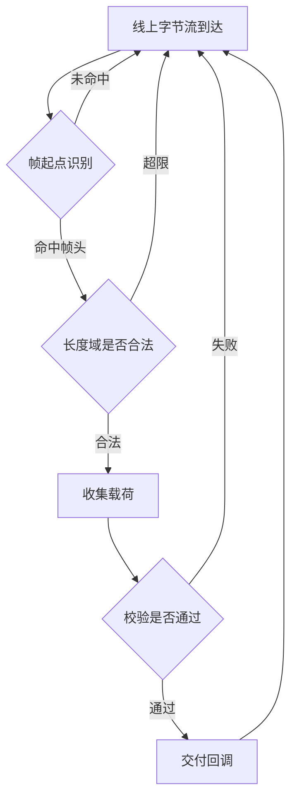
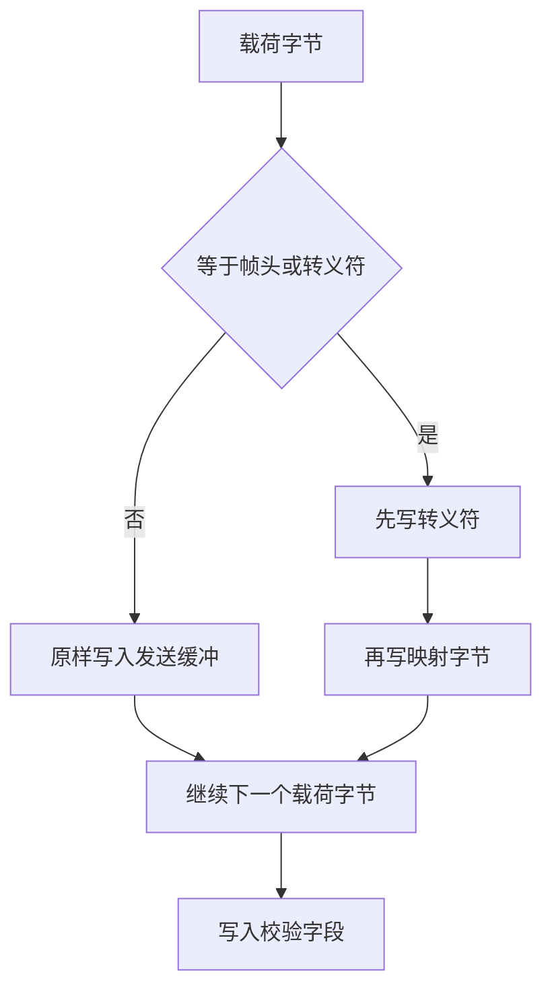
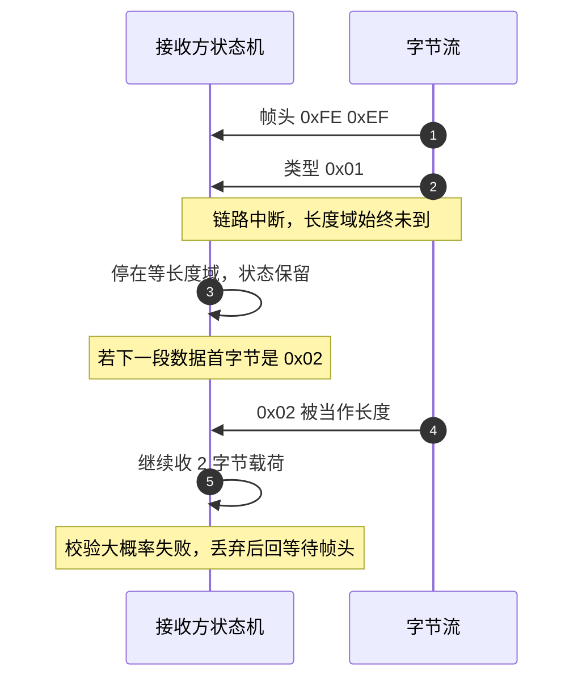

# 串口协议设计要素

云台板固件（`/home/wyx/rm/2026SentriOmeniGimbal/2026OmniSentryGimbal`）上同时挂着四套帧：DBUS 遥控、`UartProtocol` 的 0xFE 0xEF 帧、视觉 SP 帧、裁判系统 0xA5 帧。它们分别跑在 USART3、预留的 USART6、USB CDC 与底盘板的 USART6 上，硬件形态各异，但交给应用层的都是同一种东西：一串按到达顺序排列的字节。

USART 与 USB CDC 都不定义消息边界。外设只保证字节与顺序，从哪一字节开始算一帧、这一帧有多少字节、收到的字节是否可信、中途断开后怎么重新对齐，全部由协议层回答。四套帧对这四个问题的取法不同，正好构成一组可对照的样本。

帧设计要定的六件事是：定长还是变长、帧头用什么、长度域能表示多远、校验做到多强、转义放在哪一层、超时后由谁重新对齐。四套帧对每一件事的取值不同，差异都在工程里落成了具体数字，末尾把它们并排放在一张字段对照表里。

> 源码索引（本单元引用的固件路径都相对于固件仓库根目录）

| 路径 | 作用 |
| --- | --- |
| `Communication/Src/dbus.cpp` | DBUS 定长 18 字节的判断与字段移位 |
| `Communication/Inc/usart_protocol.h` | 0xFE 0xEF 帧的常量、状态枚举与批量入口 |
| `Communication/Src/usart_protocol.cpp` | 0xFE 0xEF 帧的解析与建帧 |
| `Communication/Inc/usb_protocol.h` | SP 帧长度常量、模式枚举与结构体 |
| `Communication/Src/usb_protocol.cpp`、`usb_decode.cpp` | SP 帧的建帧与解析 |
| `Communication/Src/referee_protocol.cpp` | 裁判系统十态解析器 |
| `Communication/Src/usart_dma.cpp` | 空闲中断收包与整段交付 |

## 1. USART 交付的只有字节与到达顺序

USART 外设把线上的电平翻译成字节，放进数据寄存器，再把字节按到达顺序交给接收方。它不提供包边界、不提供地址、不提供重传。接收方拿到的是无结构的字节流，可能从任意位置开始，也可能在任意位置断开。

协议层要做的是在这个字节流上恢复出消息边界。四件事需要同时成立：

1. 起点识别：从连续字节中判断一帧从哪一字节开始；
2. 长度确定：知道这一帧还有多少字节没有收完；
3. 正确性判断：知道收到的字节是否与发送方一致；
4. 同步恢复：在丢字节、丢帧或从中间接入后，能重新对齐到下一帧起点。

这四件事在任何一套帧上都要有答案。答案可以很轻，比如 DBUS 直接约定固定 18 字节，起点与长度都由长度常量代替；也可以很重，比如裁判系统用帧头加两字节长度加双重校验。选择哪一种取决于链路的错误率、帧率与可承受的解析开销。

四套链路的分工与取法：

| 链路 | 方向 | 物理层 | 帧长 | 帧头 | 校验 | 云台板是否启用 |
| --- | --- | --- | --- | --- | --- | --- |
| DBUS 遥控 | 遥控器 → 云台板 | USART3，100000 / 8E1 | 固定 18 字节 | 无，靠长度 | 无 | 启用 |
| `UartProtocol` | 未接线 | 云台板 USART6 空闲，115200 / 8N1 | 变长，最长 32 字节 | 0xFE 0xEF | 8 位累加和 | 未启用 |
| 视觉 SP | 双向，走 USB CDC | USB 全速设备 | 固定 29 或 43 字节 | S 与 P 两个字符 | CRC16 | 启用 |
| 裁判系统 | 底盘板 ↔ 裁判系统 | 底盘板 USART6，115200 / 8N1 | 变长，数据段上限 200 字节 | 0xA5 | CRC8 加 CRC16 | 云台板未启用 |

DBUS 的固定长度来自遥控器接收机的输出节奏，接收端用长度不等于 18 直接判废（`Communication/Src/dbus.cpp`）。其余三套都自己在字节流上找起点，差异只在于找起点之后用什么手段确认。

## 2. 定长与变长：DBUS 的 18 字节和 UartProtocol 的 5+len

定长帧把长度写进协议常量。接收方收到固定字节数即认为一帧结束，不需要长度域，也不依赖帧头。

| 维度 | 定长帧 | 变长帧 |
| --- | --- | --- |
| 边界依据 | 计数器到达常量 | 帧头加长度域 |
| 每帧开销 | 无长度域 | 至少 1 到 2 字节 |
| 丢字节后的表现 | 整帧错位，靠下一帧的帧头恢复 | 长度域若被破坏会吃进后续字节 |
| 适用场景 | 数据字段固定的周期报文 | 命令码多、数据段长度互异 |

定长帧的问题在于错位是静默的：少收一个字节时，剩下的字节会与下一帧拼在一起，长度仍然凑够 18，字段全部移位。DBUS 用无帧头、无校验的定长帧，一旦错位只能等遥控器重新上电或长时间静默后再对齐，这一层风险没有代码兜底。

变长帧把安全边界交给长度域，代价是长度域本身可能被噪声改写。长度域必须先做上限检查，再进入收数据状态，否则一个被改写为 255 的长度会让解析器持续吞字节。`UartProtocol` 的整帧长度是 `5 + len`，五个固定字节依次是帧头两字节、类型、长度、校验，`len` 只表示载荷字节数。

## 3. 帧头长度与误命中概率

帧头的作用是把找起点的成本压到一个常数。常见做法是两字节固定序列，第一字节用于快速跳过无关数据，第二字节用于排除偶然命中。

帧头越短，误命中的概率越高。单字节帧头在随机数据里平均每 256 字节出现一次，双字节则降到 65536 分之一。`UartProtocol` 选 0xFE 0xEF，SP 帧选 S 与 P，裁判系统选 0xA5 单字节加长度、序号、CRC8 三重约束。

帧头不能出现在载荷里，否则接收方会把它当成新帧起点。两字节帧头的低概率特性让这一点通常可以忽略；若载荷是任意二进制且帧率很高，则需要转义来彻底排除。

## 4. 长度域的两种写法与上限

长度域写在帧头之后、载荷之前。接收方收到长度后先判断上限，再决定收多少字节。常见的两种写法：

- 长度表示载荷长度，整帧长度等于固定开销加长度，`UartProtocol` 用这种；
- 长度表示从帧头到校验之前的全部字节数，裁判系统用这种，SOF 后的两字节长度等于命令码加数据段的字节数。

长度域位宽决定单帧上限。8 位长度域最多表示 255 字节载荷，但受接收缓冲区限制，实际可用值往往远小于 255。`UartProtocol` 的缓冲是 32 字节，所以长度上限被压到 27；裁判系统的缓冲是 256 字节，长度上限写死 200（`Communication/Src/referee_protocol.cpp`）。上限检查必须在写入载荷之前完成，放在收满之后再判断已经来不及，缓冲已经被覆盖。

## 5. 四档校验强度与覆盖范围

校验回答收到的字节是否与发出的一致。串口链路上的校验有三档强度，再加上物理层的奇偶校验：

| 方式 | 宽度 | 能力 | 本工程位置 |
| --- | --- | --- | --- |
| 奇偶校验 | 1 位，随每字节 | 只查单字节单比特错 | USART3 配 8E1，硬件检查 |
| 累加和 | 8 位 | 查单字节错、部分多字节错，对调序不敏感 | `UartProtocol` 的 `calcChecksum` |
| CRC8 | 8 位 | 查突发错能力优于累加和 | 裁判系统帧头段 |
| CRC16 | 16 位 | 16 位以内突发错全部可查 | SP 帧、裁判系统帧尾 |

累加和是最弱的一种：两个字节互换位置不会改变和，一个字节加一而另一个字节减一也不会。`UartProtocol` 用的是 8 位累加和（`Communication/Src/usart_protocol.cpp`），与同仓库的 CRC8 和 CRC16 是两套实现，不能互相替代。

CRC 还需要约定覆盖范围和初值，否则两端各算一段也能得出不同结果。SP 帧的覆盖范围在 `Communication/Src/usb_protocol.cpp` 与 `Communication/Src/usb_decode.cpp` 两处分别体现，都是除校验字段之外的全部字节，初值 0xFFFF。

## 6. 转义：本工程没有启用的那条路

转义解决帧头、转义符与长度域出现在载荷里造成的歧义。做法是选一个转义字节，把载荷中所有与帧头或转义符相同的字节替换成转义符加映射字节的组合。

转义的代价是帧长不再确定：载荷中命中转义规则的字节数决定实际长度，长度域必须写转义后的字节数，或者由接收方在解转义后再算。转义还会让同一份数据占用更多带宽，最坏情况下翻倍。

本工程未使用转义。四套帧都靠帧头低概率命中与校验丢弃来处理歧义。若要在 `UartProtocol` 上启用转义，需要增加一个转义状态、改写 `input` 的载荷分支、让 `buildFrame` 先转义再写长度，且两端同步改。当前没有这样的代码。

## 7. 空闲中断给的是段边界，超时重同步要应用层做

逐字节状态机在等长度域或等载荷时可能永远等不到下一字节。超时重同步在接收静默超过阈值后强制把状态机复位到等待帧头。

云台板的接收链路是 DMA 空闲中断触发，一次回调交付的是两帧之间收到的整段数据（`Communication/Src/usart_dma.cpp`）。空闲中断本身可以看作硬件提供的一段结束信号，但代码里没有据此复位协议状态机：`UartProtocol` 的 `feedDMABuffer` 只逐字节调用 `input`（`Communication/Inc/usart_protocol.h`），状态跨回调保留。

超时重同步的另一个作用是清除半帧：若上一段数据的尾字节停在等长度域，下一段数据的前几字节可能恰好构成一个合法长度，解析器会把两段无关数据拼成一帧。校验大概率拦住这种拼接，但拦截失败时会交付伪帧。空闲中断给出了天然的复位时机，代价只是要在回调入口加一次状态清零。

## 8. 四套帧的字段取法

### 8.1 DBUS：定长加无校验

`Communication/Src/dbus.cpp` 只做两件事：先确认整段长度是否为 18 字节，再逐字段做移位拼装。帧结构没有帧头与校验，接收端只检查长度是否为 18。字段拼装规则在 `04-DBUS遥控` 单元展开。这套帧把省下来的字节全部给了载荷，代价是错误只能靠上位机的物理层保证。

### 8.2 UartProtocol：两字节帧头加 8 位累加和

帧格式为 `head1 head2 type len payload[len] checksum`，总长 `5 + len`。`FRAME_MAX_LEN` 为 32，载荷上限 `FRAME_MAX_LEN - 5 = 27`（`Communication/Inc/usart_protocol.h`、`Communication/Src/usart_protocol.cpp`）。

校验值等于 `type` 与全部载荷字节的 8 位和：

$$S = \left( \text{type} + \sum_{i=0}^{len-1} payload_i \right) \bmod 256$$

`buildFrame` 按同一公式生成校验并返回 `5 + len`（`usart_protocol.cpp`），与解析端构成对偶。该链路全工程无调用点，细节在 `03-UsartProtocol实现`。

### 8.3 视觉 SP：定长加 CRC16

两种长度都是编译期常量，用结构体 `static_assert` 锁定（`Communication/Inc/usb_protocol.h`）。校验覆盖范围由长度常量减 2 得到，不依赖额外的范围字段。接收端用三个状态收集固定字节数，收满后再校验（`Communication/Src/usb_decode.cpp`）。定长让协议层省掉了长度域，代价是增删字段必须两端同时改。

### 8.4 裁判系统：单字节帧头加双重校验

`Communication/Src/referee_protocol.cpp` 是十态解析器。长度域由两个字节拼成，超过 200 直接复位；帧头加长度加序号共四字节先过 CRC8（`referee_protocol.cpp`），命令码与数据段收满后再过 CRC16（`referee_protocol.cpp`）。两段校验把帧结构字段和业务数据分开保护，早期的 CRC8 能在一帧刚开始时就丢掉明显错误的帧。

四套帧的字段对照：

| 字段 | DBUS | UartProtocol | 视觉 SP | 裁判系统 |
| --- | --- | --- | --- | --- |
| 帧头 | 无 | 0xFE 0xEF | S 与 P | 0xA5 |
| 长度域 | 无 | 1 字节，载荷长度 | 无，靠常量 | 2 字节小端，命令码加数据段 |
| 校验 | 无 | 8 位累加和 | CRC16，初值 0xFFFF | 前四字节 CRC8，整帧 CRC16 |
| 帧上限 | 18 | 32 | 43 | 7 加 200 加 2 |
| 缓冲区 | 不缓存，直接映射 | 32 字节 | 29 字节 | 256 字节 |

## 9. 易错点

| 易错点 | 现象 | 对应位置 |
| --- | --- | --- |
| 把 UART 当成有边界的接口 | 一次回调的数据不等于一帧 | `usart_dma.cpp` 交付的是两帧之间的整段 |
| 长度域不设上限 | 一个被改写的长度让解析器持续吞字节 | `usart_protocol.cpp`、`referee_protocol.cpp` 都设了上限 |
| 混淆累加和与 CRC | 认为 `calcChecksum` 是 CRC8 | `usart_protocol.cpp` 是 8 位和，`Algorithm/Src/CRC8.cpp` 才是 CRC8 |
| 校验覆盖范围不一致 | 两端都算 CRC 却都对不上 | SP 收发两侧都取长度减 2；改字段时要同步改两侧 |
| 单字节帧头误命中 | 载荷中的 0xA5 被当成新帧 | 裁判系统靠后续长度、序号、CRC8 逐层排除 |
| 依赖固定长度恢复错位 | 少一字节后字段整体移位 | DBUS 无帧头无校验，错位只能靠后续静默恢复 |

## 10. 小结

### 核心概念

- UART 只提供字节与顺序，帧边界由协议层建立。
- 定长帧无长度开销，错位静默；变长帧靠帧头与长度域，长度必须做上限检查。
- 校验强度从奇偶、累加和、CRC8 到 CRC16 递增，覆盖范围与初值必须两端一致。
- 转义把载荷中的帧头与转义符映射出去，代价是帧长不再确定。
- 超时重同步用于清除半帧，空闲中断本身不触发协议复位。
- 本工程四套帧分别取定长、双字节帧头变长、定长 CRC16、单字节帧头双校验四种方案。

### 设计权衡

| 决策 | 选择 | 收益 | 代价 |
| --- | --- | --- | --- |
| DBUS 帧结构 | 定长 18 字节，无校验 | 解析零开销 | 错位与位错都无法自检 |
| UartProtocol 校验 | 8 位累加和 | 计算只需一次循环，无需查表 | 查错能力弱于 CRC8 |
| 视觉 SP 帧长 | 编译期常量加 `static_assert` | 错位在编译期暴露 | 增字段必须两端同时改，否则编译失败 |
| 裁判系统校验 | 帧头段 CRC8 加整帧 CRC16 | 早期丢弃坏帧，减少无效缓冲 | 每帧两次查表 |
| 转义 | 不启用 | 帧长确定，解析简单 | 载荷含帧头时依赖低概率与校验丢弃 |

## 11. 练习

### 基础题

1. 写出 `UartProtocol` 中 `type = 0x01`、载荷为 `{0x34, 0x12}` 时的 8 位累加和，并写出完整帧的字节序列与长度。
2. DBUS 一帧固定 18 字节，若接收时丢掉 1 字节，接收端在什么条件下才会再次对齐？
3. SP 帧的 CRC16 覆盖哪些字节？把覆盖长度写成长度常量减 2 的形式，并说明改动 `GIMBAL_TO_VISION_LEN` 时哪两处必须同步。
4. 裁判系统为什么把 CRC8 放在帧头段、CRC16 放在帧尾，而不是只保留一个 CRC16？

### 挑战题

5. 为 `UartProtocol` 设计一套转义方案：选择转义字节，说明它与 0xFE、0xEF 的冲突如何解决，并写出 `input` 需要新增的状态与转移。
6. 在 `UartProtocol` 上加入超时重同步：给出超时阈值的取值依据，说明阈值过短与过长各自造成的后果，并画出状态转移。
7. 假设载荷为随机二进制、帧率为 200 Hz、每帧 20 字节，估算单字节帧头在 1 小时运行中误命中的期望次数，并判断是否需要用双字节帧头。

---

### 附：本页引用的固件路径

| 路径 | 用途 |
| --- | --- |
| `2026OmniSentryGimbal/Communication/Src/dbus.cpp` | 定长 18 字节判断与逐字段移位 |
| `2026OmniSentryGimbal/Communication/Inc/usart_protocol.h` | 帧头与上限常量、批量入口 |
| `2026OmniSentryGimbal/Communication/Src/usart_protocol.cpp` | 长度上限、累加和、建帧 |
| `2026OmniSentryGimbal/Communication/Inc/usb_protocol.h` | SP 帧长度常量与 `static_assert` |
| `2026OmniSentryGimbal/Communication/Src/usb_protocol.cpp` | SP 帧 CRC16 覆盖范围 |
| `2026OmniSentryGimbal/Communication/Src/usb_decode.cpp` | SP 接收状态机与校验 |
| `2026OmniSentryGimbal/Communication/Src/referee_protocol.cpp` | 长度上限、CRC8、CRC16 |
| `2026OmniSentryGimbal/Communication/Src/usart_dma.cpp` | 空闲中断与整段交付 |
| `2026OmniSentryGimbal/Algorithm/Src/CRC8.cpp` | CRC8 查表实现 |
