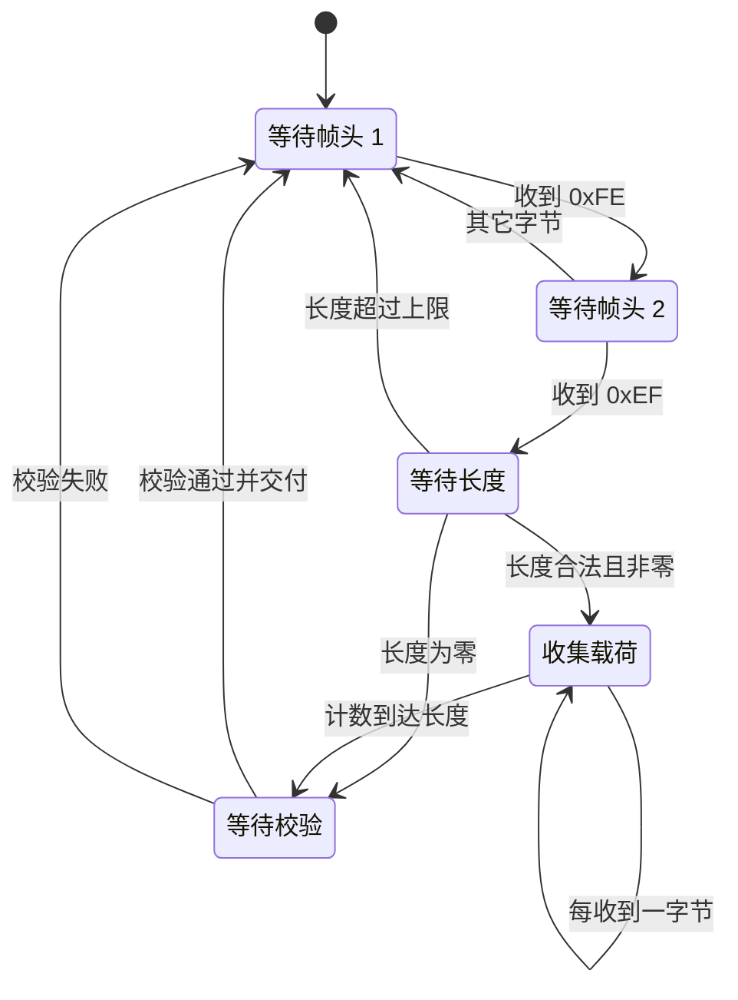
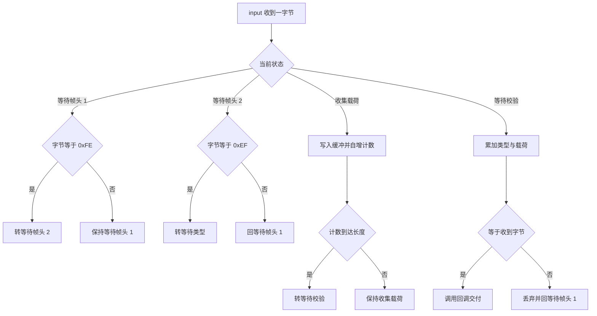
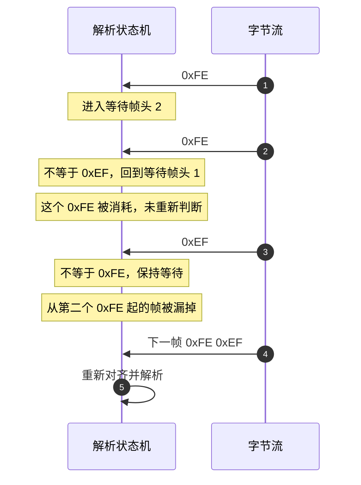

# 状态机解帧原理

云台板固件（`/home/wyx/rm/2026SentriOmeniGimbal/2026OmniSentryGimbal`）与底盘板固件（`/home/wyx/rm/2026SentriOmeniChassis/2026OmniSentryChassis`）里有三套逐字节解析器：`UartProtocol` 六态、`USBDecode` 三态、`RefereeProtocol` 十态。三套装在不同字节流上，状态数量差一倍以上，但写法是同一种。

解帧可以拆成「每次只吃一个字节」：状态机因此能直接放进中断，不需要缓冲。一个五态例子能走完转移、校验与失败分支；容易写错的地方是重同步——帧头第二字节判断失败时，当前字节要不要吃掉，决定了下一轮从哪里开始找。三套解析器最后并排对照。

## 1. 逐字节推进与整帧缓冲：两条解帧路线

串口数据以字节为单位到达，接收方在中断或任务里拿到的是不完整的片段。解帧有两种组织方式：

1. 缓冲整帧再解析：把收到的字节先存进大缓冲，等到认为一帧收齐后再一次性解析；
2. 逐字节状态机：每收到一字节就更新一次状态，状态里保存已经解析出的字段，收齐后立即交付。

第一种方式需要在缓冲层再判断一次帧边界，边界逻辑与解析逻辑分处两地。第二种方式把边界判断与字段解析合进一个 switch，同一份状态既表达“收到哪里”又表达“已经解析出什么”。

逐字节状态机的形式化描述是一个四元组：状态集、输入字母表、转移函数、输出动作。输入字母表是 0 到 255 的全部字节，转移函数由 `input` 里的 switch 给出，输出动作在收满并校验通过时调用回调。三套解析器都符合这个结构，差别只在状态集的规模与输出动作的触发条件。

## 2. 五态小例子：head1 head2 len payload sum

以一个双字节帧头、带长度域、带 8 位和校验的帧为例，帧格式为 `head1 head2 len payload[len] sum`。需要五个状态：

| 状态 | 含义 | 收到字节时的动作 |
| --- | --- | --- |
| `WAIT_HEAD1` | 等待帧头第一字节 | 等于 0xFE 则进入下一态，否则留在本态 |
| `WAIT_HEAD2` | 等待帧头第二字节 | 等于 0xEF 则进入下一态，否则回到第一态 |
| `WAIT_LEN` | 等待长度域 | 保存长度并检查上限，为零则跳到校验态 |
| `WAIT_PAYLOAD` | 收集载荷 | 逐字节写入缓冲，计数到达长度则进入校验态 |
| `WAIT_SUM` | 等待校验 | 计算并比对，通过则交付，两种结果都回到第一态 |

载荷长度为零时，`WAIT_LEN` 直接跳到 `WAIT_SUM`，校验态需要能接受零长度。这一点在 `UartProtocol` 里有对应实现：长度为零的帧同样要收校验字节，只是载荷循环一次都不执行。

## 3. 一次调用吃一个字节：执行时间上界

状态机的每次调用只处理一字节，执行时间与已经收到的字节数无关，是一个上界固定的常数。这个性质让它可以放在中断里跑：

- 不会因为等待下一字节而让 CPU 空转；
- 不会因为一帧很长而阻塞整个中断；
- 状态保存在对象成员里，跨调用、跨任务上下文都成立。

工程里 `DBUS_Decode` 就在 USART3 中断上下文里执行（`Core/Src/main.c:72-76`、`Communication/Src/dbus.cpp:37-39`），一次处理一整段。`UartProtocol::feedDMABuffer` 也是同步循环，把一个 DMA 段内的字节全部喂完才返回（`Communication/Inc/usart_protocol.h:37-41`）。

每次调用一个字节的执行时间可以估：`UartProtocol` 的 `input` 最多走一个 switch 分支加一次长度判断，载荷分支是一次数组写入与一次比较，校验分支是一次长度不超过 27 的循环。校验分支是其中最长的，代价随长度线性增长。把一整个 DMA 段交给 `feedDMABuffer` 时，总时间等于段内字节数乘以单字节代价，段越长中断占用越久，这是空闲中断方案里要盯的量。

## 4. 0xFE 0xFE 0xEF 为什么漏掉一帧

重同步指在丢字节、丢帧或从字节流中间接入后重新找到帧起点。状态机要做到两点：

1. 任何异常都回到 `WAIT_HEAD1`，不带半帧进入下一轮；
2. 回到 `WAIT_HEAD1` 后从当前字节继续判断，不丢弃当前字节。

第二点常被写成丢弃。以序列 0xFE 0xFE 0xEF 为例：第一个 0xFE 进入 `WAIT_HEAD2`，第二个 0xFE 不等于 0xEF，若直接回到 `WAIT_HEAD1`，第二个 0xFE 就被消耗掉了；接着到达的 0xEF 不等于 0xFE，解析器停在 `WAIT_HEAD1`，一个本来从第二个 0xFE 开始的合法帧被漏掉。

`UartProtocol` 的 `WAIT_HEAD2` 分支正是这种写法（`Communication/Src/usart_protocol.cpp:22-25`）。若帧头第一字节在载荷中重复出现，紧跟的第二字节又不是 0xEF，就会漏掉一个潜在起点。两字节帧头的重复概率低，实际影响有限；若要严格，`WAIT_HEAD2` 失败时应重新判断当前字节是否为 0xFE，相当于不消耗该字节。代价是每个失败字节都要多做一次比较，且要保证重判路径不会把状态绕回自身形成死循环。

## 5. 长度域与状态的耦合

长度域把“还要收多少字节”变成状态机的一部分。设计上有两个选择：

- 长度合法时不立即改状态，而是在收载荷分支里用计数判断；
- 长度合法时按零与非零分别跳到校验态或载荷态。

`UartProtocol` 用第二种：在 `WAIT_LEN` 里把 `data_index_` 清零，按 `data_len_ == 0` 选择下一态（`usart_protocol.cpp:32-40`）。`RefereeProtocol` 把数据段长度与命令码分开，收到命令码高位后再决定进入数据态还是直接进校验态（`Communication/Src/referee_protocol.cpp:86-94`）。

状态数与协议字段数正相关：字段越多，显式状态越多。裁判系统有帧头、两字节长度、序号、CRC8、两字节命令码、数据段、两字节 CRC16，对应十个状态（`Communication/Inc/referee_protocol.h:25-37`）。字段一多，状态枚举本身就成了一份协议文档，读代码时先看枚举比先看 switch 更快。

## 6. 工程内三套解析器：六态、三态、十态

### 6.1 UartProtocol：六态

状态枚举为 `WAIT_HEAD1`、`WAIT_HEAD2`、`WAIT_TYPE`、`WAIT_LEN`、`WAIT_PAYLOAD`、`WAIT_CHECKSUM`（`Communication/Inc/usart_protocol.h:44-51`）。`WAIT_TYPE` 不做任何判断，收到字节即保存并进入下一态。校验失败与成功都回到 `WAIT_HEAD1`，回调只在成功时触发（`usart_protocol.cpp:47-57`）。

### 6.2 USBDecode：三态

状态为 `WAIT_HEAD_0`、`WAIT_HEAD_1`、`COLLECT`（`Communication/Inc/usb_decode.h:27-31`）。因为帧长固定，进入 `COLLECT` 后没有长度判断，只按 `index_` 计数，收满 29 字节后统一算 CRC 并回到 `WAIT_HEAD_0`（`Communication/Src/usb_decode.cpp:45-108`，收满与校验在 :66-104）。固定长度让状态数从六降到三，省掉的不只是长度态，还有长度上限检查。

### 6.3 RefereeProtocol：十态

状态枚举见 `Communication/Inc/referee_protocol.h:25-37`，处理逻辑在 `Communication/Src/referee_protocol.cpp:26-133`。它在两处提前复位：长度超过 200 时（`:49-52`）与 CRC8 不匹配时（`:69-72`）。校验通过后回调拿到的数据段指针是 `buffer_[7]`（`referee_protocol.cpp:125-126`）。

三套解析器的性质对照：

| 解析器 | 状态数 | 帧长来源 | 提前复位点 | 交付条件 |
| --- | --- | --- | --- | --- |
| `UartProtocol` | 6 | 长度域 | 长度超过 27 | 8 位和匹配 |
| `USBDecode` | 3 | 编译期常量 29 | 无，收满才校验 | CRC16 匹配且模式有效 |
| `RefereeProtocol` | 10 | 两字节长度域 | 长度超过 200、CRC8 不匹配 | CRC16 匹配 |

三套的状态数差异来自协议字段，不来自实现水平。裁判系统的十个状态里，有四个服务于两段校验与两字节命令码；去掉这些字段，状态数立刻降下来。写新解析器时可以先数字段，再决定状态集，避免一边写一边加状态。

## 7. 易错点

| 易错点 | 现象 | 对应位置 |
| --- | --- | --- |
| 帧头第二字节判断失败时丢弃当前字节 | 形如 0xFE 0xFE 0xEF 的帧被漏掉 | `usart_protocol.cpp:22-25` |
| 长度为零时没有从长度态直接进校验态 | 零载荷帧永远收不到校验 | `usart_protocol.cpp:39` 做了处理 |
| 校验失败后不回等待帧头 | 半帧状态残留，下一帧被拼坏 | 三套解析器都在失败后回第一态 |
| 状态变量未初始化 | 上电第一次调用就落在错误状态 | `usart_protocol.h:53` 有初值，`referee_protocol.h:39` 有初值 |
| 在载荷分支里做重活 | 中断执行时间随载荷增长 | 本工程载荷分支只做写入与计数 |
| 把回调当异步交付 | 回调在中断上下文里执行 | `UartProtocol` 的回调由 `input` 同步调用 |

## 8. 小结

### 核心概念

- 逐字节状态机用一个 switch 同时表达边界判断与字段解析，状态跨调用保留。
- 每次调用只处理一字节，执行时间是常数上界，校验分支与载荷长度线性相关。
- 任何异常都应回到等待帧头状态；是否重新判断当前字节决定会不会漏掉紧邻的起点。
- 状态数由协议字段数决定，固定长度帧可以把状态压到三个。
- 提前复位点放在长度域与早期校验上，能减少无效缓冲占用。

### 设计权衡

| 决策 | 选择 | 收益 | 代价 |
| --- | --- | --- | --- |
| 解帧位置 | 中断上下文的逐字节状态机 | 无额外缓冲，延迟低 | 状态与全局对象耦合，调试需读对象内部 |
| 长度为零的处理 | 长度态直接进校验态 | 支持零载荷帧 | 校验分支要能处理零长度 |
| 帧头失败处理 | 回到第一态且消耗当前字节 | 实现简单 | 连续帧头字节会漏掉一个起点 |
| 固定长度帧 | 三态加计数 | 状态少、无长度域 | 字段增删必须改两端常量 |
| 校验失败处理 | 丢弃并回第一态 | 逻辑单一 | 无错误计数与重传，问题静默 |

## 9. 练习

### 基础题

1. 写出五态小例子中，收到字节序列 `0xFE 0xEF 0x02 0x11 0x22 ` 后各状态的迁移过程，并给出最终校验值。
2. `UartProtocol` 的 `WAIT_LEN` 收到长度 0 时进入哪个状态？画出从 `WAIT_HEAD1` 到交付的完整路径。
3. `USBDecode` 收满 29 字节后为什么要先回到 `WAIT_HEAD_0` 再校验？这与在 `COLLECT` 里校验有什么差别？
4. 裁判系统在 CRC8 不匹配时直接复位，为什么不在数据段收完后再统一校验？

### 挑战题

5. 把 `UartProtocol` 的帧头失败分支改成不消耗当前字节，写出修改后的转移，并分析它对解析时间最坏情况的影响。
6. 为 `USBDecode` 增加一个“在已收 29 字节中重新搜索帧头”的重同步逻辑，说明需要在哪些状态里搜索、代价是多少。
7. 设计一个状态机，支持同一字节流上交织的两套帧头且互不干扰，给出状态集合与转移条件。

---

### 附：本页引用的固件路径

| 路径 | 用途 |
| --- | --- |
| `2026OmniSentryGimbal/Communication/Inc/usart_protocol.h` | 六态枚举（:44-51）、状态初值（:53）、批量入口（:37-41） |
| `2026OmniSentryGimbal/Communication/Src/usart_protocol.cpp` | `input` 全部转移（:14-59）、校验交付（:47-57） |
| `2026OmniSentryGimbal/Communication/Inc/usb_decode.h` | 三态枚举（:27-31） |
| `2026OmniSentryGimbal/Communication/Src/usb_decode.cpp` | 固定长度收集与校验（:45-108） |
| `2026OmniSentryGimbal/Communication/Inc/referee_protocol.h` | 十态枚举（:25-37） |
| `2026OmniSentryGimbal/Communication/Src/referee_protocol.cpp` | 提前复位（:49-52、:69-72）、命令码后分支（:86-94）、交付（:125-126） |
| `2026OmniSentryGimbal/Core/Src/main.c` | USART3 回调注册与中断上下文（:72-76） |
| `2026OmniSentryGimbal/Communication/Src/dbus.cpp` | C 接口包装（:37-39） |
