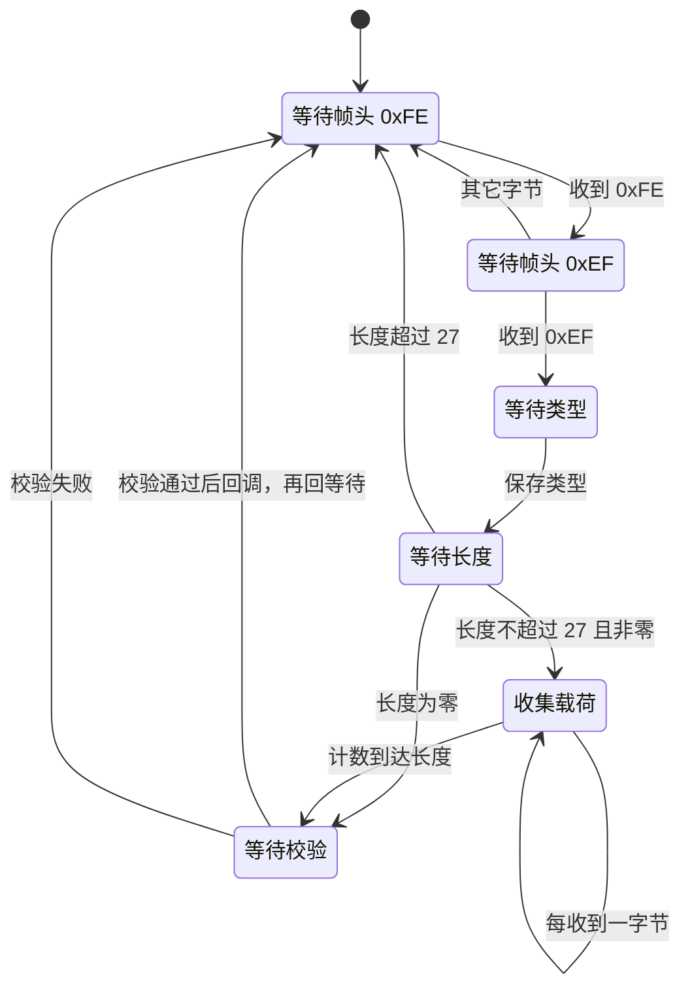
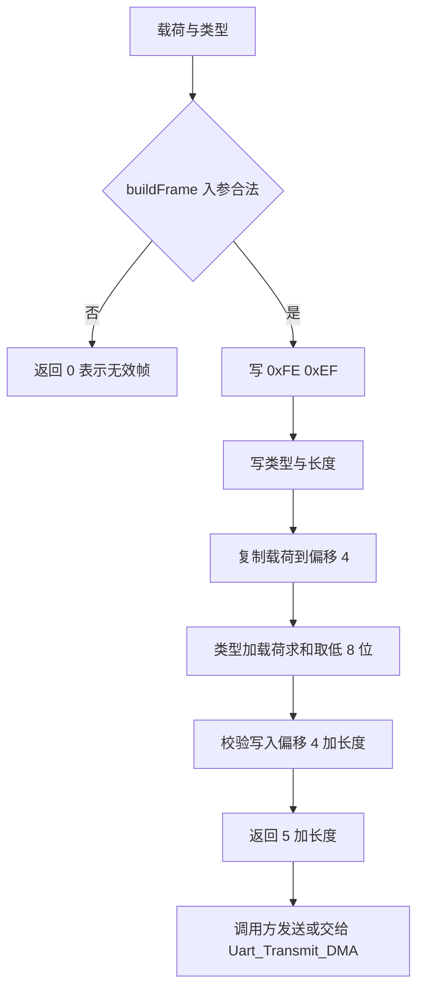
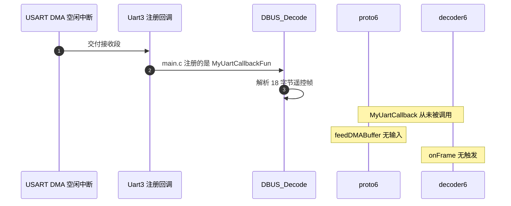

# UsartProtocol 实现

云台板固件（`/home/wyx/rm/2026SentriOmeniGimbal/2026OmniSentryGimbal`）与底盘板固件（`/home/wyx/rm/2026SentriOmeniChassis/2026OmniSentryChassis`）里各有一份相同的 `UartProtocol` 与配套的 `UartDecode`。这套代码把 0xFE 0xEF 帧的解析、建帧与命令分派都写好了，但在两块板子上都没有被注册到任何串口上。

这条链路的实现可以按接口约定、帧布局、状态转移、校验公式、建帧对偶与组装方式六段读完。它在当前固件里没有调用点，证据在文末；把它接起来需要改哪些地方属于推断，未经实机验证。

## 1. 协议层与应用层的分工

`UartProtocol` 只负责把字节流变成帧：判帧头、读长度、收载荷、算校验、交付载荷。它不知道载荷里是什么命令，只把 `type`、载荷指针和长度交给回调。

`UartDecode` 负责解释载荷：按 `type` 分派，调用具体的处理函数。协议层通过构造函数注入回调，应用层在回调里接收帧。

分工的意义在于：新增命令码只改 `UartDecode::onFrame` 的 switch，不改协议层；换一种帧格式只改协议层，不动业务代码。当前工程里两层的接口都写好了，业务分支只有一个 `0x01`。这种分层在别处也有同样的形状，只是这一条链路的业务侧还没有接上目标对象。

## 2. 0xFE 0xEF 帧的 5+len 布局

帧格式为 `head1 head2 type len payload[len] checksum`：

| 偏移 | 长度 | 字段 | 取值 |
| --- | --- | --- | --- |
| 0 | 1 | `head1` | 0xFE |
| 1 | 1 | `head2` | 0xEF |
| 2 | 1 | `type` | 命令码，当前只定义 0x01 |
| 3 | 1 | `len` | 载荷字节数，上限 27 |
| 4 | `len` | `payload` | 载荷 |
| `4 + len` | 1 | `checksum` | 8 位累加和 |

整帧长度为 `5 + len`。三个常量在头文件里：`FRAME_HEAD_1 = 0xFE`、`FRAME_HEAD_2 = 0xEF`、`FRAME_MAX_LEN = 32`（`Communication/Inc/usart_protocol.h`）。

长度上限由接收缓冲决定，而不是由 8 位长度域决定。缓冲区 `recv_buf_[FRAME_MAX_LEN]` 是 32 字节（`usart_protocol.h`），扣除帧头两字节、类型、长度、校验共 5 字节，载荷上限是 27。把上限从 255 压到 27 换来的是一条可以直接数组索引的定长缓冲，不需要动态分配，也不需要溢出检查之外的边界处理。

## 3. 六态里与帧长有关的两处转移

状态为 `WAIT_HEAD1`、`WAIT_HEAD2`、`WAIT_TYPE`、`WAIT_LEN`、`WAIT_PAYLOAD`、`WAIT_CHECKSUM`（`usart_protocol.h`），初值为 `WAIT_HEAD1`。转移细节在 `02-状态机解帧原理` 已展开，这里只列帧长相关的两处：

- `WAIT_LEN` 收到长度后，若大于 `FRAME_MAX_LEN - 5` 则回 `WAIT_HEAD1`，否则把 `data_index_` 清零，并按长度是否为零跳到校验态或载荷态（`Communication/Src/usart_protocol.cpp`）；
- `WAIT_PAYLOAD` 每收一字节写入 `recv_buf_` 并自增 `data_index_`，计数到达长度后进校验态。

两处合起来构成一条完整的长度约束：进入载荷态之前先限幅，进入之后只按计数收字节。校验态不读长度，只读缓冲与类型。



## 4. 8 位累加和：解析端与建帧端的对偶

校验值是 `type` 与全部载荷字节之和取低 8 位：

$$S = \left( \text{type} + \sum_{i=0}^{len-1} payload_i \right) \bmod 256$$

解析端在 `WAIT_CHECKSUM` 里现算（`usart_protocol.cpp`）。建帧端在 `buildFrame` 里用同一公式。两端对称，不涉及查表，算一次校验的代价是一次长度不超过 27 的循环。

头文件还导出一个静态函数 `calcChecksum`（`usart_protocol.h`，实现见 `usart_protocol.cpp`）。它只对传入的 `data` 求和，不把 `type` 算进去。解析与建帧都没有调用它，全工程也没有其它调用点。直接用它算帧校验会得到与 `buildFrame` 不同的结果，因为少了类型字节这一项。

这不是一个纯风格问题：函数名与帧校验同名，放在同一份头文件里，接线时很容易被当成“现成的校验函数”拿去用。两端的对偶关系因此要写成注释或者干脆让 `calcChecksum` 接受一个初值参数，把类型字节作为初值传入。

## 5. buildFrame 的逐字段对偶与失败分支

`buildFrame` 的签名是 `uint8_t buildFrame(uint8_t* out_buf, uint8_t frame_type, const uint8_t* payload, uint8_t len)`（`usart_protocol.h`）。行为：

1. 若 `out_buf` 为空或 `len > FRAME_MAX_LEN - 5`，返回 0；
2. 依次写帧头、类型、长度；
3. 把载荷复制到偏移 4 起（`usart_protocol.cpp`）；
4. 计算校验写在第 `4 + len` 字节；
5. 返回 `5 + len`。

与解析端逐字段对应：解析端从偏移 2 取 `type`，从偏移 3 取 `len`，从偏移 4 起取载荷，从偏移 `4 + len` 取校验。两侧对偏移的约定一致，帧格式改动需要同时改两处。返回值 `0` 是一个有效的失败信号，因为最小合法帧长是 `5`，不会与正常返回撞上；调用方必须判断它。



## 6. feedDMABuffer 与 proto6、decoder6 的组装

DMA 回调交付的是一整段数据，协议层需要逐字节处理。头文件提供内联的 `feedDMABuffer(volatile uint8_t* buf, int len)`，内部就是一个 `for` 循环调用 `input`（`usart_protocol.h`）。它是唯一把 DMA 段接进状态机的入口，放在头文件里，除了省一次函数调用，也让调用方不必关心状态机内部。

调用链是这样接起来的：

1. 全局实例 `proto6` 与 `decoder6` 在 `Communication/Src/usart_decode.cpp` 定义，`proto6` 先用空回调构造；
2. `UartDecode` 的构造函数调用 `proto.setCallback`，把 `onFrame` 注册进 `proto6`（`usart_decode.cpp`），于是 `proto6` 的回调指向 `decoder6` 的成员函数；
3. C 接口 `MyUartCallback` 调 `proto6.feedDMABuffer`（`usart_decode.cpp`），它是把 USART 接收段接进 `proto6` 的桥梁。

三步里只有最后一步需要外部调用者，前两步在静态初始化阶段完成。也就是说，只要有人调用 `Uart_Init(&huart, MyUartCallback)`，整条链路就会开始工作。

## 7. 无调用点的证据链

`Uart_Init` 是注册接收回调的唯一接口（`Communication/Inc/usart_dma.h`）。云台板的调用点只有一处：

```cpp
Uart_Init(&huart3, MyUartCallbackFun); // huart3是连接遥控器的UART实例
```

出处是 `Core/Src/main.c`，回调 `MyUartCallbackFun` 的函数体只有 `DBUS_Decode(buf, len)`（`main.c`）。工程里没有 `Uart_Init(&huart6, MyUartCallback)`，也没有任何地方调用 `MyUartCallback`。底盘板同样只注册了 `huart3` 与裁判系统的 `huart6`（底盘 `Core/Src/main.c`），`MyUartCallback` 同样无调用点。

连带的三处死代码：

| 位置 | 内容 | 状态 |
| --- | --- | --- |
| `usart_decode.cpp` | `bool motor_cmd_triggered` | 只写不读 |
| `usart_decode.cpp` | `float speed = raw_speed` | 局部变量，赋值后未使用 |
| `usart_decode.h` | `extern ControlCommand g_control_cmd` | 只有声明，全工程无定义、无引用 |

`UartDecode::handleMotorCmd` 解析出小端 `int16_t` 速度后转成 `float` 就没有下文（`usart_decode.cpp`）。发送侧 `UartProtocol::buildFrame` 与 `Uart_Transmit_DMA` 也都没有调用点。整条链路从注入数据到发出应答均未接通。



## 8. 若要接线：两种方案（属推断）

以下为设计建议，未经实机验证，属推断。按链路选择分两种：

方案一：把 0xFE 0xEF 帧跑在 USART6 上。云台板 USART6 已由 CubeMX 初始化为 115200 8N1，TX 与 RX 都配了（`Core/Src/usart.c`），当前在云台板上没有接收注册。接线步骤：

1. 在 `main.c` 的 `MX_USART6_UART_Init` 之后调用 `Uart_Init(&huart6, MyUartCallback)`；
2. 确认 `DT7DMA_MAX_INSTANCES` 为 3，当前只用了 `huart3` 一个实例，容量足够（`usart_dma.h`）；
3. 把 `handleMotorCmd` 的结果写入实际控制目标，例如 `control_target`，而不是无引用的 `speed`；
4. 若需要应答，用 `buildFrame` 组帧后调 `Uart_Transmit_DMA(&huart6, frame, len)`，并检查返回状态。

方案二：复用 USB CDC 已建的字节通路。视觉小电脑的字节已经在 `UsbConnectTask::run` 里被逐个取出（`Task/Src/UsbConnectTask.cpp`）。把 `usb_decoder.feed` 换成 `proto6.input` 可以把 0xFE 0xEF 帧接到同一通路，但 SP 帧与 0xFE 0xEF 帧不能共用同一个解析器，需要按帧头分派或只保留一种。

方案一的一个前提是 USART6 的用途不与裁判系统冲突。云台板当前没有裁判系统接收通路，`huart6` 处于空闲；底盘板的 `huart6` 已注册给裁判系统，不能复用。

## 9. 易错点

| 易错点 | 现象 | 对应位置 |
| --- | --- | --- |
| 认为这条链路在运行 | 调试时等不到 `onFrame` 触发 | `main.c` 注册的是 DBUS 回调 |
| 用 `calcChecksum` 算帧校验 | 结果比 `buildFrame` 少一个类型字节 | `usart_protocol.cpp` 只对入参求和 |
| 把 8 位累加和当 CRC8 | 按 CRC8 查表去比对 | `usart_protocol.cpp` 是求和，CRC8 在 `Algorithm/Src/CRC8.cpp` |
| 长度上限写错 | 允许 28 到 255 的载荷 | 上限是 `FRAME_MAX_LEN - 5 = 27`，两端都有检查 |
| 依赖 `g_control_cmd` 保存结果 | 引用后链接报未定义 | `usart_decode.h` 只有声明 |
| 认为 `buildFrame` 一定成功 | 忽略返回 0 的情况 | 返回值 0 表示无效帧，需判断 |

## 10. 小结

### 核心概念

- `UartProtocol` 负责帧边界与校验，`UartDecode` 负责命令分派，两层通过回调连接。
- 帧长 `5 + len`，缓冲 32 字节，载荷上限 27。
- 校验是类型加载荷的 8 位累加和，解析与建帧两端公式一致。
- `feedDMABuffer` 是批量入口，逐字节调用 `input`。
- 该链路在云台板与底盘板都无调用点，`proto6`、`decoder6`、`MyUartCallback`、`buildFrame`、`Uart_Transmit_DMA` 均未接通。

### 设计权衡

| 决策 | 选择 | 收益 | 代价 |
| --- | --- | --- | --- |
| 帧格式 | 双字节帧头加长度域 | 变长命令与低误命中率 | 每帧 3 字节开销 |
| 校验 | 8 位累加和 | 无查表，代码短 | 查错能力弱，不抗调序 |
| 校验范围 | 类型加载荷 | 类型字段也被保护 | 与 `calcChecksum` 的入参约定不一致 |
| 缓冲 | 固定 32 字节 | 无动态分配 | 载荷上限压到 27 |
| 当前接线 | 不注册 | 遥控链路零干扰 | 已写好的协议层无法被验证 |

## 11. 练习

### 基础题

1. `FRAME_MAX_LEN` 为 32 时载荷上限是多少？写出推导。
2. 给定 `type = 0x02`、载荷 `{0x01, 0x02, 0x03}`，算出校验值并写出完整帧的 8 个字节。
3. `calcChecksum` 与 `buildFrame` 里的校验计算有什么区别？用一组具体字节说明差值。
4. 列出把 `MyUartCallback` 接入接收链路的唯一函数名，并说明它在云台板被调用时传的是什么。

### 挑战题

5. 按方案一把链路接通，写出 `main.c` 需要新增的语句位置与 `handleMotorCmd` 需要改写的字段，并说明 `control_target` 的哪些字段适合作为速度目标。
6. 为 `UartProtocol` 增加一个错误计数与最近失败原因字段，说明它们应该放在协议层还是应用层，以及中断上下文写入时需要注意什么。
7. `buildFrame` 返回 `uint8_t`，帧长上限 32 可以容纳。若把 `FRAME_MAX_LEN` 提高到 300，返回类型、长度域宽度与调用方需要各改什么？

---

### 附：本页引用的固件路径

| 路径 | 用途 |
| --- | --- |
| `2026OmniSentryGimbal/Communication/Inc/usart_protocol.h` | 常量、接口与内联批量入口、状态枚举 |
| `2026OmniSentryGimbal/Communication/Src/usart_protocol.cpp` | 状态转移、校验、建帧 |
| `2026OmniSentryGimbal/Communication/Inc/usart_decode.h` | `ControlCommand` 与全局声明、`proto6` 声明 |
| `2026OmniSentryGimbal/Communication/Src/usart_decode.cpp` | 实例与回调注册、命令分派、未用变量、C 接口 |
| `2026OmniSentryGimbal/Core/Src/main.c` | 唯一 `Uart_Init` 调用点与 DBUS 回调 |
| `2026OmniSentryGimbal/Communication/Inc/usart_dma.h` | 注册接口、实例容量 |
| `2026OmniSentryGimbal/Communication/Src/usart_dma.cpp` | `Uart_Init` 与 `Uart_Transmit_DMA` 实现 |
| `2026OmniSentryGimbal/Task/Src/UsbConnectTask.cpp` | USB 字节取出循环 |
| `2026OmniSentryChassis/2026OmniSentryChassis/Core/Src/main.c` | 底盘两处注册 |
