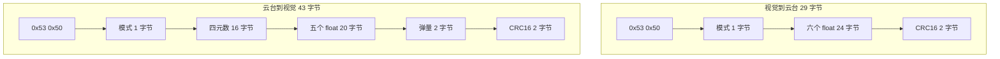
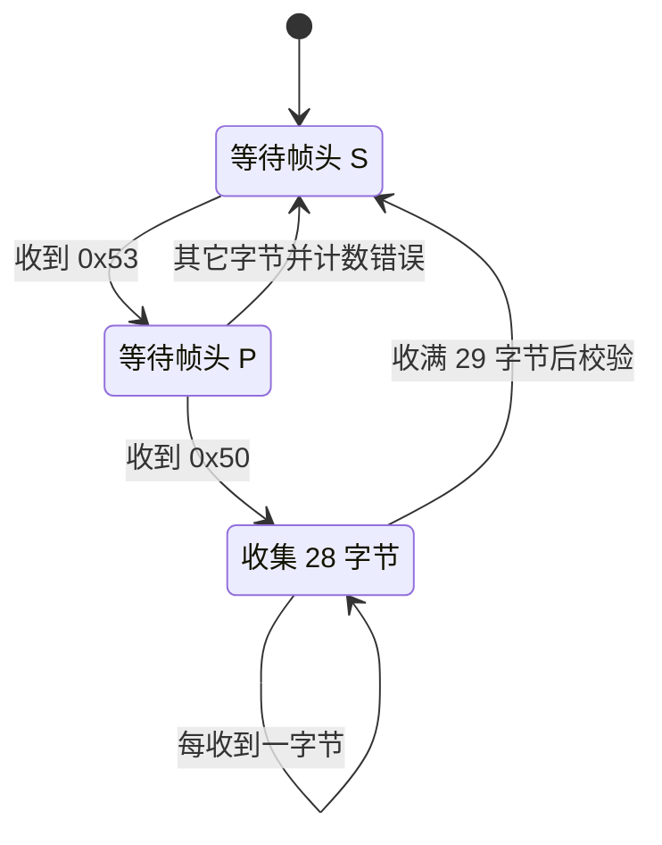
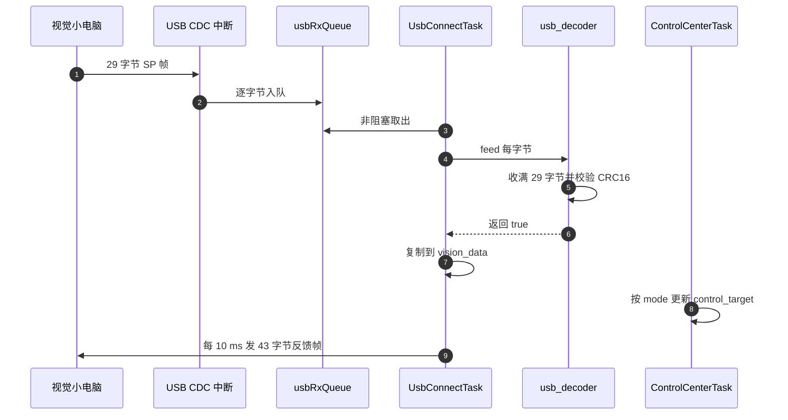

# 视觉链路 SP 协议

云台板固件（`/home/wyx/rm/2026SentriOmeniGimbal/2026OmniSentryGimbal`）与视觉小电脑之间的链路走 USB CDC，不走 USART。协议在仓库根目录的 `云台串口协议.md` 里描述，固件侧实现在 `Communication/Inc/usb_protocol.h` 与 `Communication/Src/usb_decode.cpp`。

链路两端的分工是固定的：视觉小电脑做 USB 主机，云台板做设备；视觉发目标角，云台回姿态与弹量。两个方向的数据量差别明显，帧长因此不同，一个是 29 字节，另一个是 43 字节。载体、帧头、两种布局、模式取值、CRC16 与收发链路按这个顺序看下来，最后对照文档记下差异。

## 1. 视觉链路的载体：USB CDC 上的字节流

视觉小电脑算出自瞄目标后，把目标角与角速度交给云台板；云台板把姿态四元数、实际角、弹速与弹量交回视觉。两个方向的数据量不同，帧长也不同：

| 方向 | 常量 | 长度 | 内容 |
| --- | --- | --- | --- |
| 视觉 → 云台 | `VISION_TO_GIMBAL_LEN` | 29 | 控制模式、三轴目标角与角速度 |
| 云台 → 视觉 | `GIMBAL_TO_VISION_LEN` | 43 | 云台模式、四元数、实际角与角速度、弹速、弹量 |

链路载体是 USB 全速 CDC 设备，主机侧表现为一个虚拟串口。云台板做设备，视觉小电脑做主机。USB 本身有包边界与 CRC，但协议层仍然自己加了帧头与 CRC16，原因是 CDC 在主机侧只暴露字节流，USB 的包边界不会传给应用。上层应用看到的仍然是一串无边界字节，与 USART 面临的问题相同。

## 2. SP 帧头与两个方向的定长约定

两字节帧头取 ASCII 的 `'S'` 与 `'P'`，十六进制是 0x53 与 0x50（`Communication/Inc/usb_protocol.h`）。两个方向共用同一帧头，靠长度区分：接收方固定收 29 字节，发送方固定发 43 字节。

帧头不参与方向编码，意味着同一条 CDC 链路上如果两端同时发，接收方无法只凭帧头判断这一帧来自哪个方向。当前实现里云台板只收 29 字节帧、只发 43 字节帧，方向由角色固定。定长加上角色固定，让解析器只需三个状态；代价是任何一端改了字段，另一端必须在同一轮改动里跟上。

## 3. 两种帧长的逐字段布局

### 3.1 视觉到云台：29 字节

字段顺序在 `usb_protocol.h`：

| 偏移 | 长度 | 字段 | 类型 | 含义 |
| --- | --- | --- | --- | --- |
| 0 | 1 | `head[0]` | `uint8_t` | 0x53 |
| 1 | 1 | `head[1]` | `uint8_t` | 0x50 |
| 2 | 1 | `mode` | `uint8_t` | 控制模式 |
| 3 | 4 | `yaw` | `float` | 目标 yaw 角 |
| 7 | 4 | `yaw_vel` | `float` | 目标 yaw 角速度 |
| 11 | 4 | `yaw_acc` | `float` | 目标 yaw 角加速度 |
| 15 | 4 | `pitch` | `float` | 目标 pitch 角 |
| 19 | 4 | `pitch_vel` | `float` | 目标 pitch 角速度 |
| 23 | 4 | `pitch_acc` | `float` | 目标 pitch 角加速度 |
| 27 | 2 | `crc16` | `uint16_t` | 校验值 |

长度 3 加 6 乘 4 加 2 等于 29。CRC16 覆盖前 27 字节，即偏移 0 到 26。

### 3.2 云台到视觉：43 字节

字段顺序在 `usb_protocol.h`：

| 偏移 | 长度 | 字段 | 类型 | 含义 |
| --- | --- | --- | --- | --- |
| 0 | 1 | `head[0]` | `uint8_t` | 0x53 |
| 1 | 1 | `head[1]` | `uint8_t` | 0x50 |
| 2 | 1 | `mode` | `uint8_t` | 云台模式 |
| 3 | 16 | `q[4]` | 4 个 `float` | 姿态四元数，顺序 w x y z |
| 19 | 4 | `yaw` | `float` | 实际 yaw 角 |
| 23 | 4 | `yaw_vel` | `float` | 实际 yaw 角速度 |
| 27 | 4 | `pitch` | `float` | 实际 pitch 角 |
| 31 | 4 | `pitch_vel` | `float` | 实际 pitch 角速度 |
| 35 | 4 | `bullet_speed` | `float` | 弹速 |
| 39 | 2 | `bullet_count` | `uint16_t` | 累计弹量 |
| 41 | 2 | `crc16` | `uint16_t` | 校验值 |

长度 3 加 16 加 20 加 2 加 2 等于 43。CRC16 覆盖前 41 字节，即偏移 0 到 40。

两个结构体都标了 `__attribute__((packed))`，并用 `static_assert` 在编译期锁定长度（`usb_protocol.h`）。字段顺序或类型改动导致长度变化时编译立即失败。字节序是本机小端：发送侧直接写 `float`，接收侧用 `memcpy` 与 `reinterpret_cast` 还原，两侧依赖同一套小端约定。



## 4. 控制模式与云台模式的枚举漂移

`usb_protocol.h` 定义了两个枚举：

| 枚举 | 取值 | 含义 |
| --- | --- | --- |
| `ControlMode` | 0 | 不控制 |
| `ControlMode` | 1 | 控制但不开火 |
| `ControlMode` | 2 | 控制且开火 |
| `GimbalMode` | 0 | 空闲 |
| `GimbalMode` | 1 | 自瞄 |
| `GimbalMode` | 2 | 小符 |
| `GimbalMode` | 3 | 大符 |

两个枚举都是 `enum class`，全工程没有以枚举类型的变量引用它们。视觉侧的模式值由 `VisionToGimbalData::mode` 保存，它是 `float`（`Task/Inc/UsbConnectTask.h`）；发送侧用的是宏 `GIMBAL_MODE_IDLE` 与 `GIMBAL_MODE_AIM` 或者原始整数，不是 `GimbalMode`（`Task/Src/UsbConnectTask.cpp`）。枚举因此只是一份取值文档，改动枚举值不会改变任何运行期行为。核对协议时要以实际比较的整数为准，不能以枚举为准。

## 5. CRC16 查表与覆盖范围的常量绑定

CRC16 是查表实现，表在 `Algorithm/Src/CRC16.cpp`，函数签名是 `uint16_t crc16_calc(const uint8_t *data, uint32_t len, uint16_t init)`（`Algorithm/Inc/CRC16.h`）。计算过程每字节一次异或与一次查表（`CRC16.cpp`）：

```cpp
uint8_t index = (crc ^ *data++) & 0xFF;
crc = (crc >> 8) ^ CRC16_TABLE[index];
```

这是反射式 CRC-16 的常见写法。发送侧初值取 0xFFFF，覆盖 41 字节（`Communication/Src/usb_protocol.cpp`）；接收侧同样初值，覆盖 27 字节（`Communication/Src/usb_decode.cpp`）。两处覆盖长度分别写成 `GIMBAL_TO_VISION_LEN - 2` 与 `VISION_TO_GIMBAL_LEN - 2`，与长度常量绑定。改字段时只要长度常量跟着走，覆盖范围自动正确，这是把长度写成常量表达式的好处。

发送侧在算 CRC 之前把 `pkt.crc16` 清零（`usb_protocol.cpp`）。覆盖范围本来就排除了最后两字节，清零是冗余步骤，但保留了“未初始化结构体也能算对”的性质。

## 6. 从 CDC 中断到 vision_data 的接收链路

USB 数据到达时，`CDC_Receive_FS` 在中断上下文里把每个字节放进 `usbRxQueue`（`USB_DEVICE/App/usbd_cdc_if.c`），队列长度 128 字节，创建于 `Core/Src/freertos.c`，每项 1 字节。任务侧 `StartUsbConnectTask::run` 循环取出字节并喂给 `usb_decoder.feed`（`Task/Src/UsbConnectTask.cpp`），解析成功后把七个字段复制进 `vision_data`。

`USBDecode` 的状态机只有三态：`WAIT_HEAD_0`、`WAIT_HEAD_1`、`COLLECT`（`Communication/Inc/usb_decode.h`）。进入 `COLLECT` 后按 `index_` 计数，收满 29 字节后重置状态，再算 CRC 并检查模式是否不超过 2（`Communication/Src/usb_decode.cpp` 的收集计数与校验分支）。把状态重置放在校验之前，保证下一帧的第一字节无论何时到达都能进入等待帧头状态，不会因为本轮校验失败而滞留。



## 7. 每 10 ms 一帧的发送链路

发送侧每 10 ms 组一帧并调 `CDC_Transmit_FS`（`UsbConnectTask.cpp`）。发送前用 `USBProtocol::buildFrame` 填充 `tx_pkt`，再检查设备状态是否为 `USBD_STATE_CONFIGURED`。`CDC_Transmit_FS` 返回 `USBD_BUSY` 时循环内 `osDelay(5)` 等待。任务周期 10 ms 与重试间隔 5 ms 是同一量级的两个数，重试一次就会吃掉半个周期，因此这一处更接近“等一个空窗口”，谈不上重传。



## 8. 应用层映射与协议文档的差异

`vision_data.mode` 在 `ControlCenterTask` 里被判断：等于 1 或 2 时把 `vision_data.yaw` 与 `pitch` 乘弧度转角度系数写入 `control_target`（`Task/Src/ControlCenterTask.cpp`）；等于 2 时参与摩擦轮与拨弹盘使能。模式 0 时保留遥控器叠加路径。

发送侧的云台模式由 `control_target.friction_ready` 决定：为真发 1，否则发 0（`UsbConnectTask.cpp`）。小符与大符两个模式值在当前发送逻辑里没有出现。

仓库根目录的 `云台串口协议.md` 给出同样的偏移表，并写明 CRC 覆盖除校验字段外的全部字节、字节序为小端（`云台串口协议.md`）。代码与这份文档在覆盖范围上一致。差异在两处：

1. `usb_decode.cpp` 有一个未被调用的辅助函数 `parse_vision_to_gimbal_manual`，它按大端读取 CRC（`pkt.crc16 = (data[27] << 8) | data[28]`），注释里写着协议可能是小端、需要确认。实际使用的 `reinterpret_cast` 路径按本机小端读，与发送侧一致。这个未调用函数描述的字节序与生效代码相反。
2. `Task/Inc/UsbConnectTask.h` 另有一套 `vision_to_gimbal_t` 与 `gimbal_to_vision_t` 结构体，与 `USBProtocol` 里的结构体字段相同。两套定义并存，改字段时要同步。

## 9. 易错点

| 易错点 | 现象 | 对应位置 |
| --- | --- | --- |
| 按大端解析 CRC | 校验始终不通过 | 生效路径用 `reinterpret_cast` 小端，`usb_decode.cpp` 注释里的写法未被调用 |
| 把 `errorCount` 当累计错误数 | 成功一帧后计数归零 | `usb_decode.cpp` 校验成功时清零 |
| 修改帧长只改一端 | `static_assert` 编译失败 | `usb_protocol.h` 锁长度，收发两侧都要改覆盖范围 |
| 认为 `ControlMode` 枚举在参与判断 | 改动枚举值不影响行为 | 实际比较的是 `vision_data.mode` 的整数 |
| 忽略队列容量 | 高频接收时字节被丢，CRC 失败 | 队列 128 字节（`freertos.c`），队列满时丢弃 |
| 误用 `USB_Data_Received` | 期望它转发数据 | 它的函数体只读入参并丢弃（`UsbConnectTask.cpp`） |
| 四元数顺序写错 | 视觉侧姿态反了 | 结构体注释与文档都写 w x y z（`usb_protocol.h`） |

## 10. 小结

### 核心概念

- 视觉链路走 USB CDC，帧头为 `'S'` 与 `'P'`，两方向靠固定长度区分。
- 视觉到云台 29 字节，云台到视觉 43 字节，两个结构体都 packed 并用 `static_assert` 锁长度。
- CRC16 覆盖除校验字段外的全部字节，初值 0xFFFF，字节序小端。
- 接收经 CDC 中断入队、任务取出、逐字节状态机解析，收满固定长度后校验。
- 应用层按 `vision_data.mode` 更新 `control_target`，发送每 10 ms 一帧。
- `ControlMode` 与 `GimbalMode` 枚举未被引用，实际值由整数与宏给出。

### 设计权衡

| 决策 | 选择 | 收益 | 代价 |
| --- | --- | --- | --- |
| 链路载体 | USB CDC 而非 USART | 带宽高，接线少 | 需要枚举与队列，字节流边界仍要自己划 |
| 帧长 | 定长 29 与 43 | 状态机只需三态 | 增字段必须两端同时改，否则编译或校验失败 |
| 帧头 | 两方向共用 S P | 收发共用一套常量 | 无法只凭帧头区分方向 |
| 校验 | CRC16 查表 | 查错能力强 | 每帧一次 41 字节或 27 字节查表 |
| 模式表示 | 整数与宏，枚举只作文档 | 与上位机整数协议直接对齐 | 枚举与实际取值可能漂移，需人工核对 |
| 错误统计 | 连续失败计数，成功后清零 | 能反映当前链路质量 | 看不到累计失败次数 |

## 11. 练习

### 基础题

1. 写出 29 字节帧与 43 字节帧中各字段的偏移，并验证长度求和。
2. `usb_decode.cpp` 里生效的 CRC 覆盖长度是多少？与 `usb_protocol.cpp` 的覆盖长度各用哪个常量表示？
3. 接收端在什么条件下把 `error_count_` 清零？什么条件下自增？
4. `ControlMode` 的取值 2 在接收侧与发送侧分别触发什么行为？

### 挑战题

5. `usb_decoder.feed` 收满 29 字节后立即重置状态，若一帧中途丢字节导致错位，下一帧最早在什么位置恢复？给出恢复所需的最坏字节数。
6. 视觉侧每 10 ms 写入一帧 29 字节，云台侧每 10 ms 发出 43 字节反馈帧，接收队列 128 字节只服务入方向。估算队列在视觉侧突发发送时的安全余量，并说明队列溢出后的表现。
7. 把 `parse_vision_to_gimbal_manual` 的大端读法改到生效路径上，会出什么现象？给出验证该字节序假设的最小实验。

---

### 附：本页引用的固件路径

| 路径 | 用途 |
| --- | --- |
| `2026OmniSentryGimbal/Communication/Inc/usb_protocol.h` | 长度常量与帧头、模式枚举、两种结构体 |
| `2026OmniSentryGimbal/Communication/Src/usb_protocol.cpp` | `buildFrame` 与 CRC16 覆盖 |
| `2026OmniSentryGimbal/Communication/Inc/usb_decode.h` | 三态枚举、缓冲与错误计数 |
| `2026OmniSentryGimbal/Communication/Src/usb_decode.cpp` | 未调用的大端辅助函数、解析与校验、计数清零 |
| `2026OmniSentryGimbal/Algorithm/Inc/CRC16.h` | `crc16_calc` 声明 |
| `2026OmniSentryGimbal/Algorithm/Src/CRC16.cpp` | 查表实现 |
| `2026OmniSentryGimbal/Task/Src/UsbConnectTask.cpp` | 收发主循环、未用桩函数 |
| `2026OmniSentryGimbal/Task/Inc/UsbConnectTask.h` | `VisionToGimbalData`、并行结构体定义 |
| `2026OmniSentryGimbal/Task/Src/ControlCenterTask.cpp` | 视觉模式到控制目标的映射 |
| `2026OmniSentryGimbal/USB_DEVICE/App/usbd_cdc_if.c` | CDC 接收入队、发送 |
| `2026OmniSentryGimbal/Core/Src/freertos.c` | 队列创建 |
| `2026OmniSentryGimbal/云台串口协议.md` | 协议字段表与 CRC 约定 |
