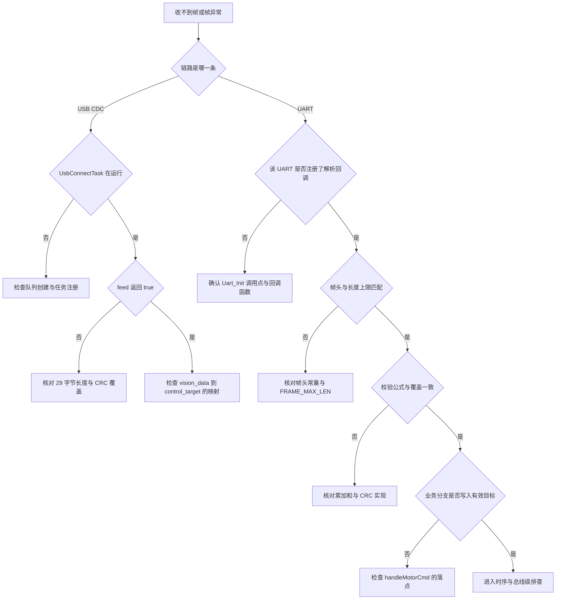
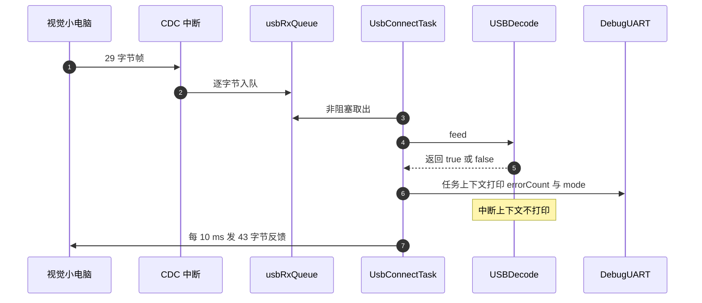

# 协议解帧的易错点与调试

云台板固件（`/home/wyx/rm/2026SentriOmeniGimbal/2026OmniSentryGimbal`）与底盘板固件（`/home/wyx/rm/2026SentriOmeniChassis/2026OmniSentryChassis`）上的解帧故障集中在三类：收不到帧、收到错帧、收到帧但业务不生效。三类的排查顺序不同，前两类要先看链路，第三类要一路查到应用层的落点。

三类故障按层次列开，每条链路给出对应的观测手段，末尾汇总本单元核实出的十项缺陷。排查动作都以源码位置为坐标，不依赖运行期猜测。

## 1. 两套帧格式的对照

解帧故障有一半来自把两套帧格式记混。云台板上有两套容易混的帧：`UartProtocol` 的 0xFE 0xEF 帧，与视觉 SP 帧。两者字段、校验、链路、启用状态都不同：

| 项目 | UartProtocol | 视觉 SP |
| --- | --- | --- |
| 帧头 | 0xFE 0xEF | 0x53 0x50，即 S 与 P |
| 长度 | 变长，帧长 `5 + len` | 定长 29 或 43 |
| 长度域 | 1 字节，载荷长度 | 无 |
| 校验 | 8 位累加和，类型加载荷 | CRC16，初值 0xFFFF |
| 校验覆盖 | 类型与全部载荷 | 除最后两字节外的全部 |
| 物理链路 | 预留 USART6，115200 8N1 | USB CDC |
| 状态数 | 6 | 3 |
| 云台板是否启用 | 未接线 | 启用 |
| 源码 | `Communication/Src/usart_protocol.cpp` | `Communication/Src/usb_decode.cpp` |

排查前先确认故障发生在哪条链路上。`UartProtocol` 在当前固件里没有数据源，若在它上面等帧，等不到是预期结果。

## 2. 收不到帧的三层原因

收不到帧指状态机停在等待帧头状态，回调始终不触发。原因分三层：

1. 物理层：波特率、校验位、接线、DMA 通道配置不匹配；
2. 回调注册：接收段没有被交给解析器；
3. 帧头不匹配：发送方帧头与解析器常量不一致。

第三层在本工程里有一个具体的分支：`UartProtocol` 的两个帧头常量是 0xFE 与 0xEF，视觉 SP 是 0x53 与 0x50。若把 SP 帧喂给 `UartProtocol`，解析器会一直停在 `WAIT_HEAD1`。

第二层的检查动作很直接：搜索 `Uart_Init` 的调用点，确认回调函数是谁。云台板只有 `Core/Src/main.c:125` 一处，传的是 `MyUartCallbackFun`，而它内部只调 `DBUS_Decode`。这一条查完就能排除“以为接了但没接”的情况。

## 3. 收到错帧的四个检查点

收到错帧指回调触发了，但字段值不合理。排查点：

- 校验覆盖范围与两端是否一致；
- 长度域与载荷长度是否对应；
- 多字节字段的字节序；
- 结构体是否 packed，字段间是否被编译器插入填充。

本工程的两个结构体都加了 packed，并用 `static_assert` 锁长度，填充问题在编译期暴露。SP 帧的字节序是本机小端，发送侧直接写 `float`，接收侧用 `memcpy` 与 `reinterpret_cast` 还原，两侧都依赖本机小端。字节序与覆盖范围这两项都是“两端约好才有意义”的约定，单看一端无法判断对错。

## 4. 帧解出来了业务不动：handleMotorCmd 断在哪

回调触发后业务没有变化，原因在应用层。`UartDecode::handleMotorCmd` 是典型：它解析出速度写进局部变量 `speed`，该变量随后被丢弃（`Communication/Src/usart_decode.cpp:35-46`）；模块级变量 `motor_cmd_triggered` 只写不读（`:16、:37`）；头文件声明的 `g_control_cmd` 在全工程没有定义（`usart_decode.h:20`）。解析成功与业务生效之间没有连起来。

这类故障的表现是“日志里能看到帧，机器不动”。区分它与校验失败的办法是看回调是否进入：回调进入说明帧已经通过校验，问题在回调内部；回调没进入才回到前两节的链路与校验。

## 5. 排查顺序的分叉

分叉的顺序是按“排除代价从小到大”排的：先确认链路上有没有数据，再看注册，再看帧头，最后看校验与业务。反过来查会把大量时间花在 CRC 与字节序上，而问题可能只是回调没注册。

## 6. 观测手段：DebugUART、DMA 段长、errorCount

### 6.1 DebugUART

云台板把 USART1 配成 `DebugUART`，115200 8N1，在 `Task/Src/ImuTask.cpp:34` 初始化。它没有开 NVIC，适合单向输出调试文本。在解析回调或任务里打印帧头、长度、校验与失败原因，可以看到帧的到达情况。

在中断上下文里打印需要注意两点：`printf` 本身可能阻塞，且 DMA 发送可能与空闲中断嵌套。可取的顺序是只在任务上下文打印，中断里只置标志或计数。计数器用 `volatile` 修饰，读的时候先关中断或做一次快照，避免读到半个更新。

### 6.2 逐段观测 DMA 交付

接收链路一次交付的是两帧之间的整段数据。`UsartDma::uartRxIdleCallback` 在空闲中断里算出段长并切换缓冲区，随后调用注册的回调（`Communication/Src/usart_dma.cpp:81-116`）。`callback_busy_` 只保护空闲回调的重入（`:61-63`），解析本身仍在中断上下文里同步执行。

观测段长可以判断两件事：段长是否稳定（发送节奏是否规律）、段长是否等于整帧长度（是否发生了粘包或拆包）。`UartProtocol::feedDMABuffer` 按字节处理，粘包不会导致丢帧，但一段内混入两帧时回调会触发两次。

### 6.3 USB 侧观测

接收侧可观测的量有三个：

- `usb_decoder.errorCount()`：连续失败计数，成功后归零（`Communication/Src/usb_decode.cpp:91、:115-118`）；
- `usbRxQueue` 的长度：队列满表示字节被丢，帧会被破坏；
- `vision_data.mode` 与角度字段：判断解析结果是否进入应用层。

`USBDecode::feed` 在模式字段超过 2 时也计入错误并返回 false（`usb_decode.cpp:88-97`），因此 `errorCount` 的上升既可能是 CRC 失败，也可能是模式非法。区分两者需要临时打印分支。

## 7. 本单元核出的十项缺陷

| 缺陷 | 位置 | 性质 |
| --- | --- | --- |
| UartProtocol 链路全工程无调用点 | `main.c:125` 只注册 DBUS | 未接线代码 |
| `MyUartCallback` 无调用点 | `usart_decode.cpp:48-52` | 死代码 |
| `handleMotorCmd` 的 `speed` 未使用 | `usart_decode.cpp:44` | 编译告警级缺陷 |
| `g_control_cmd` 只有声明无定义 | `usart_decode.h:20` | 引用会链接失败 |
| `calcChecksum` 只对入参求和，与帧校验差一个类型字节 | `usart_protocol.cpp:61-66` | 约定不一致 |
| 未调用辅助函数按大端读 CRC | `usb_decode.cpp:31` | 与生效路径相反 |
| `USB_Data_Received` 是空桩 | `UsbConnectTask.cpp:165-174` | 未接线代码 |
| `Uart_Transmit_DMA` 无调用点 | `usart_dma.cpp:192-201` | 发送路径未使用 |
| `ControlMode` 与 `GimbalMode` 枚举未被引用 | `usb_protocol.h:24-36` | 文档级定义 |
| 两套 SP 结构体定义并存 | `UsbConnectTask.h:41-79` 与 `usb_protocol.h:39-70` | 需同步维护 |

## 8. 易错点清单

| 易错点 | 现象 | 排查动作 |
| --- | --- | --- |
| 在无数据源的链路上等帧 | 回调永不触发 | 先查 `Uart_Init` 调用点 |
| 把 SP 帧喂给 0xFE 0xEF 解析器 | 停在等待帧头 | 核对帧头常量 |
| 用 CRC8 校验 SP 帧 | 全部失败 | SP 用 CRC16 查表，初值 0xFFFF |
| 用累加和校验 SP 帧 | 部分帧偶然通过，多数失败 | 两套校验不能互换 |
| 认为 `errorCount` 是累计值 | 故障数被低估 | 成功一帧后自动归零 |
| 队列溢出 | CRC 间歇失败，重发后恢复 | 检查队列长度与取出频率 |
| 只改发送端覆盖范围 | 接收端校验失败 | 收发两侧都取长度减 2 |
| 在中断里调用阻塞式打印 | 中断延迟变大，可能丢字节 | 中断只计数，任务里打印 |

## 9. 小结

### 核心概念

- 解帧故障分收不到、收到错、业务不生效三类，排查顺序从链路与注册开始。
- 两套帧格式的帧头、长度、校验、链路都不同，不能互相套用。
- 校验公式与覆盖范围必须两端一致，累加和与 CRC 不能互换。
- `UartProtocol` 链路在云台板与底盘板都无调用点，等待它出帧属于预期外。
- 观测手段有 DebugUART、DMA 段长、`errorCount` 与队列长度，中断里只做轻量记录。

### 设计权衡

| 决策 | 选择 | 收益 | 代价 |
| --- | --- | --- | --- |
| 调试输出位置 | 任务上下文打印 | 不阻塞中断 | 故障瞬间的信息要先用标志缓存 |
| 错误统计 | 单次连续失败计数 | 反映当前链路质量 | 无累计值，长时间故障率不可见 |
| 段长观测 | 空闲中断算 NDTR 差 | 无需改动发送端 | 粘包与拆包要结合帧头判断 |
| 未接线代码保留 | 保留实现，不注册 | 后续接线成本低 | 阅读时容易误认为在运行 |
| 两套结构体并存 | 各自 packed 加断言 | 兼容旧调用点 | 字段改动要同步两处 |

## 10. 练习

### 基础题

1. 列出 UartProtocol 与视觉 SP 在帧头、长度、校验、链路、启用状态上的全部差异。
2. `USBDecode::feed` 返回 false 的可能原因有哪几种？如何在不断点的情况下区分。
3. `errorCount` 在成功解析一帧后会发生什么？这给故障率统计带来什么限制？
4. `UartProtocol` 在云台板上的数据源来自哪个函数？该函数当前是否被调用？

### 挑战题

5. 设计一个最小复现实验，证明 SP 帧的 CRC 字节序是小端。写出实验步骤与判据。
6. 为解帧链路增加端到端诊断：统计每类失败次数、最近一次失败的状态与偏移，说明计数器应放在哪一层、如何在中断与任务之间传递。
7. 假设视觉侧突发发送 5 帧 29 字节的数据（43 字节是云台到视觉方向的帧长），队列 128 字节且任务每 10 ms 取出一次，推导最坏情况下被丢弃的字节数并给出两种缓解方案。

---

### 附：本页引用的固件路径

| 路径 | 用途 |
| --- | --- |
| `2026OmniSentryGimbal/Communication/Src/usart_protocol.cpp` | 帧头与校验实现（:14-88） |
| `2026OmniSentryGimbal/Communication/Inc/usart_protocol.h` | 帧头与上限常量（:17-19） |
| `2026OmniSentryGimbal/Communication/Src/usart_decode.cpp` | 未用变量与死代码（:16、:37、:44、:48-52） |
| `2026OmniSentryGimbal/Communication/Inc/usart_decode.h` | `g_control_cmd` 声明（:20） |
| `2026OmniSentryGimbal/Communication/Src/usb_decode.cpp` | 校验与错误计数（:45-118） |
| `2026OmniSentryGimbal/Communication/Inc/usb_protocol.h` | SP 常量与模式枚举（:18-36、:39-77） |
| `2026OmniSentryGimbal/Task/Src/UsbConnectTask.cpp` | 收发主循环与空桩（:71-174） |
| `2026OmniSentryGimbal/Task/Inc/UsbConnectTask.h` | 并行 SP 结构体（:41-79） |
| `2026OmniSentryGimbal/Core/Src/main.c` | 唯一 `Uart_Init` 调用点（:125） |
| `2026OmniSentryGimbal/Communication/Src/usart_dma.cpp` | 空闲回调与发送接口（:81-116、:192-201） |
| `2026OmniSentryGimbal/Task/Src/ImuTask.cpp` | DebugUART 初始化（:34） |
