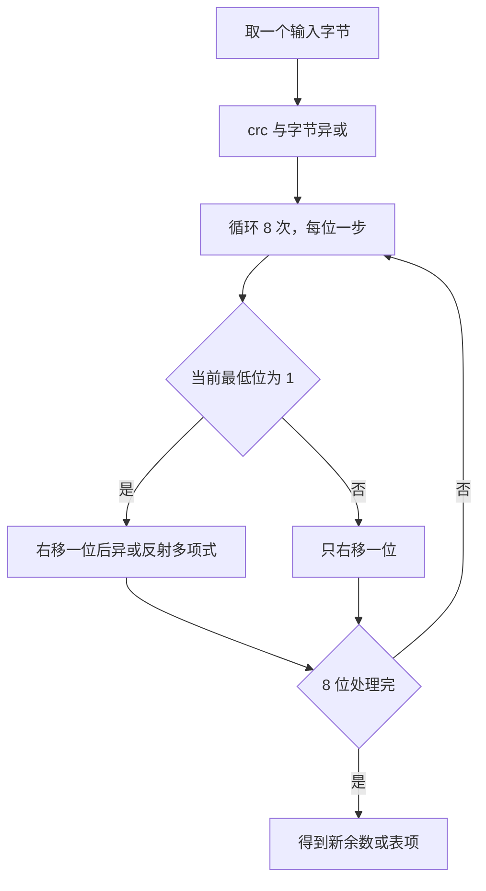
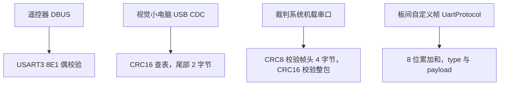

# 校验和与CRC原理

云台板固件（`/home/wyx/rm/2026SentriOmeniGimbal/2026OmniSentryGimbal`）与底盘板固件（`/home/wyx/rm/2026SentriOmeniChassis/2026OmniSentryChassis`）的串口链路上同时跑着三种校验：USART3 的硬件偶校验、`UartProtocol` 的 8 位累加和、CRC8 与 CRC16 查表。三种东西都能让接收方丢弃一帧，但覆盖的错误形态完全不同。

串口链路会出哪些错、每类校验码能覆盖哪一部分、CRC 的多项式与五个参数从哪来、查表法为什么等价于逐位计算，是理解校验方法要回答的四件事。查表实现见 `02-CRC8查表实现` 与 `03-CRC16查表实现`，整帧校验顺序见 `04-裁判系统帧校验流程`。正文引用的源码路径都是固件仓库相对路径。

## 1. 链路会出哪几类错，校验码能管哪几类

串口是异步点对点链路，收发双方各自用自己的时钟采样。噪声、时钟偏差、线束干扰都会让收到的比特流与发出的不一致。按错误形态分四类：

| 错误形态 | 表现 | 典型来源 |
| --- | --- | --- |
| 位翻转 | 某一位 0 变 1 或 1 变 0 | 电磁干扰、采样点偏移 |
| 突发错误 | 连续一串位出错 | 电源切换、电机换向 |
| 字节丢失或插入 | 帧整体错位 | 波特率偏差、DMA 缓冲切换 |
| 字节顺序颠倒 | 内容对但位置错 | 解析代码的错误 |

校验码只能覆盖前两类的一部分。帧同步、长度检查与协议状态机负责后两类。把两者混为一谈，会出现反复核 CRC 却查不出问题的情形。

## 2. 奇偶校验：每字节一位的廉价保险

奇偶校验在每个字节后加 1 位，使 1 的个数保持奇数或偶数。接收方重算这一位，不符就置 USART 的 PE 标志。STM32 的 `UART_InitTypeDef.Parity` 就是这一位。本项目 USART3 用偶校验（`Core/Src/usart.c` 的 `UART_PARITY_EVEN`），与 DBUS 遥控器一致；USART1 与 USART6 都是 `UART_PARITY_NONE`（`usart.c`、`usart.c`）。

| 能力 | 结论 |
| --- | --- |
| 检出奇数个位翻转 | 能 |
| 检出偶数个位翻转 | 不能 |
| 定位出错字节 | 不能 |
| 开销 | 每字节 1 位，8E1 每 10 位传 8 位数据 |

偶校验对两个同时翻转的位完全无效，它只算链路层的廉价保险，不能替代整帧校验。8E1 的格式还意味着每 10 位里只有 8 位是数据，带宽利用率比 8N1 低两成。

## 3. 累加和的盲区：交换与抵消

累加和把参与校验的字节按无符号整数相加，取低位作为校验值。本工程有两处。

一是 `UartProtocol` 的 8 位和（`Communication/Src/usart_protocol.cpp`）：

```cpp
uint8_t sum = frame_type_;
for (uint8_t i = 0; i < data_len_; ++i) sum += recv_buf_[i];
sum &= 0xFF;
if (sum == byte && cb_) cb_(frame_type_, recv_buf_, data_len_);
```

发送侧用同一算式（`usart_protocol.cpp`）。覆盖范围是 `type` 与 `payload`，不含帧头与长度字节。另有静态函数 `calcChecksum`（`usart_protocol.cpp`），本页未查到调用点。

二是底盘板 USB 链路的 16 位和（`Task/Src/UsbConnectTask.cpp`），它按 `unsigned short` 累加后返回。该函数同样没有调用点，属未接线实现。

累加和的盲区可以用一组具体字节说明。参与校验的字节若是 `0x10 0x20`，和是 `0x30`；改成 `0x20 0x10`，和仍是 `0x30`。同理 `0x10 0x21` 与 `0x11 0x20` 的和也相同。任何一对 +k 与 -k 的改动都会互相抵消，进位溢出又会让高位错误丢失。

| 能力 | 结论 |
| --- | --- |
| 检出单个字节错误 | 能，条件是改动量不被其他字节抵消 |
| 检出字节顺序颠倒 | 不能 |
| 检出错位对消 | 不能 |
| 开销 | 1 或 2 字节，实现只需一个循环 |

## 4. 把报文当成 GF(2) 多项式

CRC 把整段报文看成一个 GF(2) 上的多项式，用生成多项式做带余除法，取余数作为校验值。设报文多项式为 $M(x)$，生成多项式 $G(x)$ 的次数为 $r$：

$$M(x)\,x^{r} = Q(x)\,G(x) + R(x), \qquad \deg R < r$$

发送的是 $M(x)x^r + R(x)$，它在模 $G(x)$ 下与 $M(x)x^r$ 同余。接收方对收到的整段再除一次 $G(x)$，余数为零就通过。左移 $r$ 位是给余数腾出位置，这也是 CRC 校验值长度等于多项式次数减一的原因。

检错能力由 $G(x)$ 的因式决定。以下四条是标准结论，属推导而非实测：

| 错误形态 | 检出条件 |
| --- | --- |
| 全部单比特错误 | $G(x)$ 至少有两项 |
| 全部双比特错误 | $G(x)$ 不被 $x$ 整除，且不整除 $x^k+1$，$k$ 小于等于帧长 |
| 全部奇数位错误 | $x+1$ 整除 $G(x)$ |
| 长度不超过 $r$ 的突发错误 | 全部检出 |

本工程两个多项式在 $x=1$ 处都取 0，即都含 $x+1$ 因式，奇数位错误可检出。CRC8 的 $r=8$，CRC16 的 $r=16$，能覆盖的突发长度分别是 8 位与 16 位。

## 5. 五个参数与反射的来历

实际实现里还有四个可配置量，与 $G(x)$ 一起决定最终校验值：

| 参数 | 作用 | 本工程 CRC8 | 本工程 CRC16 |
| --- | --- | --- | --- |
| 多项式 | 除数，决定检错能力 | 0x31，按表反推，见 02 篇 | 0x1021，按表反推，见 03 篇 |
| 初值 init | 循环开始前装入的余数 | 调用方传 0xFF | 调用方传 0xFFFF |
| 输入反射 refin | 每个输入字节先按位翻转 | 是 | 是 |
| 输出反射 refout | 输出余数按位翻转 | 是 | 是 |
| 异或输出 xorout | 输出后再异或一个常数 | 0x00 | 0x00 |

反射是 LSB-first 实现的语言。当 refin 与 refout 都为真时，位处理顺序整体反过来，等价于把多项式也按位翻转：0x31 的 8 位翻转是 0x8C，0x1021 的 16 位翻转是 0x8408。查表法把这一步固化进表里。同一份报文在 MSB-first 与 LSB-first 下算出的余数不同，这是两个实现对接时最常见的第一个分歧点。

## 6. 查表法把八次移位压成一次索引

逐位实现每处理一位都要判断最低位并做一次异或。把 8 次移位的结果预先算成 256 项的表，运行时每字节只做一次查表与一次异或。

表项的生成规则（LSB-first，以 CRC8 为例）：

```c
uint8_t table[256];
for (int i = 0; i < 256; ++i) {
    uint8_t crc = (uint8_t)i;
    for (int j = 0; j < 8; ++j) {
        crc = (crc & 1) ? (uint8_t)((crc >> 1) ^ 0x8C) : (uint8_t)(crc >> 1);
    }
    table[i] = crc;
}
```

运行时只需 `crc = table[crc ^ byte]`。CRC16 的表项是 16 位，运行时多一次右移拼接：`index = (crc ^ byte) & 0xFF; crc = (crc >> 8) ^ table[index]`。



表是纯函数：给定反射多项式，256 项唯一确定。判断一段固件用的是哪个多项式，比对表比读注释可靠。反过来，表也是唯一无法撒谎的证据，注释与文档都可能沿用别处的说法。

## 7. 四条链路的校验选择

本工程四条链路各自选了不同的校验：



| 实现 | 位置 | 校验量 | 初值 | 调用点 |
| --- | --- | --- | --- | --- |
| `crc8_calc` | `Algorithm/Src/CRC8.cpp` | CRC8，256 项表 | 由调用方给 | `Communication/Src/referee_protocol.cpp`；底盘 `Task/Src/UsbConnectTask.cpp` |
| `crc16_calc` | `Algorithm/Src/CRC16.cpp` | CRC16，256 项表 | 由调用方给 | `referee_protocol.cpp`、`Communication/Src/usb_protocol.cpp`、`usb_decode.cpp`；底盘 `UsbConnectTask.cpp` |
| 累加和 | `Communication/Src/usart_protocol.cpp` | 8 位和 | 无 | 本页未查到调用点 |
| 硬件 CRC | `Core/Src/crc.c` | 仅初始化 | 无 | 全工程没有 `HAL_CRC_Calculate` 调用 |

## 8. 硬件 CRC 外设闲置的原因

`MX_CRC_Init` 在云台板 `Core/Src/main.c` 与底盘板 `Core/Src/main.c` 都被调用，`HAL_CRC_Init` 只登记 instance 并打开时钟（`Drivers/STM32F4xx_HAL_Driver/Src/stm32f4xx_hal_crc.c`）。这块外设在 F407 上只有 `DR`、`IDR`、`CR` 三个寄存器（`Drivers/CMSIS/Device/ST/STM32F4xx/Include/stm32f407xx.h`），`CR` 只有一位复位（同文件 ），没有多项式、初值与反射的配置位。按手册，F407 的 CRC 多项式固定为 0x04C11DB7、初值 0xFFFFFFFF、无输入输出反射，因此它只能算固定的 32 位 CRC，不能直接产出本工程用的 CRC8 与 CRC16。

本工程未使用该外设。若要使用，写法是：

```c
uint32_t words[8];
memcpy(words, buf, sizeof(words));
__HAL_CRC_DR_RESET(&hcrc);                 /* 复位后 DR 为 0xFFFFFFFF */
uint32_t crc = HAL_CRC_Calculate(&hcrc, words, 8);
```

需要注意三点：入参是 `uint32_t*` 与字个数，字节流要先按小端补齐成 32 位字；F407 的初值与多项式由硬件固定，无法配成 0xFF 与 0xFFFF；即使读回低 8 位或低 16 位，得到的也不是本工程的 CRC8 与 CRC16，因为多项式与反射都不同。

## 9. 易错点

| 易错点 | 现象 | 对应位置 |
| --- | --- | --- |
| 用偶校验替代整帧校验 | 双比特翻转静默通过 | `usart.c` 只保护单字节 |
| 把累加和当 CRC | 两套校验的盲区不同，混用时误判 | `usart_protocol.cpp` 与 `CRC8.cpp` 是两套 |
| 认为累加和能查字节顺序 | 交换两个字节后和不变 | 第 3 节的抵消例子 |
| 只看注释不看表 | 按 0x8005 生成表却对不上固件 | 见 03 篇的注释冲突 |
| 认为硬件 CRC 能省软件开销 | 需要 32 位字对齐，且多项式不可配 | `crc.c` |

## 10. 小结

### 核心概念

- 奇偶校验每字节 1 位，只查奇数个位翻转。
- 累加和对字节顺序与成对抵消完全无感。
- CRC 是 GF(2) 上的多项式除法取余，检错能力由生成多项式的因式决定。
- 多项式、初值、输入反射、输出反射、异或输出共同决定结果，缺一不可。
- 查表法把 8 次移位预计算成 256 项，表由多项式唯一确定。
- 本工程 CRC8 与 CRC16 都用反射式查表，初值由调用方传入，分别为 0xFF 与 0xFFFF。

### 设计权衡

| 决策 | 选择 | 收益 | 代价 |
| --- | --- | --- | --- |
| 遥控链路 | 仅偶校验 | 零额外字节，与遥控器硬件一致 | 双比特错误无法发现 |
| 视觉链路 | CRC16 整帧 | 检错能力强 | 每帧 2 字节开销，软件计算 |
| 裁判帧 | CRC8 帧头加 CRC16 整包 | 帧头错误可早停，整包再兜底 | 两次计算、两个初值 |
| 板间帧 | 8 位累加和 | 实现最短 | 盲区大，未接线 |
| 硬件 CRC | 初始化后不用 | 不占软件时间 | 外设闲置，且不能替代两个软件 CRC |

## 11. 练习

### 基础题

1. 列出四个字节 `0x01 0x02 0x04 0x08` 的 8 位累加和，再交换前两个字节重算，说明累加和为什么分不出这两种排列。
2. 偶校验下，一个字节发生三位翻转能否检出；发生两位翻转能否检出。
3. 写出 CRC 五个参数中，哪几个会改变输出值，哪几个在 LSB-first 表法里被固化进表。
4. 判断 $G(x)=x^8+x^5+x^4+1$ 是否含 $x+1$ 因式，并说明它能否检出全部奇数位错误。

### 挑战题

5. 用第 6 节的循环生成 CRC8 表的第 0、1、2 项，与 `Algorithm/Src/CRC8.cpp` 逐项对照。
6. 若要给 `UartProtocol` 的板间帧换成 CRC16，需要改动哪些函数，覆盖范围应取 `type` 到 `payload` 还是包含帧头与长度字节，说明理由。
7. F407 的硬件 CRC 多项式固定为 0x04C11DB7。若把本工程一帧数据交给它计算，说明为什么读回的低 16 位与 `crc16_calc` 的结果不同，并列出至少两个原因。

---

### 附：本页引用的固件路径

| 路径 | 用途 |
| --- | --- |
| `2026OmniSentryGimbal/Algorithm/Src/CRC8.cpp` | CRC8 表与 `crc8_calc` |
| `2026OmniSentryGimbal/Algorithm/Src/CRC16.cpp` | CRC16 表与 `crc16_calc` |
| `2026OmniSentryGimbal/Communication/Src/usart_protocol.cpp` | 8 位累加和、发送侧校验 |
| `2026OmniSentryGimbal/Communication/Src/referee_protocol.cpp` | 帧头 CRC8与整包 CRC16 |
| `2026OmniSentryGimbal/Communication/Src/usb_protocol.cpp` | 视觉发送帧 CRC16 |
| `2026OmniSentryGimbal/Communication/Src/usb_decode.cpp` | 视觉接收帧 CRC16 |
| `2026OmniSentryGimbal/Core/Src/crc.c` | 硬件 CRC 初始化 |
| `2026OmniSentryGimbal/Core/Src/main.c` | `MX_CRC_Init` 调用 |
| `2026OmniSentryChassis/2026OmniSentryChassis/Core/Src/main.c` | 硬件 CRC 初始化、huart6 注册 |
| `2026OmniSentryChassis/2026OmniSentryChassis/Task/Src/UsbConnectTask.cpp` | 16 位累加和、CRC8、CRC16 |
| `2026OmniSentryGimbal/Drivers/STM32F4xx_HAL_Driver/Src/stm32f4xx_hal_crc.c` | `HAL_CRC_Init`、`HAL_CRC_Calculate` |
| `2026OmniSentryGimbal/Drivers/CMSIS/Device/ST/STM32F4xx/Include/stm32f407xx.h` | CRC 寄存器块与 `CRC_CR_RESET` |
| `2026OmniSentryGimbal/Core/Src/usart.c` | USART3 偶校验、USART1 与 USART6 无校验 |
