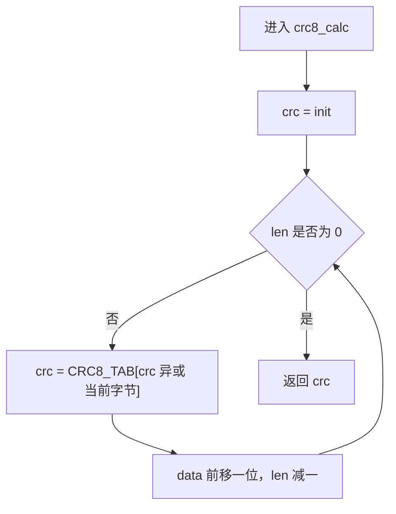
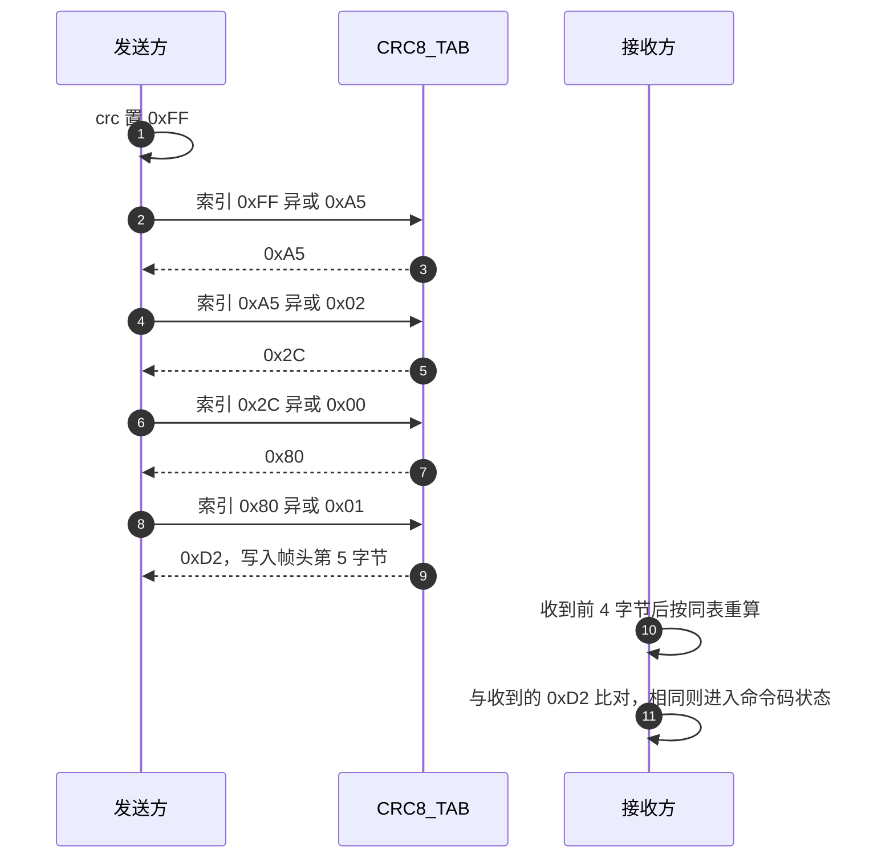

# CRC8查表实现

云台板与底盘板共用同一份 `Algorithm/Src/CRC8.cpp`。表有 256 项，每项一个字节；函数 `crc8_calc` 的循环体只有一行，初值由调用方传入。裁判系统帧头用它校验前四个字节，底盘 USB 帧头用它校验前三个字节。

从逐位写法能推出表项的等价形式，再用表反推反射多项式与标准形式；帧头四字节可以手算一遍，核对脚本可复现这个过程。两处调用点附在末尾，表在各类帧里的覆盖范围与校验顺序见 `04-裁判系统帧校验流程`。

## 1. 一个字节输出的表与函数

CRC8 的输出是一个字节，表有 256 项，每项也是 1 字节。本工程的表位于 `Algorithm/Src/CRC8.cpp:7-24`，函数是 `crc8_calc`（`CRC8.cpp:26-33`），声明在 `Algorithm/Inc/CRC8.h:15`：

```cpp
uint8_t crc8_calc(const uint8_t *data, uint16_t len, uint8_t init);
```

三个入参分别是数据指针、字节长度、初始值。函数不带异或输出，也没有内部固定初值，初值完全由调用方决定。裁判系统帧头传入 `0xFF`（`Communication/Src/referee_protocol.cpp:68`），底盘 USB 帧头也传 `0xFF`（`Task/Src/UsbConnectTask.cpp:41`、`:244`）。函数不检查 `data` 是否为空，长度为零时也不读取指针，所以空指针加零长度是安全的；长度非零时空指针会直接解引用。

## 2. 逐位写法与表项的等价关系

CRC8 的 LSB-first（反射）逐位写法是：

```c
uint8_t crc = init;
crc ^= byte;
for (int j = 0; j < 8; ++j) {
    crc = (crc & 1) ? (uint8_t)((crc >> 1) ^ P) : (uint8_t)(crc >> 1);
}
```

其中 P 是反射多项式。把一个字节的 8 步结果预先算出来，就得到表。表项的定义是：

$$T[i] = \text{以 } i \text{ 为初值、异或一个值为 } 0 \text{ 的字节后，再迭代 8 步的结果}$$

运行时先做异或再查表，与逐位写法完全等价：

```cpp
uint8_t crc = init;
while (len--) {
    crc = CRC8_TAB[crc ^ *data++];
}
return crc;
```

理由是 LSB-first 的每一步只用到当前余数的最低位，而一个字节的 8 步结果只取决于这 8 步的入口值 `crc ^ byte`。把入口值的 256 种可能全部预计算，运行时就不需要再判断最低位。

## 3. 从表反推 0x8C 与 CRC-8/MAXIM-DOW

表一旦确定，反射多项式也唯一确定。做法是把 256 个候选反射多项式各生成一张 LSB-first 表，与固件表逐项比对。以下结论属推导，可用第 7 节的脚本复核：

| 候选反射多项式 | 生成表的前四项 | 与固件表比对 |
| --- | --- | --- |
| 0x8C | 0x00、0x5E、0xBC、0xE2 | 完全一致 |
| 0xE0 | 0x00、0x91、0xE3、0x72 | 第 2 项起不符 |

固件表前四项是 0x00、0x5E、0xBC、0xE2（`CRC8.cpp:8`），因此反射多项式是 0x8C。0x8C 的 8 位翻转是 0x31，对应的标准形式是

$$G(x) = x^{8} + x^{5} + x^{4} + 1$$

这套参数即 CRC-8/MAXIM-DOW：多项式 0x31、反射输入与输出、初值可变、异或输出 0x00。用标准 check 值可以再确认一次：初值 0x00 时 `crc8("123456789") = 0xA1`，与 MAXIM 的公开 check 值一致；初值 0xFF 时结果是 0x0B。这两条属推导，未在硬件上实测。

需要显式标出的一处冲突：常见资料把裁判系统 CRC8 记为多项式 0x07、反射形式 0xE0。按上表，0xE0 生成的表与固件不符，因此该说法与本工程的表不一致。固件、底盘固件与上位机脚本使用的是同一张 0x8C 表，内部一致；与外部实现对接时以表为准，此点待现场确认。

## 4. crc8_calc 的四行代码

```cpp
uint8_t crc8_calc(const uint8_t *data, uint16_t len, uint8_t init)
{
    uint8_t crc = init;
    while (len--) {
        crc = CRC8_TAB[crc ^ *data++];
    }
    return crc;
}
```

| 行 | 语句 | 作用 |
| --- | --- | --- |
| `CRC8.cpp:28` | `uint8_t crc = init;` | 把调用方给的初值装入余数寄存器 |
| `CRC8.cpp:29` | `while (len--)` | 按字节迭代，先判断再自减，长度为 0 时直接返回初值 |
| `CRC8.cpp:30` | `crc = CRC8_TAB[crc ^ *data++]` | 旧余数与当前字节异或作为索引，取表项作为新余数；指针同时前移 |
| `CRC8.cpp:32` | `return crc;` | 输出余数，不再异或 |

三个细节决定了行为边界：长度为 0 时返回 `init`，所以空数据的校验值就是初值；`len` 是 `uint16_t`，单帧长度不会超过 65535；输出不做反射与异或，因为反射已经体现在表里。



## 5. 帧头四字节的手算过程

以裁判帧头四个字节 `0xA5 0x02 0x00 0x01`、初值 0xFF 为例，逐字节的余数变化如下。数值由表推出，属手算示例：

| 步 | 当前字节 | 异或后的索引 | 新余数 |
| --- | --- | --- | --- |
| 0 | 初始 | 无 | 0xFF |
| 1 | 0xA5 | 0x5A | 0xA5 |
| 2 | 0x02 | 0xA7 | 0x2C |
| 3 | 0x00 | 0x2C | 0x80 |
| 4 | 0x01 | 0x81 | 0xD2 |

四步后的 0xD2 就是帧头校验字段的取值（见 04 篇的完整帧）。接收方对同一段字节重算，得到相同的 0xD2 才继续。



## 6. 两块板上的调用点

| 项目 | 内容 | 位置 |
| --- | --- | --- |
| 表 | `static const uint8_t CRC8_TAB[256]` | `Algorithm/Src/CRC8.cpp:7-24` |
| 函数 | `crc8_calc(data, len, init)` | `Algorithm/Src/CRC8.cpp:26-33` |
| 声明 | 带 `extern "C"`，可被 C 与 C++ 调用 | `Algorithm/Inc/CRC8.h:11-19` |
| 裁判帧头调用 | `crc8_calc(buffer_, 4, 0xFF)` | `Communication/Src/referee_protocol.cpp:68` |
| 底盘 USB 帧头调用 | `crc8_calc(header, 3, 0xFF)` | 底盘 `Task/Src/UsbConnectTask.cpp:244` |
| 底盘封装函数 | `calculate_crc8` 转调 `crc8_calc` | 底盘 `Task/Src/UsbConnectTask.cpp:38-42` |

云台板与底盘板的 `CRC8.cpp` 表逐项相同，两块板的帧头校验结果一致。底盘 `UsbConnectTask.cpp:244` 只对 `usb_protocol_header_t` 的前 3 个字节算 CRC8，与该协议的帧头长度一致，说明调用方负责确定覆盖范围，函数本身不检查范围是否合理。表的 `static` 是文件级链接属性，两个编译单元各自持有一份副本，不会互相引用。

## 7. 用脚本复核表与多项式

下面的脚本可以直接复核第 3 节的反推。表从固件文件里抄入，`crc8` 与 `CRC8.cpp:26-33` 同构。

```python
# 表取自 Algorithm/Src/CRC8.cpp:7-24，这里省略中间项
T8 = [0x00, 0x5E, 0xBC, 0xE2]

def gen_lsb8(poly):
    t = []
    for i in range(256):
        c = i
        for _ in range(8):
            c = ((c >> 1) ^ poly) if (c & 1) else (c >> 1)
        t.append(c & 0xFF)
    return t

print([hex(x) for x in gen_lsb8(0x8C)[:4]])   # 0x00 0x5e 0xbc 0xe2
print([hex(x) for x in gen_lsb8(0xE0)[:4]])   # 0x00 0x91 0xe3 0x72
```

## 8. 易错点

| 易错点 | 现象 | 说明 |
| --- | --- | --- |
| 把初值写进函数 | 调用方给 0xFF 时才与固件一致 | `CRC8.cpp:28` 用入参 `init` |
| 认为空数据返回 0 | 空数据返回初值 | `while` 循环零次 |
| 用多项式 0x07 生成表 | 第 2 项起与固件不符 | 反射多项式是 0x8C |
| 覆盖范围多算一个字节 | 把第 5 字节也算进 CRC8 | 裁判帧头只覆盖前 4 字节 |
| 误以为函数内含反射配置 | 没有配置项，反射固化在表里 | 表即参数 |
| 把 CRC8 与 8 位累加和混用 | 两套校验值不同 | 累加和在 `usart_protocol.cpp:47-57` |

## 9. 小结

### 核心概念

- CRC8 表是 256 项 1 字节的纯函数，由反射多项式唯一确定。
- `crc8_calc` 的循环体只有一行：`crc = CRC8_TAB[crc ^ *data++]`。
- 按表反推，反射多项式是 0x8C，标准形式 0x31，即 CRC-8/MAXIM-DOW。
- 初值由调用方传入，本工程帧头固定用 0xFF。
- 长度为 0 时函数返回初值。
- 覆盖范围由调用方决定，函数不做边界检查。

### 设计权衡

| 决策 | 选择 | 收益 | 代价 |
| --- | --- | --- | --- |
| 表与函数分离 | 表是文件级静态数组 | 无法在运行时换多项式 | 只有一套参数 |
| 初值入参化 | `init` 由调用方给 | 同一份代码可服务不同协议 | 调用方写错初值不会报错 |
| 反射固化进表 | 不在函数里做位翻转 | 每字节只有一次查表 | 表不可读，需反推才能确认参数 |
| 长度用 `uint16_t` | 单帧上限 65535 | 与串口帧长匹配 | 与 CRC16 的 `uint32_t` 不一致 |

## 10. 练习

### 基础题

1. 写出 `crc8_calc(data, 0, 0xFF)` 的返回值，并说明理由。
2. 查 `CRC8.cpp:8` 写出 `CRC8_TAB[1]`、`CRC8_TAB[2]`、`CRC8_TAB[3]` 的值，与第 3 节表格核对。
3. 说明 `crc8_calc` 为什么要先异或再查表，如果只查表不异或会有什么后果。
4. 裁判帧头 `0xA5 0x02 0x00 0x01` 的 CRC8 是 0xD2。接收方收到 `0xA5 0x02 0x00 0x02` 时，CRC8 会变成多少，是否还会通过校验。

### 挑战题

5. 用第 7 节的脚本生成 0x8C 的完整 256 项表，与 `CRC8.cpp:7-24` 逐项比对，写出第一处不一致时的索引；预期没有不一致。
6. 把 `crc8_calc` 改写成逐位版本，要求输出与表版本完全相同，并说明改动后单字节的循环次数由 1 次查表变成多少次判断。
7. 现有调用 `crc8_calc(buffer_, 4, 0xFF)`。若把长度改成 5，接收方仍然用 4，说明为什么校验会失败，并写出失败时接收方得到的 CRC8 与发送方写入的值。

---

### 附：本页引用的固件路径

| 路径 | 用途 |
| --- | --- |
| `2026OmniSentryGimbal/Algorithm/Src/CRC8.cpp` | 表（:7-24）与 `crc8_calc`（:26-33） |
| `2026OmniSentryGimbal/Algorithm/Inc/CRC8.h` | 函数声明与 `extern "C"`（:11-19） |
| `2026OmniSentryGimbal/Communication/Src/referee_protocol.cpp` | 帧头 CRC8 调用（:68）与状态（:64-78） |
| `2026OmniSentryChassis/2026OmniSentryChassis/Algorithm/Src/CRC8.cpp` | 底盘板同一张表 |
| `2026OmniSentryChassis/2026OmniSentryChassis/Task/Src/UsbConnectTask.cpp` | 底盘 CRC8 封装（:38-42）与帧头调用（:244） |
