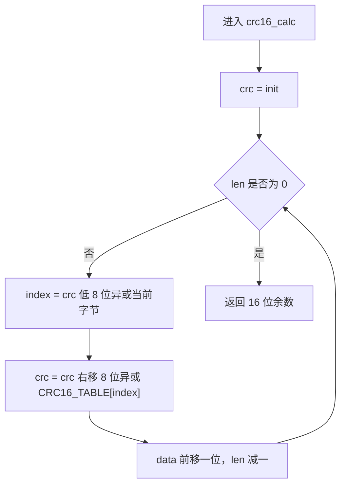
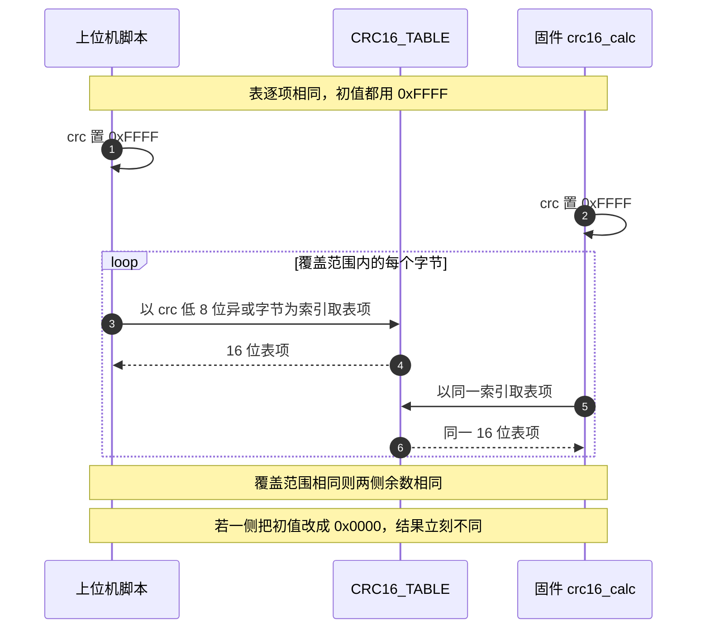

# CRC16查表实现

云台板与底盘板共用 `Algorithm/Src/CRC16.cpp`，仓库根目录的两个上位机脚本各自带一份同构的表与循环。固件侧有四处调用点，脚本侧负责封包与解码，两边必须逐字节一致，否则上位机发出的帧在板子上进不了回调。

这份实现按接口、循环体、多项式反推、初值版本与注释冲突几段读下来更顺；表在各类帧里的覆盖范围见 `04-裁判系统帧校验流程`，脚本与固件的完整一致性核对见 `06-上位机封包脚本`。

## 1. 十六位表与 crc16_calc 的接口

CRC16 的输出是两个字节，表有 256 项，每项 2 字节。本工程的表位于 `Algorithm/Src/CRC16.cpp`，函数是 `crc16_calc`（`CRC16.cpp`），声明在 `Algorithm/Inc/CRC16.h`：

```cpp
uint16_t crc16_calc(const uint8_t *data, uint32_t len, uint16_t init);
```

与 CRC8 一样，初值由调用方传入，函数不含异或输出。本工程所有调用点都传 `0xFFFF`（`Communication/Src/referee_protocol.cpp`、`Communication/Src/usb_protocol.cpp`、`Communication/Src/usb_decode.cpp`、底盘 `Task/Src/UsbConnectTask.cpp`）。

与 CRC8 的一处差异是表的可见性：CRC8 的表是 `static`，只在本编译单元可见；CRC16 的表是 `const` 全局符号（`CRC16.cpp`），链接期可被其他文件引用。长度参数的类型也不同，这里是 `uint32_t`，可以容纳视觉链路的整帧长度。

## 2. 两步循环体：低八位索引、高位异或

CRC16 的 LSB-first 逐位写法是：

```c
uint16_t crc = init;
crc ^= byte;
for (int j = 0; j < 8; ++j) {
    crc = (crc & 1) ? (uint16_t)((crc >> 1) ^ P) : (uint16_t)(crc >> 1);
}
```

P 是反射多项式。表项定义为以 `i` 为初值、异或一个值为 0 的字节后迭代 8 步的结果。运行时把余数的低 8 位与字节异或作为索引，再把余数右移 8 位与表项异或：

```cpp
uint16_t crc = init;
while (len--) {
    uint8_t index = (crc ^ *data++) & 0xFF;
    crc = (crc >> 8) ^ CRC16_TABLE[index];
}
return crc;
```

表项只有 8 步的结果，剩下的 8 位由 `crc >> 8` 带入，两者异或后即完整的 16 位新余数。这正是 CRC8 表法的推广：余数比表项宽，宽出来的高位在移位过程中落到低字节，与新表项异或后回到余数寄存器。

## 3. 反推 0x8408 与 CRC-16/CCITT

对 65536 个候选反射多项式各生成一张 LSB-first 表，与固件表逐项比对，只有一个匹配。以下结论属推导，可用第 7 节脚本复核：

| 候选反射多项式 | 生成表的前四项 | 与固件表比对 |
| --- | --- | --- |
| 0x8408 | 0x0000、0x1189、0x2312、0x329B | 完全一致 |
| 0xA001 | 0x0000、0xC0C1、0xC181、0x0140 | 第 2 项起不符 |

固件表前四项是 0x0000、0x1189、0x2312、0x329B（`CRC16.cpp`），因此反射多项式是 0x8408。0x8408 的 16 位翻转是 0x1021，对应的标准形式是

$$G(x) = x^{16} + x^{12} + x^{5} + 1$$

即 CRC-16/CCITT。用标准 check 值可以再确认：对 `"123456789"`，初值 0x0000 时结果是 0x2189，属 CRC-16/KERMIT；初值 0xFFFF 时结果是 0x6F91，属 CRC-16/MCRF4XX。两者共用同一个多项式，差别只在初值。这些数值属推导，未在硬件上实测。

## 4. KERMIT 与 MCRF4XX 只差初值

一张表配不同初值能成立，是因为表只固化多项式，初值在循环前装入余数寄存器。同一张表加同一个初值，双方结果相同；任一侧换了初值，结果立刻不同。

| 参数组合 | 初值 | 对 `"123456789"` 的结果 | 名称 |
| --- | --- | --- | --- |
| 0x1021 反射 0x8408 | 0x0000 | 0x2189 | CRC-16/KERMIT |
| 0x1021 反射 0x8408 | 0xFFFF | 0x6F91 | CRC-16/MCRF4XX |

本工程全部使用第二组。初值属于协议约定，与算法本身无关，所以它写在每个调用点上，函数里只保留形参。这也是同一份 `crc16_calc` 能同时服务裁判系统、视觉链路与上位机脚本的原因。

## 5. 脚本注释与代码的两处冲突

`generate_gimbal_packet.py` 的注释写：

```python
# CRC16 标准表（与下位机/上位机完全一致，多项式 0x8005，初始 0x0000 的表格）
```

这句话有两处与代码不符：

| 注释项 | 注释值 | 代码与表实际值 | 判定依据 |
| --- | --- | --- | --- |
| 多项式 | 0x8005 | 0x1021，反射形式 0x8408 | 第 3 节的表比对 |
| 初始值 | 0x0000 | 0xFFFF | `generate_gimbal_packet.py` 默认参数、 与  调用 |

代码写法是 `def crc16_calc(data, init=0xFFFF)`（`generate_gimbal_packet.py`），解码脚本同样（`generate_gimbal_packet_decode.py`）。按写作约定，注释与实现不一致时以代码为准，因此脚本的有效初值是 0xFFFF，与固件一致。多项式一项按表反推为 0x1021，注释中的 0x8005 与本工程的表不符，此点待现场确认。

## 6. 逐行读 crc16_calc

```cpp
uint16_t crc16_calc(const uint8_t *data, uint32_t len, uint16_t init)
{
    uint16_t crc = init;

    while (len--) {
        uint8_t index = (crc ^ *data++) & 0xFF;
        crc = (crc >> 8) ^ CRC16_TABLE[index];
    }

    return crc;
}
```

| 行 | 语句 | 作用 |
| --- | --- | --- |
| `CRC16.cpp` | `uint16_t crc = init;` | 装入初值 |
| `CRC16.cpp` | `while (len--)` | 按字节迭代，长度为 0 时返回初值 |
| `CRC16.cpp` | `uint8_t index = (crc ^ *data++) & 0xFF;` | 取余数低字节与当前字节异或，截成 8 位索引 |
| `CRC16.cpp` | `crc = (crc >> 8) ^ CRC16_TABLE[index];` | 余数右移 8 位与表项异或，得到新余数 |
| `CRC16.cpp` | `return crc;` | 输出 16 位余数 |

`index` 的类型是 `uint8_t`，即使不做 `& 0xFF` 也会被截断，这一句的掩码是显式写法。长度为 0 时返回 `0xFFFF`，即初值。



## 7. 单字节改动对余数的影响

用 04 篇手算示例的字节可以看出一字节改动的影响：对报文 `0xA5 0x02 0x00 0x01 0xD2 0x01 0x00 0x11 0x22` 算 CRC16，初值 0xFFFF，得到 0x7BF7；把最后一个字节从 `0x22` 改成 `0x23`，结果变成 0x6A7E。单字节改动就让 16 位余数完全改变，这是 CRC 的基本性质，属手算示例。

上位机脚本与固件各写一份循环，但表与初值相同，结果逐字节一致。第 9 节的脚本已对两张表逐项比对。



## 8. CRC16 在四处的调用点

| 项目 | 内容 | 位置 |
| --- | --- | --- |
| 表 | `const uint16_t CRC16_TABLE[256]` | `Algorithm/Src/CRC16.cpp` |
| 函数 | `crc16_calc(data, len, init)` | `Algorithm/Src/CRC16.cpp` |
| 声明 | 带 `extern "C"` | `Algorithm/Inc/CRC16.h` |
| 裁判帧整包 | `crc16_calc(buffer_, index_-2, 0xFFFF)` | `Communication/Src/referee_protocol.cpp` |
| 视觉发送帧 | `crc16_calc(&pkt, GIMBAL_TO_VISION_LEN - 2, 0xFFFF)` | `Communication/Src/usb_protocol.cpp` |
| 视觉接收帧 | `crc16_calc(buffer_, VISION_TO_GIMBAL_LEN - 2, 0xFFFF)` | `Communication/Src/usb_decode.cpp` |
| 底盘 USB 帧 | `crc16_calc(frame_buffer, index, 0xFFFF)` | 底盘 `Task/Src/UsbConnectTask.cpp` |
| 上位机封包 | `def crc16_calc(data, init=0xFFFF)` | `generate_gimbal_packet.py` |
| 上位机解码 | 同上 | `generate_gimbal_packet_decode.py` |

## 9. 核对脚本与固件表

下面的脚本把固件表与两个上位机脚本的表逐项比较，并生成候选多项式的前四项。

```python
import re

def load_table(path, marker):
    text = open(path, encoding='utf-8').read.split(marker, 1)[1]
    return [int(x, 16) for x in re.findall(r'0x[0-9a-fA-F]+', text)][:256]

fw = load_table('Algorithm/Src/CRC16.cpp', 'CRC16_TABLE')
py = load_table('generate_gimbal_packet.py', 'CRC16_TABLE')
dc = load_table('generate_gimbal_packet_decode.py', 'CRC16_TABLE')
print(fw == py, fw == dc)          # True True

def gen_lsb16(poly):
    t = []
    for i in range(256):
        c = i
        for _ in range(8):
            c = ((c >> 1) ^ poly) if (c & 1) else (c >> 1)
        t.append(c & 0xFFFF)
    return t

print([hex(x) for x in gen_lsb16(0x8408)[:4]])
print([hex(x) for x in gen_lsb16(0xA001)[:4]])
```

## 10. 易错点

| 易错点 | 现象 | 说明 |
| --- | --- | --- |
| 相信注释里的初值 | 按 0x0000 算，与固件不一致 | 代码默认 0xFFFF |
| 相信注释里的多项式 | 按 0x8005 生成表，对不上固件 | 表对应 0x1021 |
| 索引不截断 | 高 8 位参与索引会越界 | `CRC16.cpp` 用 `& 0xFF` |
| 覆盖范围差一字节 | 把 CRC16 字段本身也算进去 | 调用点一律用长度减 2 或校验字段之前 |
| 大小端写反 | 结果值对但字节序反 | `recv_crc16` 按小端拼接 |
| 认为初值可省 | 长度 0 时返回值就是初值 | 与 CRC8 同一行为 |

## 11. 小结

### 核心概念

- CRC16 表是 256 项 16 位纯函数，由反射多项式唯一确定。
- 循环体两步：`index = (crc ^ byte) & 0xFF`，`crc = (crc >> 8) ^ TABLE[index]`。
- 按表反推，反射多项式是 0x8408，标准形式 0x1021，即 CRC-16/CCITT。
- 同一张表配 0x0000 是 KERMIT，配 0xFFFF 是 MCRF4XX；本工程用后者。
- 脚本注释的多项式与初值都与代码不符，以代码与表为准。
- 固件、底盘固件与两个脚本的表逐项相同。

### 设计权衡

| 决策 | 选择 | 收益 | 代价 |
| --- | --- | --- | --- |
| 多项式 | CCITT 0x1021 | 16 位突发错误全检出 | 与注释写的 0x8005 不同，易混 |
| 初值 | 0xFFFF | 与官方帧格式一致 | 与脚本注释矛盾 |
| 表可见性 | 全局 `const` | 其他编译单元可引用 | 符号暴露，无封装 |
| 长度类型 | `uint32_t` | 与视觉帧长度类型一致 | 与 CRC8 的 `uint16_t` 不一致 |
| 覆盖范围 | 由调用方给长度 | 各协议自行决定 | 差一字节不会报错 |

## 12. 练习

### 基础题

1. 写出 `crc16_calc(data, 0, 0xFFFF)` 与 `crc16_calc(data, 0, 0x0000)` 的返回值。
2. 查 `CRC16.cpp` 写出表的第 1、2、3 项，与第 3 节表格核对。
3. 说明 `CRC16.cpp` 的 `& 0xFF` 去掉后为什么仍然能编译通过，以及去掉后索引是否可能越界。
4. 对 `"123456789"`，初值 0xFFFF 的 CRC16 是 0x6F91。若初值换成 0x0000，结果是 0x2189。说明为什么同一张表会给出两个不同结果。

### 挑战题

5. 用第 9 节脚本生成 0x8408 的完整表并与 `CRC16.cpp` 比对，说明表项数量与文件行数的对应关系。
6. 已知上位机脚本注释写 0x8005。若按 0x8005 的反射形式 0xA001 生成表并替换固件表，用第 9 节脚本算出对 `"123456789"` 初值 0xFFFF 的新 check 值，并说明与 0x6F91 的差别。
7. 把 `crc16_calc` 改写成逐位版本，要求与表版本输出一致，并比较两者对 43 字节视觉帧的执行次数。

---

### 附：本页引用的固件路径

| 路径 | 用途 |
| --- | --- |
| `2026OmniSentryGimbal/Algorithm/Src/CRC16.cpp` | 表与 `crc16_calc` |
| `2026OmniSentryGimbal/Algorithm/Inc/CRC16.h` | 函数声明与 `extern "C"` |
| `2026OmniSentryGimbal/Communication/Src/referee_protocol.cpp` | 整包 CRC16 |
| `2026OmniSentryGimbal/Communication/Src/usb_protocol.cpp` | 视觉发送帧 CRC16 |
| `2026OmniSentryGimbal/Communication/Src/usb_decode.cpp` | 视觉接收帧 CRC16 |
| `2026OmniSentryGimbal/generate_gimbal_packet.py` | 上位机封包与 CRC16 |
| `2026OmniSentryGimbal/generate_gimbal_packet_decode.py` | 上位机解码与 CRC16 |
| `2026OmniSentryChassis/2026OmniSentryChassis/Algorithm/Src/CRC16.cpp` | 底盘板同一张表 |
| `2026OmniSentryChassis/2026OmniSentryChassis/Task/Src/UsbConnectTask.cpp` | 底盘 USB 帧 CRC16 |
